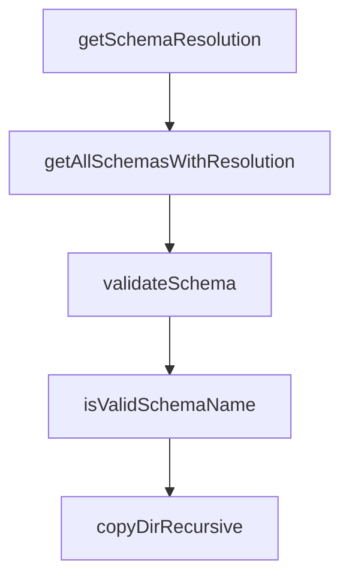

# Chapter 4: Spec Authoring, Delta Patterns, and Quality

Welcome to **Chapter 4: Spec Authoring, Delta Patterns, and Quality**. In this part of **OpenSpec Tutorial: Spec-Driven Workflows for AI Coding Agents**, you will build an intuitive mental model first, then move into concrete implementation details and practical production tradeoffs.


Delta spec quality determines whether OpenSpec increases predictability or just adds paperwork.

## Learning Goals

- write clear ADDED/MODIFIED/REMOVED requirement deltas
- use scenario-driven language for testable behavior
- prevent ambiguity before implementation begins

## Delta Format Essentials

```markdown
## ADDED Requirements
### Requirement: Feature X

## MODIFIED Requirements
### Requirement: Existing Behavior Y

## REMOVED Requirements
### Requirement: Deprecated Behavior Z
```

## Authoring Quality Checklist

| Check | Why |
|:------|:----|
| requirement statement is testable | improves validation and review quality |
| scenarios are concrete | reduces interpretation drift |
| modified sections preserve old behavior context | avoids accidental regressions |
| removals include migration notes | supports safer rollout |

## Common Anti-Patterns

- vague requirements like "improve UX" without measurable behavior
- tasks that introduce implementation details not reflected in specs
- archive attempts before delta specs are reconciled

## Source References

- [Concepts](https://github.com/Fission-AI/OpenSpec/blob/main/docs/concepts.md)
- [Getting Started: Delta Specs](https://github.com/Fission-AI/OpenSpec/blob/main/docs/getting-started.md)
- [Workflows](https://github.com/Fission-AI/OpenSpec/blob/main/docs/workflows.md)

## Summary

You now have concrete rules for writing high-signal artifacts that agents and humans can execute against.

Next: [Chapter 5: Customization, Schemas, and Project Rules](05-customization-schemas-and-project-rules.md)

## Source Code Walkthrough

### `src/commands/schema.ts`

The `getSchemaResolution` function in [`src/commands/schema.ts`](https://github.com/Fission-AI/OpenSpec/blob/HEAD/src/commands/schema.ts) handles a key part of this chapter's functionality:

```ts
 * Get resolution info for a schema including shadow detection.
 */
function getSchemaResolution(
  name: string,
  projectRoot: string
): SchemaResolution | null {
  const locations = checkAllLocations(name, projectRoot);
  const existingLocations = locations.filter((loc) => loc.exists);

  if (existingLocations.length === 0) {
    return null;
  }

  const active = existingLocations[0];
  const shadows = existingLocations.slice(1).map((loc) => ({
    source: loc.source,
    path: loc.path,
  }));

  return {
    name,
    source: active.source,
    path: active.path,
    shadows,
  };
}

/**
 * Get all schemas with resolution info.
 */
function getAllSchemasWithResolution(
  projectRoot: string
```

This function is important because it defines how OpenSpec Tutorial: Spec-Driven Workflows for AI Coding Agents implements the patterns covered in this chapter.

### `src/commands/schema.ts`

The `getAllSchemasWithResolution` function in [`src/commands/schema.ts`](https://github.com/Fission-AI/OpenSpec/blob/HEAD/src/commands/schema.ts) handles a key part of this chapter's functionality:

```ts
 * Get all schemas with resolution info.
 */
function getAllSchemasWithResolution(
  projectRoot: string
): SchemaResolution[] {
  const schemaNames = listSchemas(projectRoot);
  const results: SchemaResolution[] = [];

  for (const name of schemaNames) {
    const resolution = getSchemaResolution(name, projectRoot);
    if (resolution) {
      results.push(resolution);
    }
  }

  return results;
}

/**
 * Validate a schema and return issues.
 */
function validateSchema(
  schemaDir: string,
  verbose: boolean = false
): { valid: boolean; issues: ValidationIssue[] } {
  const issues: ValidationIssue[] = [];
  const schemaPath = path.join(schemaDir, 'schema.yaml');

  // Check schema.yaml exists
  if (verbose) {
    console.log('  Checking schema.yaml exists...');
  }
```

This function is important because it defines how OpenSpec Tutorial: Spec-Driven Workflows for AI Coding Agents implements the patterns covered in this chapter.

### `src/commands/schema.ts`

The `validateSchema` function in [`src/commands/schema.ts`](https://github.com/Fission-AI/OpenSpec/blob/HEAD/src/commands/schema.ts) handles a key part of this chapter's functionality:

```ts
 * Validate a schema and return issues.
 */
function validateSchema(
  schemaDir: string,
  verbose: boolean = false
): { valid: boolean; issues: ValidationIssue[] } {
  const issues: ValidationIssue[] = [];
  const schemaPath = path.join(schemaDir, 'schema.yaml');

  // Check schema.yaml exists
  if (verbose) {
    console.log('  Checking schema.yaml exists...');
  }
  if (!fs.existsSync(schemaPath)) {
    issues.push({
      level: 'error',
      path: 'schema.yaml',
      message: 'schema.yaml not found',
    });
    return { valid: false, issues };
  }

  // Parse YAML
  if (verbose) {
    console.log('  Parsing YAML...');
  }
  let content: string;
  try {
    content = fs.readFileSync(schemaPath, 'utf-8');
  } catch (err) {
    issues.push({
      level: 'error',
```

This function is important because it defines how OpenSpec Tutorial: Spec-Driven Workflows for AI Coding Agents implements the patterns covered in this chapter.

### `src/commands/schema.ts`

The `isValidSchemaName` function in [`src/commands/schema.ts`](https://github.com/Fission-AI/OpenSpec/blob/HEAD/src/commands/schema.ts) handles a key part of this chapter's functionality:

```ts
 * Validate schema name format (kebab-case).
 */
function isValidSchemaName(name: string): boolean {
  return /^[a-z][a-z0-9]*(-[a-z0-9]+)*$/.test(name);
}

/**
 * Copy a directory recursively.
 */
function copyDirRecursive(src: string, dest: string): void {
  fs.mkdirSync(dest, { recursive: true });

  const entries = fs.readdirSync(src, { withFileTypes: true });
  for (const entry of entries) {
    const srcPath = path.join(src, entry.name);
    const destPath = path.join(dest, entry.name);

    if (entry.isDirectory()) {
      copyDirRecursive(srcPath, destPath);
    } else {
      fs.copyFileSync(srcPath, destPath);
    }
  }
}

/**
 * Default artifacts with descriptions for schema init.
 */
const DEFAULT_ARTIFACTS: Array<{
  id: string;
  description: string;
  generates: string;
```

This function is important because it defines how OpenSpec Tutorial: Spec-Driven Workflows for AI Coding Agents implements the patterns covered in this chapter.


## How These Components Connect


