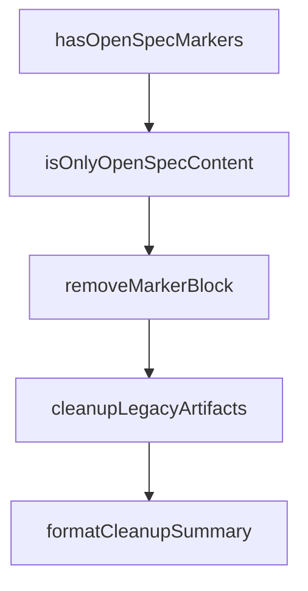

# Chapter 4: Spec Authoring, Delta Patterns, and Quality

Welcome to **Chapter 4: Spec Authoring, Delta Patterns, and Quality**. In this part of **OpenSpec Tutorial: Spec-Driven Workflows for AI Coding Agents**, you will build an intuitive mental model first, then move into concrete implementation details and practical production tradeoffs.


Delta spec quality determines whether OpenSpec increases predictability or just adds paperwork.

## Learning Goals

- write clear ADDED/MODIFIED/REMOVED requirement deltas
- use scenario-driven language for testable behavior
- prevent ambiguity before implementation begins

## Delta Format Essentials

```markdown
## ADDED Requirements
### Requirement: Feature X

## MODIFIED Requirements
### Requirement: Existing Behavior Y

## REMOVED Requirements
### Requirement: Deprecated Behavior Z
```

## Authoring Quality Checklist

| Check | Why |
|:------|:----|
| requirement statement is testable | improves validation and review quality |
| scenarios are concrete | reduces interpretation drift |
| modified sections preserve old behavior context | avoids accidental regressions |
| removals include migration notes | supports safer rollout |

## Common Anti-Patterns

- vague requirements like "improve UX" without measurable behavior
- tasks that introduce implementation details not reflected in specs
- archive attempts before delta specs are reconciled

## Source References

- [Concepts](https://github.com/Fission-AI/OpenSpec/blob/main/docs/concepts.md)
- [Getting Started: Delta Specs](https://github.com/Fission-AI/OpenSpec/blob/main/docs/getting-started.md)
- [Workflows](https://github.com/Fission-AI/OpenSpec/blob/main/docs/workflows.md)

## Summary

You now have concrete rules for writing high-signal artifacts that agents and humans can execute against.

Next: [Chapter 5: Customization, Schemas, and Project Rules](05-customization-schemas-and-project-rules.md)

## Depth Expansion Playbook

## Source Code Walkthrough

### `src/core/legacy-cleanup.ts`

The `hasOpenSpecMarkers` function in [`src/core/legacy-cleanup.ts`](https://github.com/Fission-AI/OpenSpec/blob/HEAD/src/core/legacy-cleanup.ts) handles a key part of this chapter's functionality:

```ts
      const content = await FileSystemUtils.readFile(filePath);

      if (hasOpenSpecMarkers(content)) {
        allFiles.push(fileName);
        filesToUpdate.push(fileName); // Always update, never delete config files
      }
    }
  }

  return { allFiles, filesToUpdate };
}

/**
 * Detects legacy slash command directories and files.
 *
 * @param projectPath - The root path of the project
 * @returns Object with directories and individual files found
 */
export async function detectLegacySlashCommands(
  projectPath: string
): Promise<{
  directories: string[];
  files: string[];
}> {
  const directories: string[] = [];
  const files: string[] = [];

  for (const [toolId, pattern] of Object.entries(LEGACY_SLASH_COMMAND_PATHS)) {
    if (pattern.type === 'directory' && pattern.path) {
      const dirPath = FileSystemUtils.joinPath(projectPath, pattern.path);
      if (await FileSystemUtils.directoryExists(dirPath)) {
        directories.push(pattern.path);
```

This function is important because it defines how OpenSpec Tutorial: Spec-Driven Workflows for AI Coding Agents implements the patterns covered in this chapter.

### `src/core/legacy-cleanup.ts`

The `isOnlyOpenSpecContent` function in [`src/core/legacy-cleanup.ts`](https://github.com/Fission-AI/OpenSpec/blob/HEAD/src/core/legacy-cleanup.ts) handles a key part of this chapter's functionality:

```ts
 * @returns True if content outside markers is only whitespace
 */
export function isOnlyOpenSpecContent(content: string): boolean {
  const startIndex = content.indexOf(OPENSPEC_MARKERS.start);
  const endIndex = content.indexOf(OPENSPEC_MARKERS.end);

  if (startIndex === -1 || endIndex === -1 || endIndex <= startIndex) {
    return false;
  }

  const before = content.substring(0, startIndex);
  const after = content.substring(endIndex + OPENSPEC_MARKERS.end.length);

  return before.trim() === '' && after.trim() === '';
}

/**
 * Removes the OpenSpec marker block from file content.
 * Only removes markers that are on their own lines (ignores inline mentions).
 * Cleans up double blank lines that may result from removal.
 *
 * @param content - File content with OpenSpec markers
 * @returns Content with marker block removed
 */
export function removeMarkerBlock(content: string): string {
  return removeMarkerBlockUtil(content, OPENSPEC_MARKERS.start, OPENSPEC_MARKERS.end);
}

/**
 * Result of cleanup operation
 */
export interface CleanupResult {
```

This function is important because it defines how OpenSpec Tutorial: Spec-Driven Workflows for AI Coding Agents implements the patterns covered in this chapter.

### `src/core/legacy-cleanup.ts`

The `removeMarkerBlock` function in [`src/core/legacy-cleanup.ts`](https://github.com/Fission-AI/OpenSpec/blob/HEAD/src/core/legacy-cleanup.ts) handles a key part of this chapter's functionality:

```ts
import { promises as fs } from 'fs';
import chalk from 'chalk';
import { FileSystemUtils, removeMarkerBlock as removeMarkerBlockUtil } from '../utils/file-system.js';
import { OPENSPEC_MARKERS } from './config.js';

/**
 * Legacy config file names from the old ToolRegistry.
 * These were config files created at project root with OpenSpec markers.
 */
export const LEGACY_CONFIG_FILES = [
  'CLAUDE.md',
  'CLINE.md',
  'CODEBUDDY.md',
  'COSTRICT.md',
  'QODER.md',
  'IFLOW.md',
  'AGENTS.md', // root AGENTS.md (not openspec/AGENTS.md)
  'QWEN.md',
] as const;

/**
 * Legacy slash command patterns from the old SlashCommandRegistry.
 * These map toolId to the path pattern where legacy commands were created.
 * Some tools used a directory structure, others used individual files.
 */
export const LEGACY_SLASH_COMMAND_PATHS: Record<string, LegacySlashCommandPattern> = {
  // Directory-based: .tooldir/commands/openspec/ or .tooldir/commands/openspec/*.md
  'claude': { type: 'directory', path: '.claude/commands/openspec' },
  'codebuddy': { type: 'directory', path: '.codebuddy/commands/openspec' },
  'qoder': { type: 'directory', path: '.qoder/commands/openspec' },
  'crush': { type: 'directory', path: '.crush/commands/openspec' },
  'gemini': { type: 'directory', path: '.gemini/commands/openspec' },
```

This function is important because it defines how OpenSpec Tutorial: Spec-Driven Workflows for AI Coding Agents implements the patterns covered in this chapter.

### `src/core/legacy-cleanup.ts`

The `cleanupLegacyArtifacts` function in [`src/core/legacy-cleanup.ts`](https://github.com/Fission-AI/OpenSpec/blob/HEAD/src/core/legacy-cleanup.ts) handles a key part of this chapter's functionality:

```ts
 * @returns Cleanup result with summary of actions taken
 */
export async function cleanupLegacyArtifacts(
  projectPath: string,
  detection: LegacyDetectionResult
): Promise<CleanupResult> {
  const result: CleanupResult = {
    deletedFiles: [],
    modifiedFiles: [],
    deletedDirs: [],
    projectMdNeedsMigration: detection.hasProjectMd,
    errors: [],
  };

  // Remove marker blocks from config files (NEVER delete config files)
  // Config files like CLAUDE.md, AGENTS.md belong to the user's project root
  for (const fileName of detection.configFilesToUpdate) {
    const filePath = FileSystemUtils.joinPath(projectPath, fileName);
    try {
      const content = await FileSystemUtils.readFile(filePath);
      const newContent = removeMarkerBlock(content);
      // Always write the file, even if empty - never delete user config files
      await FileSystemUtils.writeFile(filePath, newContent);
      result.modifiedFiles.push(fileName);
    } catch (error: any) {
      result.errors.push(`Failed to modify ${fileName}: ${error.message}`);
    }
  }

  // Delete legacy slash command directories (these are 100% OpenSpec-managed)
  for (const dirPath of detection.slashCommandDirs) {
    const fullPath = FileSystemUtils.joinPath(projectPath, dirPath);
```

This function is important because it defines how OpenSpec Tutorial: Spec-Driven Workflows for AI Coding Agents implements the patterns covered in this chapter.


## How These Components Connect


