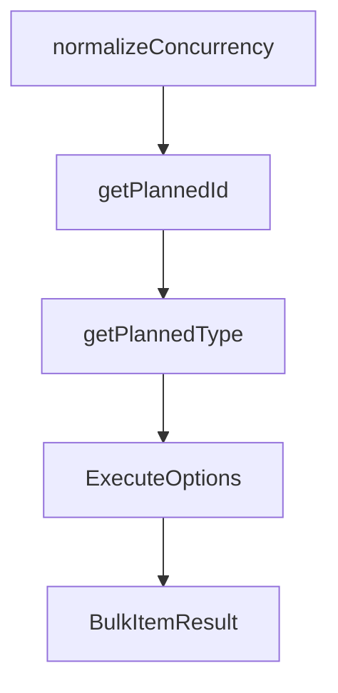

# Chapter 5: Customization, Schemas, and Project Rules

Welcome to **Chapter 5: Customization, Schemas, and Project Rules**. In this part of **OpenSpec Tutorial: Spec-Driven Workflows for AI Coding Agents**, you will build an intuitive mental model first, then move into concrete implementation details and practical production tradeoffs.


OpenSpec can be tailored to your engineering environment through configuration and schema controls.

## Learning Goals

- use `openspec/config.yaml` for project defaults and rules
- understand schema precedence and artifact IDs
- avoid over-customization that breaks portability

## Example Project Config

```yaml
schema: spec-driven

context: |
  Tech stack: TypeScript, React, Node.js
  Testing: Vitest and Playwright

rules:
  proposal:
    - Include rollback plan for risky changes
  specs:
    - Use Given/When/Then in scenarios
```

## Schema Precedence

1. CLI `--schema`
2. change-level metadata
3. project config default
4. built-in default schema

## Customization Strategy

| Layer | Use For |
|:------|:--------|
| context | stack facts and non-obvious constraints |
| rules | artifact-specific quality constraints |
| custom schemas | domain-specific artifact graphs |

## Source References

- [Customization Guide](https://github.com/Fission-AI/OpenSpec/blob/main/docs/customization.md)
- [CLI Schema Commands](https://github.com/Fission-AI/OpenSpec/blob/main/docs/cli.md)
- [OPSX Workflow Config Section](https://github.com/Fission-AI/OpenSpec/blob/main/docs/opsx.md)

## Summary

You now know how to shape OpenSpec behavior while keeping workflows maintainable across teams.

Next: [Chapter 6: Tool Integrations and Multi-Agent Portability](06-tool-integrations-and-multi-agent-portability.md)

## Source Code Walkthrough

### `src/commands/validate.ts`

The `normalizeConcurrency` function in [`src/commands/validate.ts`](https://github.com/Fission-AI/OpenSpec/blob/HEAD/src/commands/validate.ts) handles a key part of this chapter's functionality:

```ts
    const DEFAULT_CONCURRENCY = 6;
    const maxSuggestions = 5; // used by nearestMatches
    const concurrency = normalizeConcurrency(opts.concurrency) ?? normalizeConcurrency(process.env.OPENSPEC_CONCURRENCY) ?? DEFAULT_CONCURRENCY;
    const validator = new Validator(opts.strict);
    const queue: Array<() => Promise<BulkItemResult>> = [];

    for (const id of changeIds) {
      queue.push(async () => {
        const start = Date.now();
        const changeDir = path.join(process.cwd(), 'openspec', 'changes', id);
        const report = await validator.validateChangeDeltaSpecs(changeDir);
        const durationMs = Date.now() - start;
        return { id, type: 'change' as const, valid: report.valid, issues: report.issues, durationMs };
      });
    }
    for (const id of specIds) {
      queue.push(async () => {
        const start = Date.now();
        const file = path.join(process.cwd(), 'openspec', 'specs', id, 'spec.md');
        const report = await validator.validateSpec(file);
        const durationMs = Date.now() - start;
        return { id, type: 'spec' as const, valid: report.valid, issues: report.issues, durationMs };
      });
    }

    if (queue.length === 0) {
      spinner?.stop();

      const summary = {
        totals: { items: 0, passed: 0, failed: 0 },
        byType: {
          ...(scope.changes ? { change: { items: 0, passed: 0, failed: 0 } } : {}),
```

This function is important because it defines how OpenSpec Tutorial: Spec-Driven Workflows for AI Coding Agents implements the patterns covered in this chapter.

### `src/commands/validate.ts`

The `getPlannedId` function in [`src/commands/validate.ts`](https://github.com/Fission-AI/OpenSpec/blob/HEAD/src/commands/validate.ts) handles a key part of this chapter's functionality:

```ts
            .catch((error: any) => {
              const message = error?.message || 'Unknown error';
              const res: BulkItemResult = { id: getPlannedId(currentIndex, changeIds, specIds) ?? 'unknown', type: getPlannedType(currentIndex, changeIds, specIds) ?? 'change', valid: false, issues: [{ level: 'ERROR', path: 'file', message }], durationMs: 0 };
              results.push(res);
              failed++;
            })
            .finally(() => {
              running--;
              if (index >= queue.length && running === 0) resolve();
              else next();
            });
        }
      };
      next();
    });

    spinner?.stop();

    results.sort((a, b) => a.id.localeCompare(b.id));
    const summary = {
      totals: { items: results.length, passed, failed },
      byType: {
        ...(scope.changes ? { change: summarizeType(results, 'change') } : {}),
        ...(scope.specs ? { spec: summarizeType(results, 'spec') } : {}),
      },
    } as const;

    if (opts.json) {
      const out = { items: results, summary, version: '1.0' };
      console.log(JSON.stringify(out, null, 2));
    } else {
      for (const res of results) {
```

This function is important because it defines how OpenSpec Tutorial: Spec-Driven Workflows for AI Coding Agents implements the patterns covered in this chapter.

### `src/commands/validate.ts`

The `getPlannedType` function in [`src/commands/validate.ts`](https://github.com/Fission-AI/OpenSpec/blob/HEAD/src/commands/validate.ts) handles a key part of this chapter's functionality:

```ts
            .catch((error: any) => {
              const message = error?.message || 'Unknown error';
              const res: BulkItemResult = { id: getPlannedId(currentIndex, changeIds, specIds) ?? 'unknown', type: getPlannedType(currentIndex, changeIds, specIds) ?? 'change', valid: false, issues: [{ level: 'ERROR', path: 'file', message }], durationMs: 0 };
              results.push(res);
              failed++;
            })
            .finally(() => {
              running--;
              if (index >= queue.length && running === 0) resolve();
              else next();
            });
        }
      };
      next();
    });

    spinner?.stop();

    results.sort((a, b) => a.id.localeCompare(b.id));
    const summary = {
      totals: { items: results.length, passed, failed },
      byType: {
        ...(scope.changes ? { change: summarizeType(results, 'change') } : {}),
        ...(scope.specs ? { spec: summarizeType(results, 'spec') } : {}),
      },
    } as const;

    if (opts.json) {
      const out = { items: results, summary, version: '1.0' };
      console.log(JSON.stringify(out, null, 2));
    } else {
      for (const res of results) {
```

This function is important because it defines how OpenSpec Tutorial: Spec-Driven Workflows for AI Coding Agents implements the patterns covered in this chapter.

### `src/commands/validate.ts`

The `ExecuteOptions` interface in [`src/commands/validate.ts`](https://github.com/Fission-AI/OpenSpec/blob/HEAD/src/commands/validate.ts) handles a key part of this chapter's functionality:

```ts
type ItemType = 'change' | 'spec';

interface ExecuteOptions {
  all?: boolean;
  changes?: boolean;
  specs?: boolean;
  type?: string;
  strict?: boolean;
  json?: boolean;
  noInteractive?: boolean;
  interactive?: boolean; // Commander sets this to false when --no-interactive is used
  concurrency?: string;
}

interface BulkItemResult {
  id: string;
  type: ItemType;
  valid: boolean;
  issues: { level: 'ERROR' | 'WARNING' | 'INFO'; path: string; message: string }[];
  durationMs: number;
}

export class ValidateCommand {
  async execute(itemName: string | undefined, options: ExecuteOptions = {}): Promise<void> {
    const interactive = isInteractive(options);

    // Handle bulk flags first
    if (options.all || options.changes || options.specs) {
      await this.runBulkValidation({
        changes: !!options.all || !!options.changes,
        specs: !!options.all || !!options.specs,
      }, { strict: !!options.strict, json: !!options.json, concurrency: options.concurrency, noInteractive: resolveNoInteractive(options) });
```

This interface is important because it defines how OpenSpec Tutorial: Spec-Driven Workflows for AI Coding Agents implements the patterns covered in this chapter.


## How These Components Connect


