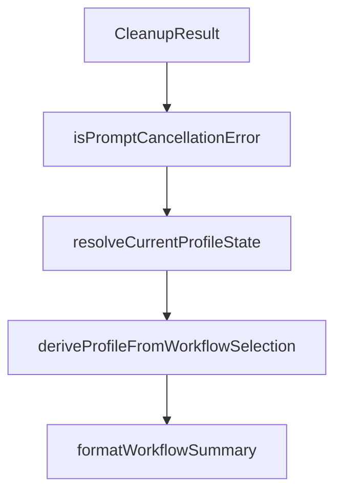

# Chapter 5: Customization, Schemas, and Project Rules

Welcome to **Chapter 5: Customization, Schemas, and Project Rules**. In this part of **OpenSpec Tutorial: Spec-Driven Workflows for AI Coding Agents**, you will build an intuitive mental model first, then move into concrete implementation details and practical production tradeoffs.


OpenSpec can be tailored to your engineering environment through configuration and schema controls.

## Learning Goals

- use `openspec/config.yaml` for project defaults and rules
- understand schema precedence and artifact IDs
- avoid over-customization that breaks portability

## Example Project Config

```yaml
schema: spec-driven

context: |
  Tech stack: TypeScript, React, Node.js
  Testing: Vitest and Playwright

rules:
  proposal:
    - Include rollback plan for risky changes
  specs:
    - Use Given/When/Then in scenarios
```

## Schema Precedence

1. CLI `--schema`
2. change-level metadata
3. project config default
4. built-in default schema

## Customization Strategy

| Layer | Use For |
|:------|:--------|
| context | stack facts and non-obvious constraints |
| rules | artifact-specific quality constraints |
| custom schemas | domain-specific artifact graphs |

## Source References

- [Customization Guide](https://github.com/Fission-AI/OpenSpec/blob/main/docs/customization.md)
- [CLI Schema Commands](https://github.com/Fission-AI/OpenSpec/blob/main/docs/cli.md)
- [OPSX Workflow Config Section](https://github.com/Fission-AI/OpenSpec/blob/main/docs/opsx.md)

## Summary

You now know how to shape OpenSpec behavior while keeping workflows maintainable across teams.

Next: [Chapter 6: Tool Integrations and Multi-Agent Portability](06-tool-integrations-and-multi-agent-portability.md)

## Depth Expansion Playbook

## Source Code Walkthrough

### `src/core/legacy-cleanup.ts`

The `CleanupResult` interface in [`src/core/legacy-cleanup.ts`](https://github.com/Fission-AI/OpenSpec/blob/HEAD/src/core/legacy-cleanup.ts) handles a key part of this chapter's functionality:

```ts
 * Result of cleanup operation
 */
export interface CleanupResult {
  /** Files that were deleted entirely */
  deletedFiles: string[];
  /** Files that had marker blocks removed */
  modifiedFiles: string[];
  /** Directories that were deleted */
  deletedDirs: string[];
  /** Whether project.md exists and needs manual migration */
  projectMdNeedsMigration: boolean;
  /** Error messages if any operations failed */
  errors: string[];
}

/**
 * Cleans up legacy OpenSpec artifacts from a project.
 * Preserves openspec/project.md (shows migration hint instead of deleting).
 *
 * @param projectPath - The root path of the project
 * @param detection - Detection result from detectLegacyArtifacts
 * @returns Cleanup result with summary of actions taken
 */
export async function cleanupLegacyArtifacts(
  projectPath: string,
  detection: LegacyDetectionResult
): Promise<CleanupResult> {
  const result: CleanupResult = {
    deletedFiles: [],
    modifiedFiles: [],
    deletedDirs: [],
    projectMdNeedsMigration: detection.hasProjectMd,
```

This interface is important because it defines how OpenSpec Tutorial: Spec-Driven Workflows for AI Coding Agents implements the patterns covered in this chapter.

### `src/commands/config.ts`

The `isPromptCancellationError` function in [`src/commands/config.ts`](https://github.com/Fission-AI/OpenSpec/blob/HEAD/src/commands/config.ts) handles a key part of this chapter's functionality:

```ts
};

function isPromptCancellationError(error: unknown): boolean {
  return (
    error instanceof Error &&
    (error.name === 'ExitPromptError' || error.message.includes('force closed the prompt with SIGINT'))
  );
}

/**
 * Resolve the effective current profile state from global config defaults.
 */
export function resolveCurrentProfileState(config: GlobalConfig): ProfileState {
  const profile = config.profile || 'core';
  const delivery = config.delivery || 'both';
  const workflows = [
    ...getProfileWorkflows(profile, config.workflows ? [...config.workflows] : undefined),
  ];
  return { profile, delivery, workflows };
}

/**
 * Derive profile type from selected workflows.
 */
export function deriveProfileFromWorkflowSelection(selectedWorkflows: string[]): Profile {
  const isCoreMatch =
    selectedWorkflows.length === CORE_WORKFLOWS.length &&
    CORE_WORKFLOWS.every((w) => selectedWorkflows.includes(w));
  return isCoreMatch ? 'core' : 'custom';
}

/**
```

This function is important because it defines how OpenSpec Tutorial: Spec-Driven Workflows for AI Coding Agents implements the patterns covered in this chapter.

### `src/commands/config.ts`

The `resolveCurrentProfileState` function in [`src/commands/config.ts`](https://github.com/Fission-AI/OpenSpec/blob/HEAD/src/commands/config.ts) handles a key part of this chapter's functionality:

```ts
 * Resolve the effective current profile state from global config defaults.
 */
export function resolveCurrentProfileState(config: GlobalConfig): ProfileState {
  const profile = config.profile || 'core';
  const delivery = config.delivery || 'both';
  const workflows = [
    ...getProfileWorkflows(profile, config.workflows ? [...config.workflows] : undefined),
  ];
  return { profile, delivery, workflows };
}

/**
 * Derive profile type from selected workflows.
 */
export function deriveProfileFromWorkflowSelection(selectedWorkflows: string[]): Profile {
  const isCoreMatch =
    selectedWorkflows.length === CORE_WORKFLOWS.length &&
    CORE_WORKFLOWS.every((w) => selectedWorkflows.includes(w));
  return isCoreMatch ? 'core' : 'custom';
}

/**
 * Format a compact workflow summary for the profile header.
 */
export function formatWorkflowSummary(workflows: readonly string[], profile: Profile): string {
  return `${workflows.length} selected (${profile})`;
}

function stableWorkflowOrder(workflows: readonly string[]): string[] {
  const seen = new Set<string>();
  const ordered: string[] = [];

```

This function is important because it defines how OpenSpec Tutorial: Spec-Driven Workflows for AI Coding Agents implements the patterns covered in this chapter.

### `src/commands/config.ts`

The `deriveProfileFromWorkflowSelection` function in [`src/commands/config.ts`](https://github.com/Fission-AI/OpenSpec/blob/HEAD/src/commands/config.ts) handles a key part of this chapter's functionality:

```ts
 * Derive profile type from selected workflows.
 */
export function deriveProfileFromWorkflowSelection(selectedWorkflows: string[]): Profile {
  const isCoreMatch =
    selectedWorkflows.length === CORE_WORKFLOWS.length &&
    CORE_WORKFLOWS.every((w) => selectedWorkflows.includes(w));
  return isCoreMatch ? 'core' : 'custom';
}

/**
 * Format a compact workflow summary for the profile header.
 */
export function formatWorkflowSummary(workflows: readonly string[], profile: Profile): string {
  return `${workflows.length} selected (${profile})`;
}

function stableWorkflowOrder(workflows: readonly string[]): string[] {
  const seen = new Set<string>();
  const ordered: string[] = [];

  for (const workflow of ALL_WORKFLOWS) {
    if (workflows.includes(workflow) && !seen.has(workflow)) {
      ordered.push(workflow);
      seen.add(workflow);
    }
  }

  const extras = workflows.filter((w) => !ALL_WORKFLOWS.includes(w as (typeof ALL_WORKFLOWS)[number]));
  extras.sort();
  for (const extra of extras) {
    if (!seen.has(extra)) {
      ordered.push(extra);
```

This function is important because it defines how OpenSpec Tutorial: Spec-Driven Workflows for AI Coding Agents implements the patterns covered in this chapter.


## How These Components Connect


