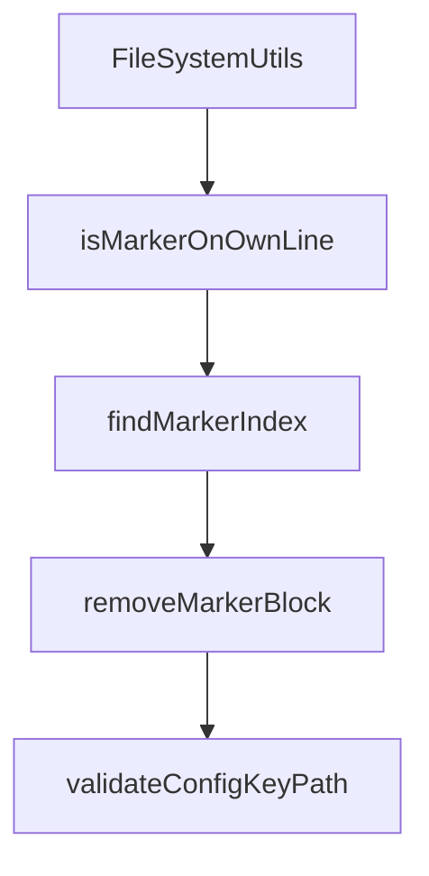

# Chapter 6: Tool Integrations and Multi-Agent Portability

Welcome to **Chapter 6: Tool Integrations and Multi-Agent Portability**. In this part of **OpenSpec Tutorial: Spec-Driven Workflows for AI Coding Agents**, you will build an intuitive mental model first, then move into concrete implementation details and practical production tradeoffs.


A major OpenSpec strength is tool portability: one workflow, many coding assistants.

## Learning Goals

- understand how OpenSpec maps skills/commands across tools
- choose integration targets for your team environment
- minimize tool-specific lock-in

## Integration Model

| Layer | Description |
|:------|:------------|
| skills | reusable instruction assets powering OPSX behavior |
| command bindings | tool-specific slash command wiring |
| project artifacts | shared `openspec/` state independent of assistant choice |

## Examples of Supported Ecosystem Paths

- Claude Code
- Cursor
- Continue
- Codex
- OpenCode
- GitHub Copilot
- Windsurf
- RooCode

## Portability Checklist

1. keep workflow semantics in artifacts, not chat history
2. commit OpenSpec directories to version control
3. document tool-specific command paths for onboarding
4. periodically test at least one secondary tool integration

## Source References

- [Supported Tools](https://github.com/Fission-AI/OpenSpec/blob/main/docs/supported-tools.md)
- [Commands Reference](https://github.com/Fission-AI/OpenSpec/blob/main/docs/commands.md)
- [README](https://github.com/Fission-AI/OpenSpec/blob/main/README.md)

## Summary

You now understand how OpenSpec reduces migration friction across coding-agent clients.

Next: [Chapter 7: Validation, Automation, and CI Operations](07-validation-automation-and-ci-operations.md)

## Depth Expansion Playbook

## Source Code Walkthrough

### `src/utils/file-system.ts`

The `FileSystemUtils` class in [`src/utils/file-system.ts`](https://github.com/Fission-AI/OpenSpec/blob/HEAD/src/utils/file-system.ts) handles a key part of this chapter's functionality:

```ts
}

export class FileSystemUtils {
  /**
   * Converts a path to use forward slashes (POSIX style).
   * Essential for cross-platform compatibility with glob libraries like fast-glob.
   */
  static toPosixPath(p: string): string {
    return p.replace(/\\/g, '/');
  }

  private static isWindowsBasePath(basePath: string): boolean {
    return /^[A-Za-z]:[\\/]/.test(basePath) || basePath.startsWith('\\');
  }

  private static normalizeSegments(segments: string[]): string[] {
    return segments
      .flatMap((segment) => segment.split(/[\\/]+/u))
      .filter((part) => part.length > 0);
  }

  static joinPath(basePath: string, ...segments: string[]): string {
    const normalizedSegments = this.normalizeSegments(segments);

    if (this.isWindowsBasePath(basePath)) {
      const normalizedBasePath = path.win32.normalize(basePath);
      return normalizedSegments.length
        ? path.win32.join(normalizedBasePath, ...normalizedSegments)
        : normalizedBasePath;
    }

    const posixBasePath = basePath.replace(/\\/g, '/');
```

This class is important because it defines how OpenSpec Tutorial: Spec-Driven Workflows for AI Coding Agents implements the patterns covered in this chapter.

### `src/utils/file-system.ts`

The `isMarkerOnOwnLine` function in [`src/utils/file-system.ts`](https://github.com/Fission-AI/OpenSpec/blob/HEAD/src/utils/file-system.ts) handles a key part of this chapter's functionality:

```ts
import path from 'path';

function isMarkerOnOwnLine(content: string, markerIndex: number, markerLength: number): boolean {
  let leftIndex = markerIndex - 1;
  while (leftIndex >= 0 && content[leftIndex] !== '\n') {
    const char = content[leftIndex];
    if (char !== ' ' && char !== '\t' && char !== '\r') {
      return false;
    }
    leftIndex--;
  }

  let rightIndex = markerIndex + markerLength;
  while (rightIndex < content.length && content[rightIndex] !== '\n') {
    const char = content[rightIndex];
    if (char !== ' ' && char !== '\t' && char !== '\r') {
      return false;
    }
    rightIndex++;
  }

  return true;
}

function findMarkerIndex(
  content: string,
  marker: string,
  fromIndex = 0
): number {
  let currentIndex = content.indexOf(marker, fromIndex);

  while (currentIndex !== -1) {
```

This function is important because it defines how OpenSpec Tutorial: Spec-Driven Workflows for AI Coding Agents implements the patterns covered in this chapter.

### `src/utils/file-system.ts`

The `findMarkerIndex` function in [`src/utils/file-system.ts`](https://github.com/Fission-AI/OpenSpec/blob/HEAD/src/utils/file-system.ts) handles a key part of this chapter's functionality:

```ts
}

function findMarkerIndex(
  content: string,
  marker: string,
  fromIndex = 0
): number {
  let currentIndex = content.indexOf(marker, fromIndex);

  while (currentIndex !== -1) {
    if (isMarkerOnOwnLine(content, currentIndex, marker.length)) {
      return currentIndex;
    }

    currentIndex = content.indexOf(marker, currentIndex + marker.length);
  }

  return -1;
}

export class FileSystemUtils {
  /**
   * Converts a path to use forward slashes (POSIX style).
   * Essential for cross-platform compatibility with glob libraries like fast-glob.
   */
  static toPosixPath(p: string): string {
    return p.replace(/\\/g, '/');
  }

  private static isWindowsBasePath(basePath: string): boolean {
    return /^[A-Za-z]:[\\/]/.test(basePath) || basePath.startsWith('\\');
  }
```

This function is important because it defines how OpenSpec Tutorial: Spec-Driven Workflows for AI Coding Agents implements the patterns covered in this chapter.

### `src/utils/file-system.ts`

The `removeMarkerBlock` function in [`src/utils/file-system.ts`](https://github.com/Fission-AI/OpenSpec/blob/HEAD/src/utils/file-system.ts) handles a key part of this chapter's functionality:

```ts
 * @returns Content with marker block removed, or original content if markers not found/invalid
 */
export function removeMarkerBlock(
  content: string,
  startMarker: string,
  endMarker: string
): string {
  const startIndex = findMarkerIndex(content, startMarker);
  const endIndex = startIndex !== -1
    ? findMarkerIndex(content, endMarker, startIndex + startMarker.length)
    : findMarkerIndex(content, endMarker);

  if (startIndex === -1 || endIndex === -1 || endIndex <= startIndex) {
    return content;
  }

  // Find the start of the line containing the start marker
  let lineStart = startIndex;
  while (lineStart > 0 && content[lineStart - 1] !== '\n') {
    lineStart--;
  }

  // Find the end of the line containing the end marker
  let lineEnd = endIndex + endMarker.length;
  while (lineEnd < content.length && content[lineEnd] !== '\n') {
    lineEnd++;
  }
  // Include the trailing newline if present
  if (lineEnd < content.length && content[lineEnd] === '\n') {
    lineEnd++;
  }

```

This function is important because it defines how OpenSpec Tutorial: Spec-Driven Workflows for AI Coding Agents implements the patterns covered in this chapter.


## How These Components Connect


