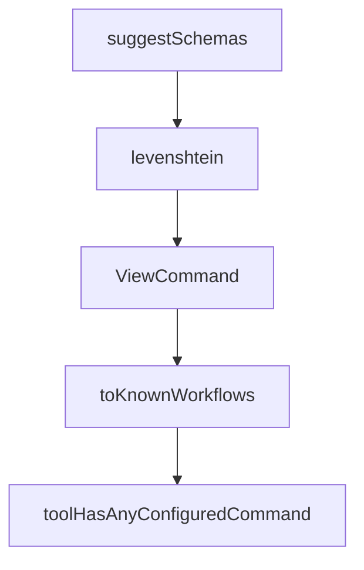

# Chapter 7: Validation, Automation, and CI Operations

Welcome to **Chapter 7: Validation, Automation, and CI Operations**. In this part of **OpenSpec Tutorial: Spec-Driven Workflows for AI Coding Agents**, you will build an intuitive mental model first, then move into concrete implementation details and practical production tradeoffs.


This chapter focuses on quality gates so OpenSpec artifacts remain trusted inputs to implementation.

## Learning Goals

- apply validation commands in local and CI contexts
- use JSON outputs for automation pipelines
- prevent broken artifact states from reaching merge

## Core Validation Commands

```bash
openspec validate --all
openspec status
openspec instructions proposal --change <name>
```

For automation pipelines:

```bash
openspec validate --all --json
openspec status --json
```

## CI Gate Suggestions

| Gate | Purpose |
|:-----|:--------|
| artifact validation | catch malformed or inconsistent specs early |
| status checks | ensure no ambiguous lifecycle state before merge |
| implementation verification | detect mismatch between tasks and delivered behavior |

## Operating Pattern

1. run validation before `/opsx:archive`
2. enforce validation in pull request checks
3. keep artifacts updated with code changes in the same branch

## Source References

- [CLI Reference](https://github.com/Fission-AI/OpenSpec/blob/main/docs/cli.md)
- [Commands](https://github.com/Fission-AI/OpenSpec/blob/main/docs/commands.md)
- [Workflows](https://github.com/Fission-AI/OpenSpec/blob/main/docs/workflows.md)

## Summary

You now have an actionable quality-gate model for integrating OpenSpec into CI/CD.

Next: [Chapter 8: Migration, Governance, and Team Adoption](08-migration-governance-and-team-adoption.md)

## Source Code Walkthrough

### `src/core/project-config.ts`

The `suggestSchemas` function in [`src/core/project-config.ts`](https://github.com/Fission-AI/OpenSpec/blob/HEAD/src/core/project-config.ts) handles a key part of this chapter's functionality:

```ts
 * @returns Error message with suggestions and available schemas
 */
export function suggestSchemas(
  invalidSchemaName: string,
  availableSchemas: { name: string; isBuiltIn: boolean }[]
): string {
  // Simple fuzzy match: Levenshtein distance
  function levenshtein(a: string, b: string): number {
    const matrix: number[][] = [];
    for (let i = 0; i <= b.length; i++) {
      matrix[i] = [i];
    }
    for (let j = 0; j <= a.length; j++) {
      matrix[0][j] = j;
    }
    for (let i = 1; i <= b.length; i++) {
      for (let j = 1; j <= a.length; j++) {
        if (b.charAt(i - 1) === a.charAt(j - 1)) {
          matrix[i][j] = matrix[i - 1][j - 1];
        } else {
          matrix[i][j] = Math.min(
            matrix[i - 1][j - 1] + 1,
            matrix[i][j - 1] + 1,
            matrix[i - 1][j] + 1
          );
        }
      }
    }
    return matrix[b.length][a.length];
  }

  // Find closest matches (distance <= 3)
```

This function is important because it defines how OpenSpec Tutorial: Spec-Driven Workflows for AI Coding Agents implements the patterns covered in this chapter.

### `src/core/project-config.ts`

The `levenshtein` function in [`src/core/project-config.ts`](https://github.com/Fission-AI/OpenSpec/blob/HEAD/src/core/project-config.ts) handles a key part of this chapter's functionality:

```ts
): string {
  // Simple fuzzy match: Levenshtein distance
  function levenshtein(a: string, b: string): number {
    const matrix: number[][] = [];
    for (let i = 0; i <= b.length; i++) {
      matrix[i] = [i];
    }
    for (let j = 0; j <= a.length; j++) {
      matrix[0][j] = j;
    }
    for (let i = 1; i <= b.length; i++) {
      for (let j = 1; j <= a.length; j++) {
        if (b.charAt(i - 1) === a.charAt(j - 1)) {
          matrix[i][j] = matrix[i - 1][j - 1];
        } else {
          matrix[i][j] = Math.min(
            matrix[i - 1][j - 1] + 1,
            matrix[i][j - 1] + 1,
            matrix[i - 1][j] + 1
          );
        }
      }
    }
    return matrix[b.length][a.length];
  }

  // Find closest matches (distance <= 3)
  const suggestions = availableSchemas
    .map((s) => ({ ...s, distance: levenshtein(invalidSchemaName, s.name) }))
    .filter((s) => s.distance <= 3)
    .sort((a, b) => a.distance - b.distance)
    .slice(0, 3);
```

This function is important because it defines how OpenSpec Tutorial: Spec-Driven Workflows for AI Coding Agents implements the patterns covered in this chapter.

### `src/core/view.ts`

The `ViewCommand` class in [`src/core/view.ts`](https://github.com/Fission-AI/OpenSpec/blob/HEAD/src/core/view.ts) handles a key part of this chapter's functionality:

```ts
import { MarkdownParser } from './parsers/markdown-parser.js';

export class ViewCommand {
  async execute(targetPath: string = '.'): Promise<void> {
    const openspecDir = path.join(targetPath, 'openspec');
    
    if (!fs.existsSync(openspecDir)) {
      console.error(chalk.red('No openspec directory found'));
      process.exit(1);
    }

    console.log(chalk.bold('\nOpenSpec Dashboard\n'));
    console.log('═'.repeat(60));

    // Get changes and specs data
    const changesData = await this.getChangesData(openspecDir);
    const specsData = await this.getSpecsData(openspecDir);

    // Display summary metrics
    this.displaySummary(changesData, specsData);

    // Display draft changes
    if (changesData.draft.length > 0) {
      console.log(chalk.bold.gray('\nDraft Changes'));
      console.log('─'.repeat(60));
      changesData.draft.forEach((change) => {
        console.log(`  ${chalk.gray('○')} ${change.name}`);
      });
    }

    // Display active changes
    if (changesData.active.length > 0) {
```

This class is important because it defines how OpenSpec Tutorial: Spec-Driven Workflows for AI Coding Agents implements the patterns covered in this chapter.

### `src/core/profile-sync-drift.ts`

The `toKnownWorkflows` function in [`src/core/profile-sync-drift.ts`](https://github.com/Fission-AI/OpenSpec/blob/HEAD/src/core/profile-sync-drift.ts) handles a key part of this chapter's functionality:

```ts
};

function toKnownWorkflows(workflows: readonly string[]): WorkflowId[] {
  return workflows.filter(
    (workflow): workflow is WorkflowId =>
      (ALL_WORKFLOWS as readonly string[]).includes(workflow)
  );
}

/**
 * Checks whether a tool has at least one generated OpenSpec command file.
 */
export function toolHasAnyConfiguredCommand(projectPath: string, toolId: string): boolean {
  const adapter = CommandAdapterRegistry.get(toolId);
  if (!adapter) return false;

  for (const commandId of COMMAND_IDS) {
    const cmdPath = adapter.getFilePath(commandId);
    const fullPath = path.isAbsolute(cmdPath) ? cmdPath : path.join(projectPath, cmdPath);
    if (fs.existsSync(fullPath)) {
      return true;
    }
  }

  return false;
}

/**
 * Returns tools with at least one generated command file on disk.
 */
export function getCommandConfiguredTools(projectPath: string): string[] {
  return AI_TOOLS
```

This function is important because it defines how OpenSpec Tutorial: Spec-Driven Workflows for AI Coding Agents implements the patterns covered in this chapter.


## How These Components Connect


