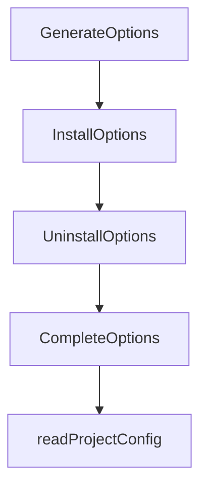

# Chapter 7: Validation, Automation, and CI Operations

Welcome to **Chapter 7: Validation, Automation, and CI Operations**. In this part of **OpenSpec Tutorial: Spec-Driven Workflows for AI Coding Agents**, you will build an intuitive mental model first, then move into concrete implementation details and practical production tradeoffs.


This chapter focuses on quality gates so OpenSpec artifacts remain trusted inputs to implementation.

## Learning Goals

- apply validation commands in local and CI contexts
- use JSON outputs for automation pipelines
- prevent broken artifact states from reaching merge

## Core Validation Commands

```bash
openspec validate --all
openspec status
openspec instructions proposal --change <name>
```

For automation pipelines:

```bash
openspec validate --all --json
openspec status --json
```

## CI Gate Suggestions

| Gate | Purpose |
|:-----|:--------|
| artifact validation | catch malformed or inconsistent specs early |
| status checks | ensure no ambiguous lifecycle state before merge |
| implementation verification | detect mismatch between tasks and delivered behavior |

## Operating Pattern

1. run validation before `/opsx:archive`
2. enforce validation in pull request checks
3. keep artifacts updated with code changes in the same branch

## Source References

- [CLI Reference](https://github.com/Fission-AI/OpenSpec/blob/main/docs/cli.md)
- [Commands](https://github.com/Fission-AI/OpenSpec/blob/main/docs/commands.md)
- [Workflows](https://github.com/Fission-AI/OpenSpec/blob/main/docs/workflows.md)

## Summary

You now have an actionable quality-gate model for integrating OpenSpec into CI/CD.

Next: [Chapter 8: Migration, Governance, and Team Adoption](08-migration-governance-and-team-adoption.md)

## Depth Expansion Playbook

## Source Code Walkthrough

### `src/commands/completion.ts`

The `GenerateOptions` interface in [`src/commands/completion.ts`](https://github.com/Fission-AI/OpenSpec/blob/HEAD/src/commands/completion.ts) handles a key part of this chapter's functionality:

```ts
import { getArchivedChangeIds } from '../utils/item-discovery.js';

interface GenerateOptions {
  shell?: string;
}

interface InstallOptions {
  shell?: string;
  verbose?: boolean;
}

interface UninstallOptions {
  shell?: string;
  yes?: boolean;
}

interface CompleteOptions {
  type: string;
}

/**
 * Command for managing shell completions for OpenSpec CLI
 */
export class CompletionCommand {
  private completionProvider: CompletionProvider;

  constructor() {
    this.completionProvider = new CompletionProvider();
  }
  /**
   * Resolve shell parameter or exit with error
   *
```

This interface is important because it defines how OpenSpec Tutorial: Spec-Driven Workflows for AI Coding Agents implements the patterns covered in this chapter.

### `src/commands/completion.ts`

The `InstallOptions` interface in [`src/commands/completion.ts`](https://github.com/Fission-AI/OpenSpec/blob/HEAD/src/commands/completion.ts) handles a key part of this chapter's functionality:

```ts
}

interface InstallOptions {
  shell?: string;
  verbose?: boolean;
}

interface UninstallOptions {
  shell?: string;
  yes?: boolean;
}

interface CompleteOptions {
  type: string;
}

/**
 * Command for managing shell completions for OpenSpec CLI
 */
export class CompletionCommand {
  private completionProvider: CompletionProvider;

  constructor() {
    this.completionProvider = new CompletionProvider();
  }
  /**
   * Resolve shell parameter or exit with error
   *
   * @param shell - The shell parameter (may be undefined)
   * @param operationName - Name of the operation (for error messages)
   * @returns Resolved shell or null if should exit
   */
```

This interface is important because it defines how OpenSpec Tutorial: Spec-Driven Workflows for AI Coding Agents implements the patterns covered in this chapter.

### `src/commands/completion.ts`

The `UninstallOptions` interface in [`src/commands/completion.ts`](https://github.com/Fission-AI/OpenSpec/blob/HEAD/src/commands/completion.ts) handles a key part of this chapter's functionality:

```ts
}

interface UninstallOptions {
  shell?: string;
  yes?: boolean;
}

interface CompleteOptions {
  type: string;
}

/**
 * Command for managing shell completions for OpenSpec CLI
 */
export class CompletionCommand {
  private completionProvider: CompletionProvider;

  constructor() {
    this.completionProvider = new CompletionProvider();
  }
  /**
   * Resolve shell parameter or exit with error
   *
   * @param shell - The shell parameter (may be undefined)
   * @param operationName - Name of the operation (for error messages)
   * @returns Resolved shell or null if should exit
   */
  private resolveShellOrExit(shell: string | undefined, operationName: string): SupportedShell | null {
    const normalizedShell = this.normalizeShell(shell);

    if (!normalizedShell) {
      const detectionResult = detectShell();
```

This interface is important because it defines how OpenSpec Tutorial: Spec-Driven Workflows for AI Coding Agents implements the patterns covered in this chapter.

### `src/commands/completion.ts`

The `CompleteOptions` interface in [`src/commands/completion.ts`](https://github.com/Fission-AI/OpenSpec/blob/HEAD/src/commands/completion.ts) handles a key part of this chapter's functionality:

```ts
}

interface CompleteOptions {
  type: string;
}

/**
 * Command for managing shell completions for OpenSpec CLI
 */
export class CompletionCommand {
  private completionProvider: CompletionProvider;

  constructor() {
    this.completionProvider = new CompletionProvider();
  }
  /**
   * Resolve shell parameter or exit with error
   *
   * @param shell - The shell parameter (may be undefined)
   * @param operationName - Name of the operation (for error messages)
   * @returns Resolved shell or null if should exit
   */
  private resolveShellOrExit(shell: string | undefined, operationName: string): SupportedShell | null {
    const normalizedShell = this.normalizeShell(shell);

    if (!normalizedShell) {
      const detectionResult = detectShell();

      if (detectionResult.shell && CompletionFactory.isSupported(detectionResult.shell)) {
        return detectionResult.shell;
      }

```

This interface is important because it defines how OpenSpec Tutorial: Spec-Driven Workflows for AI Coding Agents implements the patterns covered in this chapter.


## How These Components Connect


