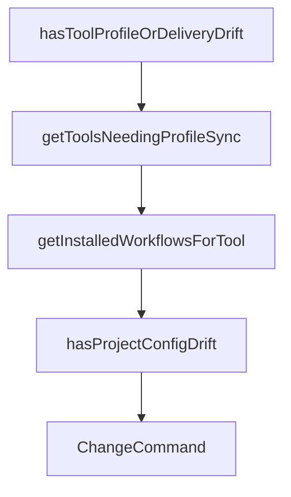

# Chapter 8: Migration, Governance, and Team Adoption

Welcome to **Chapter 8: Migration, Governance, and Team Adoption**. In this part of **OpenSpec Tutorial: Spec-Driven Workflows for AI Coding Agents**, you will build an intuitive mental model first, then move into concrete implementation details and practical production tradeoffs.


This final chapter covers migration from legacy workflows and long-term team operating practices.

## Learning Goals

- migrate from pre-OPSX patterns without losing intent
- define governance for artifact quality and ownership
- scale OpenSpec adoption across teams and repositories

## Migration Priorities

| Priority | Reason |
|:---------|:-------|
| clean legacy instruction files | reduce command ambiguity |
| regenerate skills with current CLI | align tool behavior |
| validate migrated artifacts | preserve spec continuity |

## Governance Model

1. assign owners for schema, rules, and workflow policy
2. define review criteria for proposal/spec/design/tasks quality
3. require validation before archive and merge
4. audit telemetry and privacy posture against team policy

## Adoption Blueprint

| Phase | Objective |
|:------|:----------|
| pilot | prove value on one active product area |
| standardization | publish templates and review guides |
| scale | expand to multi-team, multi-tool workflows |

## Source References

- [Migration Guide](https://github.com/Fission-AI/OpenSpec/blob/main/docs/migration-guide.md)
- [README](https://github.com/Fission-AI/OpenSpec/blob/main/README.md)
- [Maintainers and Advisors](https://github.com/Fission-AI/OpenSpec/blob/main/MAINTAINERS.md)

## Summary

You now have an end-to-end model for running OpenSpec as part of a production engineering workflow.

Next: compare execution patterns with [Claude Task Master](../claude-task-master-tutorial/) and [Codex CLI](../codex-cli-tutorial/).

## Depth Expansion Playbook

## Source Code Walkthrough

### `src/core/profile-sync-drift.ts`

The `hasToolProfileOrDeliveryDrift` function in [`src/core/profile-sync-drift.ts`](https://github.com/Fission-AI/OpenSpec/blob/HEAD/src/core/profile-sync-drift.ts) handles a key part of this chapter's functionality:

```ts
 * - artifacts for workflows that were deselected from the current profile
 */
export function hasToolProfileOrDeliveryDrift(
  projectPath: string,
  toolId: string,
  desiredWorkflows: readonly string[],
  delivery: Delivery
): boolean {
  const tool = AI_TOOLS.find((t) => t.value === toolId);
  if (!tool?.skillsDir) return false;

  const knownDesiredWorkflows = toKnownWorkflows(desiredWorkflows);
  const desiredWorkflowSet = new Set<WorkflowId>(knownDesiredWorkflows);
  const skillsDir = path.join(projectPath, tool.skillsDir, 'skills');
  const adapter = CommandAdapterRegistry.get(toolId);
  const shouldGenerateSkills = delivery !== 'commands';
  const shouldGenerateCommands = delivery !== 'skills';

  if (shouldGenerateSkills) {
    for (const workflow of knownDesiredWorkflows) {
      const dirName = WORKFLOW_TO_SKILL_DIR[workflow];
      const skillFile = path.join(skillsDir, dirName, 'SKILL.md');
      if (!fs.existsSync(skillFile)) {
        return true;
      }
    }

    // Deselecting workflows in a profile should trigger sync.
    for (const workflow of ALL_WORKFLOWS) {
      if (desiredWorkflowSet.has(workflow)) continue;
      const dirName = WORKFLOW_TO_SKILL_DIR[workflow];
      const skillDir = path.join(skillsDir, dirName);
```

This function is important because it defines how OpenSpec Tutorial: Spec-Driven Workflows for AI Coding Agents implements the patterns covered in this chapter.

### `src/core/profile-sync-drift.ts`

The `getToolsNeedingProfileSync` function in [`src/core/profile-sync-drift.ts`](https://github.com/Fission-AI/OpenSpec/blob/HEAD/src/core/profile-sync-drift.ts) handles a key part of this chapter's functionality:

```ts
 * Returns configured tools that currently need a profile/delivery sync.
 */
export function getToolsNeedingProfileSync(
  projectPath: string,
  desiredWorkflows: readonly string[],
  delivery: Delivery,
  configuredTools?: readonly string[]
): string[] {
  const tools = configuredTools ? [...new Set(configuredTools)] : getConfiguredToolsForProfileSync(projectPath);
  return tools.filter((toolId) =>
    hasToolProfileOrDeliveryDrift(projectPath, toolId, desiredWorkflows, delivery)
  );
}

function getInstalledWorkflowsForTool(
  projectPath: string,
  toolId: string,
  options: { includeSkills: boolean; includeCommands: boolean }
): WorkflowId[] {
  const tool = AI_TOOLS.find((t) => t.value === toolId);
  if (!tool?.skillsDir) return [];

  const installed = new Set<WorkflowId>();
  const skillsDir = path.join(projectPath, tool.skillsDir, 'skills');

  if (options.includeSkills) {
    for (const workflow of ALL_WORKFLOWS) {
      const dirName = WORKFLOW_TO_SKILL_DIR[workflow];
      const skillFile = path.join(skillsDir, dirName, 'SKILL.md');
      if (fs.existsSync(skillFile)) {
        installed.add(workflow);
      }
```

This function is important because it defines how OpenSpec Tutorial: Spec-Driven Workflows for AI Coding Agents implements the patterns covered in this chapter.

### `src/core/profile-sync-drift.ts`

The `getInstalledWorkflowsForTool` function in [`src/core/profile-sync-drift.ts`](https://github.com/Fission-AI/OpenSpec/blob/HEAD/src/core/profile-sync-drift.ts) handles a key part of this chapter's functionality:

```ts
}

function getInstalledWorkflowsForTool(
  projectPath: string,
  toolId: string,
  options: { includeSkills: boolean; includeCommands: boolean }
): WorkflowId[] {
  const tool = AI_TOOLS.find((t) => t.value === toolId);
  if (!tool?.skillsDir) return [];

  const installed = new Set<WorkflowId>();
  const skillsDir = path.join(projectPath, tool.skillsDir, 'skills');

  if (options.includeSkills) {
    for (const workflow of ALL_WORKFLOWS) {
      const dirName = WORKFLOW_TO_SKILL_DIR[workflow];
      const skillFile = path.join(skillsDir, dirName, 'SKILL.md');
      if (fs.existsSync(skillFile)) {
        installed.add(workflow);
      }
    }
  }

  if (options.includeCommands) {
    const adapter = CommandAdapterRegistry.get(toolId);
    if (adapter) {
      for (const workflow of ALL_WORKFLOWS) {
        const cmdPath = adapter.getFilePath(workflow);
        const fullPath = path.isAbsolute(cmdPath) ? cmdPath : path.join(projectPath, cmdPath);
        if (fs.existsSync(fullPath)) {
          installed.add(workflow);
        }
```

This function is important because it defines how OpenSpec Tutorial: Spec-Driven Workflows for AI Coding Agents implements the patterns covered in this chapter.

### `src/core/profile-sync-drift.ts`

The `hasProjectConfigDrift` function in [`src/core/profile-sync-drift.ts`](https://github.com/Fission-AI/OpenSpec/blob/HEAD/src/core/profile-sync-drift.ts) handles a key part of this chapter's functionality:

```ts
 * Detects whether the current project has any profile/delivery drift.
 */
export function hasProjectConfigDrift(
  projectPath: string,
  desiredWorkflows: readonly string[],
  delivery: Delivery
): boolean {
  const configuredTools = getConfiguredToolsForProfileSync(projectPath);
  if (getToolsNeedingProfileSync(projectPath, desiredWorkflows, delivery, configuredTools).length > 0) {
    return true;
  }

  const desiredSet = new Set(toKnownWorkflows(desiredWorkflows));
  const includeSkills = delivery !== 'commands';
  const includeCommands = delivery !== 'skills';

  for (const toolId of configuredTools) {
    const installed = getInstalledWorkflowsForTool(projectPath, toolId, { includeSkills, includeCommands });
    if (installed.some((workflow) => !desiredSet.has(workflow))) {
      return true;
    }
  }

  return false;
}

```

This function is important because it defines how OpenSpec Tutorial: Spec-Driven Workflows for AI Coding Agents implements the patterns covered in this chapter.


## How These Components Connect


