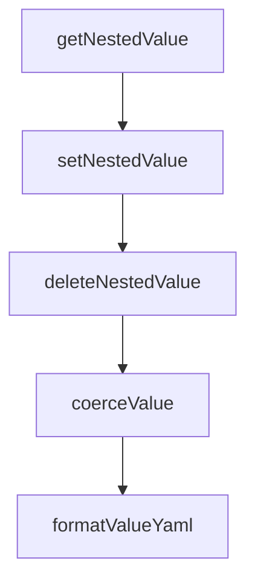

# Chapter 8: Migration, Governance, and Team Adoption

Welcome to **Chapter 8: Migration, Governance, and Team Adoption**. In this part of **OpenSpec Tutorial: Spec-Driven Workflows for AI Coding Agents**, you will build an intuitive mental model first, then move into concrete implementation details and practical production tradeoffs.


This final chapter covers migration from legacy workflows and long-term team operating practices.

## Learning Goals

- migrate from pre-OPSX patterns without losing intent
- define governance for artifact quality and ownership
- scale OpenSpec adoption across teams and repositories

## Migration Priorities

| Priority | Reason |
|:---------|:-------|
| clean legacy instruction files | reduce command ambiguity |
| regenerate skills with current CLI | align tool behavior |
| validate migrated artifacts | preserve spec continuity |

## Governance Model

1. assign owners for schema, rules, and workflow policy
2. define review criteria for proposal/spec/design/tasks quality
3. require validation before archive and merge
4. audit telemetry and privacy posture against team policy

## Adoption Blueprint

| Phase | Objective |
|:------|:----------|
| pilot | prove value on one active product area |
| standardization | publish templates and review guides |
| scale | expand to multi-team, multi-tool workflows |

## Source References

- [Migration Guide](https://github.com/Fission-AI/OpenSpec/blob/main/docs/migration-guide.md)
- [README](https://github.com/Fission-AI/OpenSpec/blob/main/README.md)
- [Maintainers and Advisors](https://github.com/Fission-AI/OpenSpec/blob/main/MAINTAINERS.md)

## Summary

You now have an end-to-end model for running OpenSpec as part of a production engineering workflow.

Next: compare execution patterns with [Claude Task Master](../claude-task-master-tutorial/) and [Codex CLI](../codex-cli-tutorial/).

## Source Code Walkthrough

### `src/core/config-schema.ts`

The `getNestedValue` function in [`src/core/config-schema.ts`](https://github.com/Fission-AI/OpenSpec/blob/HEAD/src/core/config-schema.ts) handles a key part of this chapter's functionality:

```ts
 * @returns The value at the path, or undefined if not found
 */
export function getNestedValue(obj: Record<string, unknown>, path: string): unknown {
  const keys = path.split('.');
  let current: unknown = obj;

  for (const key of keys) {
    if (current === null || current === undefined) {
      return undefined;
    }
    if (typeof current !== 'object') {
      return undefined;
    }
    current = (current as Record<string, unknown>)[key];
  }

  return current;
}

/**
 * Set a nested value in an object using dot notation.
 * Creates intermediate objects as needed.
 *
 * @param obj - The object to modify (mutated in place)
 * @param path - Dot-separated path (e.g., "featureFlags.someFlag")
 * @param value - The value to set
 */
export function setNestedValue(obj: Record<string, unknown>, path: string, value: unknown): void {
  const keys = path.split('.');
  let current: Record<string, unknown> = obj;

  for (let i = 0; i < keys.length - 1; i++) {
```

This function is important because it defines how OpenSpec Tutorial: Spec-Driven Workflows for AI Coding Agents implements the patterns covered in this chapter.

### `src/core/config-schema.ts`

The `setNestedValue` function in [`src/core/config-schema.ts`](https://github.com/Fission-AI/OpenSpec/blob/HEAD/src/core/config-schema.ts) handles a key part of this chapter's functionality:

```ts
 * @param value - The value to set
 */
export function setNestedValue(obj: Record<string, unknown>, path: string, value: unknown): void {
  const keys = path.split('.');
  let current: Record<string, unknown> = obj;

  for (let i = 0; i < keys.length - 1; i++) {
    const key = keys[i];
    if (current[key] === undefined || current[key] === null || typeof current[key] !== 'object') {
      current[key] = {};
    }
    current = current[key] as Record<string, unknown>;
  }

  const lastKey = keys[keys.length - 1];
  current[lastKey] = value;
}

/**
 * Delete a nested value from an object using dot notation.
 *
 * @param obj - The object to modify (mutated in place)
 * @param path - Dot-separated path (e.g., "featureFlags.someFlag")
 * @returns true if the key existed and was deleted, false otherwise
 */
export function deleteNestedValue(obj: Record<string, unknown>, path: string): boolean {
  const keys = path.split('.');
  let current: Record<string, unknown> = obj;

  for (let i = 0; i < keys.length - 1; i++) {
    const key = keys[i];
    if (current[key] === undefined || current[key] === null || typeof current[key] !== 'object') {
```

This function is important because it defines how OpenSpec Tutorial: Spec-Driven Workflows for AI Coding Agents implements the patterns covered in this chapter.

### `src/core/config-schema.ts`

The `deleteNestedValue` function in [`src/core/config-schema.ts`](https://github.com/Fission-AI/OpenSpec/blob/HEAD/src/core/config-schema.ts) handles a key part of this chapter's functionality:

```ts
 * @returns true if the key existed and was deleted, false otherwise
 */
export function deleteNestedValue(obj: Record<string, unknown>, path: string): boolean {
  const keys = path.split('.');
  let current: Record<string, unknown> = obj;

  for (let i = 0; i < keys.length - 1; i++) {
    const key = keys[i];
    if (current[key] === undefined || current[key] === null || typeof current[key] !== 'object') {
      return false;
    }
    current = current[key] as Record<string, unknown>;
  }

  const lastKey = keys[keys.length - 1];
  if (lastKey in current) {
    delete current[lastKey];
    return true;
  }
  return false;
}

/**
 * Coerce a string value to its appropriate type.
 * - "true" / "false" -> boolean
 * - Numeric strings -> number
 * - Everything else -> string
 *
 * @param value - The string value to coerce
 * @param forceString - If true, always return the value as a string
 * @returns The coerced value
 */
```

This function is important because it defines how OpenSpec Tutorial: Spec-Driven Workflows for AI Coding Agents implements the patterns covered in this chapter.

### `src/core/config-schema.ts`

The `coerceValue` function in [`src/core/config-schema.ts`](https://github.com/Fission-AI/OpenSpec/blob/HEAD/src/core/config-schema.ts) handles a key part of this chapter's functionality:

```ts
 * @returns The coerced value
 */
export function coerceValue(value: string, forceString: boolean = false): string | number | boolean {
  if (forceString) {
    return value;
  }

  // Boolean coercion
  if (value === 'true') {
    return true;
  }
  if (value === 'false') {
    return false;
  }

  // Number coercion - must be a valid finite number
  const num = Number(value);
  if (!isNaN(num) && isFinite(num) && value.trim() !== '') {
    return num;
  }

  return value;
}

/**
 * Format a value for YAML-like display.
 *
 * @param value - The value to format
 * @param indent - Current indentation level
 * @returns Formatted string
 */
export function formatValueYaml(value: unknown, indent: number = 0): string {
```

This function is important because it defines how OpenSpec Tutorial: Spec-Driven Workflows for AI Coding Agents implements the patterns covered in this chapter.


## How These Components Connect


