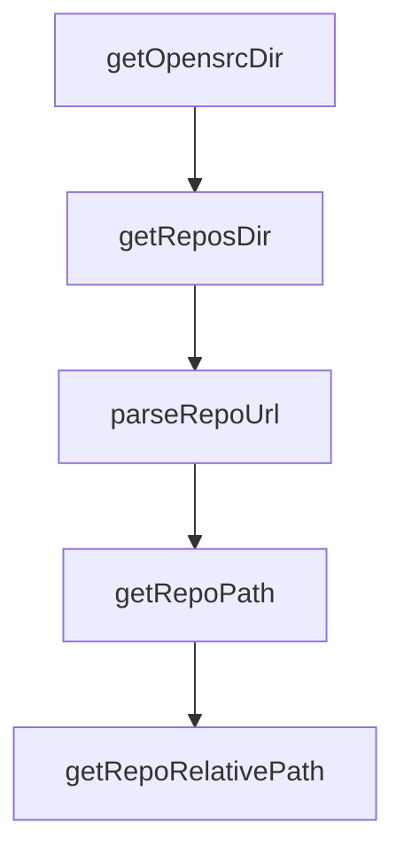

# Chapter 1: Getting Started

Welcome to **Chapter 1: Getting Started**. In this part of **OpenSrc Tutorial: Deep Source Context for Coding Agents**, you will build an intuitive mental model first, then move into concrete implementation details and practical production tradeoffs.


This chapter gets OpenSrc installed and fetching your first source dependency.

## Quick Start

```bash
npm install -g opensrc
opensrc zod
opensrc list
```

## Alternative Invocation

```bash
npx opensrc react react-dom
```

## What to Verify

- an `opensrc/` directory exists
- `opensrc/sources.json` is created
- `opensrc list` shows fetched entries

## Source References

- [OpenSrc README](https://github.com/vercel-labs/opensrc/blob/main/README.md)

## Summary

You now have OpenSrc running with an initial source import and index file.

Next: [Chapter 2: Input Parsing and Resolution Pipeline](02-input-parsing-and-resolution-pipeline.md)

## Depth Expansion Playbook

## Source Code Walkthrough

### `src/lib/git.ts`

The `getOpensrcDir` function in [`src/lib/git.ts`](https://github.com/vercel-labs/opensrc/blob/HEAD/src/lib/git.ts) handles a key part of this chapter's functionality:

```ts
 * Get the opensrc directory path
 */
export function getOpensrcDir(cwd: string = process.cwd()): string {
  return join(cwd, OPENSRC_DIR);
}

/**
 * Get the repos directory path
 */
export function getReposDir(cwd: string = process.cwd()): string {
  return join(getOpensrcDir(cwd), REPOS_DIR);
}

/**
 * Extract host/owner/repo from a git URL
 */
export function parseRepoUrl(
  url: string,
): { host: string; owner: string; repo: string } | null {
  // Handle HTTPS URLs: https://github.com/owner/repo
  const httpsMatch = url.match(/https?:\/\/([^/]+)\/([^/]+)\/([^/]+)/);
  if (httpsMatch) {
    return {
      host: httpsMatch[1],
      owner: httpsMatch[2],
      repo: httpsMatch[3].replace(/\.git$/, ""),
    };
  }

  // Handle SSH URLs: git@github.com:owner/repo.git
  const sshMatch = url.match(/git@([^:]+):([^/]+)\/(.+)/);
  if (sshMatch) {
```

This function is important because it defines how OpenSrc Tutorial: Deep Source Context for Coding Agents implements the patterns covered in this chapter.

### `src/lib/git.ts`

The `getReposDir` function in [`src/lib/git.ts`](https://github.com/vercel-labs/opensrc/blob/HEAD/src/lib/git.ts) handles a key part of this chapter's functionality:

```ts
 * Get the repos directory path
 */
export function getReposDir(cwd: string = process.cwd()): string {
  return join(getOpensrcDir(cwd), REPOS_DIR);
}

/**
 * Extract host/owner/repo from a git URL
 */
export function parseRepoUrl(
  url: string,
): { host: string; owner: string; repo: string } | null {
  // Handle HTTPS URLs: https://github.com/owner/repo
  const httpsMatch = url.match(/https?:\/\/([^/]+)\/([^/]+)\/([^/]+)/);
  if (httpsMatch) {
    return {
      host: httpsMatch[1],
      owner: httpsMatch[2],
      repo: httpsMatch[3].replace(/\.git$/, ""),
    };
  }

  // Handle SSH URLs: git@github.com:owner/repo.git
  const sshMatch = url.match(/git@([^:]+):([^/]+)\/(.+)/);
  if (sshMatch) {
    return {
      host: sshMatch[1],
      owner: sshMatch[2],
      repo: sshMatch[3].replace(/\.git$/, ""),
    };
  }

```

This function is important because it defines how OpenSrc Tutorial: Deep Source Context for Coding Agents implements the patterns covered in this chapter.

### `src/lib/git.ts`

The `parseRepoUrl` function in [`src/lib/git.ts`](https://github.com/vercel-labs/opensrc/blob/HEAD/src/lib/git.ts) handles a key part of this chapter's functionality:

```ts
 * Extract host/owner/repo from a git URL
 */
export function parseRepoUrl(
  url: string,
): { host: string; owner: string; repo: string } | null {
  // Handle HTTPS URLs: https://github.com/owner/repo
  const httpsMatch = url.match(/https?:\/\/([^/]+)\/([^/]+)\/([^/]+)/);
  if (httpsMatch) {
    return {
      host: httpsMatch[1],
      owner: httpsMatch[2],
      repo: httpsMatch[3].replace(/\.git$/, ""),
    };
  }

  // Handle SSH URLs: git@github.com:owner/repo.git
  const sshMatch = url.match(/git@([^:]+):([^/]+)\/(.+)/);
  if (sshMatch) {
    return {
      host: sshMatch[1],
      owner: sshMatch[2],
      repo: sshMatch[3].replace(/\.git$/, ""),
    };
  }

  return null;
}

/**
 * Get the path where a repo's source will be stored
 */
export function getRepoPath(
```

This function is important because it defines how OpenSrc Tutorial: Deep Source Context for Coding Agents implements the patterns covered in this chapter.

### `src/lib/git.ts`

The `getRepoPath` function in [`src/lib/git.ts`](https://github.com/vercel-labs/opensrc/blob/HEAD/src/lib/git.ts) handles a key part of this chapter's functionality:

```ts
 * Get the path where a repo's source will be stored
 */
export function getRepoPath(
  displayName: string,
  cwd: string = process.cwd(),
): string {
  return join(getReposDir(cwd), displayName);
}

/**
 * Get the relative path for a repo (for sources.json)
 */
export function getRepoRelativePath(displayName: string): string {
  return `${REPOS_DIR}/${displayName}`;
}

/**
 * Get repo display name from URL
 */
export function getRepoDisplayName(repoUrl: string): string | null {
  const parsed = parseRepoUrl(repoUrl);
  if (!parsed) return null;
  return `${parsed.host}/${parsed.owner}/${parsed.repo}`;
}

interface PackageEntry {
  name: string;
  version: string;
  registry: Registry;
  path: string;
  fetchedAt: string;
}
```

This function is important because it defines how OpenSrc Tutorial: Deep Source Context for Coding Agents implements the patterns covered in this chapter.


## How These Components Connect


