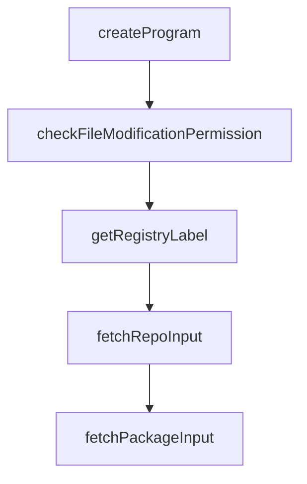

# Chapter 1: Getting Started

Welcome to **Chapter 1: Getting Started**. In this part of **OpenSrc Tutorial: Deep Source Context for Coding Agents**, you will build an intuitive mental model first, then move into concrete implementation details and practical production tradeoffs.


This chapter gets OpenSrc installed and fetching your first source dependency.

## Quick Start

```bash
npm install -g opensrc
opensrc zod
opensrc list
```

## Alternative Invocation

```bash
npx opensrc react react-dom
```

## What to Verify

- an `opensrc/` directory exists
- `opensrc/sources.json` is created
- `opensrc list` shows fetched entries

## Source References

- [OpenSrc README](https://github.com/vercel-labs/opensrc/blob/main/README.md)

## Summary

You now have OpenSrc running with an initial source import and index file.

Next: [Chapter 2: Input Parsing and Resolution Pipeline](02-input-parsing-and-resolution-pipeline.md)

## Source Code Walkthrough

### `src/index.ts`

The `createProgram` function in [`src/index.ts`](https://github.com/vercel-labs/opensrc/blob/HEAD/src/index.ts) handles a key part of this chapter's functionality:

```ts
const pkg = require("../package.json") as { version: string };

export function createProgram(): Command {
  const program = new Command();

  program
    .name("opensrc")
    .description(
      "Fetch source code for packages to give coding agents deeper context",
    )
    .version(pkg.version)
    .enablePositionalOptions();

  // Default command: fetch packages
  program
    .argument(
      "[packages...]",
      "packages or repos to fetch (e.g., zod, pypi:requests, crates:serde, owner/repo)",
    )
    .option("--cwd <path>", "working directory (default: current directory)")
    .option(
      "--modify [value]",
      "allow/deny modifying .gitignore, tsconfig.json, AGENTS.md",
      (val) => {
        if (val === undefined || val === "" || val === "true") return true;
        if (val === "false") return false;
        return true;
      },
    )
    .action(
      async (
        packages: string[],
```

This function is important because it defines how OpenSrc Tutorial: Deep Source Context for Coding Agents implements the patterns covered in this chapter.

### `src/commands/fetch.ts`

The `checkFileModificationPermission` function in [`src/commands/fetch.ts`](https://github.com/vercel-labs/opensrc/blob/HEAD/src/commands/fetch.ts) handles a key part of this chapter's functionality:

```ts
 * Check if file modifications are allowed
 */
async function checkFileModificationPermission(
  cwd: string,
  cliOverride?: boolean,
): Promise<boolean> {
  if (cliOverride !== undefined) {
    await setFileModificationPermission(cliOverride, cwd);
    if (cliOverride) {
      console.log("✓ File modifications enabled (--modify)");
    } else {
      console.log("✗ File modifications disabled (--modify=false)");
    }
    return cliOverride;
  }

  const storedPermission = await getFileModificationPermission(cwd);
  if (storedPermission !== undefined) {
    return storedPermission;
  }

  console.log(
    "\nopensrc can update the following files for better integration:",
  );
  console.log("  • .gitignore - add opensrc/ to ignore list");
  console.log("  • tsconfig.json - exclude opensrc/ from compilation");
  console.log("  • AGENTS.md - add source code reference section\n");

  const allowed = await confirm("Allow opensrc to modify these files?");

  await setFileModificationPermission(allowed, cwd);

```

This function is important because it defines how OpenSrc Tutorial: Deep Source Context for Coding Agents implements the patterns covered in this chapter.

### `src/commands/fetch.ts`

The `getRegistryLabel` function in [`src/commands/fetch.ts`](https://github.com/vercel-labs/opensrc/blob/HEAD/src/commands/fetch.ts) handles a key part of this chapter's functionality:

```ts
 * Get registry display name
 */
function getRegistryLabel(registry: Registry): string {
  switch (registry) {
    case "npm":
      return "npm";
    case "pypi":
      return "PyPI";
    case "crates":
      return "crates.io";
  }
}

/**
 * Fetch a git repository
 */
async function fetchRepoInput(spec: string, cwd: string): Promise<FetchResult> {
  const repoSpec = parseRepoSpec(spec);

  if (!repoSpec) {
    return {
      package: spec,
      version: "",
      path: "",
      success: false,
      error: `Invalid repository format: ${spec}`,
    };
  }

  const displayName = `${repoSpec.host}/${repoSpec.owner}/${repoSpec.repo}`;
  console.log(
    `\nFetching ${repoSpec.owner}/${repoSpec.repo} from ${repoSpec.host}...`,
```

This function is important because it defines how OpenSrc Tutorial: Deep Source Context for Coding Agents implements the patterns covered in this chapter.

### `src/commands/fetch.ts`

The `fetchRepoInput` function in [`src/commands/fetch.ts`](https://github.com/vercel-labs/opensrc/blob/HEAD/src/commands/fetch.ts) handles a key part of this chapter's functionality:

```ts
 * Fetch a git repository
 */
async function fetchRepoInput(spec: string, cwd: string): Promise<FetchResult> {
  const repoSpec = parseRepoSpec(spec);

  if (!repoSpec) {
    return {
      package: spec,
      version: "",
      path: "",
      success: false,
      error: `Invalid repository format: ${spec}`,
    };
  }

  const displayName = `${repoSpec.host}/${repoSpec.owner}/${repoSpec.repo}`;
  console.log(
    `\nFetching ${repoSpec.owner}/${repoSpec.repo} from ${repoSpec.host}...`,
  );

  try {
    // Check if already exists with the same ref
    if (repoExists(displayName, cwd)) {
      const existing = await getRepoInfo(displayName, cwd);
      if (existing && repoSpec.ref && existing.version === repoSpec.ref) {
        console.log(`  ✓ Already up to date (${repoSpec.ref})`);
        return {
          package: displayName,
          version: existing.version,
          path: getRepoRelativePath(displayName),
          success: true,
        };
```

This function is important because it defines how OpenSrc Tutorial: Deep Source Context for Coding Agents implements the patterns covered in this chapter.


## How These Components Connect


