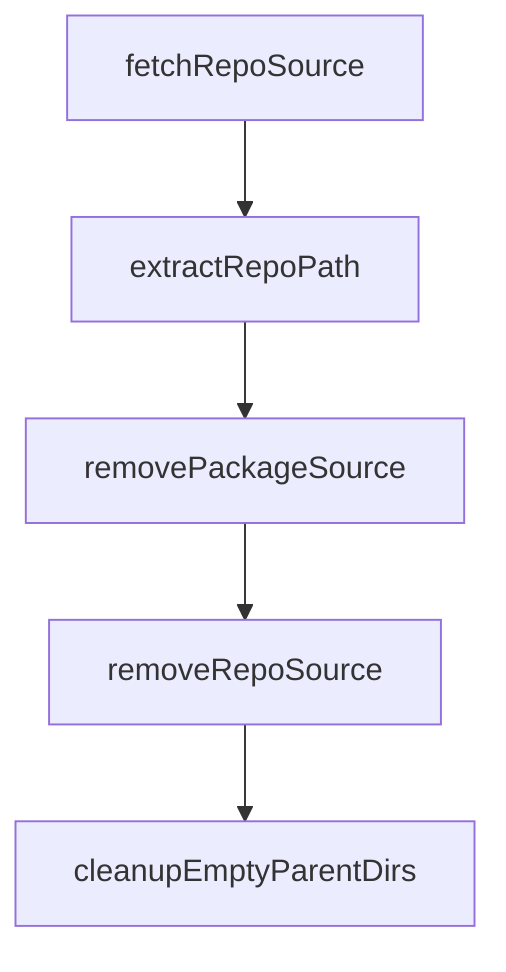

# Chapter 2: Input Parsing and Resolution Pipeline

Welcome to **Chapter 2: Input Parsing and Resolution Pipeline**. In this part of **OpenSrc Tutorial: Deep Source Context for Coding Agents**, you will build an intuitive mental model first, then move into concrete implementation details and practical production tradeoffs.


OpenSrc routes each input through parsing logic that determines whether it is a package spec or a direct repository spec.

## Input Types

| Input | Interpreted As | Example |
|:------|:---------------|:--------|
| npm package | package | `zod`, `react@19.0.0` |
| prefixed package | package | `pypi:requests`, `crates:serde` |
| owner/repo | git repository | `facebook/react` |
| host-prefixed repo | git repository | `gitlab:owner/repo` |
| URL | git repository | `https://github.com/vercel/ai` |

## Detection Rules

- explicit registry prefixes force package mode
- repo-like patterns (`owner/repo`, URLs, host prefixes) route to repo mode
- scoped npm packages (starting with `@`) stay in package mode

## Source References

- [Input parser and registry detection](https://github.com/vercel-labs/opensrc/blob/main/src/lib/registries/index.ts)
- [Repo parsing and host support](https://github.com/vercel-labs/opensrc/blob/main/src/lib/repo.ts)

## Summary

You now understand how OpenSrc classifies and routes each input before fetching.

Next: [Chapter 3: Multi-Registry Package Fetching](03-multi-registry-package-fetching.md)

## Depth Expansion Playbook

## Source Code Walkthrough

### `src/lib/git.ts`

The `fetchRepoSource` function in [`src/lib/git.ts`](https://github.com/vercel-labs/opensrc/blob/HEAD/src/lib/git.ts) handles a key part of this chapter's functionality:

```ts
 * Fetch source code for a resolved repository
 */
export async function fetchRepoSource(
  resolved: ResolvedRepo,
  cwd: string = process.cwd(),
): Promise<FetchResult> {
  const git = simpleGit();
  const repoPath = getRepoPath(resolved.displayName, cwd);
  const reposDir = getReposDir(cwd);

  // Ensure repos directory exists
  if (!existsSync(reposDir)) {
    await mkdir(reposDir, { recursive: true });
  }

  // Remove existing if present
  if (existsSync(repoPath)) {
    await rm(repoPath, { recursive: true, force: true });
  }

  // Ensure parent directories exist (for host/owner structure)
  const parentDir = join(repoPath, "..");
  if (!existsSync(parentDir)) {
    await mkdir(parentDir, { recursive: true });
  }

  // Clone the repository
  const cloneResult = await cloneAtRef(
    git,
    resolved.repoUrl,
    repoPath,
    resolved.ref,
```

This function is important because it defines how OpenSrc Tutorial: Deep Source Context for Coding Agents implements the patterns covered in this chapter.

### `src/lib/git.ts`

The `extractRepoPath` function in [`src/lib/git.ts`](https://github.com/vercel-labs/opensrc/blob/HEAD/src/lib/git.ts) handles a key part of this chapter's functionality:

```ts
 * e.g., "repos/github.com/owner/repo/packages/sub" -> "repos/github.com/owner/repo"
 */
function extractRepoPath(fullPath: string): string {
  const parts = fullPath.split("/");
  // repos/host/owner/repo = 4 parts minimum
  if (parts.length >= 4 && parts[0] === "repos") {
    return parts.slice(0, 4).join("/");
  }
  return fullPath;
}

/**
 * Remove source code for a package (removes its repo if no other packages use it)
 */
export async function removePackageSource(
  packageName: string,
  cwd: string = process.cwd(),
  registry: Registry = "npm",
): Promise<{ removed: boolean; repoRemoved: boolean }> {
  const sources = await readSourcesJson(cwd);
  if (!sources?.packages) {
    return { removed: false, repoRemoved: false };
  }

  const pkg = sources.packages.find(
    (p) => p.name === packageName && p.registry === registry,
  );
  if (!pkg) {
    return { removed: false, repoRemoved: false };
  }

  const pkgRepoPath = extractRepoPath(pkg.path);
```

This function is important because it defines how OpenSrc Tutorial: Deep Source Context for Coding Agents implements the patterns covered in this chapter.

### `src/lib/git.ts`

The `removePackageSource` function in [`src/lib/git.ts`](https://github.com/vercel-labs/opensrc/blob/HEAD/src/lib/git.ts) handles a key part of this chapter's functionality:

```ts
 * Remove source code for a package (removes its repo if no other packages use it)
 */
export async function removePackageSource(
  packageName: string,
  cwd: string = process.cwd(),
  registry: Registry = "npm",
): Promise<{ removed: boolean; repoRemoved: boolean }> {
  const sources = await readSourcesJson(cwd);
  if (!sources?.packages) {
    return { removed: false, repoRemoved: false };
  }

  const pkg = sources.packages.find(
    (p) => p.name === packageName && p.registry === registry,
  );
  if (!pkg) {
    return { removed: false, repoRemoved: false };
  }

  const pkgRepoPath = extractRepoPath(pkg.path);

  // Check if other packages use the same repo
  const otherPackagesUsingSameRepo = sources.packages.filter(
    (p) =>
      extractRepoPath(p.path) === pkgRepoPath &&
      !(p.name === packageName && p.registry === registry),
  );

  let repoRemoved = false;

  // Only remove the repo if no other packages use it
  if (otherPackagesUsingSameRepo.length === 0) {
```

This function is important because it defines how OpenSrc Tutorial: Deep Source Context for Coding Agents implements the patterns covered in this chapter.

### `src/lib/git.ts`

The `removeRepoSource` function in [`src/lib/git.ts`](https://github.com/vercel-labs/opensrc/blob/HEAD/src/lib/git.ts) handles a key part of this chapter's functionality:

```ts
 * Remove source code for a repo
 */
export async function removeRepoSource(
  displayName: string,
  cwd: string = process.cwd(),
): Promise<boolean> {
  const repoPath = getRepoPath(displayName, cwd);

  if (!existsSync(repoPath)) {
    return false;
  }

  await rm(repoPath, { recursive: true, force: true });

  // Clean up empty parent directories
  await cleanupEmptyParentDirs(getRepoRelativePath(displayName), cwd);

  return true;
}

/**
 * Clean up empty parent directories after removing a repo
 */
async function cleanupEmptyParentDirs(
  relativePath: string,
  cwd: string,
): Promise<void> {
  const parts = relativePath.split("/");
  if (parts.length < 4) return; // repos/host/owner/repo - need at least 4 parts

  const { readdir } = await import("fs/promises");
  const opensrcDir = getOpensrcDir(cwd);
```

This function is important because it defines how OpenSrc Tutorial: Deep Source Context for Coding Agents implements the patterns covered in this chapter.


## How These Components Connect


