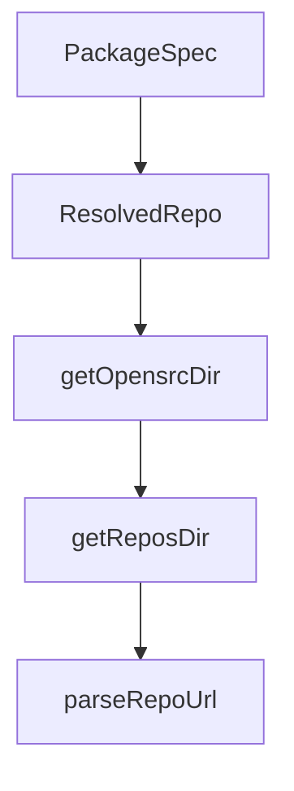

# Chapter 2: Input Parsing and Resolution Pipeline

Welcome to **Chapter 2: Input Parsing and Resolution Pipeline**. In this part of **OpenSrc Tutorial: Deep Source Context for Coding Agents**, you will build an intuitive mental model first, then move into concrete implementation details and practical production tradeoffs.


OpenSrc routes each input through parsing logic that determines whether it is a package spec or a direct repository spec.

## Input Types

| Input | Interpreted As | Example |
|:------|:---------------|:--------|
| npm package | package | `zod`, `react@19.0.0` |
| prefixed package | package | `pypi:requests`, `crates:serde` |
| owner/repo | git repository | `facebook/react` |
| host-prefixed repo | git repository | `gitlab:owner/repo` |
| URL | git repository | `https://github.com/vercel/ai` |

## Detection Rules

- explicit registry prefixes force package mode
- repo-like patterns (`owner/repo`, URLs, host prefixes) route to repo mode
- scoped npm packages (starting with `@`) stay in package mode

## Source References

- [Input parser and registry detection](https://github.com/vercel-labs/opensrc/blob/main/src/lib/registries/index.ts)
- [Repo parsing and host support](https://github.com/vercel-labs/opensrc/blob/main/src/lib/repo.ts)

## Summary

You now understand how OpenSrc classifies and routes each input before fetching.

Next: [Chapter 3: Multi-Registry Package Fetching](03-multi-registry-package-fetching.md)

## Source Code Walkthrough

### `src/types.ts`

The `PackageSpec` interface in [`src/types.ts`](https://github.com/vercel-labs/opensrc/blob/HEAD/src/types.ts) handles a key part of this chapter's functionality:

```ts
 * Parsed package specification with registry
 */
export interface PackageSpec {
  registry: Registry;
  name: string;
  version?: string;
}

/**
 * Resolved repository information (for git repos)
 */
export interface ResolvedRepo {
  host: string; // e.g., "github.com", "gitlab.com"
  owner: string;
  repo: string;
  ref: string; // branch, tag, or commit (resolved)
  repoUrl: string;
  displayName: string; // e.g., "github.com/owner/repo"
}

```

This interface is important because it defines how OpenSrc Tutorial: Deep Source Context for Coding Agents implements the patterns covered in this chapter.

### `src/types.ts`

The `ResolvedRepo` interface in [`src/types.ts`](https://github.com/vercel-labs/opensrc/blob/HEAD/src/types.ts) handles a key part of this chapter's functionality:

```ts
 * Resolved repository information (for git repos)
 */
export interface ResolvedRepo {
  host: string; // e.g., "github.com", "gitlab.com"
  owner: string;
  repo: string;
  ref: string; // branch, tag, or commit (resolved)
  repoUrl: string;
  displayName: string; // e.g., "github.com/owner/repo"
}

```

This interface is important because it defines how OpenSrc Tutorial: Deep Source Context for Coding Agents implements the patterns covered in this chapter.

### `src/lib/git.ts`

The `getOpensrcDir` function in [`src/lib/git.ts`](https://github.com/vercel-labs/opensrc/blob/HEAD/src/lib/git.ts) handles a key part of this chapter's functionality:

```ts
 * Get the opensrc directory path
 */
export function getOpensrcDir(cwd: string = process.cwd()): string {
  return join(cwd, OPENSRC_DIR);
}

/**
 * Get the repos directory path
 */
export function getReposDir(cwd: string = process.cwd()): string {
  return join(getOpensrcDir(cwd), REPOS_DIR);
}

/**
 * Extract host/owner/repo from a git URL
 */
export function parseRepoUrl(
  url: string,
): { host: string; owner: string; repo: string } | null {
  // Handle HTTPS URLs: https://github.com/owner/repo
  const httpsMatch = url.match(/https?:\/\/([^/]+)\/([^/]+)\/([^/]+)/);
  if (httpsMatch) {
    return {
      host: httpsMatch[1],
      owner: httpsMatch[2],
      repo: httpsMatch[3].replace(/\.git$/, ""),
    };
  }

  // Handle SSH URLs: git@github.com:owner/repo.git
  const sshMatch = url.match(/git@([^:]+):([^/]+)\/(.+)/);
  if (sshMatch) {
```

This function is important because it defines how OpenSrc Tutorial: Deep Source Context for Coding Agents implements the patterns covered in this chapter.

### `src/lib/git.ts`

The `getReposDir` function in [`src/lib/git.ts`](https://github.com/vercel-labs/opensrc/blob/HEAD/src/lib/git.ts) handles a key part of this chapter's functionality:

```ts
 * Get the repos directory path
 */
export function getReposDir(cwd: string = process.cwd()): string {
  return join(getOpensrcDir(cwd), REPOS_DIR);
}

/**
 * Extract host/owner/repo from a git URL
 */
export function parseRepoUrl(
  url: string,
): { host: string; owner: string; repo: string } | null {
  // Handle HTTPS URLs: https://github.com/owner/repo
  const httpsMatch = url.match(/https?:\/\/([^/]+)\/([^/]+)\/([^/]+)/);
  if (httpsMatch) {
    return {
      host: httpsMatch[1],
      owner: httpsMatch[2],
      repo: httpsMatch[3].replace(/\.git$/, ""),
    };
  }

  // Handle SSH URLs: git@github.com:owner/repo.git
  const sshMatch = url.match(/git@([^:]+):([^/]+)\/(.+)/);
  if (sshMatch) {
    return {
      host: sshMatch[1],
      owner: sshMatch[2],
      repo: sshMatch[3].replace(/\.git$/, ""),
    };
  }

```

This function is important because it defines how OpenSrc Tutorial: Deep Source Context for Coding Agents implements the patterns covered in this chapter.


## How These Components Connect


