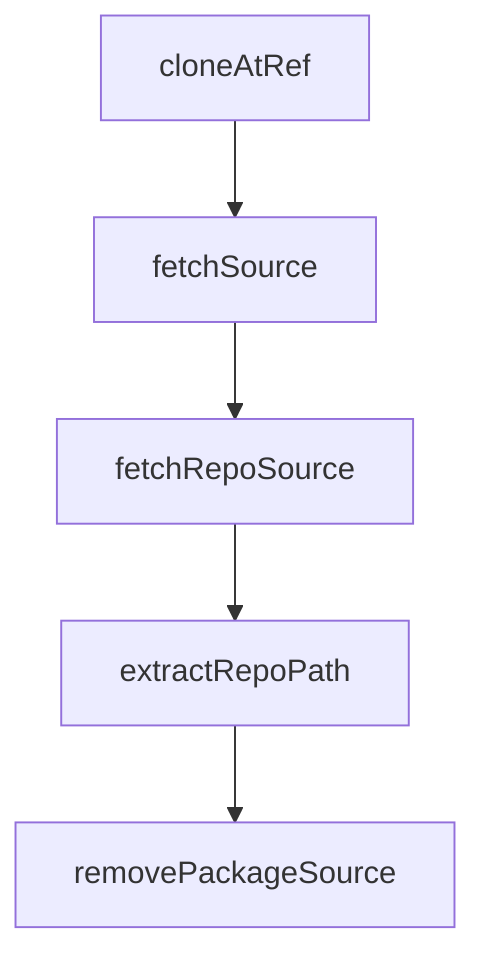

# Chapter 3: Multi-Registry Package Fetching

Welcome to **Chapter 3: Multi-Registry Package Fetching**. In this part of **OpenSrc Tutorial: Deep Source Context for Coding Agents**, you will build an intuitive mental model first, then move into concrete implementation details and practical production tradeoffs.


OpenSrc supports package resolution across npm, PyPI, and crates.io using registry-specific metadata paths.

## Registry Coverage

| Registry | Prefix | Resolution Source |
|:---------|:-------|:------------------|
| npm | `npm:` (optional) | npm registry metadata |
| PyPI | `pypi:` / `pip:` / `python:` | PyPI JSON API |
| crates.io | `crates:` / `cargo:` / `rust:` | crates.io API |

## Resolution Behavior

- resolves repository URL from package metadata
- attempts version-aware cloning behavior
- tracks fetched outputs in a unified local index

## Example Commands

```bash
opensrc npm:zod
opensrc pypi:requests
opensrc crates:serde
```

## Source References

- [npm resolver](https://github.com/vercel-labs/opensrc/blob/main/src/lib/registries/npm.ts)
- [PyPI resolver](https://github.com/vercel-labs/opensrc/blob/main/src/lib/registries/pypi.ts)
- [crates resolver](https://github.com/vercel-labs/opensrc/blob/main/src/lib/registries/crates.ts)

## Summary

You now have a model for how OpenSrc maps package ecosystems to repository source retrieval.

Next: [Chapter 4: Git Repository Source Imports](04-git-repository-source-imports.md)

## Source Code Walkthrough

### `src/lib/git.ts`

The `cloneAtRef` function in [`src/lib/git.ts`](https://github.com/vercel-labs/opensrc/blob/HEAD/src/lib/git.ts) handles a key part of this chapter's functionality:

```ts
 * Clone a repository at a specific ref (branch, tag, or commit)
 */
async function cloneAtRef(
  git: SimpleGit,
  repoUrl: string,
  targetPath: string,
  ref: string,
): Promise<{ success: boolean; ref?: string; error?: string }> {
  try {
    await git.clone(repoUrl, targetPath, [
      "--depth",
      "1",
      "--branch",
      ref,
      "--single-branch",
    ]);
    return { success: true, ref };
  } catch {
    // Ref might be a commit or doesn't exist as a branch/tag
  }

  // Clone default branch
  try {
    await git.clone(repoUrl, targetPath, ["--depth", "1"]);
    return {
      success: true,
      ref: "HEAD",
      error: `Could not find ref "${ref}", cloned default branch instead`,
    };
  } catch (err) {
    return {
      success: false,
```

This function is important because it defines how OpenSrc Tutorial: Deep Source Context for Coding Agents implements the patterns covered in this chapter.

### `src/lib/git.ts`

The `fetchSource` function in [`src/lib/git.ts`](https://github.com/vercel-labs/opensrc/blob/HEAD/src/lib/git.ts) handles a key part of this chapter's functionality:

```ts
 * Fetch source code for a resolved package
 */
export async function fetchSource(
  resolved: ResolvedPackage,
  cwd: string = process.cwd(),
): Promise<FetchResult> {
  const git = simpleGit();

  // Get repo display name from URL
  const repoDisplayName = getRepoDisplayName(resolved.repoUrl);
  if (!repoDisplayName) {
    return {
      package: resolved.name,
      version: resolved.version,
      path: "",
      success: false,
      error: `Could not parse repository URL: ${resolved.repoUrl}`,
      registry: resolved.registry,
    };
  }

  const repoPath = getRepoPath(repoDisplayName, cwd);
  const reposDir = getReposDir(cwd);

  // Ensure repos directory exists
  if (!existsSync(reposDir)) {
    await mkdir(reposDir, { recursive: true });
  }

  // Remove existing if present (re-fetch at potentially different version)
  if (existsSync(repoPath)) {
    await rm(repoPath, { recursive: true, force: true });
```

This function is important because it defines how OpenSrc Tutorial: Deep Source Context for Coding Agents implements the patterns covered in this chapter.

### `src/lib/git.ts`

The `fetchRepoSource` function in [`src/lib/git.ts`](https://github.com/vercel-labs/opensrc/blob/HEAD/src/lib/git.ts) handles a key part of this chapter's functionality:

```ts
 * Fetch source code for a resolved repository
 */
export async function fetchRepoSource(
  resolved: ResolvedRepo,
  cwd: string = process.cwd(),
): Promise<FetchResult> {
  const git = simpleGit();
  const repoPath = getRepoPath(resolved.displayName, cwd);
  const reposDir = getReposDir(cwd);

  // Ensure repos directory exists
  if (!existsSync(reposDir)) {
    await mkdir(reposDir, { recursive: true });
  }

  // Remove existing if present
  if (existsSync(repoPath)) {
    await rm(repoPath, { recursive: true, force: true });
  }

  // Ensure parent directories exist (for host/owner structure)
  const parentDir = join(repoPath, "..");
  if (!existsSync(parentDir)) {
    await mkdir(parentDir, { recursive: true });
  }

  // Clone the repository
  const cloneResult = await cloneAtRef(
    git,
    resolved.repoUrl,
    repoPath,
    resolved.ref,
```

This function is important because it defines how OpenSrc Tutorial: Deep Source Context for Coding Agents implements the patterns covered in this chapter.

### `src/lib/git.ts`

The `extractRepoPath` function in [`src/lib/git.ts`](https://github.com/vercel-labs/opensrc/blob/HEAD/src/lib/git.ts) handles a key part of this chapter's functionality:

```ts
 * e.g., "repos/github.com/owner/repo/packages/sub" -> "repos/github.com/owner/repo"
 */
function extractRepoPath(fullPath: string): string {
  const parts = fullPath.split("/");
  // repos/host/owner/repo = 4 parts minimum
  if (parts.length >= 4 && parts[0] === "repos") {
    return parts.slice(0, 4).join("/");
  }
  return fullPath;
}

/**
 * Remove source code for a package (removes its repo if no other packages use it)
 */
export async function removePackageSource(
  packageName: string,
  cwd: string = process.cwd(),
  registry: Registry = "npm",
): Promise<{ removed: boolean; repoRemoved: boolean }> {
  const sources = await readSourcesJson(cwd);
  if (!sources?.packages) {
    return { removed: false, repoRemoved: false };
  }

  const pkg = sources.packages.find(
    (p) => p.name === packageName && p.registry === registry,
  );
  if (!pkg) {
    return { removed: false, repoRemoved: false };
  }

  const pkgRepoPath = extractRepoPath(pkg.path);
```

This function is important because it defines how OpenSrc Tutorial: Deep Source Context for Coding Agents implements the patterns covered in this chapter.


## How These Components Connect


