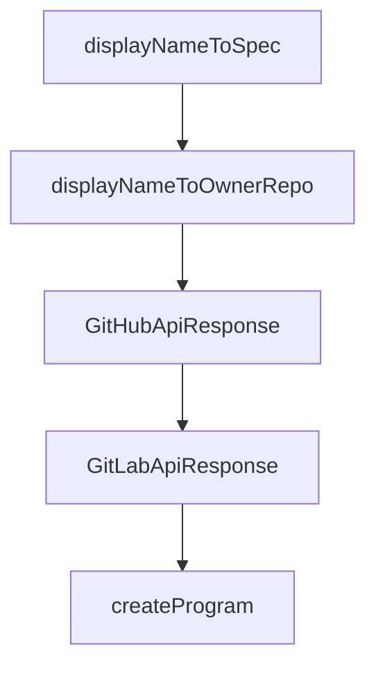

# Chapter 3: Multi-Registry Package Fetching

Welcome to **Chapter 3: Multi-Registry Package Fetching**. In this part of **OpenSrc Tutorial: Deep Source Context for Coding Agents**, you will build an intuitive mental model first, then move into concrete implementation details and practical production tradeoffs.


OpenSrc supports package resolution across npm, PyPI, and crates.io using registry-specific metadata paths.

## Registry Coverage

| Registry | Prefix | Resolution Source |
|:---------|:-------|:------------------|
| npm | `npm:` (optional) | npm registry metadata |
| PyPI | `pypi:` / `pip:` / `python:` | PyPI JSON API |
| crates.io | `crates:` / `cargo:` / `rust:` | crates.io API |

## Resolution Behavior

- resolves repository URL from package metadata
- attempts version-aware cloning behavior
- tracks fetched outputs in a unified local index

## Example Commands

```bash
opensrc npm:zod
opensrc pypi:requests
opensrc crates:serde
```

## Source References

- [npm resolver](https://github.com/vercel-labs/opensrc/blob/main/src/lib/registries/npm.ts)
- [PyPI resolver](https://github.com/vercel-labs/opensrc/blob/main/src/lib/registries/pypi.ts)
- [crates resolver](https://github.com/vercel-labs/opensrc/blob/main/src/lib/registries/crates.ts)

## Summary

You now have a model for how OpenSrc maps package ecosystems to repository source retrieval.

Next: [Chapter 4: Git Repository Source Imports](04-git-repository-source-imports.md)

## Depth Expansion Playbook

## Source Code Walkthrough

### `src/lib/repo.ts`

The `displayNameToSpec` function in [`src/lib/repo.ts`](https://github.com/vercel-labs/opensrc/blob/HEAD/src/lib/repo.ts) handles a key part of this chapter's functionality:

```ts
 * Convert a repo display name back to host/owner/repo format
 */
export function displayNameToSpec(displayName: string): {
  host: string;
  owner: string;
  repo: string;
} | null {
  const parts = displayName.split("/");
  if (parts.length !== 3) {
    return null;
  }
  return { host: parts[0], owner: parts[1], repo: parts[2] };
}

/**
 * @deprecated Use displayNameToSpec instead
 */
export function displayNameToOwnerRepo(displayName: string): {
  owner: string;
  repo: string;
} | null {
  // Handle old format: owner--repo
  if (displayName.includes("--") && !displayName.includes("/")) {
    const parts = displayName.split("--");
    if (parts.length !== 2) {
      return null;
    }
    return { owner: parts[0], repo: parts[1] };
  }

  // Handle new format: host/owner/repo
  const spec = displayNameToSpec(displayName);
```

This function is important because it defines how OpenSrc Tutorial: Deep Source Context for Coding Agents implements the patterns covered in this chapter.

### `src/lib/repo.ts`

The `displayNameToOwnerRepo` function in [`src/lib/repo.ts`](https://github.com/vercel-labs/opensrc/blob/HEAD/src/lib/repo.ts) handles a key part of this chapter's functionality:

```ts
 * @deprecated Use displayNameToSpec instead
 */
export function displayNameToOwnerRepo(displayName: string): {
  owner: string;
  repo: string;
} | null {
  // Handle old format: owner--repo
  if (displayName.includes("--") && !displayName.includes("/")) {
    const parts = displayName.split("--");
    if (parts.length !== 2) {
      return null;
    }
    return { owner: parts[0], repo: parts[1] };
  }

  // Handle new format: host/owner/repo
  const spec = displayNameToSpec(displayName);
  if (!spec) {
    return null;
  }
  return { owner: spec.owner, repo: spec.repo };
}

```

This function is important because it defines how OpenSrc Tutorial: Deep Source Context for Coding Agents implements the patterns covered in this chapter.

### `src/lib/repo.ts`

The `GitHubApiResponse` interface in [`src/lib/repo.ts`](https://github.com/vercel-labs/opensrc/blob/HEAD/src/lib/repo.ts) handles a key part of this chapter's functionality:

```ts
}

interface GitHubApiResponse {
  default_branch: string;
  clone_url: string;
  html_url: string;
}

interface GitLabApiResponse {
  default_branch: string;
  http_url_to_repo: string;
  web_url: string;
}

/**
 * Resolve a repo spec to full repository information using the appropriate API
 */
export async function resolveRepo(spec: RepoSpec): Promise<ResolvedRepo> {
  const { host, owner, repo, ref } = spec;

  if (host === "github.com") {
    return resolveGitHubRepo(host, owner, repo, ref);
  } else if (host === "gitlab.com") {
    return resolveGitLabRepo(host, owner, repo, ref);
  } else {
    // For unsupported hosts, assume default branch is "main"
    return {
      host,
      owner,
      repo,
      ref: ref || "main",
      repoUrl: `https://${host}/${owner}/${repo}`,
```

This interface is important because it defines how OpenSrc Tutorial: Deep Source Context for Coding Agents implements the patterns covered in this chapter.

### `src/lib/repo.ts`

The `GitLabApiResponse` interface in [`src/lib/repo.ts`](https://github.com/vercel-labs/opensrc/blob/HEAD/src/lib/repo.ts) handles a key part of this chapter's functionality:

```ts
}

interface GitLabApiResponse {
  default_branch: string;
  http_url_to_repo: string;
  web_url: string;
}

/**
 * Resolve a repo spec to full repository information using the appropriate API
 */
export async function resolveRepo(spec: RepoSpec): Promise<ResolvedRepo> {
  const { host, owner, repo, ref } = spec;

  if (host === "github.com") {
    return resolveGitHubRepo(host, owner, repo, ref);
  } else if (host === "gitlab.com") {
    return resolveGitLabRepo(host, owner, repo, ref);
  } else {
    // For unsupported hosts, assume default branch is "main"
    return {
      host,
      owner,
      repo,
      ref: ref || "main",
      repoUrl: `https://${host}/${owner}/${repo}`,
      displayName: `${host}/${owner}/${repo}`,
    };
  }
}

async function resolveGitHubRepo(
```

This interface is important because it defines how OpenSrc Tutorial: Deep Source Context for Coding Agents implements the patterns covered in this chapter.


## How These Components Connect


