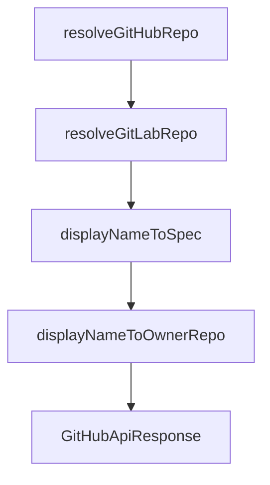

# Chapter 4: Git Repository Source Imports

Welcome to **Chapter 4: Git Repository Source Imports**. In this part of **OpenSrc Tutorial: Deep Source Context for Coding Agents**, you will build an intuitive mental model first, then move into concrete implementation details and practical production tradeoffs.


OpenSrc can fetch direct git repositories when package metadata is not the right entry path.

## Supported Repo Inputs

- `github:owner/repo`
- `owner/repo` (defaults to GitHub)
- `owner/repo@tag` or `owner/repo#branch`
- `https://github.com/owner/repo`
- `gitlab:owner/repo` and other supported hosts

## Storage Layout

Repositories are organized under host/owner/repo path segments:

```text
opensrc/
  repos/
    github.com/
      vercel/
        ai/
```

## Source References

- [Repo parsing and resolution](https://github.com/vercel-labs/opensrc/blob/main/src/lib/repo.ts)
- [Git clone and path strategy](https://github.com/vercel-labs/opensrc/blob/main/src/lib/git.ts)

## Summary

You now understand how OpenSrc imports repository source directly and normalizes storage paths.

Next: [Chapter 5: AGENTS.md and sources.json Integration](05-agents-md-and-sources-json-integration.md)

## Source Code Walkthrough

### `src/lib/repo.ts`

The `resolveGitHubRepo` function in [`src/lib/repo.ts`](https://github.com/vercel-labs/opensrc/blob/HEAD/src/lib/repo.ts) handles a key part of this chapter's functionality:

```ts

  if (host === "github.com") {
    return resolveGitHubRepo(host, owner, repo, ref);
  } else if (host === "gitlab.com") {
    return resolveGitLabRepo(host, owner, repo, ref);
  } else {
    // For unsupported hosts, assume default branch is "main"
    return {
      host,
      owner,
      repo,
      ref: ref || "main",
      repoUrl: `https://${host}/${owner}/${repo}`,
      displayName: `${host}/${owner}/${repo}`,
    };
  }
}

async function resolveGitHubRepo(
  host: string,
  owner: string,
  repo: string,
  ref?: string,
): Promise<ResolvedRepo> {
  const apiUrl = `https://api.github.com/repos/${owner}/${repo}`;

  const response = await fetch(apiUrl, {
    headers: {
      Accept: "application/vnd.github.v3+json",
      "User-Agent": "opensrc-cli",
    },
  });
```

This function is important because it defines how OpenSrc Tutorial: Deep Source Context for Coding Agents implements the patterns covered in this chapter.

### `src/lib/repo.ts`

The `resolveGitLabRepo` function in [`src/lib/repo.ts`](https://github.com/vercel-labs/opensrc/blob/HEAD/src/lib/repo.ts) handles a key part of this chapter's functionality:

```ts
    return resolveGitHubRepo(host, owner, repo, ref);
  } else if (host === "gitlab.com") {
    return resolveGitLabRepo(host, owner, repo, ref);
  } else {
    // For unsupported hosts, assume default branch is "main"
    return {
      host,
      owner,
      repo,
      ref: ref || "main",
      repoUrl: `https://${host}/${owner}/${repo}`,
      displayName: `${host}/${owner}/${repo}`,
    };
  }
}

async function resolveGitHubRepo(
  host: string,
  owner: string,
  repo: string,
  ref?: string,
): Promise<ResolvedRepo> {
  const apiUrl = `https://api.github.com/repos/${owner}/${repo}`;

  const response = await fetch(apiUrl, {
    headers: {
      Accept: "application/vnd.github.v3+json",
      "User-Agent": "opensrc-cli",
    },
  });

  if (!response.ok) {
```

This function is important because it defines how OpenSrc Tutorial: Deep Source Context for Coding Agents implements the patterns covered in this chapter.

### `src/lib/repo.ts`

The `displayNameToSpec` function in [`src/lib/repo.ts`](https://github.com/vercel-labs/opensrc/blob/HEAD/src/lib/repo.ts) handles a key part of this chapter's functionality:

```ts
 * Convert a repo display name back to host/owner/repo format
 */
export function displayNameToSpec(displayName: string): {
  host: string;
  owner: string;
  repo: string;
} | null {
  const parts = displayName.split("/");
  if (parts.length !== 3) {
    return null;
  }
  return { host: parts[0], owner: parts[1], repo: parts[2] };
}

/**
 * @deprecated Use displayNameToSpec instead
 */
export function displayNameToOwnerRepo(displayName: string): {
  owner: string;
  repo: string;
} | null {
  // Handle old format: owner--repo
  if (displayName.includes("--") && !displayName.includes("/")) {
    const parts = displayName.split("--");
    if (parts.length !== 2) {
      return null;
    }
    return { owner: parts[0], repo: parts[1] };
  }

  // Handle new format: host/owner/repo
  const spec = displayNameToSpec(displayName);
```

This function is important because it defines how OpenSrc Tutorial: Deep Source Context for Coding Agents implements the patterns covered in this chapter.

### `src/lib/repo.ts`

The `displayNameToOwnerRepo` function in [`src/lib/repo.ts`](https://github.com/vercel-labs/opensrc/blob/HEAD/src/lib/repo.ts) handles a key part of this chapter's functionality:

```ts
 * @deprecated Use displayNameToSpec instead
 */
export function displayNameToOwnerRepo(displayName: string): {
  owner: string;
  repo: string;
} | null {
  // Handle old format: owner--repo
  if (displayName.includes("--") && !displayName.includes("/")) {
    const parts = displayName.split("--");
    if (parts.length !== 2) {
      return null;
    }
    return { owner: parts[0], repo: parts[1] };
  }

  // Handle new format: host/owner/repo
  const spec = displayNameToSpec(displayName);
  if (!spec) {
    return null;
  }
  return { owner: spec.owner, repo: spec.repo };
}

```

This function is important because it defines how OpenSrc Tutorial: Deep Source Context for Coding Agents implements the patterns covered in this chapter.


## How These Components Connect


