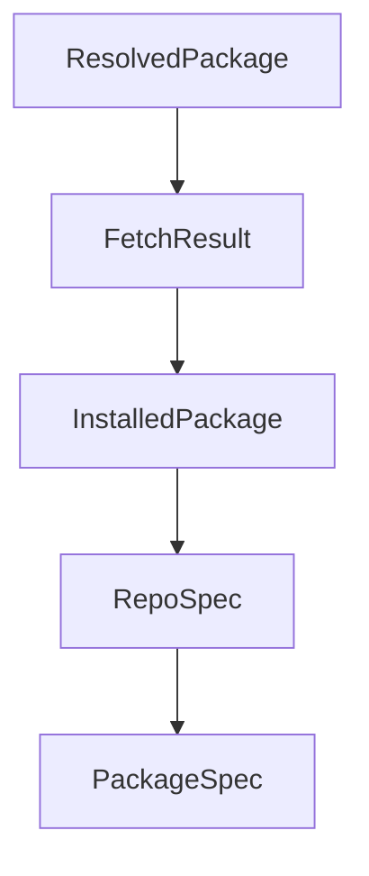

# Chapter 4: Git Repository Source Imports

Welcome to **Chapter 4: Git Repository Source Imports**. In this part of **OpenSrc Tutorial: Deep Source Context for Coding Agents**, you will build an intuitive mental model first, then move into concrete implementation details and practical production tradeoffs.


OpenSrc can fetch direct git repositories when package metadata is not the right entry path.

## Supported Repo Inputs

- `github:owner/repo`
- `owner/repo` (defaults to GitHub)
- `owner/repo@tag` or `owner/repo#branch`
- `https://github.com/owner/repo`
- `gitlab:owner/repo` and other supported hosts

## Storage Layout

Repositories are organized under host/owner/repo path segments:

```text
opensrc/
  repos/
    github.com/
      vercel/
        ai/
```

## Source References

- [Repo parsing and resolution](https://github.com/vercel-labs/opensrc/blob/main/src/lib/repo.ts)
- [Git clone and path strategy](https://github.com/vercel-labs/opensrc/blob/main/src/lib/git.ts)

## Summary

You now understand how OpenSrc imports repository source directly and normalizes storage paths.

Next: [Chapter 5: AGENTS.md and sources.json Integration](05-agents-md-and-sources-json-integration.md)

## Depth Expansion Playbook

## Source Code Walkthrough

### `src/types.ts`

The `ResolvedPackage` interface in [`src/types.ts`](https://github.com/vercel-labs/opensrc/blob/HEAD/src/types.ts) handles a key part of this chapter's functionality:

```ts
}

export interface ResolvedPackage {
  registry: Registry;
  name: string;
  version: string;
  repoUrl: string;
  repoDirectory?: string;
  gitTag: string;
}

export interface FetchResult {
  package: string;
  version: string;
  path: string;
  success: boolean;
  error?: string;
  registry?: Registry;
}

export interface InstalledPackage {
  name: string;
  version: string;
}

/**
 * Parsed repository specification
 */
export interface RepoSpec {
  host: string; // e.g., "github.com", "gitlab.com"
  owner: string;
  repo: string;
```

This interface is important because it defines how OpenSrc Tutorial: Deep Source Context for Coding Agents implements the patterns covered in this chapter.

### `src/types.ts`

The `FetchResult` interface in [`src/types.ts`](https://github.com/vercel-labs/opensrc/blob/HEAD/src/types.ts) handles a key part of this chapter's functionality:

```ts
}

export interface FetchResult {
  package: string;
  version: string;
  path: string;
  success: boolean;
  error?: string;
  registry?: Registry;
}

export interface InstalledPackage {
  name: string;
  version: string;
}

/**
 * Parsed repository specification
 */
export interface RepoSpec {
  host: string; // e.g., "github.com", "gitlab.com"
  owner: string;
  repo: string;
  ref?: string; // branch, tag, or commit
}

/**
 * Type of input: package (with ecosystem) or git repo
 */
export type InputType = "package" | "repo";

/**
```

This interface is important because it defines how OpenSrc Tutorial: Deep Source Context for Coding Agents implements the patterns covered in this chapter.

### `src/types.ts`

The `InstalledPackage` interface in [`src/types.ts`](https://github.com/vercel-labs/opensrc/blob/HEAD/src/types.ts) handles a key part of this chapter's functionality:

```ts
}

export interface InstalledPackage {
  name: string;
  version: string;
}

/**
 * Parsed repository specification
 */
export interface RepoSpec {
  host: string; // e.g., "github.com", "gitlab.com"
  owner: string;
  repo: string;
  ref?: string; // branch, tag, or commit
}

/**
 * Type of input: package (with ecosystem) or git repo
 */
export type InputType = "package" | "repo";

/**
 * Parsed package specification with registry
 */
export interface PackageSpec {
  registry: Registry;
  name: string;
  version?: string;
}

/**
```

This interface is important because it defines how OpenSrc Tutorial: Deep Source Context for Coding Agents implements the patterns covered in this chapter.

### `src/types.ts`

The `RepoSpec` interface in [`src/types.ts`](https://github.com/vercel-labs/opensrc/blob/HEAD/src/types.ts) handles a key part of this chapter's functionality:

```ts
 * Parsed repository specification
 */
export interface RepoSpec {
  host: string; // e.g., "github.com", "gitlab.com"
  owner: string;
  repo: string;
  ref?: string; // branch, tag, or commit
}

/**
 * Type of input: package (with ecosystem) or git repo
 */
export type InputType = "package" | "repo";

/**
 * Parsed package specification with registry
 */
export interface PackageSpec {
  registry: Registry;
  name: string;
  version?: string;
}

/**
 * Resolved repository information (for git repos)
 */
export interface ResolvedRepo {
  host: string; // e.g., "github.com", "gitlab.com"
  owner: string;
  repo: string;
  ref: string; // branch, tag, or commit (resolved)
  repoUrl: string;
```

This interface is important because it defines how OpenSrc Tutorial: Deep Source Context for Coding Agents implements the patterns covered in this chapter.


## How These Components Connect


