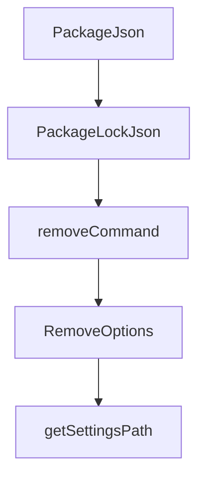

# Chapter 5: AGENTS.md and sources.json Integration

Welcome to **Chapter 5: AGENTS.md and sources.json Integration**. In this part of **OpenSrc Tutorial: Deep Source Context for Coding Agents**, you will build an intuitive mental model first, then move into concrete implementation details and practical production tradeoffs.


OpenSrc can update project metadata so coding agents know where imported source context lives.

## Integration Outputs

| File | Purpose |
|:-----|:--------|
| `opensrc/sources.json` | machine-readable index of fetched packages/repos |
| `AGENTS.md` | agent-facing guidance that source context exists in `opensrc/` |
| `.gitignore` | ignore imported source cache |
| `tsconfig.json` | exclude `opensrc/` from normal compile scope |

## Permission Model

On first run, OpenSrc asks if file modifications are allowed. The preference is persisted in `opensrc/settings.json`.

## Source References

- [Fetch command integration flow](https://github.com/vercel-labs/opensrc/blob/main/src/commands/fetch.ts)
- [AGENTS.md and index updater](https://github.com/vercel-labs/opensrc/blob/main/src/lib/agents.ts)

## Summary

You now know how OpenSrc surfaces fetched sources to agent workflows without manual file editing.

Next: [Chapter 6: Update, Remove, and Clean Lifecycle](06-update-remove-and-clean-lifecycle.md)

## Source Code Walkthrough

### `src/lib/version.ts`

The `PackageJson` interface in [`src/lib/version.ts`](https://github.com/vercel-labs/opensrc/blob/HEAD/src/lib/version.ts) handles a key part of this chapter's functionality:

```ts
import type { InstalledPackage } from "../types.js";

interface PackageJson {
  dependencies?: Record<string, string>;
  devDependencies?: Record<string, string>;
  peerDependencies?: Record<string, string>;
}

interface PackageLockJson {
  packages?: Record<string, { version?: string }>;
  dependencies?: Record<string, { version: string }>;
}

/**
 * Strip version range prefixes like ^, ~, >=, etc.
 */
function stripVersionPrefix(version: string): string {
  return version.replace(/^[\^~>=<]+/, "");
}

/**
 * Try to get installed version from node_modules
 */
async function getVersionFromNodeModules(
  packageName: string,
  cwd: string,
): Promise<string | null> {
  const packageJsonPath = join(
    cwd,
    "node_modules",
    packageName,
    "package.json",
```

This interface is important because it defines how OpenSrc Tutorial: Deep Source Context for Coding Agents implements the patterns covered in this chapter.

### `src/lib/version.ts`

The `PackageLockJson` interface in [`src/lib/version.ts`](https://github.com/vercel-labs/opensrc/blob/HEAD/src/lib/version.ts) handles a key part of this chapter's functionality:

```ts
}

interface PackageLockJson {
  packages?: Record<string, { version?: string }>;
  dependencies?: Record<string, { version: string }>;
}

/**
 * Strip version range prefixes like ^, ~, >=, etc.
 */
function stripVersionPrefix(version: string): string {
  return version.replace(/^[\^~>=<]+/, "");
}

/**
 * Try to get installed version from node_modules
 */
async function getVersionFromNodeModules(
  packageName: string,
  cwd: string,
): Promise<string | null> {
  const packageJsonPath = join(
    cwd,
    "node_modules",
    packageName,
    "package.json",
  );

  if (!existsSync(packageJsonPath)) {
    return null;
  }

```

This interface is important because it defines how OpenSrc Tutorial: Deep Source Context for Coding Agents implements the patterns covered in this chapter.

### `src/commands/remove.ts`

The `removeCommand` function in [`src/commands/remove.ts`](https://github.com/vercel-labs/opensrc/blob/HEAD/src/commands/remove.ts) handles a key part of this chapter's functionality:

```ts
 * Remove source code for one or more packages or repositories
 */
export async function removeCommand(
  items: string[],
  options: RemoveOptions = {},
): Promise<void> {
  const cwd = options.cwd || process.cwd();
  let removed = 0;
  let notFound = 0;

  // Track packages and repos to update in sources.json
  const removedPackages: Array<{ name: string; registry: Registry }> = [];
  const removedRepos: string[] = [];

  for (const item of items) {
    // Check if it's a repo or package based on format
    const isRepo =
      isRepoSpec(item) || (item.includes("/") && !item.includes(":"));

    if (isRepo) {
      // Try to remove as repo
      // Convert formats like "vercel/vercel" to "github.com/vercel/vercel" if needed
      let displayName = item;
      if (item.split("/").length === 2 && !item.startsWith("http")) {
        displayName = `github.com/${item}`;
      }

      if (!repoExists(displayName, cwd)) {
        // Try the item as-is (might already be full path like github.com/owner/repo)
        if (repoExists(item, cwd)) {
          displayName = item;
        } else {
```

This function is important because it defines how OpenSrc Tutorial: Deep Source Context for Coding Agents implements the patterns covered in this chapter.

### `src/commands/remove.ts`

The `RemoveOptions` interface in [`src/commands/remove.ts`](https://github.com/vercel-labs/opensrc/blob/HEAD/src/commands/remove.ts) handles a key part of this chapter's functionality:

```ts
import type { Registry } from "../types.js";

export interface RemoveOptions {
  cwd?: string;
}

/**
 * Remove source code for one or more packages or repositories
 */
export async function removeCommand(
  items: string[],
  options: RemoveOptions = {},
): Promise<void> {
  const cwd = options.cwd || process.cwd();
  let removed = 0;
  let notFound = 0;

  // Track packages and repos to update in sources.json
  const removedPackages: Array<{ name: string; registry: Registry }> = [];
  const removedRepos: string[] = [];

  for (const item of items) {
    // Check if it's a repo or package based on format
    const isRepo =
      isRepoSpec(item) || (item.includes("/") && !item.includes(":"));

    if (isRepo) {
      // Try to remove as repo
      // Convert formats like "vercel/vercel" to "github.com/vercel/vercel" if needed
      let displayName = item;
      if (item.split("/").length === 2 && !item.startsWith("http")) {
        displayName = `github.com/${item}`;
```

This interface is important because it defines how OpenSrc Tutorial: Deep Source Context for Coding Agents implements the patterns covered in this chapter.


## How These Components Connect


