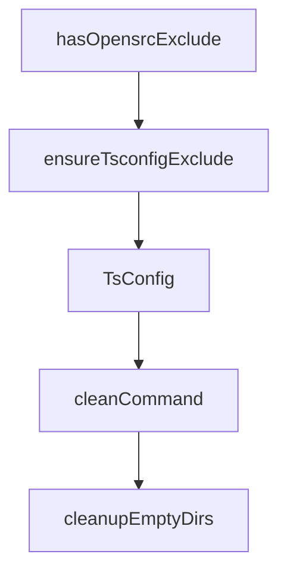

# Chapter 5: AGENTS.md and sources.json Integration

Welcome to **Chapter 5: AGENTS.md and sources.json Integration**. In this part of **OpenSrc Tutorial: Deep Source Context for Coding Agents**, you will build an intuitive mental model first, then move into concrete implementation details and practical production tradeoffs.


OpenSrc can update project metadata so coding agents know where imported source context lives.

## Integration Outputs

| File | Purpose |
|:-----|:--------|
| `opensrc/sources.json` | machine-readable index of fetched packages/repos |
| `AGENTS.md` | agent-facing guidance that source context exists in `opensrc/` |
| `.gitignore` | ignore imported source cache |
| `tsconfig.json` | exclude `opensrc/` from normal compile scope |

## Permission Model

On first run, OpenSrc asks if file modifications are allowed. The preference is persisted in `opensrc/settings.json`.

## Source References

- [Fetch command integration flow](https://github.com/vercel-labs/opensrc/blob/main/src/commands/fetch.ts)
- [AGENTS.md and index updater](https://github.com/vercel-labs/opensrc/blob/main/src/lib/agents.ts)

## Summary

You now know how OpenSrc surfaces fetched sources to agent workflows without manual file editing.

Next: [Chapter 6: Update, Remove, and Clean Lifecycle](06-update-remove-and-clean-lifecycle.md)

## Depth Expansion Playbook

## Source Code Walkthrough

### `src/lib/tsconfig.ts`

The `hasOpensrcExclude` function in [`src/lib/tsconfig.ts`](https://github.com/vercel-labs/opensrc/blob/HEAD/src/lib/tsconfig.ts) handles a key part of this chapter's functionality:

```ts
 * Check if tsconfig.json already excludes opensrc/
 */
export async function hasOpensrcExclude(
  cwd: string = process.cwd(),
): Promise<boolean> {
  const tsconfigPath = join(cwd, "tsconfig.json");

  if (!existsSync(tsconfigPath)) {
    return false;
  }

  try {
    const content = await readFile(tsconfigPath, "utf-8");
    const config = JSON.parse(content) as TsConfig;

    if (!config.exclude) {
      return false;
    }

    return config.exclude.some(
      (entry) =>
        entry === OPENSRC_DIR ||
        entry === `${OPENSRC_DIR}/` ||
        entry === `./${OPENSRC_DIR}`,
    );
  } catch {
    return false;
  }
}

/**
 * Add opensrc/ to tsconfig.json exclude array
```

This function is important because it defines how OpenSrc Tutorial: Deep Source Context for Coding Agents implements the patterns covered in this chapter.

### `src/lib/tsconfig.ts`

The `ensureTsconfigExclude` function in [`src/lib/tsconfig.ts`](https://github.com/vercel-labs/opensrc/blob/HEAD/src/lib/tsconfig.ts) handles a key part of this chapter's functionality:

```ts
 * Add opensrc/ to tsconfig.json exclude array
 */
export async function ensureTsconfigExclude(
  cwd: string = process.cwd(),
): Promise<boolean> {
  const tsconfigPath = join(cwd, "tsconfig.json");

  if (!existsSync(tsconfigPath)) {
    return false;
  }

  // Already excluded
  if (await hasOpensrcExclude(cwd)) {
    return false;
  }

  try {
    const content = await readFile(tsconfigPath, "utf-8");
    const config = JSON.parse(content) as TsConfig;

    if (!config.exclude) {
      config.exclude = [];
    }

    config.exclude.push(OPENSRC_DIR);

    // Preserve formatting by using 2-space indent (most common for tsconfig)
    await writeFile(
      tsconfigPath,
      JSON.stringify(config, null, 2) + "\n",
      "utf-8",
    );
```

This function is important because it defines how OpenSrc Tutorial: Deep Source Context for Coding Agents implements the patterns covered in this chapter.

### `src/lib/tsconfig.ts`

The `TsConfig` interface in [`src/lib/tsconfig.ts`](https://github.com/vercel-labs/opensrc/blob/HEAD/src/lib/tsconfig.ts) handles a key part of this chapter's functionality:

```ts
const OPENSRC_DIR = "opensrc";

interface TsConfig {
  exclude?: string[];
  [key: string]: unknown;
}

/**
 * Check if tsconfig.json exists
 */
export function hasTsConfig(cwd: string = process.cwd()): boolean {
  return existsSync(join(cwd, "tsconfig.json"));
}

/**
 * Check if tsconfig.json already excludes opensrc/
 */
export async function hasOpensrcExclude(
  cwd: string = process.cwd(),
): Promise<boolean> {
  const tsconfigPath = join(cwd, "tsconfig.json");

  if (!existsSync(tsconfigPath)) {
    return false;
  }

  try {
    const content = await readFile(tsconfigPath, "utf-8");
    const config = JSON.parse(content) as TsConfig;

    if (!config.exclude) {
      return false;
```

This interface is important because it defines how OpenSrc Tutorial: Deep Source Context for Coding Agents implements the patterns covered in this chapter.

### `src/commands/clean.ts`

The `cleanCommand` function in [`src/commands/clean.ts`](https://github.com/vercel-labs/opensrc/blob/HEAD/src/commands/clean.ts) handles a key part of this chapter's functionality:

```ts
 * Remove all fetched packages and/or repositories
 */
export async function cleanCommand(options: CleanOptions = {}): Promise<void> {
  const cwd = options.cwd || process.cwd();
  const cleanPackages =
    options.packages || (!options.packages && !options.repos);
  const cleanRepos =
    options.repos || (!options.packages && !options.repos && !options.registry);

  let packagesRemoved = 0;
  let reposRemoved = 0;

  // Get current sources
  const sources = await listSources(cwd);

  // Remaining after clean
  let remainingPackages: PackageEntry[] = [...sources.packages];
  let remainingRepos: RepoEntry[] = [...sources.repos];

  // Determine which packages to remove
  let packagesToRemove: PackageEntry[] = [];
  if (cleanPackages) {
    if (options.registry) {
      packagesToRemove = sources.packages.filter(
        (p) => p.registry === options.registry,
      );
      remainingPackages = sources.packages.filter(
        (p) => p.registry !== options.registry,
      );
    } else {
      packagesToRemove = sources.packages;
      remainingPackages = [];
```

This function is important because it defines how OpenSrc Tutorial: Deep Source Context for Coding Agents implements the patterns covered in this chapter.


## How These Components Connect


