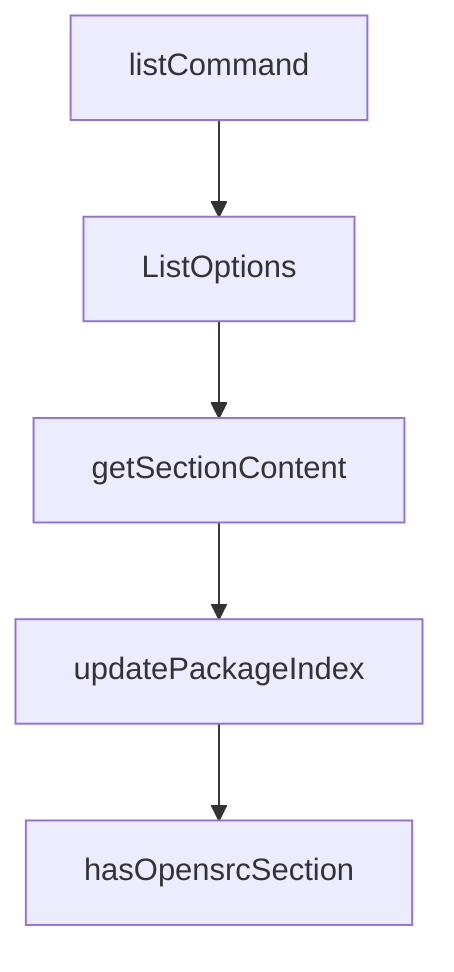

# Chapter 6: Update, Remove, and Clean Lifecycle

Welcome to **Chapter 6: Update, Remove, and Clean Lifecycle**. In this part of **OpenSrc Tutorial: Deep Source Context for Coding Agents**, you will build an intuitive mental model first, then move into concrete implementation details and practical production tradeoffs.


OpenSrc includes commands for incremental refresh and cleanup of source caches.

## Lifecycle Commands

```bash
opensrc zod                # refresh source for package
opensrc remove zod         # remove package source
opensrc remove owner/repo  # remove repository source
opensrc clean              # remove all tracked sources
opensrc clean --npm        # remove only npm package sources
```

## Maintenance Strategy

- re-run fetch for packages tied to updated lockfiles
- remove stale imports to reduce local noise
- use targeted clean modes per ecosystem when needed

## Source References

- [remove command](https://github.com/vercel-labs/opensrc/blob/main/src/commands/remove.ts)
- [clean command](https://github.com/vercel-labs/opensrc/blob/main/src/commands/clean.ts)
- [list command](https://github.com/vercel-labs/opensrc/blob/main/src/commands/list.ts)

## Summary

You now have operational control over source import lifecycle and cache hygiene.

Next: [Chapter 7: Reliability, Rate Limits, and Version Fallbacks](07-reliability-rate-limits-and-version-fallbacks.md)

## Source Code Walkthrough

### `src/commands/list.ts`

The `listCommand` function in [`src/commands/list.ts`](https://github.com/vercel-labs/opensrc/blob/HEAD/src/commands/list.ts) handles a key part of this chapter's functionality:

```ts
 * List all fetched package sources
 */
export async function listCommand(options: ListOptions = {}): Promise<void> {
  const cwd = options.cwd || process.cwd();
  const sources = await listSources(cwd);

  const totalCount = sources.packages.length + sources.repos.length;

  if (totalCount === 0) {
    console.log("No sources fetched yet.");
    console.log(
      "\nUse `opensrc <package>` to fetch source code for a package.",
    );
    console.log("Use `opensrc <owner>/<repo>` to fetch a GitHub repository.");
    console.log("\nSupported registries:");
    console.log("  • npm:      opensrc zod, opensrc npm:react");
    console.log("  • PyPI:     opensrc pypi:requests");
    console.log("  • crates:   opensrc crates:serde");
    return;
  }

  if (options.json) {
    console.log(JSON.stringify(sources, null, 2));
    return;
  }

  // Group packages by registry for display
  const packagesByRegistry: Record<Registry, typeof sources.packages> = {
    npm: [],
    pypi: [],
    crates: [],
  };
```

This function is important because it defines how OpenSrc Tutorial: Deep Source Context for Coding Agents implements the patterns covered in this chapter.

### `src/commands/list.ts`

The `ListOptions` interface in [`src/commands/list.ts`](https://github.com/vercel-labs/opensrc/blob/HEAD/src/commands/list.ts) handles a key part of this chapter's functionality:

```ts
import type { Registry } from "../types.js";

export interface ListOptions {
  cwd?: string;
  json?: boolean;
}

const REGISTRY_LABELS: Record<Registry, string> = {
  npm: "npm",
  pypi: "PyPI",
  crates: "crates.io",
};

/**
 * List all fetched package sources
 */
export async function listCommand(options: ListOptions = {}): Promise<void> {
  const cwd = options.cwd || process.cwd();
  const sources = await listSources(cwd);

  const totalCount = sources.packages.length + sources.repos.length;

  if (totalCount === 0) {
    console.log("No sources fetched yet.");
    console.log(
      "\nUse `opensrc <package>` to fetch source code for a package.",
    );
    console.log("Use `opensrc <owner>/<repo>` to fetch a GitHub repository.");
    console.log("\nSupported registries:");
    console.log("  • npm:      opensrc zod, opensrc npm:react");
    console.log("  • PyPI:     opensrc pypi:requests");
    console.log("  • crates:   opensrc crates:serde");
```

This interface is important because it defines how OpenSrc Tutorial: Deep Source Context for Coding Agents implements the patterns covered in this chapter.

### `src/lib/agents.ts`

The `getSectionContent` function in [`src/lib/agents.ts`](https://github.com/vercel-labs/opensrc/blob/HEAD/src/lib/agents.ts) handles a key part of this chapter's functionality:

```ts
 * Get the section content (without leading newline for comparison)
 */
function getSectionContent(): string {
  return `${SECTION_MARKER}

${SECTION_START}

Source code for dependencies is available in \`opensrc/\` for deeper understanding of implementation details.

See \`opensrc/sources.json\` for the list of available packages and their versions.

Use this source code when you need to understand how a package works internally, not just its types/interface.

### Fetching Additional Source Code

To fetch source code for a package or repository you need to understand, run:

\`\`\`bash
npx opensrc <package>           # npm package (e.g., npx opensrc zod)
npx opensrc pypi:<package>      # Python package (e.g., npx opensrc pypi:requests)
npx opensrc crates:<package>    # Rust crate (e.g., npx opensrc crates:serde)
npx opensrc <owner>/<repo>      # GitHub repo (e.g., npx opensrc vercel/ai)
\`\`\`

${SECTION_END_MARKER}`;
}

export interface PackageEntry {
  name: string;
  version: string;
  registry: Registry;
  path: string;
```

This function is important because it defines how OpenSrc Tutorial: Deep Source Context for Coding Agents implements the patterns covered in this chapter.

### `src/lib/agents.ts`

The `updatePackageIndex` function in [`src/lib/agents.ts`](https://github.com/vercel-labs/opensrc/blob/HEAD/src/lib/agents.ts) handles a key part of this chapter's functionality:

```ts
 * Update the sources.json file in opensrc/
 */
export async function updatePackageIndex(
  sources: {
    packages: PackageEntry[];
    repos: RepoEntry[];
  },
  cwd: string = process.cwd(),
): Promise<void> {
  const opensrcDir = join(cwd, OPENSRC_DIR);
  const sourcesPath = join(opensrcDir, SOURCES_FILE);

  if (sources.packages.length === 0 && sources.repos.length === 0) {
    // Remove index file if no sources
    if (existsSync(sourcesPath)) {
      const { rm } = await import("fs/promises");
      await rm(sourcesPath, { force: true });
    }
    return;
  }

  const index: SourcesIndex = {
    updatedAt: new Date().toISOString(),
  };

  if (sources.packages.length > 0) {
    index.packages = sources.packages.map((p) => ({
      name: p.name,
      version: p.version,
      registry: p.registry,
      path: p.path,
      fetchedAt: p.fetchedAt,
```

This function is important because it defines how OpenSrc Tutorial: Deep Source Context for Coding Agents implements the patterns covered in this chapter.


## How These Components Connect


