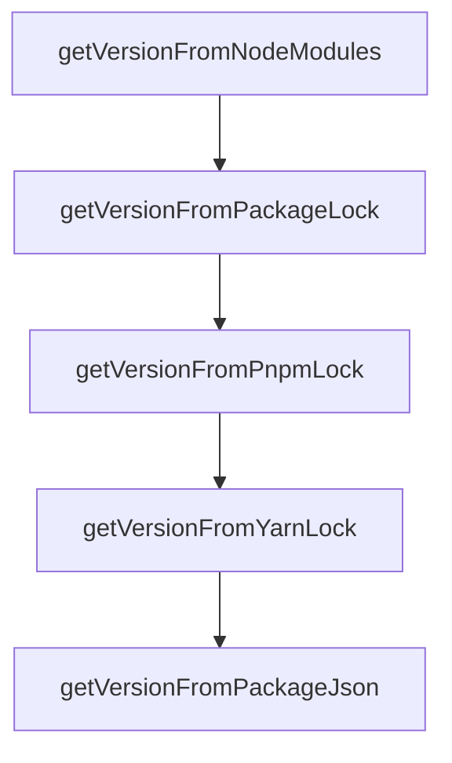

# Chapter 6: Update, Remove, and Clean Lifecycle

Welcome to **Chapter 6: Update, Remove, and Clean Lifecycle**. In this part of **OpenSrc Tutorial: Deep Source Context for Coding Agents**, you will build an intuitive mental model first, then move into concrete implementation details and practical production tradeoffs.


OpenSrc includes commands for incremental refresh and cleanup of source caches.

## Lifecycle Commands

```bash
opensrc zod                # refresh source for package
opensrc remove zod         # remove package source
opensrc remove owner/repo  # remove repository source
opensrc clean              # remove all tracked sources
opensrc clean --npm        # remove only npm package sources
```

## Maintenance Strategy

- re-run fetch for packages tied to updated lockfiles
- remove stale imports to reduce local noise
- use targeted clean modes per ecosystem when needed

## Source References

- [remove command](https://github.com/vercel-labs/opensrc/blob/main/src/commands/remove.ts)
- [clean command](https://github.com/vercel-labs/opensrc/blob/main/src/commands/clean.ts)
- [list command](https://github.com/vercel-labs/opensrc/blob/main/src/commands/list.ts)

## Summary

You now have operational control over source import lifecycle and cache hygiene.

Next: [Chapter 7: Reliability, Rate Limits, and Version Fallbacks](07-reliability-rate-limits-and-version-fallbacks.md)

## Depth Expansion Playbook

## Source Code Walkthrough

### `src/lib/version.ts`

The `getVersionFromNodeModules` function in [`src/lib/version.ts`](https://github.com/vercel-labs/opensrc/blob/HEAD/src/lib/version.ts) handles a key part of this chapter's functionality:

```ts
 * Try to get installed version from node_modules
 */
async function getVersionFromNodeModules(
  packageName: string,
  cwd: string,
): Promise<string | null> {
  const packageJsonPath = join(
    cwd,
    "node_modules",
    packageName,
    "package.json",
  );

  if (!existsSync(packageJsonPath)) {
    return null;
  }

  try {
    const content = await readFile(packageJsonPath, "utf-8");
    const pkg = JSON.parse(content) as { version?: string };
    return pkg.version || null;
  } catch {
    return null;
  }
}

/**
 * Try to get installed version from package-lock.json
 */
async function getVersionFromPackageLock(
  packageName: string,
  cwd: string,
```

This function is important because it defines how OpenSrc Tutorial: Deep Source Context for Coding Agents implements the patterns covered in this chapter.

### `src/lib/version.ts`

The `getVersionFromPackageLock` function in [`src/lib/version.ts`](https://github.com/vercel-labs/opensrc/blob/HEAD/src/lib/version.ts) handles a key part of this chapter's functionality:

```ts
 * Try to get installed version from package-lock.json
 */
async function getVersionFromPackageLock(
  packageName: string,
  cwd: string,
): Promise<string | null> {
  const lockPath = join(cwd, "package-lock.json");

  if (!existsSync(lockPath)) {
    return null;
  }

  try {
    const content = await readFile(lockPath, "utf-8");
    const lock = JSON.parse(content) as PackageLockJson;

    // npm v7+ format uses "packages"
    if (lock.packages) {
      const key = `node_modules/${packageName}`;
      if (lock.packages[key]?.version) {
        return lock.packages[key].version;
      }
    }

    // npm v6 and earlier format uses "dependencies"
    if (lock.dependencies?.[packageName]?.version) {
      return lock.dependencies[packageName].version;
    }

    return null;
  } catch {
    return null;
```

This function is important because it defines how OpenSrc Tutorial: Deep Source Context for Coding Agents implements the patterns covered in this chapter.

### `src/lib/version.ts`

The `getVersionFromPnpmLock` function in [`src/lib/version.ts`](https://github.com/vercel-labs/opensrc/blob/HEAD/src/lib/version.ts) handles a key part of this chapter's functionality:

```ts
 * This is a simplified parser - pnpm lockfiles are complex
 */
async function getVersionFromPnpmLock(
  packageName: string,
  cwd: string,
): Promise<string | null> {
  const lockPath = join(cwd, "pnpm-lock.yaml");

  if (!existsSync(lockPath)) {
    return null;
  }

  try {
    const content = await readFile(lockPath, "utf-8");

    // Look for the package in the lockfile
    // pnpm format: 'packageName@version(peer-deps):' or 'packageName@version:'
    // We need to stop at '(' or ')' (peer deps), ':' (end of key), or quotes
    // The ')' case handles matching inside another package's peer deps like ai@6.0.6(zod@4.3.4)
    const escapedName = packageName.replace(/[.*+?^${}()|[\]\\]/g, "\\$&");
    const regex = new RegExp(`['"]?${escapedName}@([^(':"\\s)]+)`, "g");
    const matches = [...content.matchAll(regex)];

    if (matches.length > 0) {
      // Return the first match's version
      return matches[0][1];
    }

    return null;
  } catch {
    return null;
  }
```

This function is important because it defines how OpenSrc Tutorial: Deep Source Context for Coding Agents implements the patterns covered in this chapter.

### `src/lib/version.ts`

The `getVersionFromYarnLock` function in [`src/lib/version.ts`](https://github.com/vercel-labs/opensrc/blob/HEAD/src/lib/version.ts) handles a key part of this chapter's functionality:

```ts
 * Try to get version from yarn.lock
 */
async function getVersionFromYarnLock(
  packageName: string,
  cwd: string,
): Promise<string | null> {
  const lockPath = join(cwd, "yarn.lock");

  if (!existsSync(lockPath)) {
    return null;
  }

  try {
    const content = await readFile(lockPath, "utf-8");

    // Yarn lockfile format:
    // "packageName@^version":
    //   version "actual-version"
    const escapedName = packageName.replace(/[.*+?^${}()|[\]\\]/g, "\\$&");
    const regex = new RegExp(
      `"?${escapedName}@[^":\\n]+[":]?\\s*\\n\\s*version\\s+["']?([^"'\\n]+)`,
      "g",
    );
    const matches = [...content.matchAll(regex)];

    if (matches.length > 0) {
      return matches[0][1];
    }

    return null;
  } catch {
    return null;
```

This function is important because it defines how OpenSrc Tutorial: Deep Source Context for Coding Agents implements the patterns covered in this chapter.


## How These Components Connect


