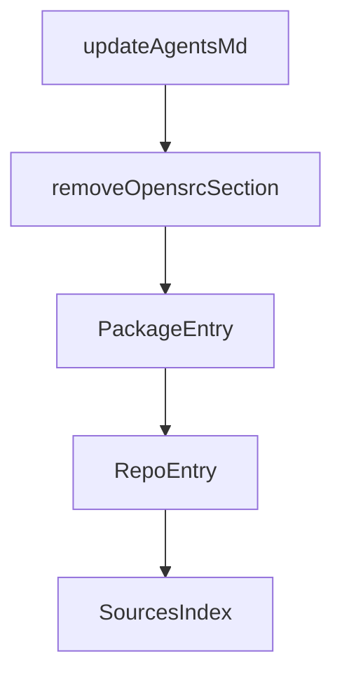

# Chapter 7: Reliability, Rate Limits, and Version Fallbacks

Welcome to **Chapter 7: Reliability, Rate Limits, and Version Fallbacks**. In this part of **OpenSrc Tutorial: Deep Source Context for Coding Agents**, you will build an intuitive mental model first, then move into concrete implementation details and practical production tradeoffs.


Real-world source fetching must account for imperfect metadata, missing tags, and API rate limits.

## Built-In Fallback Patterns

- if exact tag is missing, clone default branch with warning
- if package repo metadata is missing, return explicit error
- if host APIs rate-limit requests, surface actionable failures

## Reliability Practices

1. pin critical imports to explicit versions where possible
2. cache fetched sources in CI workspace artifacts for repeatability
3. monitor for registry/API availability issues in automation jobs

## Source References

- [Git clone fallback behavior](https://github.com/vercel-labs/opensrc/blob/main/src/lib/git.ts)
- [GitHub/GitLab repo resolution behavior](https://github.com/vercel-labs/opensrc/blob/main/src/lib/repo.ts)

## Summary

You now understand how OpenSrc behaves under common failure modes and how to design safer workflows around them.

Next: [Chapter 8: Team Operations and Governance](08-team-operations-and-governance.md)

## Depth Expansion Playbook

## Source Code Walkthrough

### `src/lib/agents.ts`

The `updateAgentsMd` function in [`src/lib/agents.ts`](https://github.com/vercel-labs/opensrc/blob/HEAD/src/lib/agents.ts) handles a key part of this chapter's functionality:

```ts
 * Update AGENTS.md and the package index
 */
export async function updateAgentsMd(
  sources: {
    packages: PackageEntry[];
    repos: RepoEntry[];
  },
  cwd: string = process.cwd(),
): Promise<boolean> {
  // Always update the index file
  await updatePackageIndex(sources, cwd);

  if (sources.packages.length > 0 || sources.repos.length > 0) {
    return ensureAgentsMd(cwd);
  }

  return removeOpensrcSection(cwd);
}

/**
 * Remove the opensrc section from AGENTS.md
 */
export async function removeOpensrcSection(
  cwd: string = process.cwd(),
): Promise<boolean> {
  const agentsPath = join(cwd, AGENTS_FILE);

  if (!existsSync(agentsPath)) {
    return false;
  }

  try {
```

This function is important because it defines how OpenSrc Tutorial: Deep Source Context for Coding Agents implements the patterns covered in this chapter.

### `src/lib/agents.ts`

The `removeOpensrcSection` function in [`src/lib/agents.ts`](https://github.com/vercel-labs/opensrc/blob/HEAD/src/lib/agents.ts) handles a key part of this chapter's functionality:

```ts
  }

  return removeOpensrcSection(cwd);
}

/**
 * Remove the opensrc section from AGENTS.md
 */
export async function removeOpensrcSection(
  cwd: string = process.cwd(),
): Promise<boolean> {
  const agentsPath = join(cwd, AGENTS_FILE);

  if (!existsSync(agentsPath)) {
    return false;
  }

  try {
    const content = await readFile(agentsPath, "utf-8");

    if (!content.includes(SECTION_MARKER)) {
      return false;
    }

    const startIdx = content.indexOf(SECTION_MARKER);
    const endIdx = content.indexOf(SECTION_END_MARKER);

    if (startIdx === -1 || endIdx === -1) {
      return false;
    }

    const before = content.slice(0, startIdx).trimEnd();
```

This function is important because it defines how OpenSrc Tutorial: Deep Source Context for Coding Agents implements the patterns covered in this chapter.

### `src/lib/agents.ts`

The `PackageEntry` interface in [`src/lib/agents.ts`](https://github.com/vercel-labs/opensrc/blob/HEAD/src/lib/agents.ts) handles a key part of this chapter's functionality:

```ts
}

export interface PackageEntry {
  name: string;
  version: string;
  registry: Registry;
  path: string;
  fetchedAt: string;
}

export interface RepoEntry {
  name: string;
  version: string;
  path: string;
  fetchedAt: string;
}

export interface SourcesIndex {
  packages?: PackageEntry[];
  repos?: RepoEntry[];
  updatedAt: string;
}

/**
 * Update the sources.json file in opensrc/
 */
export async function updatePackageIndex(
  sources: {
    packages: PackageEntry[];
    repos: RepoEntry[];
  },
  cwd: string = process.cwd(),
```

This interface is important because it defines how OpenSrc Tutorial: Deep Source Context for Coding Agents implements the patterns covered in this chapter.

### `src/lib/agents.ts`

The `RepoEntry` interface in [`src/lib/agents.ts`](https://github.com/vercel-labs/opensrc/blob/HEAD/src/lib/agents.ts) handles a key part of this chapter's functionality:

```ts
}

export interface RepoEntry {
  name: string;
  version: string;
  path: string;
  fetchedAt: string;
}

export interface SourcesIndex {
  packages?: PackageEntry[];
  repos?: RepoEntry[];
  updatedAt: string;
}

/**
 * Update the sources.json file in opensrc/
 */
export async function updatePackageIndex(
  sources: {
    packages: PackageEntry[];
    repos: RepoEntry[];
  },
  cwd: string = process.cwd(),
): Promise<void> {
  const opensrcDir = join(cwd, OPENSRC_DIR);
  const sourcesPath = join(opensrcDir, SOURCES_FILE);

  if (sources.packages.length === 0 && sources.repos.length === 0) {
    // Remove index file if no sources
    if (existsSync(sourcesPath)) {
      const { rm } = await import("fs/promises");
```

This interface is important because it defines how OpenSrc Tutorial: Deep Source Context for Coding Agents implements the patterns covered in this chapter.


## How These Components Connect


