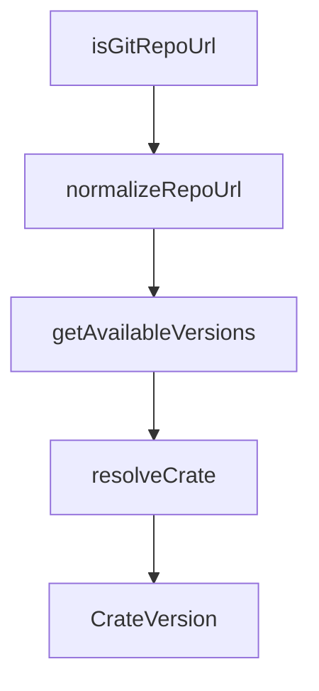

# Chapter 8: Team Operations and Governance

Welcome to **Chapter 8: Team Operations and Governance**. In this part of **OpenSrc Tutorial: Deep Source Context for Coding Agents**, you will build an intuitive mental model first, then move into concrete implementation details and practical production tradeoffs.


For team usage, OpenSrc works best with explicit policy on what to fetch, where to reference it, and how to keep it current.

## Team Governance Checklist

- standardize allowed registries and repository hosts
- define source refresh cadence for critical dependencies
- enforce cleanup policy to limit workspace bloat
- document when imported source can be used for decisions versus package APIs

## Suggested Process

1. fetch only high-impact dependencies needed for deep reasoning
2. keep `opensrc/sources.json` aligned with active dependency review scope
3. include source-context checks in PR review guidelines for agent-generated changes

## Source References

- [OpenSrc README](https://github.com/vercel-labs/opensrc/blob/main/README.md)
- [AGENTS integration](https://github.com/vercel-labs/opensrc/blob/main/AGENTS.md)

## Summary

You now have a governance baseline for scaling OpenSrc usage across repositories and teams.

## Source Code Walkthrough

### `src/lib/registries/crates.ts`

The `isGitRepoUrl` function in [`src/lib/registries/crates.ts`](https://github.com/vercel-labs/opensrc/blob/HEAD/src/lib/registries/crates.ts) handles a key part of this chapter's functionality:

```ts
function extractRepoUrl(crate: CrateResponse["crate"]): string | null {
  // Check repository field first
  if (crate.repository && isGitRepoUrl(crate.repository)) {
    return normalizeRepoUrl(crate.repository);
  }

  // Fall back to homepage if it's a git repo
  if (crate.homepage && isGitRepoUrl(crate.homepage)) {
    return normalizeRepoUrl(crate.homepage);
  }

  return null;
}

function isGitRepoUrl(url: string): boolean {
  return (
    url.includes("github.com") ||
    url.includes("gitlab.com") ||
    url.includes("bitbucket.org")
  );
}

function normalizeRepoUrl(url: string): string {
  // Remove trailing slashes and common suffixes
  return url
    .replace(/\/+$/, "")
    .replace(/\.git$/, "")
    .replace(/\/tree\/.*$/, "")
    .replace(/\/blob\/.*$/, "");
}

/**
```

This function is important because it defines how OpenSrc Tutorial: Deep Source Context for Coding Agents implements the patterns covered in this chapter.

### `src/lib/registries/crates.ts`

The `normalizeRepoUrl` function in [`src/lib/registries/crates.ts`](https://github.com/vercel-labs/opensrc/blob/HEAD/src/lib/registries/crates.ts) handles a key part of this chapter's functionality:

```ts
  // Check repository field first
  if (crate.repository && isGitRepoUrl(crate.repository)) {
    return normalizeRepoUrl(crate.repository);
  }

  // Fall back to homepage if it's a git repo
  if (crate.homepage && isGitRepoUrl(crate.homepage)) {
    return normalizeRepoUrl(crate.homepage);
  }

  return null;
}

function isGitRepoUrl(url: string): boolean {
  return (
    url.includes("github.com") ||
    url.includes("gitlab.com") ||
    url.includes("bitbucket.org")
  );
}

function normalizeRepoUrl(url: string): string {
  // Remove trailing slashes and common suffixes
  return url
    .replace(/\/+$/, "")
    .replace(/\.git$/, "")
    .replace(/\/tree\/.*$/, "")
    .replace(/\/blob\/.*$/, "");
}

/**
 * Get available versions sorted by release date (newest first)
```

This function is important because it defines how OpenSrc Tutorial: Deep Source Context for Coding Agents implements the patterns covered in this chapter.

### `src/lib/registries/crates.ts`

The `getAvailableVersions` function in [`src/lib/registries/crates.ts`](https://github.com/vercel-labs/opensrc/blob/HEAD/src/lib/registries/crates.ts) handles a key part of this chapter's functionality:

```ts
 * Get available versions sorted by release date (newest first)
 */
function getAvailableVersions(versions: CrateVersion[]): string[] {
  return versions
    .filter((v) => !v.yanked)
    .sort(
      (a, b) =>
        new Date(b.created_at).getTime() - new Date(a.created_at).getTime(),
    )
    .map((v) => v.num);
}

/**
 * Resolve a crate to its repository information
 */
export async function resolveCrate(
  crateName: string,
  version?: string,
): Promise<ResolvedPackage> {
  const info = await fetchCrateInfo(crateName);

  // If version specified, verify it exists
  let resolvedVersion = version || info.crate.max_version;

  if (version) {
    await fetchCrateVersionInfo(crateName, version);
    resolvedVersion = version;
  }

  const repoUrl = extractRepoUrl(info.crate);

  if (!repoUrl) {
```

This function is important because it defines how OpenSrc Tutorial: Deep Source Context for Coding Agents implements the patterns covered in this chapter.

### `src/lib/registries/crates.ts`

The `resolveCrate` function in [`src/lib/registries/crates.ts`](https://github.com/vercel-labs/opensrc/blob/HEAD/src/lib/registries/crates.ts) handles a key part of this chapter's functionality:

```ts
 * Resolve a crate to its repository information
 */
export async function resolveCrate(
  crateName: string,
  version?: string,
): Promise<ResolvedPackage> {
  const info = await fetchCrateInfo(crateName);

  // If version specified, verify it exists
  let resolvedVersion = version || info.crate.max_version;

  if (version) {
    await fetchCrateVersionInfo(crateName, version);
    resolvedVersion = version;
  }

  const repoUrl = extractRepoUrl(info.crate);

  if (!repoUrl) {
    const availableVersions = getAvailableVersions(info.versions)
      .slice(0, 5)
      .join(", ");
    throw new Error(
      `No repository URL found for "${crateName}@${resolvedVersion}". ` +
        `This crate may not have its source published. ` +
        `Recent versions: ${availableVersions}`,
    );
  }

  // Rust crates commonly use v1.2.3 as tags
  const gitTag = `v${resolvedVersion}`;

```

This function is important because it defines how OpenSrc Tutorial: Deep Source Context for Coding Agents implements the patterns covered in this chapter.


## How These Components Connect


