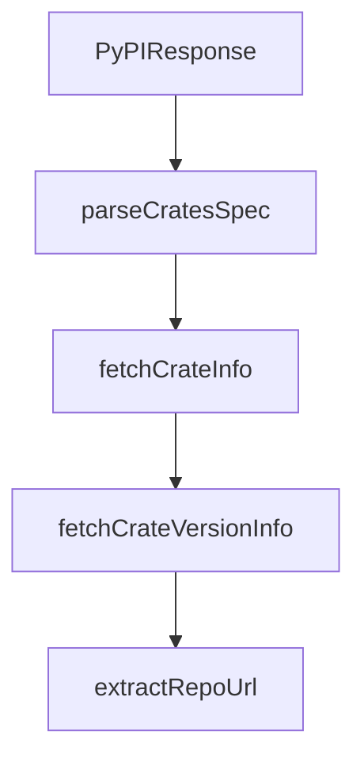

# Chapter 8: Team Operations and Governance

Welcome to **Chapter 8: Team Operations and Governance**. In this part of **OpenSrc Tutorial: Deep Source Context for Coding Agents**, you will build an intuitive mental model first, then move into concrete implementation details and practical production tradeoffs.


For team usage, OpenSrc works best with explicit policy on what to fetch, where to reference it, and how to keep it current.

## Team Governance Checklist

- standardize allowed registries and repository hosts
- define source refresh cadence for critical dependencies
- enforce cleanup policy to limit workspace bloat
- document when imported source can be used for decisions versus package APIs

## Suggested Process

1. fetch only high-impact dependencies needed for deep reasoning
2. keep `opensrc/sources.json` aligned with active dependency review scope
3. include source-context checks in PR review guidelines for agent-generated changes

## Source References

- [OpenSrc README](https://github.com/vercel-labs/opensrc/blob/main/README.md)
- [AGENTS integration](https://github.com/vercel-labs/opensrc/blob/main/AGENTS.md)

## Summary

You now have a governance baseline for scaling OpenSrc usage across repositories and teams.

## Depth Expansion Playbook

## Source Code Walkthrough

### `src/lib/registries/pypi.ts`

The `PyPIResponse` interface in [`src/lib/registries/pypi.ts`](https://github.com/vercel-labs/opensrc/blob/HEAD/src/lib/registries/pypi.ts) handles a key part of this chapter's functionality:

```ts
}

interface PyPIResponse {
  info: {
    name: string;
    version: string;
    home_page?: string;
    project_urls?: Record<string, string>;
    project_url?: string;
  };
  releases: Record<string, PyPIRelease[]>;
}

/**
 * Parse a PyPI package specifier like "requests==2.31.0" into name and version
 */
export function parsePyPISpec(spec: string): {
  name: string;
  version?: string;
} {
  // Handle version specifiers: requests==2.31.0 or requests>=2.31.0
  const eqMatch = spec.match(/^([^=<>!~]+)==(.+)$/);
  if (eqMatch) {
    return { name: eqMatch[1].trim(), version: eqMatch[2].trim() };
  }

  // Handle @ version specifier: requests@2.31.0
  const atIndex = spec.lastIndexOf("@");
  if (atIndex > 0) {
    return {
      name: spec.slice(0, atIndex).trim(),
      version: spec.slice(atIndex + 1).trim(),
```

This interface is important because it defines how OpenSrc Tutorial: Deep Source Context for Coding Agents implements the patterns covered in this chapter.

### `src/lib/registries/crates.ts`

The `parseCratesSpec` function in [`src/lib/registries/crates.ts`](https://github.com/vercel-labs/opensrc/blob/HEAD/src/lib/registries/crates.ts) handles a key part of this chapter's functionality:

```ts
 * Parse a crates.io package specifier like "serde@1.0.0" into name and version
 */
export function parseCratesSpec(spec: string): {
  name: string;
  version?: string;
} {
  // Handle @ version specifier: serde@1.0.0
  const atIndex = spec.lastIndexOf("@");
  if (atIndex > 0) {
    return {
      name: spec.slice(0, atIndex).trim(),
      version: spec.slice(atIndex + 1).trim(),
    };
  }

  return { name: spec.trim() };
}

/**
 * Fetch crate metadata from crates.io
 */
async function fetchCrateInfo(crateName: string): Promise<CrateResponse> {
  const url = `${CRATES_API}/crates/${crateName}`;

  const response = await fetch(url, {
    headers: {
      Accept: "application/json",
      "User-Agent": "opensrc-cli (https://github.com/vercel-labs/opensrc)",
    },
  });

  if (!response.ok) {
```

This function is important because it defines how OpenSrc Tutorial: Deep Source Context for Coding Agents implements the patterns covered in this chapter.

### `src/lib/registries/crates.ts`

The `fetchCrateInfo` function in [`src/lib/registries/crates.ts`](https://github.com/vercel-labs/opensrc/blob/HEAD/src/lib/registries/crates.ts) handles a key part of this chapter's functionality:

```ts
 * Fetch crate metadata from crates.io
 */
async function fetchCrateInfo(crateName: string): Promise<CrateResponse> {
  const url = `${CRATES_API}/crates/${crateName}`;

  const response = await fetch(url, {
    headers: {
      Accept: "application/json",
      "User-Agent": "opensrc-cli (https://github.com/vercel-labs/opensrc)",
    },
  });

  if (!response.ok) {
    if (response.status === 404) {
      throw new Error(`Crate "${crateName}" not found on crates.io`);
    }
    throw new Error(
      `Failed to fetch crate info: ${response.status} ${response.statusText}`,
    );
  }

  return response.json() as Promise<CrateResponse>;
}

/**
 * Fetch specific version info from crates.io
 */
async function fetchCrateVersionInfo(
  crateName: string,
  version: string,
): Promise<CrateVersionResponse> {
  const url = `${CRATES_API}/crates/${crateName}/${version}`;
```

This function is important because it defines how OpenSrc Tutorial: Deep Source Context for Coding Agents implements the patterns covered in this chapter.

### `src/lib/registries/crates.ts`

The `fetchCrateVersionInfo` function in [`src/lib/registries/crates.ts`](https://github.com/vercel-labs/opensrc/blob/HEAD/src/lib/registries/crates.ts) handles a key part of this chapter's functionality:

```ts
 * Fetch specific version info from crates.io
 */
async function fetchCrateVersionInfo(
  crateName: string,
  version: string,
): Promise<CrateVersionResponse> {
  const url = `${CRATES_API}/crates/${crateName}/${version}`;

  const response = await fetch(url, {
    headers: {
      Accept: "application/json",
      "User-Agent": "opensrc-cli (https://github.com/vercel-labs/opensrc)",
    },
  });

  if (!response.ok) {
    if (response.status === 404) {
      throw new Error(
        `Version "${version}" not found for crate "${crateName}"`,
      );
    }
    throw new Error(
      `Failed to fetch crate version info: ${response.status} ${response.statusText}`,
    );
  }

  return response.json() as Promise<CrateVersionResponse>;
}

/**
 * Extract repository URL from crate metadata
 */
```

This function is important because it defines how OpenSrc Tutorial: Deep Source Context for Coding Agents implements the patterns covered in this chapter.


## How These Components Connect


