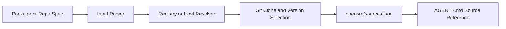

# OpenSrc Tutorial: Deep Source Context for Coding Agents

> Learn how to use `vercel-labs/opensrc` to fetch package and repository source code so coding agents can reason about implementation details, not only public types and docs.

## Why This Track Matters

Coding agents frequently need deeper package internals than API docs provide. OpenSrc automates source acquisition from npm, PyPI, crates.io, and git hosts and wires results into `AGENTS.md` and `opensrc/sources.json`.

This track focuses on:

- parsing and resolving package/repo inputs
- multi-registry source fetching workflows
- source indexing and `AGENTS.md` integration
- cleanup, reliability, and governance patterns

## Current Snapshot (auto-updated)

- repository: [`vercel-labs/opensrc`](https://github.com/vercel-labs/opensrc)
- stars: about **361**
- npm package version: [`0.6.0`](https://www.npmjs.com/package/opensrc)
- recent activity: updates on **January 26, 2026**
- project positioning: source-fetch utility for AI coding agent context

## Mental Model

## Chapter Guide

| Chapter | Key Question | Outcome |
|:--------|:-------------|:--------|
| [01 - Getting Started](01-getting-started.md) | How do I run OpenSrc on my project quickly? | Working baseline |
| [02 - Input Parsing and Resolution Pipeline](02-input-parsing-and-resolution-pipeline.md) | How does OpenSrc distinguish package specs and repo specs? | Strong parsing model |
| [03 - Multi-Registry Package Fetching](03-multi-registry-package-fetching.md) | How are npm, PyPI, and crates sources resolved? | Better dependency coverage |
| [04 - Git Repository Source Imports](04-git-repository-source-imports.md) | How does OpenSrc fetch direct repository inputs? | More flexible source acquisition |
| [05 - AGENTS.md and sources.json Integration](05-agents-md-and-sources-json-integration.md) | How does OpenSrc expose fetched sources to coding agents? | Durable context registry |
| [06 - Update, Remove, and Clean Lifecycle](06-update-remove-and-clean-lifecycle.md) | How do I maintain and prune local source caches safely? | Lifecycle hygiene |
| [07 - Reliability, Rate Limits, and Version Fallbacks](07-reliability-rate-limits-and-version-fallbacks.md) | How should I handle imperfect metadata and network constraints? | Stronger operational resilience |
| [08 - Team Operations and Governance](08-team-operations-and-governance.md) | How do teams standardize OpenSrc usage across repositories? | Governance baseline |

## What You Will Learn

- how to fetch dependency and repo sources as agent-readable context
- how OpenSrc resolves versions and repository mappings across ecosystems
- how to maintain clean, updated source indexes for team workflows
- how to operationalize source context governance in production repositories

## Source References

- [OpenSrc Repository](https://github.com/vercel-labs/opensrc)
- [OpenSrc README](https://github.com/vercel-labs/opensrc/blob/main/README.md)
- [CLI entrypoint](https://github.com/vercel-labs/opensrc/blob/main/src/index.ts)
- [Fetch command implementation](https://github.com/vercel-labs/opensrc/blob/main/src/commands/fetch.ts)
- [Registry resolvers](https://github.com/vercel-labs/opensrc/tree/main/src/lib/registries)

## Related Tutorials

- [OpenSkills Tutorial](../openskills-tutorial/)
- [CodeMachine CLI Tutorial](../codemachine-cli-tutorial/)
- [OpenCode Tutorial](../opencode-tutorial/)
- [Plandex Tutorial](../plandex-tutorial/)

---

Start with [Chapter 1: Getting Started](01-getting-started.md).

## Navigation & Backlinks

- [Start Here: Chapter 1: Getting Started](01-getting-started.md)
- [Back to Main Catalog](../../README.md#-tutorial-catalog)
- [Browse A-Z Tutorial Directory](../../discoverability/tutorial-directory.md)
- [Search by Intent](../../discoverability/query-hub.md)
- [Explore Category Hubs](../../README.md#category-hubs)

## Full Chapter Map

1. [Chapter 1: Getting Started](01-getting-started.md)
2. [Chapter 2: Input Parsing and Resolution Pipeline](02-input-parsing-and-resolution-pipeline.md)
3. [Chapter 3: Multi-Registry Package Fetching](03-multi-registry-package-fetching.md)
4. [Chapter 4: Git Repository Source Imports](04-git-repository-source-imports.md)
5. [Chapter 5: AGENTS.md and sources.json Integration](05-agents-md-and-sources-json-integration.md)
6. [Chapter 6: Update, Remove, and Clean Lifecycle](06-update-remove-and-clean-lifecycle.md)
7. [Chapter 7: Reliability, Rate Limits, and Version Fallbacks](07-reliability-rate-limits-and-version-fallbacks.md)
8. [Chapter 8: Team Operations and Governance](08-team-operations-and-governance.md)

*Generated by [AI Codebase Knowledge Builder](https://github.com/The-Pocket/Tutorial-Codebase-Knowledge)*
