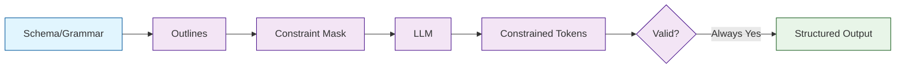

# Outlines Tutorial: Structured LLM Generation

> Control LLM outputs with guaranteed structure using grammar-based generation.

<div align="center">

**📐 Reliable, Structured Text Generation**

[](https://github.com/outlines-dev/outlines)

</div>

---

## 🎯 What is Outlines?

**Outlines**<sup>[View Repo](https://github.com/outlines-dev/outlines)</sup> is a library for structured text generation with LLMs. Unlike post-hoc parsing, Outlines guarantees that outputs match your specified format by constraining generation at the token level.

### Key Features

| Feature | Description |
|:--------|:------------|
| **JSON Generation** | Guaranteed valid JSON matching schemas |
| **Regex Constraints** | Generate text matching patterns |
| **Grammar Support** | Define custom EBNF grammars |
| **Type Constraints** | Integer, float, boolean outputs |
| **Pydantic Models** | Direct schema-to-generation |
| **Choice/Enum** | Constrained categorical outputs |



## Tutorial Chapters

1. **[Chapter 1: Getting Started](01-getting-started.md)** - Installation and basic usage
2. **[Chapter 2: JSON Generation](02-json.md)** - Schema-constrained JSON
3. **[Chapter 3: Regex Patterns](03-regex.md)** - Pattern-based generation
4. **[Chapter 4: Pydantic Models](04-pydantic.md)** - Type-safe structured outputs
5. **[Chapter 5: Choices & Enums](05-choices.md)** - Categorical constraints
6. **[Chapter 6: Custom Grammars](06-grammars.md)** - EBNF grammar definitions
7. **[Chapter 7: Performance](07-performance.md)** - Optimization and caching
8. **[Chapter 8: Integration](08-integration.md)** - Using with other frameworks

## What You'll Learn

- **Generate Valid JSON** guaranteed by construction
- **Use Regex Constraints** for formatted outputs
- **Define Pydantic Models** for type-safe generation
- **Create Custom Grammars** for complex formats
- **Optimize Performance** with caching
- **Integrate with Frameworks** like LangChain

## Prerequisites

- Python 3.9+
- Understanding of JSON and regex
- Familiarity with Pydantic

## Quick Start

```bash
# Install Outlines
pip install outlines

# With specific backends
pip install outlines[transformers]
pip install outlines[vllm]
```

## Guaranteed JSON Generation

```python
import outlines

# Load a model
model = outlines.models.transformers("mistralai/Mistral-7B-v0.1")

# Define schema
schema = {
    "type": "object",
    "properties": {
        "name": {"type": "string"},
        "age": {"type": "integer"},
        "city": {"type": "string"}
    },
    "required": ["name", "age", "city"]
}

# Create generator
generator = outlines.generate.json(model, schema)

# Generate - ALWAYS valid JSON
result = generator("Create a person profile:")
print(result)
# {"name": "Alice", "age": 28, "city": "New York"}
```

## Pydantic Models

```python
from pydantic import BaseModel
from typing import List
import outlines

class Recipe(BaseModel):
    name: str
    ingredients: List[str]
    prep_time_minutes: int
    instructions: List[str]

model = outlines.models.transformers("mistralai/Mistral-7B-v0.1")
generator = outlines.generate.json(model, Recipe)

recipe = generator("Generate a pasta recipe:")
print(recipe.name)
print(recipe.ingredients)
# Fully typed Pydantic object!
```

## Regex Constraints

```python
import outlines

model = outlines.models.transformers("mistralai/Mistral-7B-v0.1")

# Phone number pattern
phone_pattern = r"\d{3}-\d{3}-\d{4}"
generator = outlines.generate.regex(model, phone_pattern)
phone = generator("Generate a US phone number:")
# "555-123-4567" - guaranteed format

# Email pattern
email_pattern = r"[a-z]+@[a-z]+\.[a-z]{2,3}"
generator = outlines.generate.regex(model, email_pattern)
email = generator("Generate an email:")
# "john@example.com"

# Date pattern
date_pattern = r"\d{4}-\d{2}-\d{2}"
generator = outlines.generate.regex(model, date_pattern)
date = generator("Today's date:")
# "2025-12-05"
```

## Choice Constraints

```python
import outlines

model = outlines.models.transformers("mistralai/Mistral-7B-v0.1")

# Constrained to specific options
generator = outlines.generate.choice(
    model,
    choices=["positive", "negative", "neutral"]
)

sentiment = generator("Classify: 'I love this product!'")
# "positive" - guaranteed to be one of the choices
```

## Type Constraints

```python
import outlines

model = outlines.models.transformers("mistralai/Mistral-7B-v0.1")

# Integer only
int_generator = outlines.generate.format(model, int)
age = int_generator("How old is the average person?")
# 35 (integer, not "35" or "thirty-five")

# Float
float_generator = outlines.generate.format(model, float)
price = float_generator("Price of a coffee:")
# 4.50

# Boolean
bool_generator = outlines.generate.format(model, bool)
answer = bool_generator("Is Python a programming language?")
# True
```

## Custom Grammars (EBNF)

```python
import outlines

model = outlines.models.transformers("mistralai/Mistral-7B-v0.1")

# Define arithmetic expression grammar
arithmetic_grammar = """
    ?start: expression
    ?expression: term (("+" | "-") term)*
    ?term: factor (("*" | "/") factor)*
    ?factor: NUMBER | "(" expression ")"
    NUMBER: /[0-9]+/
"""

generator = outlines.generate.cfg(model, arithmetic_grammar)
expr = generator("Generate a math expression:")
# "(3 + 5) * 2"
```

## With vLLM (High Performance)

```python
import outlines

# Use vLLM backend for speed
model = outlines.models.vllm("mistralai/Mistral-7B-v0.1")

generator = outlines.generate.json(model, Recipe)
# Much faster with vLLM's optimizations
```

## Why Outlines?

| Approach | Reliability | Performance |
|:---------|:------------|:------------|
| Prompt engineering | ~80% valid | Fast |
| Post-hoc validation | Retry on failure | Slower |
| **Outlines** | **100% valid** | **Optimized** |

## Learning Path

### 🟢 Beginner Track
1. Chapters 1-3: Setup, JSON, and regex
2. Generate basic structured outputs

### 🟡 Intermediate Track
1. Chapters 4-6: Pydantic, choices, and grammars
2. Build complex structured generation

### 🔴 Advanced Track
1. Chapters 7-8: Performance and integration
2. Production-ready structured LLM apps

---

**Ready for guaranteed structured outputs? Let's begin with [Chapter 1: Getting Started](01-getting-started.md)!**

*Generated for [Awesome Code Docs](https://github.com/johnxie/awesome-code-docs)*
