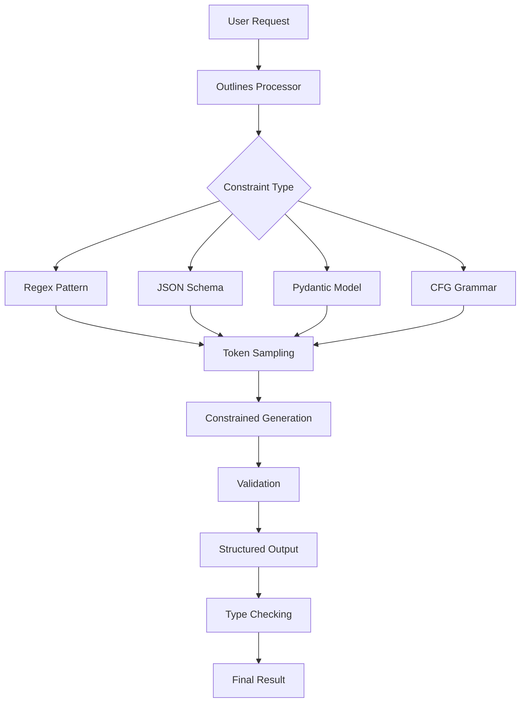

# Outlines Tutorial: Structured Text Generation with LLMs

> A deep technical walkthrough of Outlines covering Structured Text Generation with LLMs.

Outlines[View Repo](https://github.com/outlines-dev/outlines) is a Python library that allows you to control Large Language Model outputs with structural constraints. Use JSON Schema, regular expressions, context-free grammars, and more to guide model generation.

## Tutorial Chapters

1. **[Chapter 1: Getting Started](01-getting-started.md)** - Installation and basic constrained generation
2. **[Chapter 2: Text Patterns](02-text-patterns.md)** - Regular expressions and string constraints
3. **[Chapter 3: JSON Schema](03-json-schema.md)** - Structured data generation with schemas
4. **[Chapter 4: Type Safety](04-type-safety.md)** - Pydantic models and type validation
5. **[Chapter 5: Grammar-Based](05-grammar-based.md)** - Context-free grammars and formal languages
6. **[Chapter 6: Advanced Features](06-advanced-features.md)** - Sampling strategies and performance optimization
7. **[Chapter 7: Integration](07-integration.md)** - LangChain, CrewAI, and other frameworks
8. **[Chapter 8: Production](08-production.md)** - Deployment, monitoring, and scaling

## What You'll Learn

- **Constrained Generation**: Force LLMs to follow specific patterns and structures
- **JSON Schema Validation**: Generate perfectly structured JSON data
- **Type Safety**: Use Pydantic models for runtime type checking
- **Grammar Control**: Implement context-free grammars for complex structures
- **Performance Optimization**: Efficient sampling and caching strategies
- **Framework Integration**: Connect with popular AI development frameworks

## Learning Objectives

By the end of this tutorial, you'll be able to:
- Generate structured text outputs with guaranteed compliance
- Implement JSON Schema validation for API responses
- Use Pydantic models for type-safe LLM interactions
- Apply context-free grammars for domain-specific languages
- Optimize performance with advanced sampling techniques
- Deploy constrained generation systems in production

## Key Features Covered

**🔧 Core Capabilities:**
- ⚡ **Fast Constrained Sampling**: Efficiently generate structured outputs
- 📋 **JSON Schema Support**: Validate complex data structures
- 🔒 **Type Safety**: Runtime validation with Pydantic integration
- 📝 **Grammar Control**: Context-free grammars and regex patterns
- 🎯 **Multiple Backends**: Support for Transformers, llama.cpp, vLLM
- 🚀 **Performance Focused**: Optimized for speed and memory usage

**🔄 Integration Ready:**
- 🔗 **LangChain Compatible**: Drop-in replacement for LLM calls
- 🤖 **CrewAI Integration**: Structured outputs for multi-agent systems
- 📊 **FastAPI Ready**: Type-safe API responses
- 🏗️ **Framework Agnostic**: Works with any Python application

## Architecture Overview

Outlines sits between your application and the LLM, intercepting the generation process to ensure outputs conform to your specified constraints while maintaining high performance.

## Prerequisites

- Python 3.8+
- Basic understanding of LLMs and text generation
- Familiarity with JSON Schema or Pydantic (helpful but not required)
- Experience with regular expressions (beneficial)

## Getting Started

Ready to add structure to your LLM outputs? Let's begin with [Chapter 1: Getting Started](01-getting-started.md)!
