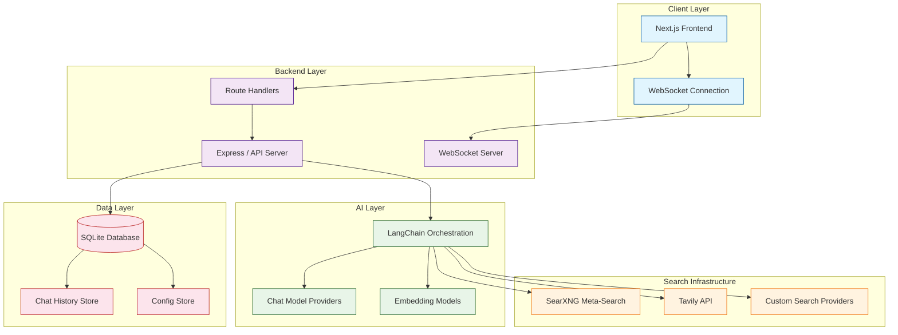
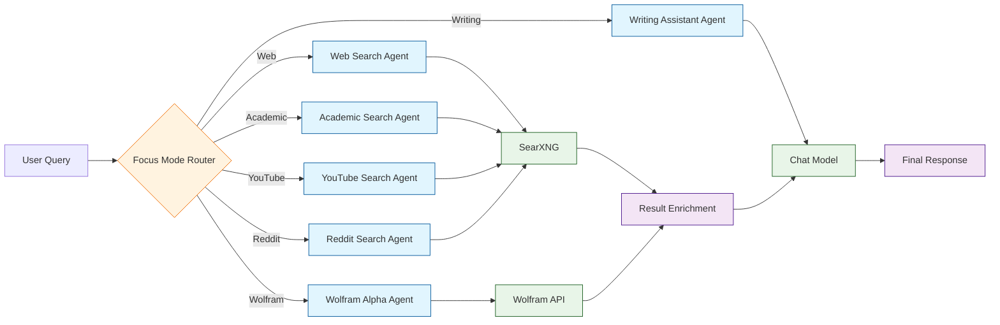
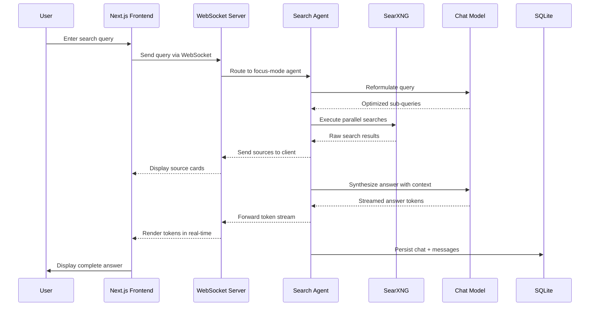
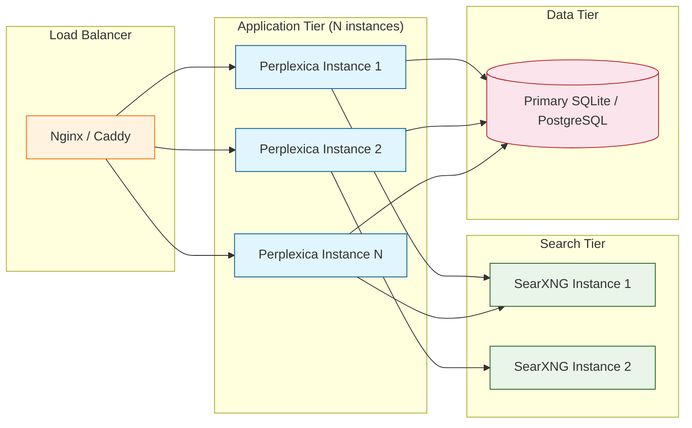

# Chapter 2: Search Engine Architecture

Understanding Perplexica's architecture is key to customizing and extending the search engine. This chapter explores every layer of the system -- from the moment a user types a query to the final synthesized answer with citations. By the end, you will know how each component communicates, where data is stored, and how to extend the architecture for your own use cases.

## High-Level System Overview

Perplexica follows a layered architecture that cleanly separates concerns across the frontend, backend, search infrastructure, and AI layer. The diagram below shows the full request lifecycle.



## Core Architecture Components

### 1. Query Processing Engine

The query processing engine is the entry point for every search. It receives the user's raw input and transforms it into a structured representation that downstream components can work with.

```typescript
// src/lib/queryProcessor.ts
interface ProcessedQuery {
  originalQuery: string;
  reformulatedQuery: string;
  searchQueries: string[];
  focusMode: FocusMode;
  conversationContext: Message[];
}

type FocusMode =
  | 'webSearch'
  | 'academicSearch'
  | 'youtubeSearch'
  | 'redditSearch'
  | 'writingAssistant'
  | 'wolframAlpha';

async function processQuery(
  input: string,
  history: Message[],
  focusMode: FocusMode,
): Promise<ProcessedQuery> {
  // Step 1: Analyze conversation context
  const context = extractContext(history);

  // Step 2: Reformulate query using LLM
  const reformulated = await reformulateWithLLM(input, context);

  // Step 3: Generate multiple search sub-queries
  const searchQueries = await generateSearchQueries(reformulated);

  return {
    originalQuery: input,
    reformulatedQuery: reformulated,
    searchQueries,
    focusMode,
    conversationContext: history,
  };
}
```

**Key responsibilities:**

| Responsibility | Description |
|---|---|
| Intent Recognition | Determines what kind of answer the user expects (factual, comparative, tutorial, etc.) |
| Query Expansion | Adds synonyms and related terms to broaden recall |
| Context Injection | Merges conversation history so follow-up questions resolve correctly |
| Focus Mode Routing | Sends the query to the correct search agent based on the selected mode |

### 2. Agent and Chain Architecture

Perplexica uses LangChain agents to orchestrate multi-step reasoning. Each focus mode maps to a dedicated agent with its own prompt template and tool set.



```typescript
// src/agents/webSearchAgent.ts
import { RunnableSequence } from '@langchain/core/runnables';
import { ChatPromptTemplate } from '@langchain/core/prompts';
import { StringOutputParser } from '@langchain/core/output_parsers';

const webSearchChain = RunnableSequence.from([
  // Step 1: Reformulate query for search engines
  ChatPromptTemplate.fromMessages([
    ['system', `You are a search query reformulator. Given a user question
     and conversation history, produce 3 optimized search engine queries.
     Return them as a JSON array of strings.`],
    ['human', '{query}'],
  ]),
  chatModel,
  new StringOutputParser(),

  // Step 2: Execute searches in parallel
  async (queries: string) => {
    const parsed = JSON.parse(queries);
    const results = await Promise.all(
      parsed.map((q: string) => searchSearXNG(q)),
    );
    return results.flat();
  },

  // Step 3: Synthesize answer with citations
  async (results: SearchResult[]) => {
    return synthesizeAnswer(results, chatModel);
  },
]);
```

### 3. Search Aggregation System

Perplexica does not rely on a single search engine. It uses SearXNG as a meta-search engine to aggregate results from dozens of upstream providers, then optionally enriches them with Tavily's AI-optimized search API.

```typescript
// src/lib/searxng.ts
interface SearXNGConfig {
  apiUrl: string;
  engines: string[];       // google, bing, duckduckgo, brave, etc.
  categories: string[];    // general, science, it, news, etc.
  language: string;
  timeRange: string;       // day, week, month, year
  safesearch: number;      // 0 = off, 1 = moderate, 2 = strict
}

async function searchSearXNG(
  query: string,
  config: SearXNGConfig,
): Promise<SearchResult[]> {
  const params = new URLSearchParams({
    q: query,
    format: 'json',
    engines: config.engines.join(','),
    categories: config.categories.join(','),
    language: config.language,
    time_range: config.timeRange,
    safesearch: String(config.safesearch),
  });

  const response = await fetch(`${config.apiUrl}/search?${params}`);
  const data = await response.json();

  return data.results.map((r: any) => ({
    title: r.title,
    url: r.url,
    content: r.content,
    engine: r.engine,
    score: r.score,
    publishedDate: r.publishedDate,
  }));
}
```

**Search provider comparison:**

| Provider | Strengths | Latency | Cost |
|---|---|---|---|
| SearXNG (self-hosted) | Privacy, no rate limits, aggregation | 200-500ms | Free (self-hosted) |
| Tavily API | AI-optimized results, high relevance | 300-800ms | Pay-per-query |
| Google Custom Search | Largest index, freshest results | 100-300ms | 100 free/day, then paid |
| Bing Web Search | Strong for news and images | 150-400ms | 1000 free/month |

### 4. WebSocket Communication Layer

Real-time streaming of AI-generated answers is handled over WebSocket connections. This allows the frontend to display tokens as they are generated, giving users immediate feedback.

```typescript
// src/websocket/connectionManager.ts
import { WebSocketServer, WebSocket } from 'ws';

interface WSMessage {
  type: 'query' | 'sources' | 'answer_chunk' | 'answer_end' | 'error';
  data: any;
  messageId: string;
}

function initWebSocketServer(server: http.Server): WebSocketServer {
  const wss = new WebSocketServer({ server });

  wss.on('connection', (ws: WebSocket) => {
    ws.on('message', async (raw: string) => {
      const message: WSMessage = JSON.parse(raw);

      if (message.type === 'query') {
        // Send sources first
        const sources = await fetchSources(message.data);
        ws.send(JSON.stringify({
          type: 'sources',
          data: sources,
          messageId: message.messageId,
        }));

        // Stream answer tokens
        const stream = await generateStreamingAnswer(
          message.data,
          sources,
        );

        for await (const chunk of stream) {
          ws.send(JSON.stringify({
            type: 'answer_chunk',
            data: chunk,
            messageId: message.messageId,
          }));
        }

        ws.send(JSON.stringify({
          type: 'answer_end',
          data: null,
          messageId: message.messageId,
        }));
      }
    });
  });

  return wss;
}
```

### 5. Data Storage Layer

Perplexica uses SQLite with Drizzle ORM for local persistence. Conversations, messages, and configuration are all stored locally, which is ideal for self-hosted privacy.

```typescript
// src/db/schema.ts
import { sqliteTable, text, integer } from 'drizzle-orm/sqlite-core';

export const chats = sqliteTable('chats', {
  id: text('id').primaryKey(),
  title: text('title').notNull(),
  createdAt: text('created_at').notNull(),
  focusMode: text('focus_mode').notNull(),
});

export const messages = sqliteTable('messages', {
  id: text('id').primaryKey(),
  chatId: text('chat_id').references(() => chats.id),
  role: text('role').notNull(),       // 'user' | 'assistant'
  content: text('content').notNull(),
  sources: text('sources'),            // JSON-serialized source array
  createdAt: text('created_at').notNull(),
});
```

## Data Flow Architecture

The complete lifecycle of a search request follows five phases.



### Phase Breakdown

| Phase | Components | Description |
|---|---|---|
| 1. Input | Frontend, WebSocket | User query captured and sent via WebSocket |
| 2. Reformulation | Agent, LLM | Raw query transformed into optimized search queries |
| 3. Retrieval | SearXNG, Tavily | Parallel searches executed against multiple providers |
| 4. Synthesis | LLM, Agent | Results combined into a coherent, cited answer |
| 5. Delivery | WebSocket, Frontend | Answer streamed token-by-token to the UI |

## Directory Structure

Understanding the file layout helps when extending Perplexica.

```
Perplexica/
├── src/
│   ├── agents/              # Focus-mode agent definitions
│   │   ├── webSearchAgent.ts
│   │   ├── academicSearchAgent.ts
│   │   ├── youtubeSearchAgent.ts
│   │   ├── redditSearchAgent.ts
│   │   ├── writingAssistant.ts
│   │   └── wolframAlphaSearchAgent.ts
│   ├── chains/              # LangChain runnables
│   ├── lib/                 # Core utilities
│   │   ├── providers/       # LLM + embedding provider configs
│   │   ├── searxng.ts       # SearXNG integration
│   │   └── linkDocument.ts  # Document fetching + parsing
│   ├── routes/              # Express API routes
│   ├── websocket/           # WebSocket server logic
│   ├── db/                  # Drizzle ORM schemas + migrations
│   └── config.ts            # Configuration loading
├── ui/                      # Next.js frontend
│   ├── app/                 # App router pages
│   ├── components/          # React components
│   └── lib/                 # Client-side utilities
├── docker-compose.yaml
├── Dockerfile
├── config.toml              # User configuration file
└── drizzle.config.ts
```

## Configuration System

Perplexica uses a TOML-based configuration file (`config.toml`) that is read at startup and can be updated at runtime through the settings UI.

```toml
# config.toml
[GENERAL]
PORT = 3001
SIMILARITY_MEASURE = "cosine"   # cosine | dot | euclidean

[API_KEYS]
OPENAI = "sk-..."
GROQ = "gsk_..."
ANTHROPIC = "sk-ant-..."

[API_ENDPOINTS]
SEARXNG = "http://localhost:32768"
OLLAMA = "http://localhost:11434"
```

```typescript
// src/config.ts
import fs from 'fs';
import toml from '@iarna/toml';

interface Config {
  GENERAL: {
    PORT: number;
    SIMILARITY_MEASURE: 'cosine' | 'dot' | 'euclidean';
  };
  API_KEYS: Record<string, string>;
  API_ENDPOINTS: Record<string, string>;
}

export function loadConfig(): Config {
  const raw = fs.readFileSync('config.toml', 'utf-8');
  return toml.parse(raw) as unknown as Config;
}
```

## Scalability Considerations

### Horizontal Scaling

For production deployments, each layer can be scaled independently.



### Performance Optimization

| Strategy | Impact | Complexity |
|---|---|---|
| Query result caching (in-memory or Redis) | Reduces duplicate search calls by 40-60% | Low |
| LLM response caching with semantic keys | Saves API costs on repeated queries | Medium |
| SearXNG result pre-fetching | Lowers perceived latency for trending topics | Medium |
| WebSocket connection pooling | Handles more concurrent users per instance | Low |
| Database WAL mode for SQLite | Enables concurrent reads during writes | Low |

## Summary

Perplexica's architecture is designed around the principle of **separation of concerns**: the frontend handles presentation and streaming, the backend orchestrates agents and routing, the search layer retrieves raw data, and the AI layer synthesizes answers. Every component communicates through well-defined interfaces (WebSocket messages, HTTP endpoints, LangChain runnables), making the system modular and extensible.

## Key Takeaways

- **Agent-per-mode architecture** -- each focus mode (web, academic, YouTube, Reddit, etc.) has its own agent with tailored prompts and tools.
- **SearXNG as the search backbone** -- a self-hosted meta-search engine eliminates dependency on any single commercial search API.
- **WebSocket streaming** -- answers are streamed token-by-token for a responsive user experience.
- **TOML configuration** -- all settings live in a single, human-readable file that can be updated at runtime.
- **SQLite for local persistence** -- conversations and settings are stored locally, preserving privacy.

## Next Steps

Now that you understand how the pieces fit together, the next chapter dives deep into the AI layer -- how Perplexica connects to LLM providers, constructs prompts, and generates coherent answers from raw search results.

**Ready for AI integration? Continue to [Chapter 3: AI Integration](03-ai-integration.md)**

---

*Built with insights from the [Perplexica](https://github.com/ItzCrazyKns/Perplexica) project.*
