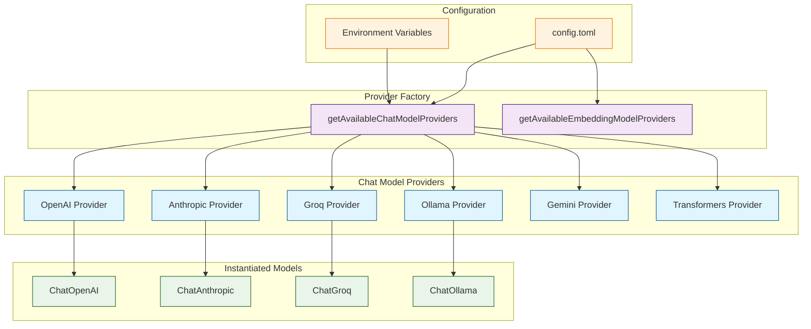
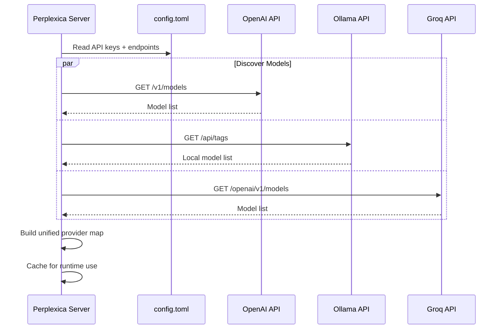

# Chapter 3: AI Integration

Perplexica's intelligence comes from its seamless integration with large language models. This chapter covers every aspect of connecting to AI providers, configuring models, crafting prompts, and optimizing for cost and quality. You will learn how to add new providers, tune generation parameters, and build the prompt chains that transform raw search results into polished, cited answers.

## AI Provider Architecture

Perplexica uses an abstraction layer built on LangChain that allows any supported LLM to be swapped in without changing application logic. The provider system follows a factory pattern.



## Supported AI Providers

### Provider Comparison

| Provider | Models | Strengths | Latency | Privacy | Cost |
|---|---|---|---|---|---|
| OpenAI | GPT-4o, GPT-4o Mini, o3 | Best general quality, function calling | 500-2000ms | Cloud | $$ |
| Anthropic | Claude Opus 4.5, Sonnet 4, Haiku | Long context, nuanced reasoning | 600-2500ms | Cloud | $$ |
| Groq | Llama 3, Mixtral, Gemma | Extremely fast inference | 50-300ms | Cloud | $ |
| Ollama | Any GGUF model | Full privacy, no API costs | 1000-5000ms | Local | Free |
| Google Gemini | Gemini 2.5 Pro, Flash | Multimodal, large context | 400-1500ms | Cloud | $ |
| Transformers | HuggingFace models | Custom fine-tuned models | Varies | Local | Free |

### OpenAI Configuration

```typescript
// src/lib/providers/openai.ts
import { ChatOpenAI } from '@langchain/openai';
import { OpenAIEmbeddings } from '@langchain/openai';

export const loadOpenAIChatModels = async () => {
  const apiKey = getOpenAIApiKey();
  if (!apiKey) return {};

  try {
    // Dynamically fetch available models from OpenAI API
    const response = await fetch('https://api.openai.com/v1/models', {
      headers: { Authorization: `Bearer ${apiKey}` },
    });
    const data = await response.json();

    const chatModels: Record<string, ChatOpenAI> = {};

    // Filter to chat-capable models
    const chatModelIds = data.data
      .filter((m: any) => m.id.startsWith('gpt-') || m.id.startsWith('o'))
      .map((m: any) => m.id);

    for (const modelId of chatModelIds) {
      chatModels[modelId] = new ChatOpenAI({
        openAIApiKey: apiKey,
        modelName: modelId,
        temperature: 0.7,
      });
    }

    return chatModels;
  } catch (err) {
    console.error('Failed to load OpenAI models:', err);
    return {};
  }
};

export const loadOpenAIEmbeddingModels = async () => {
  const apiKey = getOpenAIApiKey();
  if (!apiKey) return {};

  return {
    'text-embedding-3-small': new OpenAIEmbeddings({
      openAIApiKey: apiKey,
      modelName: 'text-embedding-3-small',
    }),
    'text-embedding-3-large': new OpenAIEmbeddings({
      openAIApiKey: apiKey,
      modelName: 'text-embedding-3-large',
    }),
  };
};
```

### Anthropic Configuration

```typescript
// src/lib/providers/anthropic.ts
import { ChatAnthropic } from '@langchain/anthropic';

export const loadAnthropicChatModels = async () => {
  const apiKey = getAnthropicApiKey();
  if (!apiKey) return {};

  return {
    'claude-opus-4-5-20251101': new ChatAnthropic({
      anthropicApiKey: apiKey,
      modelName: 'claude-opus-4-5-20251101',
      temperature: 0.7,
      maxTokens: 4096,
    }),
    'claude-sonnet-4-20250514': new ChatAnthropic({
      anthropicApiKey: apiKey,
      modelName: 'claude-sonnet-4-20250514',
      temperature: 0.7,
      maxTokens: 4096,
    }),
    'claude-3-5-haiku-20241022': new ChatAnthropic({
      anthropicApiKey: apiKey,
      modelName: 'claude-3-5-haiku-20241022',
      temperature: 0.7,
      maxTokens: 4096,
    }),
  };
};
```

### Ollama (Local Models)

```typescript
// src/lib/providers/ollama.ts
import { ChatOllama } from '@langchain/community/chat_models/ollama';
import { OllamaEmbeddings } from '@langchain/community/embeddings/ollama';

export const loadOllamaChatModels = async () => {
  const baseUrl = getOllamaApiEndpoint();
  if (!baseUrl) return {};

  try {
    // Discover locally available models
    const response = await fetch(`${baseUrl}/api/tags`);
    const data = await response.json();

    const models: Record<string, ChatOllama> = {};

    for (const model of data.models) {
      models[model.name] = new ChatOllama({
        baseUrl,
        model: model.name,
        temperature: 0.7,
      });
    }

    return models;
  } catch (err) {
    console.error('Ollama not available:', err);
    return {};
  }
};

export const loadOllamaEmbeddingModels = async () => {
  const baseUrl = getOllamaApiEndpoint();
  if (!baseUrl) return {};

  return {
    'nomic-embed-text': new OllamaEmbeddings({
      baseUrl,
      model: 'nomic-embed-text',
    }),
  };
};
```

## Dynamic Model Discovery

Starting with v1.10, Perplexica fetches available models from each provider at startup rather than maintaining a hardcoded list. This means that when OpenAI releases a new model, Perplexica picks it up automatically.



## Prompt Engineering

### System Prompts by Focus Mode

Each agent uses a carefully crafted system prompt. Below are simplified examples.

```typescript
// src/agents/webSearchAgent.ts -- system prompt (simplified)
const webSearchSystemPrompt = `
You are Perplexica, an AI-powered search engine. You are given a user query
and a set of search results. Your job is to provide a comprehensive,
well-structured answer based on the search results.

Guidelines:
1. Use information ONLY from the provided search results.
2. Cite sources using [number] notation inline, e.g., [1], [2].
3. If search results are insufficient, say so honestly.
4. Provide a direct answer first, then supporting details.
5. Use markdown formatting for readability.
6. If the query is ambiguous, address the most likely interpretation
   and mention alternatives.
`;

// src/agents/academicSearchAgent.ts -- system prompt (simplified)
const academicSearchSystemPrompt = `
You are Perplexica, operating in academic research mode. Given a research
question and search results from academic sources, provide a scholarly
response.

Guidelines:
1. Prioritize peer-reviewed sources and institutional publications.
2. Present findings objectively with proper citations [number].
3. Note any conflicting evidence or ongoing debates.
4. Mention study limitations where relevant.
5. Use formal academic tone.
`;
```

### Prompt Chain Architecture

A typical search query passes through three prompt stages:

| Stage | Purpose | Input | Output |
|---|---|---|---|
| Query Reformulation | Convert conversational query into search-engine-friendly terms | User query + chat history | 3 optimized search strings |
| Source Selection | Determine which search results are most relevant | Search results + original query | Ranked, filtered result set |
| Answer Synthesis | Generate final answer with inline citations | Filtered results + system prompt | Markdown answer with `[n]` citations |

```typescript
// Simplified three-stage chain
import { RunnableSequence } from '@langchain/core/runnables';

const searchAnswerChain = RunnableSequence.from([
  // Stage 1: Reformulate
  reformulationPrompt,
  chatModel,
  parseSearchQueries,

  // Stage 2: Search + filter
  async (queries: string[]) => {
    const raw = await executeSearches(queries);
    return filterByRelevance(raw, originalQuery);
  },

  // Stage 3: Synthesize
  synthesisPrompt,
  chatModel,
  new StringOutputParser(),
]);
```

## Embedding Models and Similarity Search

Perplexica uses embedding models to compute semantic similarity between the user's query and retrieved documents. This powers the re-ranking step that decides which search results are most relevant.

```typescript
// src/lib/computeSimilarity.ts
import { cosineSimilarity } from '@langchain/core/utils/math';

type SimilarityMeasure = 'cosine' | 'dot' | 'euclidean';

function computeSimilarity(
  x: number[],
  y: number[],
  measure: SimilarityMeasure,
): number {
  switch (measure) {
    case 'cosine':
      return cosineSimilarity(x, y);
    case 'dot':
      return dotProduct(x, y);
    case 'euclidean':
      return 1 / (1 + euclideanDistance(x, y));
    default:
      throw new Error(`Unknown similarity measure: ${measure}`);
  }
}

// Usage: re-rank search results by semantic similarity
async function rerankResults(
  query: string,
  results: SearchResult[],
  embeddingModel: Embeddings,
  measure: SimilarityMeasure,
): Promise<SearchResult[]> {
  const queryEmbedding = await embeddingModel.embedQuery(query);
  const docTexts = results.map((r) => r.content);
  const docEmbeddings = await embeddingModel.embedDocuments(docTexts);

  const scored = results.map((result, i) => ({
    ...result,
    similarityScore: computeSimilarity(
      queryEmbedding,
      docEmbeddings[i],
      measure,
    ),
  }));

  return scored.sort((a, b) => b.similarityScore - a.similarityScore);
}
```

## Optimization Techniques

### Response Quality Tuning

```typescript
// Fine-tune generation parameters per use case
const qualityPresets: Record<string, ModelParams> = {
  research: {
    temperature: 0.3,    // Lower for factual accuracy
    maxTokens: 4096,     // Longer for comprehensive answers
    topP: 0.9,
  },
  creative: {
    temperature: 0.8,    // Higher for varied responses
    maxTokens: 2048,
    topP: 0.95,
  },
  quick: {
    temperature: 0.5,
    maxTokens: 512,      // Short and fast
    topP: 0.85,
  },
};
```

### Cost Optimization Strategies

| Strategy | Savings | Trade-off |
|---|---|---|
| Use smaller models for query reformulation | 80-90% on reformulation step | Slightly less nuanced queries |
| Cache LLM responses by query hash | 40-60% on repeated queries | Stale answers for dynamic topics |
| Route simple queries to Groq (fast + cheap) | 70% vs GPT-4 | Lower quality on complex reasoning |
| Use Ollama for development and testing | 100% (free) | Slower, requires local GPU |
| Batch embedding requests | 30-50% on embedding costs | Slight latency increase |

### Error Handling and Fallback

```typescript
// src/lib/providers/index.ts
async function getWorkingChatModel(
  preferredProvider: string,
  preferredModel: string,
): Promise<BaseChatModel> {
  const providers = await getAvailableChatModelProviders();

  // Try preferred provider first
  if (providers[preferredProvider]?.[preferredModel]) {
    return providers[preferredProvider][preferredModel];
  }

  // Fallback chain: try providers in priority order
  const fallbackOrder = ['openai', 'anthropic', 'groq', 'ollama'];

  for (const provider of fallbackOrder) {
    const models = providers[provider];
    if (models && Object.keys(models).length > 0) {
      const firstModel = Object.values(models)[0];
      console.warn(
        `Falling back to ${provider}/${Object.keys(models)[0]}`,
      );
      return firstModel;
    }
  }

  throw new Error('No AI providers available. Check your config.toml.');
}
```

## Adding a New Provider

To add a new LLM provider to Perplexica, follow these steps:

1. **Create a provider file** in `src/lib/providers/`:

```typescript
// src/lib/providers/myProvider.ts
import { ChatOpenAI } from '@langchain/openai';  // or appropriate class

export const loadMyProviderChatModels = async () => {
  const apiKey = getConfigValue('API_KEYS.MY_PROVIDER');
  if (!apiKey) return {};

  return {
    'my-model-v1': new ChatOpenAI({
      configuration: {
        baseURL: 'https://api.myprovider.com/v1',
      },
      openAIApiKey: apiKey,
      modelName: 'my-model-v1',
      temperature: 0.7,
    }),
  };
};
```

2. **Register in the provider index** (`src/lib/providers/index.ts`):

```typescript
import { loadMyProviderChatModels } from './myProvider';

export const getAvailableChatModelProviders = async () => {
  const [openai, anthropic, groq, ollama, myProvider] = await Promise.all([
    loadOpenAIChatModels(),
    loadAnthropicChatModels(),
    loadGroqChatModels(),
    loadOllamaChatModels(),
    loadMyProviderChatModels(),  // Add here
  ]);

  return { openai, anthropic, groq, ollama, myProvider };
};
```

3. **Add configuration** to `config.toml`:

```toml
[API_KEYS]
MY_PROVIDER = "your-api-key-here"
```

## Summary

Perplexica's AI integration layer is designed to be **provider-agnostic and extensible**. Through LangChain abstractions, the system can use any LLM -- from cloud-hosted GPT-4 to a local Ollama model -- without changing the agent logic. Dynamic model discovery, multi-stage prompt chains, and embedding-based re-ranking work together to produce high-quality, cited answers from raw search results.

## Key Takeaways

- **Provider factory pattern** -- models are discovered at startup and registered in a unified map, making provider switching a configuration change.
- **Three-stage prompt chain** -- query reformulation, source selection, and answer synthesis each have dedicated prompts optimized for their specific task.
- **Embedding-based re-ranking** -- semantic similarity scoring ensures the most relevant search results are prioritized in the final answer.
- **Fallback chain** -- if the preferred provider is unavailable, Perplexica automatically falls back through a priority-ordered list of alternatives.
- **Dynamic model discovery** -- new models from providers are picked up automatically without code changes.

## Next Steps

With AI integration understood, the next chapter explores how Perplexica gathers the raw data that feeds these models -- web scraping and data collection.

**Ready for web scraping? Continue to [Chapter 4: Web Scraping and Data Collection](04-web-scraping.md)**

---

*Built with insights from the [Perplexica](https://github.com/ItzCraworCoded/Perplexica) project.*
