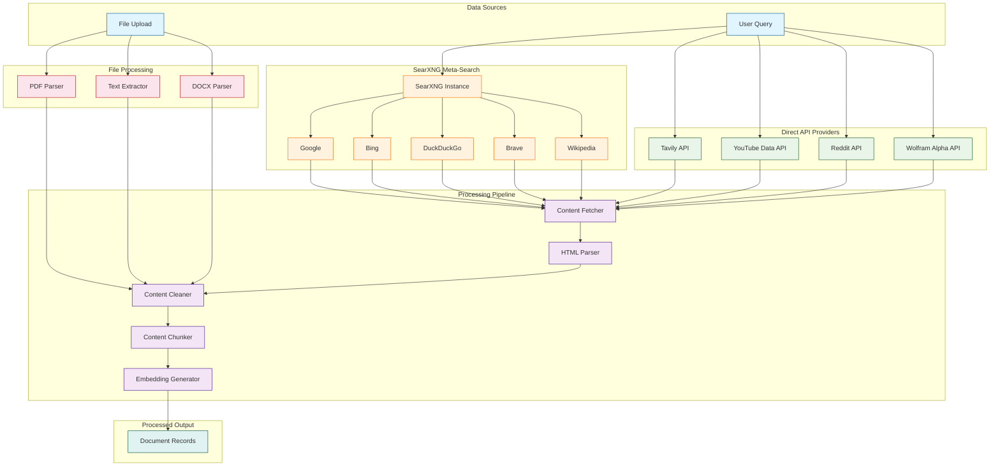
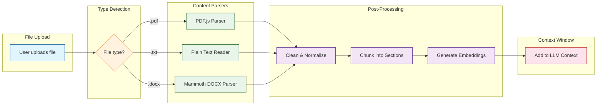
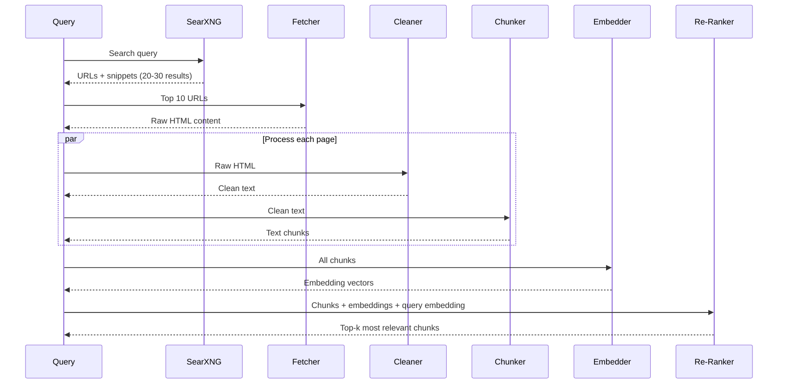

# Chapter 4: Web Scraping and Data Collection

Effective data collection is the foundation of every search answer Perplexica produces. This chapter covers the full pipeline -- from issuing queries to SearXNG, to scraping and parsing individual web pages, to handling file uploads like PDFs and documents. You will learn how each search provider is integrated, how content is extracted and cleaned, and how to add your own data sources.

## Data Collection Architecture

Perplexica collects data through three primary channels: meta-search via SearXNG, direct API calls to specialized search providers, and user-uploaded files. All channels feed into a unified document pipeline.



## SearXNG Integration

SearXNG is Perplexica's primary search backend -- a self-hosted meta-search engine that queries dozens of upstream search providers and returns aggregated results. This gives Perplexica access to multiple search engines without needing individual API keys for each one.

### SearXNG Configuration

```typescript
// src/lib/searxng.ts
interface SearXNGSearchParams {
  q: string;
  format: 'json';
  engines?: string;
  categories?: string;
  language?: string;
  time_range?: 'day' | 'week' | 'month' | 'year' | '';
  safesearch?: 0 | 1 | 2;
  pageno?: number;
}

interface SearXNGResult {
  url: string;
  title: string;
  content: string;
  engine: string;
  score: number;
  category: string;
  publishedDate?: string;
  thumbnail?: string;
  img_src?: string;
}

async function searchSearXNG(
  query: string,
  opts: Partial<SearXNGSearchParams> = {},
): Promise<SearXNGResult[]> {
  const searxngUrl = getSearXNGApiEndpoint();

  const params: SearXNGSearchParams = {
    q: query,
    format: 'json',
    ...opts,
  };

  const url = `${searxngUrl}/search?${new URLSearchParams(
    params as any,
  ).toString()}`;

  const response = await fetch(url);

  if (!response.ok) {
    throw new Error(`SearXNG error: ${response.status}`);
  }

  const data = await response.json();
  return data.results;
}
```

### SearXNG Docker Setup

```yaml
# docker-compose.yaml (SearXNG service)
services:
  searxng:
    image: searxng/searxng:latest
    container_name: perplexica-searxng
    ports:
      - "32768:8080"
    volumes:
      - ./searxng:/etc/searxng
    environment:
      - SEARXNG_BASE_URL=http://localhost:32768/
    restart: unless-stopped

  # Custom SearXNG settings
  # searxng/settings.yml
```

```yaml
# searxng/settings.yml
use_default_settings: true

general:
  debug: false
  instance_name: "Perplexica Search"

search:
  safe_search: 0
  autocomplete: "google"
  default_lang: "en"

engines:
  - name: google
    engine: google
    shortcut: g
    disabled: false
  - name: bing
    engine: bing
    shortcut: b
    disabled: false
  - name: duckduckgo
    engine: duckduckgo
    shortcut: ddg
    disabled: false
  - name: brave
    engine: brave
    shortcut: br
    disabled: false
  - name: wikipedia
    engine: wikipedia
    shortcut: wp
    disabled: false

server:
  port: 8080
  bind_address: "0.0.0.0"
  secret_key: "your-secret-key-here"

outgoing:
  request_timeout: 5.0
  max_request_timeout: 15.0
  pool_connections: 100
  pool_maxsize: 20
```

### Focus Mode to Engine Mapping

Different focus modes use different SearXNG engine configurations.

| Focus Mode | SearXNG Engines | Categories | Special Handling |
|---|---|---|---|
| Web Search | google, bing, duckduckgo, brave | general | Default, broadest coverage |
| Academic | google scholar, semantic scholar, arxiv | science | Filters for .edu, .gov, journals |
| YouTube | youtube | videos | Extracts transcripts via API |
| Reddit | reddit | social media | Filters by subreddit relevance |
| News | google news, bing news | news | Sorts by recency |
| Images | google images, bing images | images | Returns image URLs and thumbnails |

## Web Page Content Fetching

After SearXNG returns URLs, Perplexica fetches and parses the actual page content to provide the LLM with full context rather than just snippets.

```typescript
// src/lib/linkDocument.ts
import axios from 'axios';
import * as cheerio from 'cheerio';
import { htmlToText } from 'html-to-text';

interface LinkDocument {
  url: string;
  title: string;
  content: string;
  metadata: {
    description?: string;
    author?: string;
    publishedDate?: string;
    siteName?: string;
  };
}

async function fetchAndParseUrl(url: string): Promise<LinkDocument> {
  // Fetch with timeout and user-agent
  const response = await axios.get(url, {
    timeout: 10000,
    headers: {
      'User-Agent':
        'Mozilla/5.0 (compatible; Perplexica/1.0; +https://github.com/ItzCrazyKns/Perplexica)',
    },
    maxRedirects: 5,
    responseType: 'text',
  });

  const $ = cheerio.load(response.data);

  // Remove non-content elements
  $('script, style, nav, footer, header, aside, .ad, .sidebar').remove();

  // Extract metadata
  const metadata = {
    description:
      $('meta[name="description"]').attr('content') ||
      $('meta[property="og:description"]').attr('content'),
    author:
      $('meta[name="author"]').attr('content'),
    publishedDate:
      $('meta[property="article:published_time"]').attr('content') ||
      $('time').first().attr('datetime'),
    siteName:
      $('meta[property="og:site_name"]').attr('content'),
  };

  // Extract clean text content
  const content = htmlToText($.html(), {
    wordwrap: false,
    selectors: [
      { selector: 'a', options: { ignoreHref: true } },
      { selector: 'img', format: 'skip' },
    ],
  });

  return {
    url,
    title: $('title').text().trim(),
    content: content.substring(0, 10000), // Limit content length
    metadata,
  };
}
```

### Parallel Content Fetching

```typescript
// Fetch multiple URLs concurrently with error isolation
async function fetchMultipleUrls(
  urls: string[],
  concurrencyLimit: number = 5,
): Promise<LinkDocument[]> {
  const results: LinkDocument[] = [];

  // Process in batches to respect concurrency limits
  for (let i = 0; i < urls.length; i += concurrencyLimit) {
    const batch = urls.slice(i, i + concurrencyLimit);
    const batchResults = await Promise.allSettled(
      batch.map((url) => fetchAndParseUrl(url)),
    );

    for (const result of batchResults) {
      if (result.status === 'fulfilled') {
        results.push(result.value);
      } else {
        console.warn(`Failed to fetch URL: ${result.reason}`);
      }
    }
  }

  return results;
}
```

## File Upload Processing

Starting with v1.9, Perplexica supports direct file uploads (PDF, TXT, DOCX) that can be analyzed alongside web search results.



```typescript
// src/routes/uploads.ts
import multer from 'multer';
import pdfParse from 'pdf-parse';
import mammoth from 'mammoth';

const upload = multer({
  storage: multer.memoryStorage(),
  limits: { fileSize: 10 * 1024 * 1024 }, // 10MB limit
  fileFilter: (_req, file, cb) => {
    const allowed = [
      'application/pdf',
      'text/plain',
      'application/vnd.openxmlformats-officedocument.wordprocessingml.document',
    ];
    cb(null, allowed.includes(file.mimetype));
  },
});

async function parseUploadedFile(
  buffer: Buffer,
  mimetype: string,
): Promise<string> {
  switch (mimetype) {
    case 'application/pdf': {
      const pdf = await pdfParse(buffer);
      return pdf.text;
    }
    case 'text/plain': {
      return buffer.toString('utf-8');
    }
    case 'application/vnd.openxmlformats-officedocument.wordprocessingml.document': {
      const result = await mammoth.extractRawText({ buffer });
      return result.value;
    }
    default:
      throw new Error(`Unsupported file type: ${mimetype}`);
  }
}
```

## Content Cleaning and Normalization

Raw web content is noisy. Perplexica applies several cleaning steps before content enters the LLM context.

```typescript
// src/lib/contentCleaner.ts

function cleanContent(raw: string): string {
  let text = raw;

  // Remove excessive whitespace
  text = text.replace(/\s+/g, ' ');

  // Remove common boilerplate patterns
  const boilerplatePatterns = [
    /cookie\s*(policy|consent|notice)/gi,
    /subscribe\s*to\s*(our|the)\s*newsletter/gi,
    /accept\s*(all\s*)?cookies/gi,
    /privacy\s*policy/gi,
    /terms\s*(of|and)\s*(service|use|conditions)/gi,
    /copyright\s*\d{4}/gi,
    /all\s*rights\s*reserved/gi,
  ];

  for (const pattern of boilerplatePatterns) {
    text = text.replace(pattern, '');
  }

  // Normalize unicode
  text = text.normalize('NFKC');

  // Trim to reasonable length (tokens are ~4 chars)
  const maxChars = 8000;
  if (text.length > maxChars) {
    text = text.substring(0, maxChars) + '...';
  }

  return text.trim();
}
```

### Content Chunking Strategy

For long documents, content is split into chunks that fit within the LLM context window while preserving semantic coherence.

| Chunking Strategy | Chunk Size | Overlap | Best For |
|---|---|---|---|
| Fixed-size | 1000 chars | 200 chars | General web pages |
| Paragraph-based | Variable | 1 paragraph | Articles and blog posts |
| Heading-based | Variable | None | Documentation and wikis |
| Sentence-based | 5-10 sentences | 2 sentences | Academic papers |

```typescript
// src/lib/chunker.ts
function chunkByParagraph(
  text: string,
  maxChunkSize: number = 2000,
): string[] {
  const paragraphs = text.split(/\n\n+/);
  const chunks: string[] = [];
  let current = '';

  for (const para of paragraphs) {
    if ((current + '\n\n' + para).length > maxChunkSize && current) {
      chunks.push(current.trim());
      current = para;
    } else {
      current += (current ? '\n\n' : '') + para;
    }
  }

  if (current.trim()) {
    chunks.push(current.trim());
  }

  return chunks;
}
```

## Ethical Scraping Practices

### Rate Limiting and Politeness

```typescript
// src/lib/rateLimiter.ts
class DomainRateLimiter {
  private lastRequestTime: Map<string, number> = new Map();
  private minDelayMs: number;

  constructor(requestsPerSecond: number = 2) {
    this.minDelayMs = 1000 / requestsPerSecond;
  }

  async waitForSlot(domain: string): Promise<void> {
    const lastTime = this.lastRequestTime.get(domain) || 0;
    const elapsed = Date.now() - lastTime;

    if (elapsed < this.minDelayMs) {
      await sleep(this.minDelayMs - elapsed);
    }

    this.lastRequestTime.set(domain, Date.now());
  }
}

// Robots.txt compliance
async function checkRobotsTxt(url: string): Promise<boolean> {
  const parsedUrl = new URL(url);
  const robotsUrl = `${parsedUrl.origin}/robots.txt`;

  try {
    const response = await fetch(robotsUrl);
    const robotsTxt = await response.text();
    // Parse and check if our user-agent is allowed
    return isUrlAllowed(robotsTxt, url, 'Perplexica');
  } catch {
    return true; // If robots.txt is unavailable, proceed
  }
}
```

### Legal Compliance Checklist

| Requirement | Implementation |
|---|---|
| Respect robots.txt | Check before every fetch request |
| Crawl delay | Minimum 500ms between requests to same domain |
| User-Agent identification | Always send descriptive User-Agent header |
| Content attribution | All sources cited with URL in final answers |
| Rate limiting | Maximum 2 requests/second per domain |
| Timeout handling | 10-second timeout prevents hanging on slow servers |
| Error handling | Graceful degradation on blocked or failed requests |

## Data Processing Pipeline

The complete pipeline from raw query to processed documents follows this sequence.



## Summary

Perplexica's data collection layer is a multi-source pipeline that aggregates search results from SearXNG (which itself queries Google, Bing, DuckDuckGo, and more), fetches and parses the actual web pages, cleans away boilerplate, chunks content for LLM consumption, and optionally processes uploaded files. The system is designed to be polite (rate-limited, robots.txt-aware), resilient (error-isolated, timeout-protected), and extensible (new search providers can be added through SearXNG configuration or direct API integration).

## Key Takeaways

- **SearXNG as the meta-search backbone** -- a single, self-hosted service gives access to dozens of search engines without individual API keys.
- **Full-page content fetching** -- going beyond snippets to parse entire web pages gives the LLM much richer context for answer synthesis.
- **File upload support** -- PDFs, TXT, and DOCX files are parsed and injected into the same document pipeline as web results.
- **Content cleaning is critical** -- removing boilerplate, ads, and navigation noise dramatically improves answer quality.
- **Chunking preserves semantics** -- paragraph-based and heading-based chunking keeps related information together.
- **Ethical scraping** -- rate limiting, robots.txt compliance, and user-agent identification protect both Perplexica and the sites it scrapes.

## Next Steps

With data collection covered, the next chapter explores what happens after the raw content is gathered -- how Perplexica ranks, filters, and synthesizes search results into coherent answers.

**Ready for result processing? Continue to [Chapter 5: Result Processing and Ranking](05-result-processing.md)**

---

*Built with insights from the [Perplexica](https://github.com/ItzCrazyKns/Perplexica) project.*
