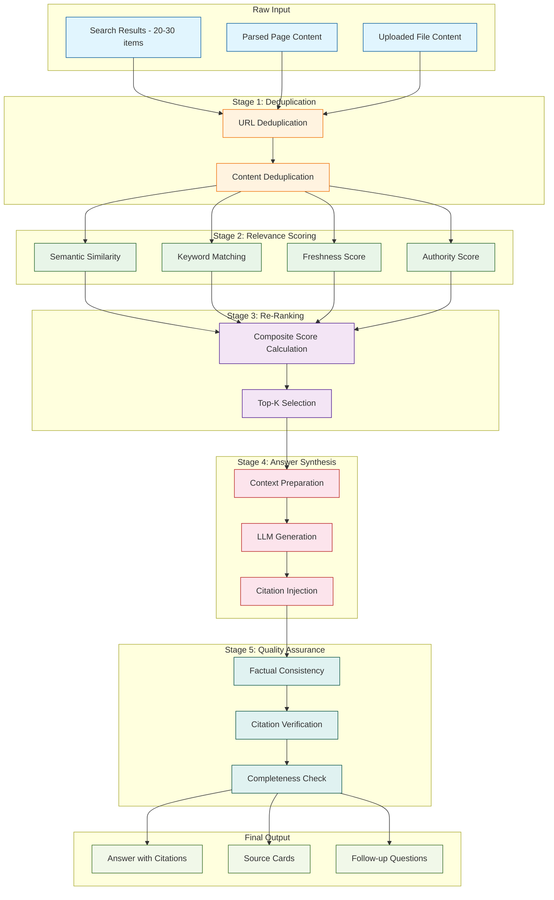

# Chapter 5: Result Processing and Ranking

How Perplexica transforms raw search results into coherent, useful answers is the heart of what makes it an AI search engine rather than just another search aggregator. This chapter covers the full result processing pipeline -- deduplication, relevance scoring, embedding-based re-ranking, answer synthesis with inline citations, and quality assurance. By the end, you will understand how to tune every stage for your specific use case.

## Result Processing Pipeline Overview

After the data collection phase (Chapter 4) delivers raw search results and parsed page content, the result processing pipeline takes over. It transforms noisy, redundant, potentially unreliable data into a single, well-cited answer.



## Stage 1: Deduplication

Search results from multiple engines frequently contain duplicate or near-duplicate entries. Perplexica removes them in two passes.

### URL-Based Deduplication

```typescript
// src/lib/dedup.ts
function deduplicateByUrl(results: SearchResult[]): SearchResult[] {
  const seen = new Map<string, SearchResult>();

  for (const result of results) {
    // Normalize URL: remove trailing slashes, query params, fragments
    const normalized = normalizeUrl(result.url);

    if (!seen.has(normalized)) {
      seen.set(normalized, result);
    } else {
      // Keep the result with the higher search engine score
      const existing = seen.get(normalized)!;
      if (result.score > existing.score) {
        seen.set(normalized, result);
      }
    }
  }

  return Array.from(seen.values());
}

function normalizeUrl(url: string): string {
  try {
    const parsed = new URL(url);
    // Remove common tracking parameters
    const trackingParams = ['utm_source', 'utm_medium', 'utm_campaign', 'ref', 'fbclid'];
    trackingParams.forEach((p) => parsed.searchParams.delete(p));
    // Remove fragment and trailing slash
    parsed.hash = '';
    let path = parsed.pathname.replace(/\/+$/, '') || '/';
    return `${parsed.origin}${path}${parsed.search}`;
  } catch {
    return url;
  }
}
```

### Content-Based Deduplication

Even with different URLs, pages can have nearly identical content (mirrors, syndication, etc.).

```typescript
// src/lib/dedup.ts
function deduplicateByContent(
  results: SearchResult[],
  similarityThreshold: number = 0.92,
): SearchResult[] {
  const unique: SearchResult[] = [];

  for (const result of results) {
    const isDuplicate = unique.some((existing) => {
      const sim = jaccardSimilarity(
        tokenize(existing.content),
        tokenize(result.content),
      );
      return sim > similarityThreshold;
    });

    if (!isDuplicate) {
      unique.push(result);
    }
  }

  return unique;
}

function jaccardSimilarity(a: Set<string>, b: Set<string>): number {
  const intersection = new Set([...a].filter((x) => b.has(x)));
  const union = new Set([...a, ...b]);
  return intersection.size / union.size;
}

function tokenize(text: string): Set<string> {
  return new Set(
    text
      .toLowerCase()
      .split(/\W+/)
      .filter((t) => t.length > 2),
  );
}
```

## Stage 2: Relevance Scoring

After deduplication, each result is scored across four dimensions.

### Scoring Dimensions

| Dimension | Weight | Method | Range |
|---|---|---|---|
| Semantic Similarity | 0.40 | Cosine similarity of query and document embeddings | 0.0 - 1.0 |
| Keyword Match | 0.25 | TF-IDF overlap between query terms and content | 0.0 - 1.0 |
| Freshness | 0.15 | Exponential decay based on publish date | 0.0 - 1.0 |
| Authority | 0.20 | Domain reputation + HTTPS + content depth heuristic | 0.0 - 1.0 |

### Semantic Similarity Scoring

```typescript
// src/lib/scoring.ts
import { Embeddings } from '@langchain/core/embeddings';
import { computeSimilarity } from './computeSimilarity';

async function scoreSemanticSimilarity(
  query: string,
  results: SearchResult[],
  embeddingModel: Embeddings,
  measure: 'cosine' | 'dot' | 'euclidean',
): Promise<Map<string, number>> {
  const queryEmbedding = await embeddingModel.embedQuery(query);

  const contents = results.map((r) => r.content || r.title);
  const docEmbeddings = await embeddingModel.embedDocuments(contents);

  const scores = new Map<string, number>();

  results.forEach((result, i) => {
    const similarity = computeSimilarity(
      queryEmbedding,
      docEmbeddings[i],
      measure,
    );
    scores.set(result.url, similarity);
  });

  return scores;
}
```

### Freshness Scoring

```typescript
// src/lib/scoring.ts
function scoreFreshness(publishedDate: string | undefined): number {
  if (!publishedDate) return 0.5; // Unknown date gets neutral score

  const published = new Date(publishedDate).getTime();
  const now = Date.now();
  const ageInDays = (now - published) / (1000 * 60 * 60 * 24);

  // Exponential decay: half-life of 90 days
  const halfLifeDays = 90;
  return Math.exp((-Math.log(2) * ageInDays) / halfLifeDays);
}
```

### Authority Scoring

```typescript
// src/lib/scoring.ts
const HIGH_AUTHORITY_DOMAINS = new Set([
  'wikipedia.org', 'arxiv.org', 'nature.com', 'science.org',
  'github.com', 'stackoverflow.com', 'docs.python.org',
  'developer.mozilla.org', 'nist.gov', 'nih.gov',
  'reuters.com', 'apnews.com', 'bbc.com',
]);

function scoreAuthority(url: string, content: string): number {
  let score = 0.5; // Base score

  const domain = new URL(url).hostname.replace('www.', '');

  // Domain reputation
  if (HIGH_AUTHORITY_DOMAINS.has(domain)) score += 0.2;
  if (domain.endsWith('.edu')) score += 0.15;
  if (domain.endsWith('.gov')) score += 0.15;

  // HTTPS
  if (url.startsWith('https')) score += 0.05;

  // Content depth heuristic
  const wordCount = content.split(/\s+/).length;
  if (wordCount > 500) score += 0.05;
  if (wordCount > 1500) score += 0.05;

  return Math.min(score, 1.0);
}
```

### Composite Score Calculation

```typescript
// src/lib/scoring.ts
interface ScoringWeights {
  semantic: number;
  keyword: number;
  freshness: number;
  authority: number;
}

const DEFAULT_WEIGHTS: ScoringWeights = {
  semantic: 0.40,
  keyword: 0.25,
  freshness: 0.15,
  authority: 0.20,
};

function computeCompositeScore(
  semanticScore: number,
  keywordScore: number,
  freshnessScore: number,
  authorityScore: number,
  weights: ScoringWeights = DEFAULT_WEIGHTS,
): number {
  return (
    weights.semantic * semanticScore +
    weights.keyword * keywordScore +
    weights.freshness * freshnessScore +
    weights.authority * authorityScore
  );
}
```

## Stage 3: Re-Ranking and Selection

After scoring, results are re-ranked by composite score and the top-k are selected for answer synthesis.

```mermaid
flowchart LR
    subgraph Before["Before Re-Ranking (15 results)"]
        R1["Result A - 0.82"]
        R2["Result B - 0.45"]
        R3["Result C - 0.91"]
        R4["Result D - 0.67"]
        R5["Result E - 0.73"]
    end

    subgraph Rerank["Re-Ranking"]
        SORT[Sort by Composite Score]
        SELECT[Select Top-K = 5-8]
    end

    subgraph After["After Re-Ranking (Top 5)"]
        T1["1. Result C - 0.91"]
        T2["2. Result A - 0.82"]
        T3["3. Result E - 0.73"]
        T4["4. Result D - 0.67"]
        T5["5. Result B - 0.45"]
    end

    Before --> SORT
    SORT --> SELECT
    SELECT --> After

    classDef before fill:#fff3e0,stroke:#ef6c00
    classDef process fill:#f3e5f5,stroke:#4a148c
    classDef after fill:#e8f5e8,stroke:#1b5e20

    class R1,R2,R3,R4,R5 before
    class SORT,SELECT process
    class T1,T2,T3,T4,T5 after
```



```typescript
// src/lib/reranker.ts
interface RankedResult extends SearchResult {
  compositeScore: number;
  semanticScore: number;
  keywordScore: number;
  freshnessScore: number;
  authorityScore: number;
}

async function rerankAndSelect(
  query: string,
  results: SearchResult[],
  embeddingModel: Embeddings,
  topK: number = 6,
): Promise<RankedResult[]> {
  // Compute all score dimensions
  const semanticScores = await scoreSemanticSimilarity(
    query, results, embeddingModel, 'cosine',
  );

  const ranked: RankedResult[] = results.map((result) => {
    const semantic = semanticScores.get(result.url) || 0;
    const keyword = scoreKeywordMatch(query, result.content);
    const freshness = scoreFreshness(result.publishedDate);
    const authority = scoreAuthority(result.url, result.content);

    return {
      ...result,
      semanticScore: semantic,
      keywordScore: keyword,
      freshnessScore: freshness,
      authorityScore: authority,
      compositeScore: computeCompositeScore(
        semantic, keyword, freshness, authority,
      ),
    };
  });

  // Sort descending by composite score and take top-k
  return ranked
    .sort((a, b) => b.compositeScore - a.compositeScore)
    .slice(0, topK);
}
```

## Stage 4: Answer Synthesis

The top-ranked results are assembled into a context window and passed to the LLM for answer generation.

### Context Assembly

```typescript
// src/lib/synthesis.ts
function assembleContext(rankedResults: RankedResult[]): string {
  return rankedResults
    .map((result, index) => {
      return [
        `[${index + 1}] Source: ${result.url}`,
        `Title: ${result.title}`,
        `Content: ${result.content}`,
        `---`,
      ].join('\n');
    })
    .join('\n\n');
}
```

### Answer Generation with Streaming

```typescript
// src/lib/synthesis.ts
import { ChatPromptTemplate } from '@langchain/core/prompts';
import { BaseChatModel } from '@langchain/core/language_models/chat_models';

const synthesisPrompt = ChatPromptTemplate.fromMessages([
  [
    'system',
    `You are Perplexica, an AI search engine. Given search results,
provide a comprehensive answer to the user's question.

Rules:
1. Use ONLY information from the provided search results.
2. Cite sources inline using [number] notation, e.g., [1], [2].
3. Every factual claim MUST have a citation.
4. If results are insufficient, say so honestly.
5. Structure your answer with markdown headings and lists.
6. Be comprehensive but concise.

Search Results:
{context}`,
  ],
  ['human', '{query}'],
]);

async function* generateStreamingAnswer(
  query: string,
  rankedResults: RankedResult[],
  chatModel: BaseChatModel,
): AsyncGenerator<string> {
  const context = assembleContext(rankedResults);

  const chain = synthesisPrompt.pipe(chatModel);

  const stream = await chain.stream({
    query,
    context,
  });

  for await (const chunk of stream) {
    yield chunk.content as string;
  }
}
```

### Citation Format

Perplexica uses numbered inline citations that map to source cards displayed alongside the answer.

| Citation Style | Example | When Used |
|---|---|---|
| Inline numbered | `According to recent studies [1], ...` | Default for all focus modes |
| Multi-source | `This is supported by [1][3][5]` | When multiple sources confirm a fact |
| Quoted | `"exact quote from source" [2]` | For direct quotations |
| Parenthetical | `(Source: [4])` | For supplementary information |

## Stage 5: Quality Assurance

### Follow-up Question Generation

After generating the answer, Perplexica suggests related follow-up questions.

```typescript
// src/lib/followUp.ts
const followUpPrompt = ChatPromptTemplate.fromMessages([
  [
    'system',
    `Based on the user's question and the answer provided, suggest
3 follow-up questions that would help the user explore the topic further.
Return them as a JSON array of strings.

Original question: {query}
Answer summary: {answerSummary}`,
  ],
  ['human', 'Generate follow-up questions.'],
]);

async function generateFollowUpQuestions(
  query: string,
  answer: string,
  chatModel: BaseChatModel,
): Promise<string[]> {
  const chain = followUpPrompt.pipe(chatModel).pipe(new StringOutputParser());

  const result = await chain.invoke({
    query,
    answerSummary: answer.substring(0, 1000),
  });

  try {
    return JSON.parse(result);
  } catch {
    return [];
  }
}
```

### Factual Consistency Check

```typescript
// src/lib/quality.ts
interface QualityReport {
  hasCitations: boolean;
  citationCount: number;
  allCitationsValid: boolean;
  estimatedFactualCoverage: number;
  warnings: string[];
}

function assessAnswerQuality(
  answer: string,
  sourceCount: number,
): QualityReport {
  // Extract citation references [n] from answer
  const citationPattern = /\[(\d+)\]/g;
  const citations = [...answer.matchAll(citationPattern)];
  const uniqueCitations = new Set(citations.map((m) => parseInt(m[1])));

  // Check all citations reference valid sources
  const allValid = [...uniqueCitations].every(
    (n) => n >= 1 && n <= sourceCount,
  );

  // Estimate factual coverage
  const sentences = answer.split(/[.!?]+/).filter((s) => s.trim().length > 20);
  const citedSentences = sentences.filter((s) => /\[\d+\]/.test(s));
  const coverage = sentences.length > 0
    ? citedSentences.length / sentences.length
    : 0;

  const warnings: string[] = [];
  if (coverage < 0.3) warnings.push('Low citation coverage');
  if (!allValid) warnings.push('Invalid citation references found');
  if (uniqueCitations.size < 2) warnings.push('Answer relies on single source');

  return {
    hasCitations: uniqueCitations.size > 0,
    citationCount: uniqueCitations.size,
    allCitationsValid: allValid,
    estimatedFactualCoverage: coverage,
    warnings,
  };
}
```

## Tuning the Pipeline

Different query types benefit from different scoring weights. Here are recommended presets.

| Query Type | Semantic | Keyword | Freshness | Authority | Top-K |
|---|---|---|---|---|---|
| General knowledge | 0.40 | 0.25 | 0.15 | 0.20 | 6 |
| Current events / news | 0.25 | 0.20 | 0.40 | 0.15 | 8 |
| Academic research | 0.35 | 0.20 | 0.10 | 0.35 | 5 |
| Technical / how-to | 0.45 | 0.30 | 0.05 | 0.20 | 5 |
| Opinion / comparative | 0.40 | 0.20 | 0.10 | 0.30 | 8 |

```typescript
// Dynamic weight selection based on focus mode
function getWeightsForFocusMode(mode: FocusMode): ScoringWeights {
  switch (mode) {
    case 'academicSearch':
      return { semantic: 0.35, keyword: 0.20, freshness: 0.10, authority: 0.35 };
    case 'youtubeSearch':
    case 'redditSearch':
      return { semantic: 0.40, keyword: 0.20, freshness: 0.30, authority: 0.10 };
    case 'writingAssistant':
      return { semantic: 0.50, keyword: 0.25, freshness: 0.05, authority: 0.20 };
    default:
      return DEFAULT_WEIGHTS;
  }
}
```

## Summary

Result processing is where Perplexica transforms raw search data into intelligent answers. The five-stage pipeline -- deduplication, relevance scoring, re-ranking, answer synthesis, and quality assurance -- ensures that the final output is accurate, well-cited, and comprehensive. Each stage is modular and configurable, allowing fine-tuning for different query types and use cases.

## Key Takeaways

- **Multi-dimensional scoring** -- semantic similarity, keyword matching, freshness, and authority each contribute to a weighted composite score.
- **Embedding-based re-ranking** -- cosine similarity between query and document embeddings is the strongest signal for relevance.
- **Inline citations are mandatory** -- every factual claim in the answer is traced back to a numbered source, ensuring verifiability.
- **Quality assurance is automated** -- citation coverage and validity are checked programmatically before the answer is delivered.
- **Scoring weights are configurable per focus mode** -- news queries emphasize freshness while academic queries emphasize authority.
- **Follow-up questions** -- the LLM generates contextual follow-up suggestions to keep the research conversation flowing.

## Next Steps

With result processing understood, the next chapter covers how these processed answers are presented to users -- the frontend user interface, component architecture, and real-time streaming display.

**Ready for UI development? Continue to [Chapter 6: User Interface Development](06-user-interface.md)**

---

*Built with insights from the [Perplexica](https://github.com/ItzCrazyKns/Perplexica) project.*
