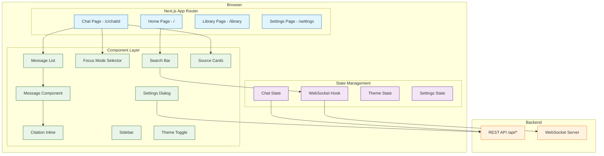
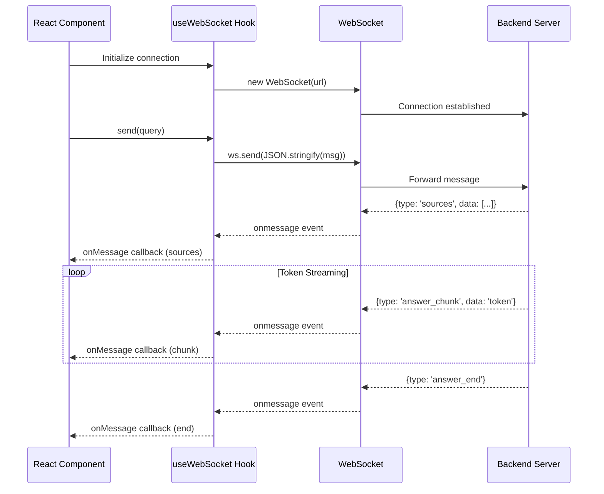
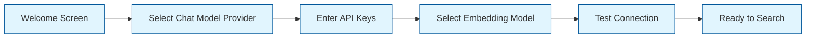

# Chapter 6: User Interface Development

Creating an intuitive and powerful search interface is what makes the difference between a backend search API and a product people actually want to use. This chapter covers Perplexica's frontend architecture -- the Next.js application, React component hierarchy, real-time streaming display, theme system, and responsive design. You will learn how every piece of the UI connects to the backend, how to build new components, and how to customize the look and feel.

## Frontend Architecture Overview

Perplexica's frontend is a Next.js application using the App Router, React, TypeScript, and Tailwind CSS. It communicates with the backend through both REST API endpoints and WebSocket connections for real-time streaming.



## Component Architecture

### Core Component Hierarchy

```
ui/
├── app/
│   ├── layout.tsx           # Root layout with sidebar + theme provider
│   ├── page.tsx             # Home page with search bar
│   ├── c/
│   │   └── [chatId]/
│   │       └── page.tsx     # Chat conversation page
│   ├── library/
│   │   └── page.tsx         # Chat history library
│   └── settings/
│       └── page.tsx         # Settings page (model, provider config)
├── components/
│   ├── Chat.tsx             # Main chat container
│   ├── ChatWindow.tsx       # Message list + input area
│   ├── MessageBox.tsx       # Individual message display
│   ├── MessageSources.tsx   # Source cards grid
│   ├── MessageActions.tsx   # Copy, share, rewrite actions
│   ├── EmptyChat.tsx        # Landing state with suggestions
│   ├── Navbar.tsx           # Top navigation bar
│   ├── Sidebar.tsx          # Collapsible sidebar with history
│   ├── SearchInput.tsx      # Search input with focus mode picker
│   ├── FocusModeSelector.tsx # Focus mode dropdown
│   ├── SettingsDialog.tsx   # Settings modal
│   └── theme/
│       ├── ThemeProvider.tsx # Dark/light theme context
│       └── ThemeToggle.tsx  # Theme switch button
└── lib/
    ├── hooks/
    │   ├── useWebSocket.ts  # WebSocket connection hook
    │   ├── useChat.ts       # Chat state management
    │   └── useTheme.ts      # Theme state hook
    ├── api.ts               # REST API client
    └── types.ts             # Shared TypeScript types
```

### The Chat Window Component

The `ChatWindow` component is the heart of the UI. It manages the message list, handles user input, and coordinates WebSocket communication.

```typescript
// ui/components/ChatWindow.tsx
'use client';

import { useState, useEffect, useRef } from 'react';
import { Message, FocusMode } from '@/lib/types';
import MessageBox from './MessageBox';
import SearchInput from './SearchInput';
import MessageSources from './MessageSources';
import { useWebSocket } from '@/lib/hooks/useWebSocket';

interface ChatWindowProps {
  chatId: string;
  initialMessages: Message[];
}

export default function ChatWindow({
  chatId,
  initialMessages,
}: ChatWindowProps) {
  const [messages, setMessages] = useState<Message[]>(initialMessages);
  const [isStreaming, setIsStreaming] = useState(false);
  const [focusMode, setFocusMode] = useState<FocusMode>('webSearch');
  const messagesEndRef = useRef<HTMLDivElement>(null);
  const ws = useWebSocket();

  // Auto-scroll to bottom when new messages arrive
  useEffect(() => {
    if (messagesEndRef.current) {
      messagesEndRef.current.scrollIntoView({ behavior: 'smooth' });
    }
  }, [messages]);

  const handleSubmit = async (query: string) => {
    // Add user message
    const userMessage: Message = {
      id: crypto.randomUUID(),
      role: 'user',
      content: query,
      createdAt: new Date().toISOString(),
    };

    setMessages((prev) => [...prev, userMessage]);
    setIsStreaming(true);

    // Send via WebSocket for streaming response
    ws.send({
      type: 'query',
      data: {
        query,
        chatId,
        focusMode,
        history: messages,
      },
      messageId: userMessage.id,
    });
  };

  // Handle incoming WebSocket messages
  useEffect(() => {
    if (!ws) return;

    ws.onMessage((msg) => {
      switch (msg.type) {
        case 'sources':
          setMessages((prev) => [
            ...prev,
            {
              id: msg.messageId,
              role: 'assistant',
              content: '',
              sources: msg.data,
              createdAt: new Date().toISOString(),
            },
          ]);
          break;

        case 'answer_chunk':
          setMessages((prev) => {
            const updated = [...prev];
            const last = updated[updated.length - 1];
            if (last && last.role === 'assistant') {
              last.content += msg.data;
            }
            return updated;
          });
          break;

        case 'answer_end':
          setIsStreaming(false);
          break;
      }
    });
  }, [ws]);

  return (
    <div className="flex flex-col h-full">
      <div className="flex-1 overflow-y-auto p-4 space-y-6">
        {messages.map((message) => (
          <div key={message.id}>
            {message.sources && (
              <MessageSources sources={message.sources} />
            )}
            <MessageBox message={message} isStreaming={isStreaming} />
          </div>
        ))}
        <div ref={messagesEndRef} />
      </div>

      <div className="border-t p-4">
        <SearchInput
          onSubmit={handleSubmit}
          focusMode={focusMode}
          onFocusModeChange={setFocusMode}
          disabled={isStreaming}
        />
      </div>
    </div>
  );
}
```

### Source Cards Component

Source cards display the web pages that contributed to the answer, giving users transparency about where information came from.

```typescript
// ui/components/MessageSources.tsx
import { Source } from '@/lib/types';

interface MessageSourcesProps {
  sources: Source[];
}

export default function MessageSources({ sources }: MessageSourcesProps) {
  return (
    <div className="mb-4">
      <h4 className="text-sm font-medium text-gray-500 dark:text-gray-400 mb-2">
        Sources
      </h4>
      <div className="grid grid-cols-2 md:grid-cols-3 lg:grid-cols-4 gap-2">
        {sources.map((source, index) => (
          <a
            key={index}
            href={source.url}
            target="_blank"
            rel="noopener noreferrer"
            className="flex flex-col p-3 rounded-lg border border-gray-200
                       dark:border-gray-700 hover:bg-gray-50
                       dark:hover:bg-gray-800 transition-colors"
          >
            <div className="flex items-center gap-2 mb-1">
              
              <span className="text-xs text-gray-500 truncate">
                {new URL(source.url).hostname}
              </span>
            </div>
            <span className="text-sm font-medium line-clamp-2">
              {source.title}
            </span>
            <span className="text-xs text-blue-600 dark:text-blue-400 mt-1">
              [{index + 1}]
            </span>
          </a>
        ))}
      </div>
    </div>
  );
}
```

### Focus Mode Selector

The focus mode selector lets users choose what kind of search to perform.

```typescript
// ui/components/FocusModeSelector.tsx
import { FocusMode } from '@/lib/types';

interface FocusModeSelectorProps {
  selected: FocusMode;
  onChange: (mode: FocusMode) => void;
}

const FOCUS_MODES: { value: FocusMode; label: string; icon: string; description: string }[] = [
  { value: 'webSearch', label: 'All', icon: 'globe', description: 'Search the entire web' },
  { value: 'academicSearch', label: 'Academic', icon: 'graduation-cap', description: 'Scholarly articles and papers' },
  { value: 'youtubeSearch', label: 'YouTube', icon: 'play', description: 'Video content and tutorials' },
  { value: 'redditSearch', label: 'Reddit', icon: 'message-square', description: 'Community discussions' },
  { value: 'writingAssistant', label: 'Writing', icon: 'pen', description: 'Help with writing tasks' },
  { value: 'wolframAlpha', label: 'Wolfram', icon: 'calculator', description: 'Computational answers' },
];

export default function FocusModeSelector({
  selected,
  onChange,
}: FocusModeSelectorProps) {
  return (
    <div className="flex flex-wrap gap-2">
      {FOCUS_MODES.map((mode) => (
        <button
          key={mode.value}
          onClick={() => onChange(mode.value)}
          className={`px-3 py-1.5 rounded-full text-sm transition-colors ${
            selected === mode.value
              ? 'bg-blue-600 text-white'
              : 'bg-gray-100 dark:bg-gray-800 text-gray-700 dark:text-gray-300 hover:bg-gray-200 dark:hover:bg-gray-700'
          }`}
          title={mode.description}
        >
          {mode.label}
        </button>
      ))}
    </div>
  );
}
```

## WebSocket Integration

The WebSocket hook manages the persistent connection between the frontend and backend, handling reconnection, message parsing, and streaming state.



```typescript
// ui/lib/hooks/useWebSocket.ts
import { useEffect, useRef, useCallback, useState } from 'react';

interface WSMessage {
  type: string;
  data: any;
  messageId: string;
}

export function useWebSocket() {
  const wsRef = useRef<WebSocket | null>(null);
  const [isConnected, setIsConnected] = useState(false);
  const listenersRef = useRef<((msg: WSMessage) => void)[]>([]);
  const reconnectTimeoutRef = useRef<NodeJS.Timeout>();

  const connect = useCallback(() => {
    const protocol = window.location.protocol === 'https:' ? 'wss:' : 'ws:';
    const wsUrl = `${protocol}//${window.location.hostname}:3001/ws`;

    const ws = new WebSocket(wsUrl);

    ws.onopen = () => {
      setIsConnected(true);
      console.log('WebSocket connected');
    };

    ws.onmessage = (event) => {
      const msg: WSMessage = JSON.parse(event.data);
      listenersRef.current.forEach((listener) => listener(msg));
    };

    ws.onclose = () => {
      setIsConnected(false);
      // Auto-reconnect after 3 seconds
      reconnectTimeoutRef.current = setTimeout(connect, 3000);
    };

    ws.onerror = (error) => {
      console.error('WebSocket error:', error);
      ws.close();
    };

    wsRef.current = ws;
  }, []);

  useEffect(() => {
    connect();
    return () => {
      wsRef.current?.close();
      clearTimeout(reconnectTimeoutRef.current);
    };
  }, [connect]);

  const send = useCallback((msg: WSMessage) => {
    if (wsRef.current?.readyState === WebSocket.OPEN) {
      wsRef.current.send(JSON.stringify(msg));
    }
  }, []);

  const onMessage = useCallback((listener: (msg: WSMessage) => void) => {
    listenersRef.current.push(listener);
    return () => {
      listenersRef.current = listenersRef.current.filter(
        (l) => l !== listener,
      );
    };
  }, []);

  return { send, onMessage, isConnected };
}
```

## Theme System

Perplexica supports light and dark themes using Tailwind CSS classes and a React context provider.

```typescript
// ui/components/theme/ThemeProvider.tsx
'use client';

import { createContext, useContext, useEffect, useState } from 'react';

type Theme = 'light' | 'dark' | 'system';

interface ThemeContextType {
  theme: Theme;
  setTheme: (theme: Theme) => void;
  resolvedTheme: 'light' | 'dark';
}

const ThemeContext = createContext<ThemeContextType | undefined>(undefined);

export function ThemeProvider({ children }: { children: React.ReactNode }) {
  const [theme, setTheme] = useState<Theme>('system');
  const [resolvedTheme, setResolvedTheme] = useState<'light' | 'dark'>('light');

  useEffect(() => {
    const stored = localStorage.getItem('theme') as Theme | null;
    if (stored) setTheme(stored);
  }, []);

  useEffect(() => {
    localStorage.setItem('theme', theme);

    const isDark =
      theme === 'dark' ||
      (theme === 'system' &&
        window.matchMedia('(prefers-color-scheme: dark)').matches);

    setResolvedTheme(isDark ? 'dark' : 'light');
    document.documentElement.classList.toggle('dark', isDark);
  }, [theme]);

  return (
    <ThemeContext.Provider value={{ theme, setTheme, resolvedTheme }}>
      {children}
    </ThemeContext.Provider>
  );
}

export const useTheme = () => {
  const context = useContext(ThemeContext);
  if (!context) throw new Error('useTheme must be used within ThemeProvider');
  return context;
};
```

## Responsive Design

Perplexica uses Tailwind CSS breakpoints to adapt the layout for different screen sizes.

| Breakpoint | Width | Layout Changes |
|---|---|---|
| `sm` | >= 640px | Source cards 2-column, sidebar overlay |
| `md` | >= 768px | Source cards 3-column, sidebar visible |
| `lg` | >= 1024px | Source cards 4-column, full sidebar |
| `xl` | >= 1280px | Max-width content area, comfortable spacing |

### Mobile Optimizations

```typescript
// ui/components/Sidebar.tsx (responsive behavior)
export default function Sidebar() {
  const [isOpen, setIsOpen] = useState(false);

  return (
    <>
      {/* Mobile overlay */}
      {isOpen && (
        <div
          className="fixed inset-0 bg-black/50 z-40 md:hidden"
          onClick={() => setIsOpen(false)}
        />
      )}

      {/* Sidebar */}
      <aside
        className={`fixed md:static inset-y-0 left-0 z-50 w-72
          transform transition-transform duration-200 ease-in-out
          ${isOpen ? 'translate-x-0' : '-translate-x-full md:translate-x-0'}
          bg-white dark:bg-gray-900 border-r dark:border-gray-800`}
      >
        <div className="flex flex-col h-full p-4">
          <button
            onClick={() => {/* new chat */}}
            className="w-full p-3 rounded-lg bg-blue-600 text-white
                       hover:bg-blue-700 transition-colors mb-4"
          >
            New Search
          </button>

          <div className="flex-1 overflow-y-auto space-y-1">
            {/* Chat history items */}
          </div>

          <div className="border-t pt-4 mt-4">
            <button className="w-full p-2 rounded-lg hover:bg-gray-100
                             dark:hover:bg-gray-800 transition-colors">
              Settings
            </button>
          </div>
        </div>
      </aside>
    </>
  );
}
```

## Setup Wizard (v1.11)

Starting with v1.11, Perplexica includes a guided setup wizard that runs on first launch. It walks users through model selection and API key configuration.



```typescript
// ui/components/SetupWizard.tsx
'use client';

import { useState } from 'react';

type WizardStep = 'welcome' | 'provider' | 'apiKeys' | 'embedding' | 'test' | 'done';

export default function SetupWizard() {
  const [step, setStep] = useState<WizardStep>('welcome');
  const [config, setConfig] = useState({
    chatModelProvider: '',
    chatModel: '',
    embeddingModelProvider: '',
    embeddingModel: '',
    apiKeys: {} as Record<string, string>,
  });

  const handleSaveConfig = async () => {
    const response = await fetch('/api/config', {
      method: 'POST',
      headers: { 'Content-Type': 'application/json' },
      body: JSON.stringify(config),
    });

    if (response.ok) {
      setStep('done');
    }
  };

  // Step rendering logic...
  return (
    <div className="fixed inset-0 bg-white dark:bg-gray-900 z-50
                    flex items-center justify-center">
      <div className="max-w-lg w-full p-8">
        {step === 'welcome' && (
          <div className="text-center">
            <h1 className="text-3xl font-bold mb-4">
              Welcome to Perplexica
            </h1>
            <p className="text-gray-600 dark:text-gray-400 mb-8">
              Let us set up your AI search engine in a few steps.
            </p>
            <button
              onClick={() => setStep('provider')}
              className="px-6 py-3 bg-blue-600 text-white rounded-lg"
            >
              Get Started
            </button>
          </div>
        )}
        {/* Additional steps... */}
      </div>
    </div>
  );
}
```

## Markdown Rendering with Citations

Perplexica renders AI answers as Markdown with special handling for inline citations (`[1]`, `[2]`, etc.) that link to source cards.

```typescript
// ui/components/MessageBox.tsx
import ReactMarkdown from 'react-markdown';
import remarkGfm from 'remark-gfm';

interface MessageBoxProps {
  message: Message;
  isStreaming: boolean;
}

export default function MessageBox({ message, isStreaming }: MessageBoxProps) {
  // Replace citation references with clickable links
  const processedContent = message.content.replace(
    /\[(\d+)\]/g,
    (match, num) => {
      const source = message.sources?.[parseInt(num) - 1];
      if (source) {
        return `[${num}](${source.url} "${source.title}")`;
      }
      return match;
    },
  );

  return (
    <div
      className={`prose dark:prose-invert max-w-none ${
        message.role === 'user' ? 'bg-blue-50 dark:bg-blue-900/20 p-4 rounded-lg' : ''
      }`}
    >
      {message.role === 'user' ? (
        <p className="font-medium">{message.content}</p>
      ) : (
        <ReactMarkdown remarkPlugins={[remarkGfm]}>
          {processedContent}
        </ReactMarkdown>
      )}

      {isStreaming && message.role === 'assistant' && (
        <span className="inline-block w-2 h-5 bg-blue-600 animate-pulse ml-1" />
      )}
    </div>
  );
}
```

## Summary

Perplexica's frontend is a modern Next.js application that combines real-time WebSocket streaming, a component-based architecture, and responsive design to deliver an intuitive search experience. The UI layer handles everything from the initial query input and focus mode selection through to streaming answer display with inline citations and interactive source cards. The theme system, setup wizard, and settings dialog ensure that users can configure and personalize their experience without touching configuration files.

## Key Takeaways

- **WebSocket-first communication** -- queries and answers flow through a persistent WebSocket connection, enabling real-time token-by-token streaming.
- **Component modularity** -- each piece of the UI (source cards, message bubbles, focus mode selector, sidebar) is an independent React component that can be styled and extended independently.
- **Streaming UX** -- sources appear first (giving immediate feedback), then the answer streams in character by character with a blinking cursor indicator.
- **Dark/light theme** -- Tailwind CSS `dark:` variants combined with a React context provider make theme switching seamless.
- **Mobile-responsive** -- the sidebar collapses to an overlay, source card grids adapt, and touch targets are appropriately sized for mobile use.
- **Setup wizard** -- first-time users are guided through provider and model selection, removing the need to manually edit configuration files.

## Next Steps

The UI is the user's window into Perplexica's capabilities. The next chapter explores the advanced features that build on this foundation -- conversation management, file uploads, API access, and analytics.

**Ready for advanced features? Continue to [Chapter 7: Advanced Features](07-advanced-features.md)**

---

*Built with insights from the [Perplexica](https://github.com/ItzCraworCoded/Perplexica) project.*
