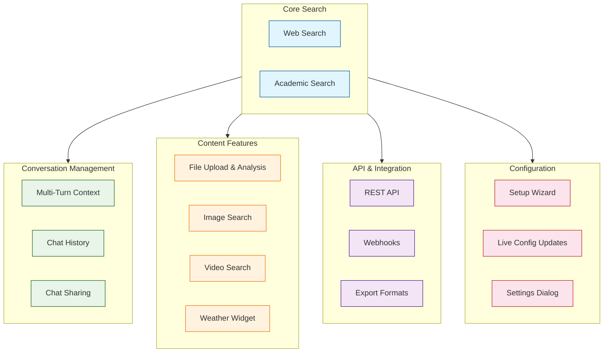
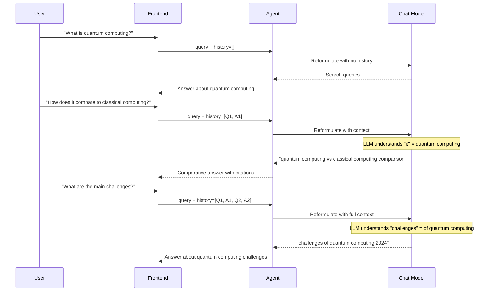
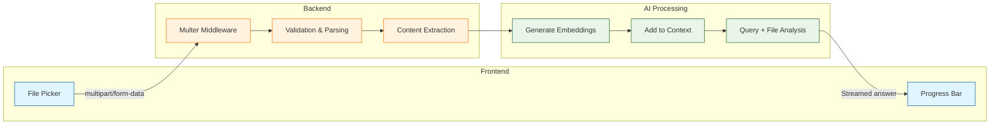
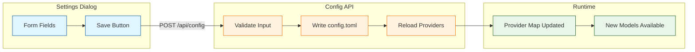

# Chapter 7: Advanced Features

Perplexica goes beyond basic search with a rich set of advanced features: multi-turn conversation management, file uploads for document analysis, a REST API for programmatic access, image and video search, and a weather widget. This chapter explores each feature in depth, showing how it is implemented and how you can extend it for your own use cases.

## Feature Overview



## Multi-Turn Conversation Management

Perplexica maintains conversation context across multiple turns, allowing users to ask follow-up questions without repeating the full context. This is powered by injecting the conversation history into the LLM prompt.

### How Context Flows Through Turns



### Conversation History Storage

```typescript
// src/db/schema.ts
import { sqliteTable, text } from 'drizzle-orm/sqlite-core';

export const chats = sqliteTable('chats', {
  id: text('id').primaryKey(),
  title: text('title').notNull(),
  createdAt: text('created_at').notNull(),
  focusMode: text('focus_mode').notNull(),
});

export const messages = sqliteTable('messages', {
  id: text('id').primaryKey(),
  chatId: text('chat_id').references(() => chats.id),
  role: text('role').notNull(),       // 'user' | 'assistant'
  content: text('content').notNull(),
  sources: text('sources'),            // JSON array of source objects
  createdAt: text('created_at').notNull(),
});
```

### Chat History API

```typescript
// src/routes/chats.ts
import { Router } from 'express';
import { eq, desc } from 'drizzle-orm';
import { db } from '../db';
import { chats, messages } from '../db/schema';

const router = Router();

// List all chats, newest first
router.get('/chats', async (_req, res) => {
  const allChats = await db
    .select()
    .from(chats)
    .orderBy(desc(chats.createdAt));

  res.json({ chats: allChats });
});

// Get a specific chat with all messages
router.get('/chats/:id', async (req, res) => {
  const chat = await db
    .select()
    .from(chats)
    .where(eq(chats.id, req.params.id))
    .limit(1);

  if (chat.length === 0) {
    return res.status(404).json({ error: 'Chat not found' });
  }

  const chatMessages = await db
    .select()
    .from(messages)
    .where(eq(messages.chatId, req.params.id))
    .orderBy(messages.createdAt);

  res.json({
    chat: chat[0],
    messages: chatMessages.map((m) => ({
      ...m,
      sources: m.sources ? JSON.parse(m.sources) : [],
    })),
  });
});

// Delete a chat and its messages
router.delete('/chats/:id', async (req, res) => {
  await db.delete(messages).where(eq(messages.chatId, req.params.id));
  await db.delete(chats).where(eq(chats.id, req.params.id));
  res.json({ success: true });
});

export default router;
```

## File Upload and Document Analysis

Starting with v1.9, users can upload PDF, TXT, and DOCX files for AI-powered analysis. The uploaded content is processed and added to the LLM context alongside web search results.

### Upload Flow



```typescript
// src/routes/uploads.ts
import { Router } from 'express';
import multer from 'multer';
import pdfParse from 'pdf-parse';
import mammoth from 'mammoth';

const router = Router();

const upload = multer({
  storage: multer.memoryStorage(),
  limits: { fileSize: 10 * 1024 * 1024 }, // 10MB max
  fileFilter: (_req, file, cb) => {
    const allowed = [
      'application/pdf',
      'text/plain',
      'application/vnd.openxmlformats-officedocument.wordprocessingml.document',
    ];
    if (allowed.includes(file.mimetype)) {
      cb(null, true);
    } else {
      cb(new Error(`Unsupported file type: ${file.mimetype}`));
    }
  },
});

router.post('/upload', upload.single('file'), async (req, res) => {
  if (!req.file) {
    return res.status(400).json({ error: 'No file uploaded' });
  }

  try {
    let content: string;

    switch (req.file.mimetype) {
      case 'application/pdf': {
        const pdf = await pdfParse(req.file.buffer);
        content = pdf.text;
        break;
      }
      case 'text/plain': {
        content = req.file.buffer.toString('utf-8');
        break;
      }
      case 'application/vnd.openxmlformats-officedocument.wordprocessingml.document': {
        const result = await mammoth.extractRawText({
          buffer: req.file.buffer,
        });
        content = result.value;
        break;
      }
      default:
        return res.status(400).json({ error: 'Unsupported file type' });
    }

    res.json({
      fileName: req.file.originalname,
      fileSize: req.file.size,
      contentLength: content.length,
      content: content.substring(0, 50000), // Cap at 50K chars
    });
  } catch (error) {
    res.status(500).json({ error: 'Failed to parse file' });
  }
});

export default router;
```

### Supported File Types

| File Type | Parser | Max Size | Content Extraction |
|---|---|---|---|
| PDF (.pdf) | pdf-parse | 10MB | Full text extraction including multi-page |
| Plain Text (.txt) | Native Buffer | 10MB | Direct UTF-8 reading |
| DOCX (.docx) | mammoth | 10MB | Text extraction, ignores formatting |

## REST API for Programmatic Access

Perplexica exposes a REST API that mirrors the functionality of the web UI, enabling programmatic search from scripts, bots, or third-party applications.

### API Endpoints

| Endpoint | Method | Description |
|---|---|---|
| `/api/search` | POST | Execute a search query and get results |
| `/api/chats` | GET | List all chat conversations |
| `/api/chats/:id` | GET | Get a specific chat with messages |
| `/api/chats/:id` | DELETE | Delete a chat |
| `/api/config` | GET | Get current configuration |
| `/api/config` | POST | Update configuration |
| `/api/models` | GET | List available models by provider |
| `/api/upload` | POST | Upload a file for analysis |

### Search API Usage

```bash
# Execute a search query
curl -X POST http://localhost:3001/api/search \
  -H "Content-Type: application/json" \
  -d '{
    "query": "What are the latest developments in AI?",
    "focusMode": "webSearch",
    "chatModel": {
      "provider": "openai",
      "model": "gpt-4o"
    },
    "embeddingModel": {
      "provider": "openai",
      "model": "text-embedding-3-small"
    }
  }'
```

**Response:**

```json
{
  "message": "Artificial intelligence has seen significant developments...[1][2]",
  "sources": [
    {
      "title": "AI Developments 2025 - Nature",
      "url": "https://nature.com/articles/ai-2025",
      "content": "Recent breakthroughs in..."
    },
    {
      "title": "State of AI Report",
      "url": "https://stateofai.com/report",
      "content": "The annual State of AI..."
    }
  ],
  "followUpQuestions": [
    "What specific AI breakthroughs occurred in healthcare?",
    "How has AI regulation evolved recently?",
    "What are the leading AI research labs working on?"
  ]
}
```

### Search API Implementation

```typescript
// src/routes/search.ts
import { Router } from 'express';

const router = Router();

router.post('/search', async (req, res) => {
  try {
    const {
      query,
      focusMode = 'webSearch',
      chatModel,
      embeddingModel,
      history = [],
    } = req.body;

    // Validate required fields
    if (!query) {
      return res.status(400).json({ error: 'Query is required' });
    }

    // Get the appropriate chat and embedding models
    const chat = await getChatModel(chatModel.provider, chatModel.model);
    const embedding = await getEmbeddingModel(
      embeddingModel.provider,
      embeddingModel.model,
    );

    // Route to the appropriate agent
    const agent = getAgentForFocusMode(focusMode);
    const result = await agent.invoke({
      query,
      history,
      chatModel: chat,
      embeddingModel: embedding,
    });

    res.json({
      message: result.answer,
      sources: result.sources,
      followUpQuestions: result.followUpQuestions,
    });
  } catch (error) {
    console.error('Search API error:', error);
    res.status(500).json({ error: 'Search failed' });
  }
});

export default router;
```

## Image and Video Search

Perplexica can search for images and videos related to a query using dedicated SearXNG categories.

### Image Search Agent

```typescript
// src/agents/imageSearchAgent.ts
async function searchImages(
  query: string,
): Promise<ImageResult[]> {
  const results = await searchSearXNG(query, {
    categories: 'images',
    engines: 'google images,bing images',
  });

  return results.map((r) => ({
    url: r.img_src || r.url,
    thumbnailUrl: r.thumbnail || r.img_src,
    title: r.title,
    sourceUrl: r.url,
    engine: r.engine,
  }));
}

interface ImageResult {
  url: string;
  thumbnailUrl: string;
  title: string;
  sourceUrl: string;
  engine: string;
}
```

### Video Search Agent

```typescript
// src/agents/videoSearchAgent.ts
async function searchVideos(
  query: string,
): Promise<VideoResult[]> {
  const results = await searchSearXNG(query, {
    categories: 'videos',
    engines: 'youtube,dailymotion',
  });

  return results.map((r) => ({
    url: r.url,
    title: r.title,
    description: r.content,
    thumbnail: r.thumbnail,
    engine: r.engine,
    duration: r.duration,
  }));
}
```

## Weather Widget

Perplexica includes a weather widget that activates when the user asks weather-related questions, providing geolocation-aware forecasts with customizable unit preferences.

```typescript
// src/routes/weather.ts
import { Router } from 'express';

const router = Router();

interface WeatherData {
  location: string;
  temperature: number;
  unit: 'celsius' | 'fahrenheit';
  condition: string;
  humidity: number;
  windSpeed: number;
  forecast: DayForecast[];
}

interface DayForecast {
  day: string;
  high: number;
  low: number;
  condition: string;
}

router.get('/weather', async (req, res) => {
  const { lat, lon, units = 'metric' } = req.query;

  if (!lat || !lon) {
    return res.status(400).json({ error: 'Latitude and longitude required' });
  }

  try {
    const apiKey = getConfigValue('API_KEYS.WEATHER');
    const response = await fetch(
      `https://api.openweathermap.org/data/2.5/forecast?lat=${lat}&lon=${lon}&units=${units}&appid=${apiKey}`,
    );

    const data = await response.json();

    const weather: WeatherData = {
      location: data.city.name,
      temperature: Math.round(data.list[0].main.temp),
      unit: units === 'metric' ? 'celsius' : 'fahrenheit',
      condition: data.list[0].weather[0].description,
      humidity: data.list[0].main.humidity,
      windSpeed: Math.round(data.list[0].wind.speed),
      forecast: extractDailyForecast(data.list),
    };

    res.json(weather);
  } catch (error) {
    res.status(500).json({ error: 'Weather data unavailable' });
  }
});

export default router;
```

## Live Configuration Updates

Starting with v1.11, configuration changes take effect immediately without restarting the server.



```typescript
// src/routes/config.ts
import { Router } from 'express';
import fs from 'fs';
import toml from '@iarna/toml';
import { loadConfig } from '../config';

const router = Router();

// Get current config (redact API keys)
router.get('/config', async (_req, res) => {
  const config = loadConfig();

  // Redact API keys for security
  const redacted = { ...config };
  if (redacted.API_KEYS) {
    for (const key of Object.keys(redacted.API_KEYS)) {
      const value = redacted.API_KEYS[key];
      if (value && value.length > 8) {
        redacted.API_KEYS[key] = value.substring(0, 4) + '...' + value.slice(-4);
      }
    }
  }

  res.json(redacted);
});

// Update config and reload providers
router.post('/config', async (req, res) => {
  try {
    const newConfig = req.body;

    // Validate required fields
    if (!newConfig.API_ENDPOINTS?.SEARXNG) {
      return res.status(400).json({
        error: 'SearXNG endpoint is required',
      });
    }

    // Write updated config
    const tomlString = toml.stringify(newConfig);
    fs.writeFileSync('config.toml', tomlString, 'utf-8');

    // Reload providers with new config
    await reloadAllProviders();

    res.json({ success: true, message: 'Configuration updated' });
  } catch (error) {
    res.status(500).json({ error: 'Failed to update configuration' });
  }
});

export default router;
```

## Data Export

Perplexica supports exporting chat conversations in multiple formats for use in research tools and documentation.

| Format | Use Case | Content Included |
|---|---|---|
| JSON | Programmatic processing | Full message data + sources + metadata |
| Markdown | Documentation and notes | Formatted Q&A with citation links |
| PDF | Formal reports | Styled document with sources appendix |
| BibTeX | Academic citation | Source references in BibTeX format |

```typescript
// src/routes/export.ts
import { Router } from 'express';

const router = Router();

router.get('/chats/:id/export', async (req, res) => {
  const { format = 'json' } = req.query;
  const chatData = await getChatWithMessages(req.params.id);

  switch (format) {
    case 'json':
      res.json(chatData);
      break;

    case 'markdown': {
      const md = chatToMarkdown(chatData);
      res.setHeader('Content-Type', 'text/markdown');
      res.setHeader(
        'Content-Disposition',
        `attachment; filename="${chatData.chat.title}.md"`,
      );
      res.send(md);
      break;
    }

    case 'bibtex': {
      const bib = sourcesToBibTeX(chatData.messages);
      res.setHeader('Content-Type', 'application/x-bibtex');
      res.setHeader(
        'Content-Disposition',
        `attachment; filename="${chatData.chat.title}.bib"`,
      );
      res.send(bib);
      break;
    }

    default:
      res.status(400).json({ error: `Unsupported format: ${format}` });
  }
});

function chatToMarkdown(chatData: any): string {
  let md = `# ${chatData.chat.title}\n\n`;
  md += `*Created: ${chatData.chat.createdAt}*\n\n---\n\n`;

  for (const msg of chatData.messages) {
    if (msg.role === 'user') {
      md += `## Question\n\n${msg.content}\n\n`;
    } else {
      md += `## Answer\n\n${msg.content}\n\n`;
      if (msg.sources?.length) {
        md += `### Sources\n\n`;
        msg.sources.forEach((s: any, i: number) => {
          md += `${i + 1}. [${s.title}](${s.url})\n`;
        });
        md += '\n';
      }
    }
  }

  return md;
}

export default router;
```

## Summary

Perplexica's advanced features transform it from a simple search interface into a comprehensive research platform. Multi-turn conversations with context preservation let users explore topics naturally. File uploads bring document analysis alongside web search. The REST API enables programmatic integration. Image and video search, the weather widget, and data export round out a feature set designed for serious research and everyday use alike. Live configuration updates and the setup wizard ensure that managing the system is as smooth as using it.

## Key Takeaways

- **Conversation context** -- previous messages are injected into the LLM prompt so follow-up questions resolve pronouns and references correctly.
- **File uploads** -- PDF, TXT, and DOCX files are parsed and added to the LLM context alongside web search results.
- **REST API** -- every feature available in the UI is also available programmatically via the `/api/*` endpoints.
- **Image and video search** -- dedicated SearXNG categories and result types enable media-specific searches.
- **Live configuration** -- API keys, model selections, and endpoints can be changed at runtime without server restart.
- **Data export** -- conversations can be exported as JSON, Markdown, or BibTeX for integration with other tools.

## Next Steps

With all features explored, the final chapter covers the operational side -- how to deploy Perplexica in production with Docker, configure monitoring, manage security, and optimize costs at scale.

**Ready for production deployment? Continue to [Chapter 8: Production Deployment](08-production-deployment.md)**

---

*Built with insights from the [Perplexica](https://github.com/ItzCraworCoded/Perplexica) project.*
