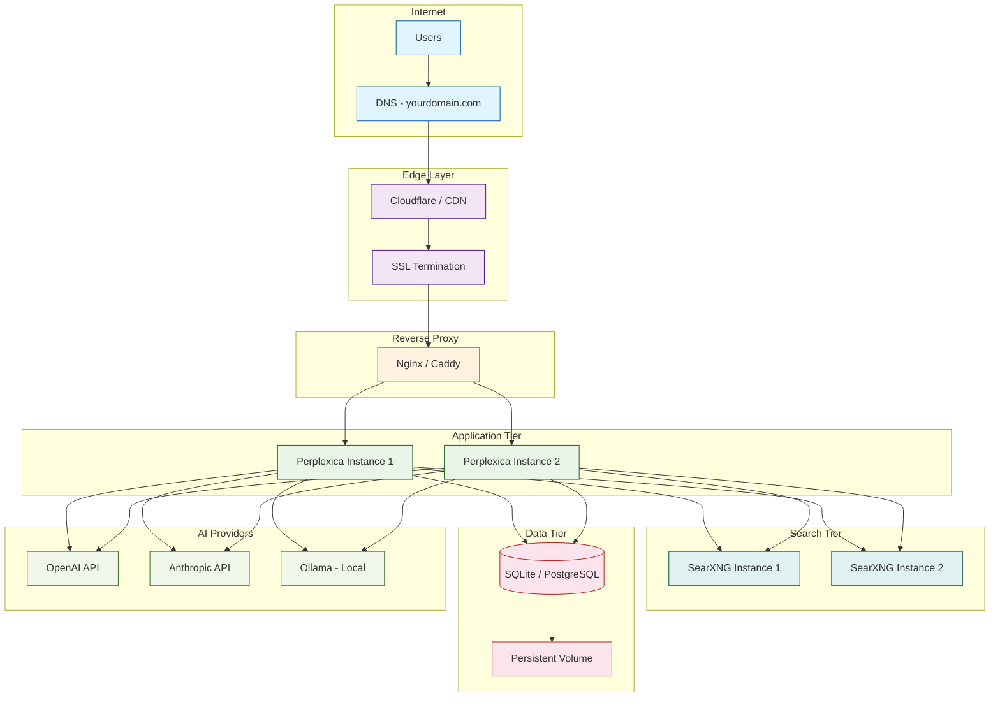
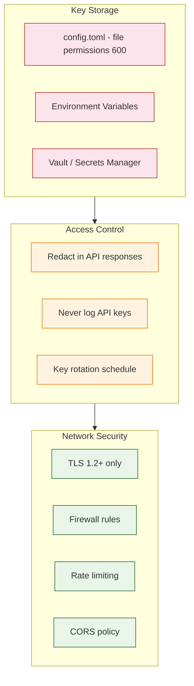
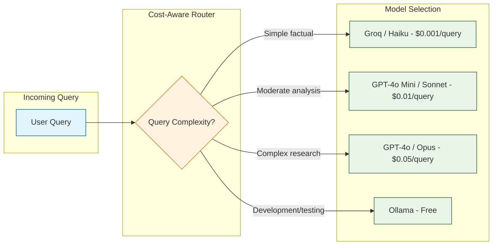

# Chapter 8: Production Deployment

Deploying Perplexica for production use requires careful planning across infrastructure, security, monitoring, and cost management. This chapter covers everything from single-command Docker deployment to multi-instance scaling with load balancing, SSL termination, API key security, observability, and cost optimization. By the end, you will have a production-ready deployment playbook.

## Deployment Architecture



## Docker Deployment

### Single-Command Quick Start

Starting with v1.11, Perplexica supports single-command Docker deployment without cloning the full repository.

```bash
# Quick start with Docker Compose (no repo clone needed)
docker run -d \
  --name perplexica \
  -p 3000:3000 \
  -p 3001:3001 \
  -v perplexica-data:/app/data \
  -v perplexica-config:/app/config \
  itzcrazykns/perplexica:latest
```

### Full Docker Compose Setup

```yaml
# docker-compose.yaml
version: '3.8'

services:
  perplexica-frontend:
    image: itzcrazykns/perplexica-frontend:latest
    build:
      context: ./ui
      dockerfile: Dockerfile
    ports:
      - "3000:3000"
    environment:
      - NEXT_PUBLIC_API_URL=http://perplexica-backend:3001
      - NEXT_PUBLIC_WS_URL=ws://perplexica-backend:3001
    depends_on:
      - perplexica-backend
    restart: unless-stopped
    networks:
      - perplexica-net

  perplexica-backend:
    image: itzcrazykns/perplexica-backend:latest
    build:
      context: .
      dockerfile: Dockerfile
    ports:
      - "3001:3001"
    volumes:
      - perplexica-data:/app/data
      - ./config.toml:/app/config.toml
    environment:
      - NODE_ENV=production
      - PORT=3001
    depends_on:
      - searxng
    restart: unless-stopped
    networks:
      - perplexica-net

  searxng:
    image: searxng/searxng:latest
    container_name: perplexica-searxng
    ports:
      - "32768:8080"
    volumes:
      - ./searxng:/etc/searxng
    environment:
      - SEARXNG_BASE_URL=http://localhost:32768/
    restart: unless-stopped
    networks:
      - perplexica-net

volumes:
  perplexica-data:
    driver: local

networks:
  perplexica-net:
    driver: bridge
```

### Production Dockerfile

```dockerfile
# Dockerfile (backend)
FROM node:20-alpine AS builder

WORKDIR /app

# Install dependencies
COPY package.json yarn.lock ./
RUN yarn install --frozen-lockfile --production=false

# Build application
COPY . .
RUN yarn build

# Production image
FROM node:20-alpine AS runner

WORKDIR /app

# Copy built application
COPY --from=builder /app/dist ./dist
COPY --from=builder /app/node_modules ./node_modules
COPY --from=builder /app/package.json ./

# Create data directory
RUN mkdir -p /app/data

# Non-root user for security
RUN addgroup --system --gid 1001 perplexica && \
    adduser --system --uid 1001 perplexica && \
    chown -R perplexica:perplexica /app

USER perplexica

EXPOSE 3001

HEALTHCHECK --interval=30s --timeout=5s --start-period=10s \
  CMD wget --no-verbose --tries=1 --spider http://localhost:3001/api/health || exit 1

CMD ["node", "dist/index.js"]
```

## Reverse Proxy Configuration

### Nginx Configuration

```nginx
# /etc/nginx/sites-available/perplexica.conf
upstream perplexica_backend {
    server 127.0.0.1:3001;
    # Add more instances for load balancing:
    # server 127.0.0.1:3002;
    # server 127.0.0.1:3003;
}

upstream perplexica_frontend {
    server 127.0.0.1:3000;
}

server {
    listen 80;
    server_name search.yourdomain.com;
    return 301 https://$server_name$request_uri;
}

server {
    listen 443 ssl http2;
    server_name search.yourdomain.com;

    ssl_certificate /etc/letsencrypt/live/search.yourdomain.com/fullchain.pem;
    ssl_certificate_key /etc/letsencrypt/live/search.yourdomain.com/privkey.pem;

    # SSL hardening
    ssl_protocols TLSv1.2 TLSv1.3;
    ssl_ciphers ECDHE-ECDSA-AES128-GCM-SHA256:ECDHE-RSA-AES128-GCM-SHA256;
    ssl_prefer_server_ciphers off;
    ssl_session_cache shared:SSL:10m;

    # Security headers
    add_header X-Frame-Options "SAMEORIGIN" always;
    add_header X-Content-Type-Options "nosniff" always;
    add_header X-XSS-Protection "1; mode=block" always;
    add_header Strict-Transport-Security "max-age=31536000; includeSubDomains" always;

    # Frontend
    location / {
        proxy_pass http://perplexica_frontend;
        proxy_set_header Host $host;
        proxy_set_header X-Real-IP $remote_addr;
        proxy_set_header X-Forwarded-For $proxy_add_x_forwarded_for;
        proxy_set_header X-Forwarded-Proto $scheme;
    }

    # Backend API
    location /api/ {
        proxy_pass http://perplexica_backend;
        proxy_set_header Host $host;
        proxy_set_header X-Real-IP $remote_addr;
        proxy_set_header X-Forwarded-For $proxy_add_x_forwarded_for;

        # Rate limiting
        limit_req zone=api burst=20 nodelay;
    }

    # WebSocket
    location /ws {
        proxy_pass http://perplexica_backend;
        proxy_http_version 1.1;
        proxy_set_header Upgrade $http_upgrade;
        proxy_set_header Connection "upgrade";
        proxy_set_header Host $host;
        proxy_read_timeout 86400;
    }
}

# Rate limiting zone
limit_req_zone $binary_remote_addr zone=api:10m rate=10r/s;
```

### Caddy Configuration (Alternative)

```
# Caddyfile
search.yourdomain.com {
    # Automatic HTTPS via Let's Encrypt

    # Frontend
    handle {
        reverse_proxy localhost:3000
    }

    # Backend API
    handle /api/* {
        reverse_proxy localhost:3001
    }

    # WebSocket
    handle /ws {
        reverse_proxy localhost:3001
    }

    # Security headers
    header {
        X-Frame-Options "SAMEORIGIN"
        X-Content-Type-Options "nosniff"
        Strict-Transport-Security "max-age=31536000; includeSubDomains"
    }
}
```

## Security Considerations

### API Key Protection



### Security Hardening Checklist

| Area | Action | Priority |
|---|---|---|
| API Keys | Store in config.toml with 600 permissions, never commit to git | Critical |
| HTTPS | Enforce TLS 1.2+ with valid certificate | Critical |
| Rate Limiting | 10 req/s per IP on API, 2 req/s per IP on search | High |
| CORS | Restrict to your domain only | High |
| File Uploads | Validate file type, enforce 10MB limit, scan for malware | High |
| Headers | X-Frame-Options, CSP, HSTS | Medium |
| Authentication | Add user auth if exposed to internet (not built-in) | Medium |
| Logging | Audit log API access, redact sensitive data | Medium |
| Updates | Automated security updates for Docker images | Medium |
| Backup | Daily database backup with encryption | Medium |

### Adding Basic Authentication

Perplexica does not include built-in authentication, but you can add it at the reverse proxy layer.

```bash
# Generate htpasswd file
sudo apt install apache2-utils
htpasswd -c /etc/nginx/.htpasswd admin
```

```nginx
# Add to nginx location blocks
location / {
    auth_basic "Perplexica";
    auth_basic_user_file /etc/nginx/.htpasswd;

    proxy_pass http://perplexica_frontend;
    # ... other proxy settings
}
```

## Monitoring and Observability

### Health Check Endpoint

```typescript
// src/routes/health.ts
import { Router } from 'express';

const router = Router();

router.get('/health', async (_req, res) => {
  const checks: Record<string, 'ok' | 'error'> = {};

  // Check database
  try {
    await db.select().from(chats).limit(1);
    checks.database = 'ok';
  } catch {
    checks.database = 'error';
  }

  // Check SearXNG
  try {
    const response = await fetch(`${getSearXNGUrl()}/healthz`, {
      signal: AbortSignal.timeout(5000),
    });
    checks.searxng = response.ok ? 'ok' : 'error';
  } catch {
    checks.searxng = 'error';
  }

  // Check at least one AI provider
  try {
    const providers = await getAvailableChatModelProviders();
    const hasProvider = Object.values(providers).some(
      (p) => Object.keys(p).length > 0,
    );
    checks.aiProviders = hasProvider ? 'ok' : 'error';
  } catch {
    checks.aiProviders = 'error';
  }

  const allHealthy = Object.values(checks).every((c) => c === 'ok');

  res.status(allHealthy ? 200 : 503).json({
    status: allHealthy ? 'healthy' : 'degraded',
    checks,
    uptime: process.uptime(),
    timestamp: new Date().toISOString(),
  });
});

export default router;
```

### Prometheus Metrics

```typescript
// src/lib/metrics.ts
import { Counter, Histogram, Gauge, register } from 'prom-client';

// Search metrics
export const searchRequestsTotal = new Counter({
  name: 'perplexica_search_requests_total',
  help: 'Total number of search requests',
  labelNames: ['focus_mode', 'status'],
});

export const searchLatency = new Histogram({
  name: 'perplexica_search_latency_seconds',
  help: 'Search request latency in seconds',
  labelNames: ['focus_mode'],
  buckets: [0.5, 1, 2, 5, 10, 30],
});

export const llmTokensUsed = new Counter({
  name: 'perplexica_llm_tokens_total',
  help: 'Total LLM tokens consumed',
  labelNames: ['provider', 'model', 'type'],
});

export const activeWebSockets = new Gauge({
  name: 'perplexica_active_websockets',
  help: 'Number of active WebSocket connections',
});

export const searxngLatency = new Histogram({
  name: 'perplexica_searxng_latency_seconds',
  help: 'SearXNG search latency',
  buckets: [0.1, 0.25, 0.5, 1, 2, 5],
});

// Metrics endpoint
export function getMetrics() {
  return register.metrics();
}
```

### Monitoring Dashboard Metrics

| Metric | Description | Alert Threshold |
|---|---|---|
| Search latency (p95) | 95th percentile search response time | > 10 seconds |
| Error rate | Percentage of failed search requests | > 5% |
| Active WebSockets | Current concurrent connections | > 100 per instance |
| LLM tokens/hour | AI provider token consumption rate | > budget limit |
| SearXNG latency | Meta-search response time | > 3 seconds |
| Database size | SQLite file size on disk | > 1 GB |
| Memory usage | Container memory consumption | > 80% of limit |
| CPU usage | Container CPU utilization | > 70% sustained |

## Scaling Strategy

### Horizontal Scaling with Docker Compose

```yaml
# docker-compose.prod.yaml
version: '3.8'

services:
  perplexica-backend:
    image: itzcrazykns/perplexica-backend:latest
    deploy:
      replicas: 3
      resources:
        limits:
          cpus: '2.0'
          memory: 2G
        reservations:
          cpus: '0.5'
          memory: 512M
    environment:
      - NODE_ENV=production
      - PORT=3001
    volumes:
      - shared-data:/app/data
      - ./config.toml:/app/config.toml:ro
    networks:
      - perplexica-net

  searxng:
    image: searxng/searxng:latest
    deploy:
      replicas: 2
      resources:
        limits:
          cpus: '1.0'
          memory: 1G
    volumes:
      - ./searxng:/etc/searxng:ro
    networks:
      - perplexica-net

volumes:
  shared-data:
    driver: local

networks:
  perplexica-net:
    driver: bridge
```

### Cloud Deployment Options

| Platform | Service | Advantages | Estimated Cost |
|---|---|---|---|
| AWS | ECS Fargate | Auto-scaling, no server management | $50-200/month |
| Google Cloud | Cloud Run | Scale to zero, pay-per-request | $30-150/month |
| DigitalOcean | App Platform | Simple deployment, predictable pricing | $20-100/month |
| Hetzner | VPS + Docker | Best price/performance for EU | $10-50/month |
| Self-hosted | Docker Compose | Full control, no recurring cloud cost | Hardware cost only |

## Cost Optimization

### AI Provider Cost Management



### Cost Optimization Strategies

| Strategy | Implementation | Monthly Savings |
|---|---|---|
| Use cheap models for query reformulation | Route reformulation step to Haiku/Mini | 60-80% on reformulation |
| Cache search results (15-min TTL) | In-memory cache by query hash | 30-50% on SearXNG load |
| Cache LLM responses (1-hour TTL) | Redis/memory cache for repeated queries | 20-40% on LLM costs |
| Rate limit per user | Nginx rate limiting + token budgets | Prevents runaway costs |
| Use Ollama for dev/staging | Local models for non-production | 100% savings in dev |
| Batch embedding requests | Group documents before embedding call | 20-30% on embeddings |
| Monitor and alert on spend | Track tokens/hour, set budget alerts | Avoids surprise bills |

### Budget Monitoring

```typescript
// src/lib/budget.ts
interface BudgetConfig {
  dailyLimitUSD: number;
  alertThresholdPercent: number;
}

class BudgetMonitor {
  private dailySpend: number = 0;
  private lastReset: Date = new Date();
  private config: BudgetConfig;

  constructor(config: BudgetConfig) {
    this.config = config;
  }

  trackUsage(tokens: number, costPerToken: number): void {
    this.resetIfNewDay();
    this.dailySpend += tokens * costPerToken;

    const percentUsed = (this.dailySpend / this.config.dailyLimitUSD) * 100;

    if (percentUsed >= this.config.alertThresholdPercent) {
      console.warn(
        `Budget alert: ${percentUsed.toFixed(1)}% of daily limit used ($${this.dailySpend.toFixed(4)} / $${this.config.dailyLimitUSD})`,
      );
    }
  }

  canProceed(): boolean {
    this.resetIfNewDay();
    return this.dailySpend < this.config.dailyLimitUSD;
  }

  private resetIfNewDay(): void {
    const now = new Date();
    if (now.toDateString() !== this.lastReset.toDateString()) {
      this.dailySpend = 0;
      this.lastReset = now;
    }
  }
}
```

## Backup and Recovery

### Database Backup Script

```bash
#!/bin/bash
# backup.sh - Run daily via cron

BACKUP_DIR="/backups/perplexica"
DB_PATH="/app/data/perplexica.db"
DATE=$(date +%Y%m%d_%H%M%S)

# Create backup directory
mkdir -p "$BACKUP_DIR"

# SQLite online backup (safe for concurrent access)
sqlite3 "$DB_PATH" ".backup '$BACKUP_DIR/perplexica_$DATE.db'"

# Compress
gzip "$BACKUP_DIR/perplexica_$DATE.db"

# Retain last 30 days
find "$BACKUP_DIR" -name "*.gz" -mtime +30 -delete

echo "Backup completed: perplexica_$DATE.db.gz"
```

```bash
# Add to crontab
# crontab -e
0 2 * * * /app/scripts/backup.sh >> /var/log/perplexica-backup.log 2>&1
```

## Production Readiness Checklist

| Category | Item | Status |
|---|---|---|
| **Infrastructure** | Docker containers configured with resource limits | Required |
| **Infrastructure** | Persistent volume for SQLite database | Required |
| **Infrastructure** | Reverse proxy with SSL termination | Required |
| **Infrastructure** | Health check endpoint configured | Required |
| **Security** | API keys stored securely (file permissions 600) | Required |
| **Security** | HTTPS enforced with valid certificate | Required |
| **Security** | Rate limiting configured | Required |
| **Security** | Security headers set | Recommended |
| **Security** | Authentication layer for public deployments | Recommended |
| **Monitoring** | Health check monitoring | Required |
| **Monitoring** | Log aggregation | Recommended |
| **Monitoring** | Performance metrics (Prometheus) | Recommended |
| **Monitoring** | Budget alerts for AI provider costs | Recommended |
| **Reliability** | Automated database backups | Required |
| **Reliability** | Container auto-restart policy | Required |
| **Reliability** | Graceful shutdown handling | Recommended |
| **Performance** | Response caching configured | Recommended |
| **Performance** | SearXNG replicas for redundancy | Recommended |
| **Performance** | Database WAL mode enabled | Recommended |

## Summary

Deploying Perplexica in production is a matter of wrapping the Docker containers with the right operational infrastructure: a reverse proxy for SSL and load balancing, persistent storage for the database, security hardening for API keys and network access, monitoring for health and performance, and cost controls for AI provider spending. The single-command Docker deployment makes getting started easy, while the modular architecture allows you to scale each tier independently as usage grows.

## Key Takeaways

- **Docker-first deployment** -- Perplexica ships with Docker Compose files that handle the frontend, backend, and SearXNG in a single command.
- **Reverse proxy is essential** -- Nginx or Caddy provides SSL termination, WebSocket proxying, rate limiting, and load balancing.
- **Security is layered** -- file permissions for API keys, HTTPS everywhere, rate limiting, security headers, and optional authentication at the proxy layer.
- **Monitoring drives reliability** -- health checks, Prometheus metrics, and budget alerts keep the system observable and costs predictable.
- **Cost-aware model routing** -- sending simple queries to cheap/fast models and reserving expensive models for complex research queries can reduce AI costs by 60-80%.
- **Backup is non-negotiable** -- daily SQLite backups with 30-day retention protect against data loss.

## Congratulations

You have completed the Perplexica tutorial. You now have the knowledge to install, configure, extend, and deploy an AI-powered search engine. Whether you are building a personal research assistant, a team knowledge tool, or a customer-facing search product, Perplexica's open-source architecture gives you full control over every layer of the stack.

**Go back to the [Tutorial Index](index.md) to review any chapter.**

---

*Built with insights from the [Perplexica](https://github.com/ItzCrazyKns/Perplexica) project.*
