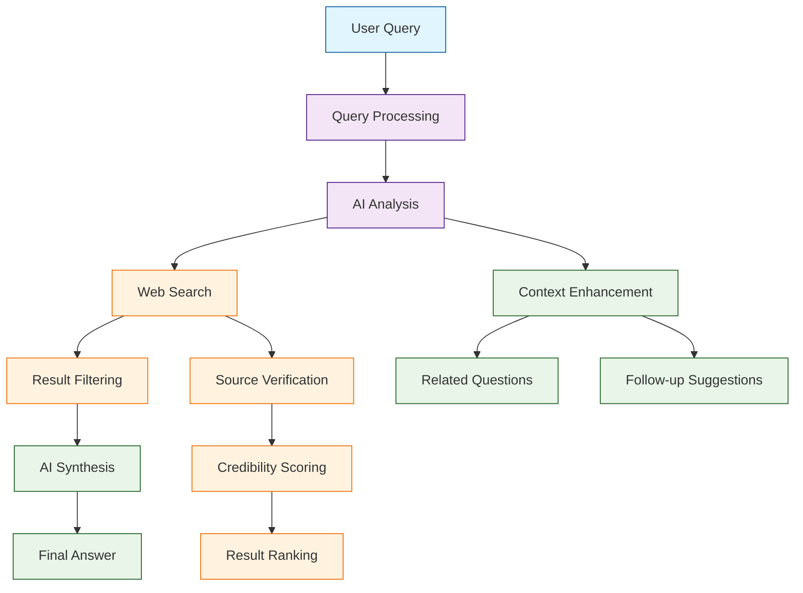

# Perplexica Tutorial: AI-Powered Search Engine

> A deep technical walkthrough of Perplexica covering AI-Powered Search Engine.

Perplexica[View Repo](https://github.com/ItzCrazyKns/Perplexica) is an AI-powered search engine and open-source alternative to Perplexity AI. It provides intelligent search capabilities with natural language processing, web scraping, and AI-driven result analysis.

Perplexica combines the power of large language models with web search capabilities to provide comprehensive, contextual answers to complex queries, making it an excellent tool for research and information discovery.

## Tutorial Chapters

Welcome to your journey through AI-powered search technology! This tutorial explores building intelligent search engines with Perplexica.

1. **[Chapter 1: Getting Started with Perplexica](01-getting-started.md)** - Installation, setup, and your first search queries
2. **[Chapter 2: Search Engine Architecture](02-search-architecture.md)** - Understanding the core search components
3. **[Chapter 3: AI Integration](03-ai-integration.md)** - Connecting LLMs and AI models
4. **[Chapter 4: Web Scraping and Data Collection](04-web-scraping.md)** - Gathering and processing web data
5. **[Chapter 5: Result Processing and Ranking](05-result-processing.md)** - Filtering and ranking search results
6. **[Chapter 6: User Interface Development](06-user-interface.md)** - Building the search interface
7. **[Chapter 7: Advanced Features](07-advanced-features.md)** - Conversation history, personalization, and analytics
8. **[Chapter 8: Production Deployment](08-production-deployment.md)** - Scaling and deploying your search engine

## What You'll Learn

By the end of this tutorial, you'll be able to:

- **Build AI Search Engines** - Create intelligent search systems with NLP capabilities
- **Integrate LLMs** - Connect and utilize large language models for query understanding
- **Implement Web Scraping** - Collect and process data from web sources
- **Process Search Results** - Filter, rank, and synthesize search results
- **Create User Interfaces** - Build intuitive search interfaces with modern UX
- **Handle Complex Queries** - Process multi-part questions and follow-up queries
- **Scale Search Systems** - Deploy and manage production search infrastructure
- **Ensure Quality** - Implement credibility scoring and result verification

## What's New in Perplexica v1.9-v1.11 (2024-2025)

> **AI Search Revolution**: File uploads, latest models, enhanced UI, and streamlined setup mark Perplexica's evolution into a comprehensive AI search platform.

**📄 Content Revolution (v1.9-v1.10):**
- 📎 **File Upload Support**: Direct PDF, TXT, DOCX uploads with AI-powered analysis
- 🌐 **URL & PDF Searching**: Deep search within web pages and documents
- 🖼️ **Automatic Media Search**: AI-driven image and video discovery
- 📝 **Blog-Style Answers**: New prompt system for comprehensive responses
- 🔗 **API Endpoint Integration**: Programmatic access to search capabilities

**🤖 Model Ecosystem Expansion:**
- 🆕 **Latest AI Models**: GPT-5, GPT-5 Mini, O3, Claude Opus 4.1, Gemini 2.5
- 🔄 **Dynamic Model Fetching**: Automatic model discovery vs hardcoded lists
- 📦 **New Providers**: AIML API, Lemonade, LM Studio, enhanced Transformers
- ⚡ **Improved Groq Integration**: Better performance with @langchain/groq
- 🎯 **Gemini Chat Support**: Expanded Google AI model integration

**🎨 User Experience Overhaul (v1.11):**
- 🧙‍♂️ **Setup Wizard**: Guided initial configuration with model selection
- ⚙️ **Live Configuration**: Real-time settings updates without restart
- 🎨 **Enhanced UI/UX**: New sidebar, improved theme system, responsive design
- 📱 **Mobile Optimization**: Better accessibility and touch interactions
- 🔄 **Auto Scroll Chat**: Smart scroll-back detection in conversations

**🏗️ Developer Experience:**
- 🐳 **Single Command Install**: Docker deployment without full repo clone
- 📦 **Standalone Builds**: Significantly reduced build sizes
- 🔧 **Settings Dialog**: Comprehensive configuration interface
- 🏷️ **Citation Components**: Enhanced source attribution rendering
- 🌤️ **Weather Widget**: Geolocation support with unit preferences

**🔧 System Improvements:**
- 🛡️ **API Route Validation**: Prevention of malformed requests
- 📊 **Configuration Migration**: Hash-based config management
- 🚀 **Instrumentation-Based Migrations**: Faster updates without ts-node
- 🐛 **Bug Fixes**: Resolved infinite loading, WebSocket errors, JSON parsing
- 📱 **iOS Compatibility**: Fixed input zoom and mobile interaction issues

## Learning Path

### 🟢 Beginner Track
Perfect for developers new to search engine development:
1. Chapters 1-2: Setup and basic search architecture
2. Focus on understanding search engine fundamentals

### 🟡 Intermediate Track
For developers building AI-powered applications:
1. Chapters 3-5: AI integration, web scraping, and result processing
2. Learn to build sophisticated search systems

### 🔴 Advanced Track
For production search engine development:
1. Chapters 6-8: UI development, advanced features, and deployment
2. Master enterprise-grade search solutions

---

**Ready to build an AI search engine? Let's begin with [Chapter 1: Getting Started](01-getting-started.md)!**

*Generated by [AI Codebase Knowledge Builder](https://github.com/The-Pocket/Tutorial-Codebase-Knowledge)*
