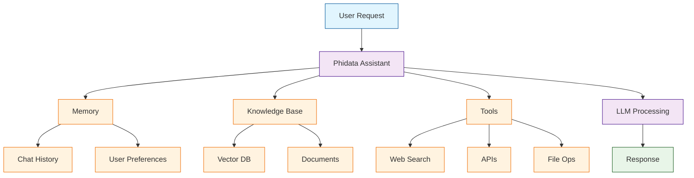

# Phidata Tutorial: AI Assistants Framework

> Build production-ready AI assistants with memory, knowledge, and tools.

<div align="center">

**🤖 From Prototype to Production AI Assistants**

[](https://github.com/phidatahq/phidata)

</div>

---

## 🎯 What is Phidata?

**Phidata**<sup>[View Repo](https://github.com/phidatahq/phidata)</sup> is a framework for building AI assistants with memory, knowledge bases, and tools. It provides a clean abstraction for creating assistants that can search the web, analyze data, generate content, and much more.

### Key Features

| Feature | Description |
|:--------|:------------|
| **Memory** | Persistent conversation and user memory |
| **Knowledge** | RAG with PDF, CSV, website, and more |
| **Tools** | Web search, APIs, file operations |
| **Teams** | Multi-assistant collaboration |
| **Playground** | Built-in testing UI |
| **Deployment** | Docker, AWS, and cloud-ready |



## Tutorial Chapters

1. **[Chapter 1: Getting Started](01-getting-started.md)** - Installation, setup, and first assistant
2. **[Chapter 2: Tools & Functions](02-tools.md)** - Web search, APIs, and custom tools
3. **[Chapter 3: Knowledge Bases](03-knowledge.md)** - RAG with documents and websites
4. **[Chapter 4: Memory Systems](04-memory.md)** - Conversation and user memory
5. **[Chapter 5: Teams & Workflows](05-teams.md)** - Multi-assistant collaboration
6. **[Chapter 6: Structured Output](06-structured.md)** - Pydantic models and validation
7. **[Chapter 7: Playground & UI](07-playground.md)** - Built-in testing interface
8. **[Chapter 8: Production Deployment](08-production.md)** - Docker, AWS, and scaling

## What You'll Learn

- **Build AI Assistants** with clean, maintainable code
- **Add Knowledge Bases** for domain expertise
- **Integrate Tools** for real-world capabilities
- **Manage Memory** across sessions
- **Create Teams** of specialized assistants
- **Deploy to Production** with confidence
- **Monitor and Debug** assistant behavior

## Prerequisites

- Python 3.9+
- API key for your LLM provider
- (Optional) Docker for deployment
- (Optional) PostgreSQL for memory

## Quick Start

```bash
# Install phidata
pip install phidata

# Or with extras
pip install "phidata[aws]"  # AWS deployment
pip install "phidata[docker]"  # Docker support
```

## Your First Assistant

```python
from phi.assistant import Assistant
from phi.llm.openai import OpenAIChat

# Create a simple assistant
assistant = Assistant(
    llm=OpenAIChat(model="gpt-4o"),
    description="You are a helpful AI assistant.",
)

# Chat with the assistant
response = assistant.run("What is the capital of France?")
print(response)
# "The capital of France is Paris."
```

## Assistant with Tools

```python
from phi.assistant import Assistant
from phi.tools.duckduckgo import DuckDuckGo
from phi.tools.yfinance import YFinanceTools

# Create assistant with web search and finance tools
assistant = Assistant(
    llm=OpenAIChat(model="gpt-4o"),
    tools=[
        DuckDuckGo(),
        YFinanceTools(stock_price=True, analyst_recommendations=True)
    ],
    description="You are a financial research assistant.",
    instructions=[
        "Always search for the latest information",
        "Provide sources for your claims"
    ]
)

response = assistant.run("What's the latest news about NVIDIA stock?")
```

## Knowledge Base (RAG)

```python
from phi.assistant import Assistant
from phi.knowledge.pdf import PDFKnowledgeBase
from phi.vectordb.pgvector import PgVector2

# Create knowledge base from PDFs
knowledge = PDFKnowledgeBase(
    path="docs/",
    vector_db=PgVector2(
        db_url="postgresql://...",
        table_name="documents"
    )
)

# Load documents (run once)
knowledge.load()

# Create assistant with knowledge
assistant = Assistant(
    knowledge=knowledge,
    search_knowledge=True,  # Enable RAG
    description="You answer questions about our documentation."
)

response = assistant.run("How do I configure the API?")
```

## Memory

```python
from phi.assistant import Assistant
from phi.memory.db.postgres import PgMemory

# Create assistant with persistent memory
assistant = Assistant(
    llm=OpenAIChat(model="gpt-4o"),
    memory=PgMemory(
        db_url="postgresql://...",
        table_name="assistant_memory"
    ),
    add_history_to_messages=True,  # Include chat history
    num_history_messages=10,  # Last 10 messages
)

# Conversations are remembered across sessions
assistant.run("My name is Alice")
# Later...
assistant.run("What's my name?")  # "Your name is Alice"
```

## Teams of Assistants

```python
from phi.assistant import Assistant
from phi.assistant.team import Team

# Create specialized assistants
researcher = Assistant(
    name="Researcher",
    tools=[DuckDuckGo()],
    description="You search for information online."
)

writer = Assistant(
    name="Writer",
    description="You write clear, engaging content."
)

# Create a team
team = Team(
    assistants=[researcher, writer],
    description="Research and write articles."
)

# Team coordinates automatically
response = team.run("Write a blog post about AI agents")
```

## Built-in Playground

```python
from phi.assistant import Assistant
from phi.playground import Playground, serve_playground_app

assistant = Assistant(...)

# Create playground app
app = Playground(assistants=[assistant]).get_app()

# Serve the UI
serve_playground_app(app)
# Open http://localhost:7777
```

## Deployment

```bash
# Deploy with Docker
phi ws up --env prd

# Deploy to AWS
phi ws up --env aws
```

## Learning Path

### 🟢 Beginner Track
1. Chapters 1-3: Setup, tools, and knowledge
2. Build a capable AI assistant

### 🟡 Intermediate Track
1. Chapters 4-6: Memory, teams, and structured output
2. Create sophisticated multi-assistant systems

### 🔴 Advanced Track
1. Chapters 7-8: Playground and production
2. Deploy enterprise-grade AI assistants

---

**Ready to build AI assistants? Let's begin with [Chapter 1: Getting Started](01-getting-started.md)!**

*Generated for [Awesome Code Docs](https://github.com/johnxie/awesome-code-docs)*
