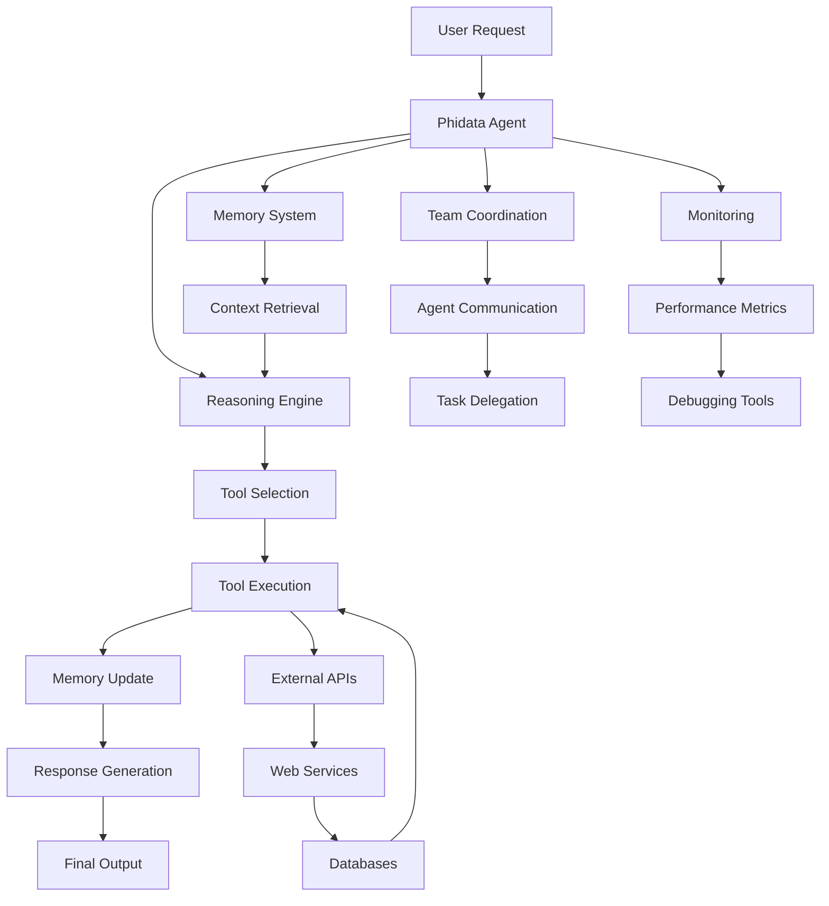

# Phidata Tutorial: Building Autonomous AI Agents

> This tutorial is AI-generated! To learn more, check out [Awesome Code Docs](https://github.com/johnxie/awesome-code-docs)

Phidata<sup>[View Repo](https://github.com/phidatahq/phidata)</sup> is a framework for building autonomous AI agents with memory, reasoning, and tool integration capabilities. Create intelligent agents that can perform complex tasks, maintain conversation context, and use various tools to accomplish goals.

## Tutorial Chapters

1. **[Chapter 1: Getting Started](01-getting-started.md)** - Installation and your first AI agent
2. **[Chapter 2: Agent Architecture](02-agent-architecture.md)** - Understanding Phidata's agent components
3. **[Chapter 3: Tools & Functions](03-tools-functions.md)** - Creating and integrating custom tools
4. **[Chapter 4: Memory Systems](04-memory-systems.md)** - Implementing agent memory and context
5. **[Chapter 5: Multi-Agent Systems](05-multi-agent-systems.md)** - Coordinating teams of AI agents
6. **[Chapter 6: Advanced Reasoning](06-advanced-reasoning.md)** - Complex reasoning patterns and workflows
7. **[Chapter 7: Integrations](07-integrations.md)** - External APIs, databases, and services
8. **[Chapter 8: Production Deployment](08-production-deployment.md)** - Scaling and deploying agent systems

## What You'll Learn

- **Agent Creation**: Build autonomous AI agents with specialized capabilities
- **Tool Integration**: Connect agents to external tools, APIs, and services
- **Memory Management**: Implement persistent memory and context retention
- **Multi-Agent Coordination**: Create collaborative agent teams
- **Advanced Reasoning**: Complex decision-making and problem-solving patterns
- **Production Deployment**: Scale agent systems for enterprise use

## Learning Objectives

By the end of this tutorial, you'll be able to:
- Design and implement autonomous AI agents for various use cases
- Create custom tools and integrate external services
- Build agents with persistent memory and context awareness
- Coordinate multiple agents for complex task completion
- Implement advanced reasoning patterns and decision-making
- Deploy and scale agent systems in production environments

## Key Features Covered

**🤖 Agent Capabilities:**
- ⚡ **Autonomous Execution**: Agents that independently complete complex tasks
- 🛠️ **Tool Integration**: Access to 100+ built-in tools and custom functions
- 🧠 **Memory Systems**: Persistent context and learning across conversations
- 👥 **Multi-Agent Teams**: Collaborative agent coordination and task delegation
- 🎯 **Reasoning Engine**: Advanced decision-making and problem-solving
- 📊 **Observability**: Comprehensive monitoring and debugging tools

**🏗️ Framework Features:**
- 🔧 **Modular Design**: Reusable components and extensible architecture
- 📈 **Scalable**: From single agents to enterprise-scale deployments
- 🔒 **Secure**: Built-in security and access control mechanisms
- 📊 **Analytics**: Detailed metrics and performance tracking
- 🚀 **Production Ready**: Enterprise-grade reliability and monitoring

## Architecture Overview



Phidata agents consist of modular components that work together to provide autonomous, tool-augmented AI capabilities with persistent memory and collaborative features.

## Prerequisites

- Python 3.8+
- Basic understanding of AI/LLMs and agent concepts
- Familiarity with API integration and tool usage
- Experience with async programming (helpful but not required)

## Getting Started

Ready to build your first autonomous AI agent? Let's begin with [Chapter 1: Getting Started](01-getting-started.md)!

## Quick Start

```bash
# Install Phidata
pip install phidata

# Create your first agent
from phidata.agent import Agent

agent = Agent(
    name="Assistant",
    instructions="You are a helpful AI assistant."
)

# Run the agent
response = agent.run("Hello, how can you help me?")
print(response)
```