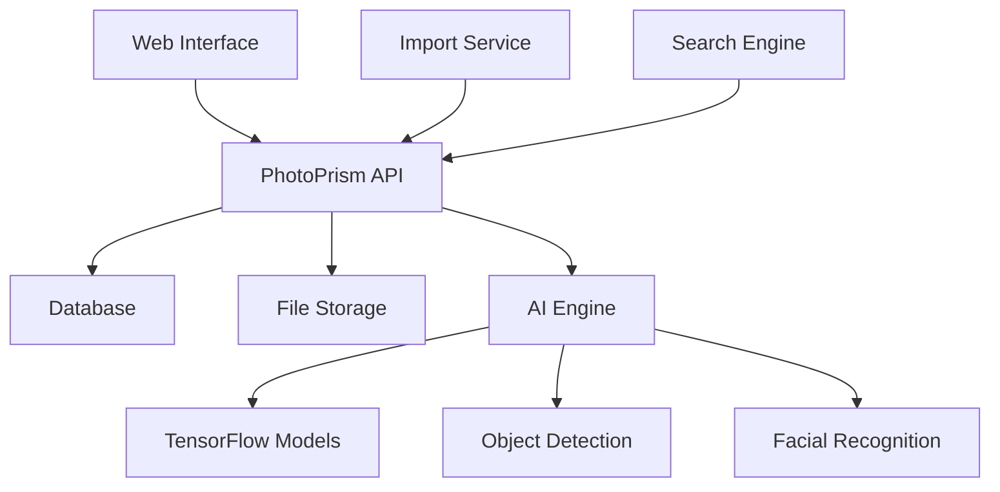

# PhotoPrism Tutorial: AI-Powered Photos App

<p align="center">
  
</p>

<p align="center">
  <strong>🤖 AI-powered photos app for the decentralized web with automatic tagging and facial recognition</strong>
</p>

---

## 🎯 What You'll Learn

This comprehensive tutorial will guide you through PhotoPrism, a powerful AI-powered photo management application that brings professional photo organization to your personal server:

- **AI-Powered Organization**: Automatic object detection, facial recognition, and scene classification
- **Privacy-First Design**: Self-hosted solution with complete control over your data
- **Advanced Search**: Natural language search through your photo collection
- **Multi-Format Support**: Handles RAW files, videos, and traditional photo formats
- **Web-Based Interface**: Access your photos from any device with a modern web browser
- **API Integration**: RESTful API for third-party integrations and automation

## 📚 Tutorial Chapters

1. **[Getting Started with PhotoPrism](01-getting-started.md)** - Installation, setup, and first photo library
2. **[AI Features & Configuration](02-ai-features-configuration.md)** - TensorFlow integration and AI model setup
3. **[Photo Management](03-photo-management.md)** - Importing, organizing, and managing your photo collection
4. **[Search & Discovery](04-search-discovery.md)** - Advanced search features and natural language queries
5. **[Facial Recognition](05-facial-recognition.md)** - Setting up and using facial recognition features
6. **[API Integration](06-api-integration.md)** - REST API usage and automation
7. **[Backup & Migration](07-backup-migration.md)** - Data backup strategies and migration
8. **[Production Deployment](08-production-deployment.md)** - Scaling and production setup

## 🚀 Quick Start

```bash
# Run PhotoPrism with Docker
docker run -d \
  --name photoprism \
  -p 2342:2342 \
  -e PHOTOPRISM_ADMIN_PASSWORD="your-admin-password" \
  -v /path/to/photos:/photoprism/photos \
  -v /path/to/storage:/photoprism/storage \
  photoprism/photoprism:latest

# Access at http://localhost:2342
```

## 🏗️ Architecture Overview



## 🎯 Use Cases

- **Personal Photo Library**: Self-hosted alternative to Google Photos
- **Family Photo Sharing**: Private family photo sharing without cloud services
- **Professional Photography**: Portfolio management and client proofing
- **Research & Documentation**: Visual documentation with AI-powered search
- **Archival Collections**: Museum and archive photo management
- **Security & Surveillance**: Privacy-focused surveillance photo management

## What's New in PhotoPrism (2024-2025)

> **AI Photo Management Revolution**: Enhanced facial recognition, LLM integrations, and advanced organization features mark PhotoPrism's evolution.

[](https://github.com/photoprism/photoprism)
[](https://www.gnu.org/licenses/agpl-3.0)
[](https://github.com/photoprism/photoprism)


**🎨 AI & Integration Breakthroughs (December 2025):**
- 📝 **Batch Metadata Editing**: Edit metadata across multiple photos simultaneously
- 👤 **Enhanced Facial Recognition**: More accurate automatic person identification
- 🤖 **Ollama & OpenAI Integration**: Automatic caption and label generation using LLMs
- 🧠 **Custom TensorFlow Models**: Advanced user model support with refined configuration
- 🎯 **Usability Improvements**: Cover image changes for person entries, updated dependencies, expanded translations

**🌐 Advanced Features (July 2025):**
- 🦙 **Ollama Model Support**: Expanded AI-powered photo analysis options
- 🗺️ **Adjust Location Dialog**: Set/correct photo coordinates via interactive map
- 🗂️ **Toolbar Album Deletion**: Direct album deletion from toolbar
- 🌍 **Customizable Location Language**: Set preferred language for location details
- 🎬 **Video Enhancements**: Improved transcoding, scanner detection, command-line tools

**🎛️ User Experience (March 2025):**
- 📱 **UI Enhancements**: Search toolbars and tabs remain visible while scrolling
- 🏠 **Customizable Start Page**: Set preferred landing page in settings
- 🕒 **Time Zone Settings**: Configure personal time zone preferences
- 💾 **Disk Usage Display**: Monitor and limit storage usage in sidebar
- 📄 **PDF Support**: Full support for Adobe PDF documents
- 📂 **Album Management**: Enhanced file naming, zip downloads, and sort orders

**🔄 Interface Revolution (February 2025):**
- 🎨 **Refreshed UI**: Complete interface overhaul with usability improvements
- 🎥 **Hybrid Viewer**: Unified photo and video viewing experience
- ✏️ **Redesigned Edit Dialog**: More responsive and intuitive editing interface
- 🌍 **3D Earth View**: Immersive 3D globe view for location exploration

## Prerequisites

- Basic understanding of Docker and containerization
- Familiarity with web interfaces and basic networking
- Understanding of photo file formats and metadata
- Basic knowledge of AI/ML concepts (helpful but not required)
- Access to a server or computer with sufficient storage space

## 🕐 Time Investment

- **Complete Tutorial**: 4-6 hours
- **Basic Setup**: 30-45 minutes
- **AI Configuration**: 1-2 hours
- **Advanced Features**: 2-3 hours

## 🎯 Learning Outcomes

By the end of this tutorial, you'll be able to:

- Set up and configure PhotoPrism on various platforms
- Leverage AI features for automatic photo organization
- Implement advanced search and discovery features
- Configure facial recognition for person identification
- Use the REST API for automation and integration
- Manage backups and ensure data persistence
- Deploy PhotoPrism in production environments

## 🔗 Resources

- **Official Documentation**: [docs.photoprism.app](https://docs.photoprism.app)
- **GitHub Repository**: [github.com/photoprism/photoprism](https://github.com/photoprism/photoprism)
- **Demo Instance**: [demo.photoprism.app](https://demo.photoprism.app)
- **API Documentation**: [docs.photoprism.app/developer-guide/api](https://docs.photoprism.app/developer-guide/api/)
- **Community Discussions**: [github.com/photoprism/photoprism/discussions](https://github.com/photoprism/photoprism/discussions)

---

## Navigation & Backlinks

- [Start Here: Chapter 1: Getting Started with PhotoPrism](01-getting-started.md)
- [Back to Main Catalog](../../README.md#-tutorial-catalog)
- [Browse A-Z Tutorial Directory](../../discoverability/tutorial-directory.md)
- [Search by Intent](../../discoverability/query-hub.md)
- [Explore Category Hubs](../../README.md#category-hubs)

*Generated by [AI Codebase Knowledge Builder](https://github.com/johnxie/awesome-code-docs)*

## Full Chapter Map

1. [Chapter 1: Getting Started with PhotoPrism](01-getting-started.md)
2. [Chapter 2: AI Features & Configuration](02-ai-features-configuration.md)
3. [Chapter 3: Photo Management](03-photo-management.md)
4. [Chapter 4: Search & Discovery](04-search-discovery.md)
5. [Chapter 5: Facial Recognition](05-facial-recognition.md)
6. [Chapter 6: API Integration](06-api-integration.md)
7. [Chapter 7: Backup & Migration](07-backup-migration.md)
8. [Chapter 8: Production Deployment](08-production-deployment.md)

## Source References

- [github.com/photoprism/photoprism](https://github.com/photoprism/photoprism)
- [github.com/photoprism/photoprism/discussions](https://github.com/photoprism/photoprism/discussions)
- [AI Codebase Knowledge Builder](https://github.com/johnxie/awesome-code-docs)
