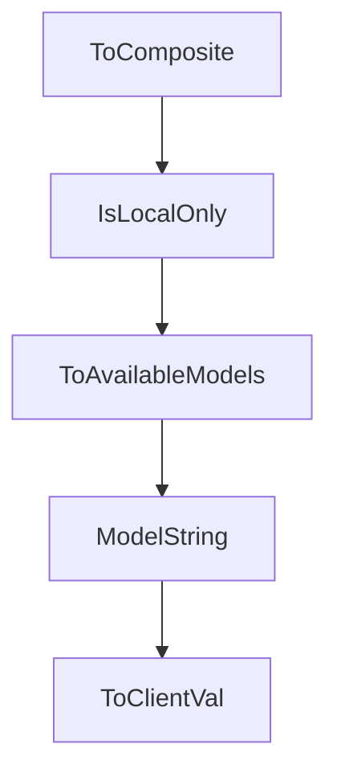

# Chapter 1: Getting Started

Welcome to **Chapter 1: Getting Started**. In this part of **Plandex Tutorial: Large-Task AI Coding Agent Workflows**, you will build an intuitive mental model first, then move into concrete implementation details and practical production tradeoffs.


This chapter gets Plandex installed and running in a project directory.

## Quick Install

```bash
curl -sL https://plandex.ai/install.sh | bash
```

## Learning Goals

- install and launch Plandex REPL
- run first planning/execution task
- validate project context loading

## Source References

- [Plandex Install Docs](https://docs.plandex.ai/install)
- [Plandex README](https://github.com/plandex-ai/plandex)

## Summary

You now have a functioning Plandex baseline.

Next: [Chapter 2: Architecture and Workflow](02-architecture-and-workflow.md)

## Source Code Walkthrough

### `app/shared/ai_models_data_models.go`

The `ToComposite` function in [`app/shared/ai_models_data_models.go`](https://github.com/plandex-ai/plandex/blob/HEAD/app/shared/ai_models_data_models.go) handles a key part of this chapter's functionality:

```go
}

func (b BaseModelUsesProvider) ToComposite() string {
	if b.CustomProvider != nil {
		return fmt.Sprintf("%s|%s", b.Provider, *b.CustomProvider)
	}
	return string(b.Provider)
}

type BaseModelConfigSchema struct {
	ModelTag    ModelTag       `json:"modelTag"`
	ModelId     ModelId        `json:"modelId"`
	Publisher   ModelPublisher `json:"publisher"`
	Description string         `json:"description"`

	BaseModelShared

	RequiresVariantOverrides []string `json:"requiresVariantOverrides"`

	Variants  []BaseModelConfigVariant `json:"variants"`
	Providers []BaseModelUsesProvider  `json:"providers"`
}

type BaseModelConfigVariant struct {
	IsBaseVariant            bool                     `json:"isBaseVariant"`
	VariantTag               VariantTag               `json:"variantTag"`
	Description              string                   `json:"description"`
	Overrides                BaseModelShared          `json:"overrides"`
	Variants                 []BaseModelConfigVariant `json:"variants"`
	RequiresVariantOverrides []string                 `json:"requiresVariantOverrides"`
	IsDefaultVariant         bool                     `json:"isDefaultVariant"`
}
```

This function is important because it defines how Plandex Tutorial: Large-Task AI Coding Agent Workflows implements the patterns covered in this chapter.

### `app/shared/ai_models_data_models.go`

The `IsLocalOnly` function in [`app/shared/ai_models_data_models.go`](https://github.com/plandex-ai/plandex/blob/HEAD/app/shared/ai_models_data_models.go) handles a key part of this chapter's functionality:

```go
}

func (b *BaseModelConfigSchema) IsLocalOnly() bool {
	if len(b.Providers) == 0 {
		return false
	}

	for _, provider := range b.Providers {
		builtIn, ok := BuiltInModelProviderConfigs[provider.Provider]
		if !ok {
			// has a custom provider—assume not local only
			return false
		}
		if !builtIn.LocalOnly {
			// has a built-in provider that is not local only
			return false
		}
	}

	return true
}

func (b *BaseModelConfigSchema) ToAvailableModels() []*AvailableModel {
	avail := []*AvailableModel{}
	for _, provider := range b.Providers {

		providerConfig, ok := BuiltInModelProviderConfigs[provider.Provider]
		if !ok {
			panic(fmt.Sprintf("provider %s not found", provider.Provider))
		}

		addBase := func() {
```

This function is important because it defines how Plandex Tutorial: Large-Task AI Coding Agent Workflows implements the patterns covered in this chapter.

### `app/shared/ai_models_data_models.go`

The `ToAvailableModels` function in [`app/shared/ai_models_data_models.go`](https://github.com/plandex-ai/plandex/blob/HEAD/app/shared/ai_models_data_models.go) handles a key part of this chapter's functionality:

```go
}

func (b *BaseModelConfigSchema) ToAvailableModels() []*AvailableModel {
	avail := []*AvailableModel{}
	for _, provider := range b.Providers {

		providerConfig, ok := BuiltInModelProviderConfigs[provider.Provider]
		if !ok {
			panic(fmt.Sprintf("provider %s not found", provider.Provider))
		}

		addBase := func() {
			avail = append(avail, &AvailableModel{
				Description:           b.Description,
				DefaultMaxConvoTokens: b.DefaultMaxConvoTokens,
				BaseModelConfig: BaseModelConfig{
					ModelTag:        b.ModelTag,
					ModelId:         ModelId(string(b.ModelTag)),
					BaseModelShared: b.BaseModelShared,
					BaseModelProviderConfig: BaseModelProviderConfig{
						ModelProviderConfigSchema: providerConfig,
						ModelName:                 provider.ModelName,
					},
				},
			})
		}

		type variantParams struct {
			BaseVariant              *BaseModelConfigVariant
			BaseId                   ModelId
			BaseDescription          string
			CumulativeOverrides      BaseModelShared
```

This function is important because it defines how Plandex Tutorial: Large-Task AI Coding Agent Workflows implements the patterns covered in this chapter.

### `app/shared/ai_models_data_models.go`

The `ModelString` function in [`app/shared/ai_models_data_models.go`](https://github.com/plandex-ai/plandex/blob/HEAD/app/shared/ai_models_data_models.go) handles a key part of this chapter's functionality:

```go
}

func (m *AvailableModel) ModelString() string {
	s := ""
	if m.Provider != "" && m.Provider != ModelProviderOpenAI {
		s += string(m.Provider) + "/"
	}
	s += string(m.ModelId)
	return s
}

type PlannerModelConfig struct {
	MaxConvoTokens int `json:"maxConvoTokens"`
}

type ReasoningEffort string

const (
	ReasoningEffortLow    ReasoningEffort = "low"
	ReasoningEffortMedium ReasoningEffort = "medium"
	ReasoningEffortHigh   ReasoningEffort = "high"
)

type ModelRoleConfig struct {
	Role ModelRole `json:"role"`

	ModelId ModelId `json:"modelId"` // new in 2.2.0 refactor — uses provider lookup instead of BaseModelConfig and MissingKeyFallback

	BaseModelConfig      *BaseModelConfig `json:"baseModelConfig,omitempty"`
	Temperature          float32          `json:"temperature"`
	TopP                 float32          `json:"topP"`
	ReservedOutputTokens int              `json:"reservedOutputTokens"`
```

This function is important because it defines how Plandex Tutorial: Large-Task AI Coding Agent Workflows implements the patterns covered in this chapter.


## How These Components Connect


