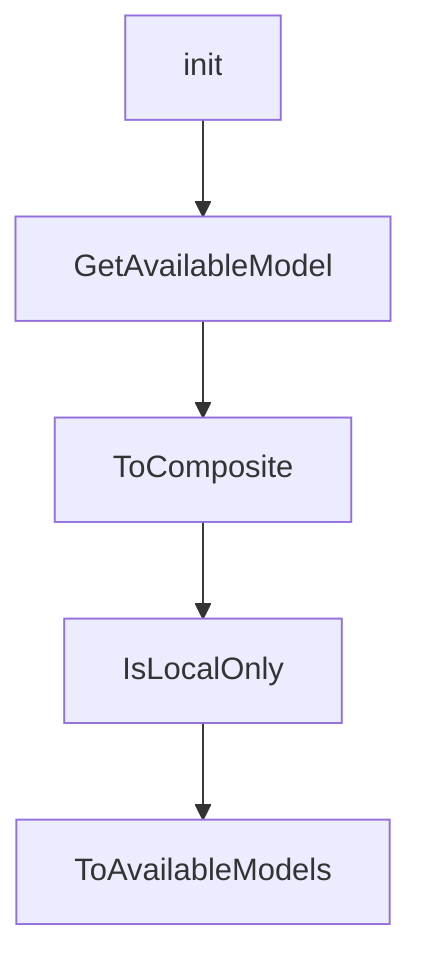

# Chapter 1: Getting Started

Welcome to **Chapter 1: Getting Started**. In this part of **Plandex Tutorial: Large-Task AI Coding Agent Workflows**, you will build an intuitive mental model first, then move into concrete implementation details and practical production tradeoffs.


This chapter gets Plandex installed and running in a project directory.

## Quick Install

```bash
curl -sL https://plandex.ai/install.sh | bash
```

## Learning Goals

- install and launch Plandex REPL
- run first planning/execution task
- validate project context loading

## Source References

- [Plandex Install Docs](https://docs.plandex.ai/install)
- [Plandex README](https://github.com/plandex-ai/plandex)

## Summary

You now have a functioning Plandex baseline.

Next: [Chapter 2: Architecture and Workflow](02-architecture-and-workflow.md)

## Depth Expansion Playbook

## Source Code Walkthrough

### `app/shared/ai_models_available.go`

The `init` function in [`app/shared/ai_models_available.go`](https://github.com/plandex-ai/plandex/blob/HEAD/app/shared/ai_models_available.go) handles a key part of this chapter's functionality:

```go
var AvailableModelsByComposite = map[string]*AvailableModel{}

func init() {
	for _, model := range BuiltInModels {
		// if the model has an anthropic provider, insert claude max provider before it
		var usesAnthropicProvider *BaseModelUsesProvider
		for _, provider := range model.Providers {
			if provider.Provider == ModelProviderAnthropic {
				copy := provider
				latestModelName, ok := AnthropicLatestModelNameMap[provider.ModelName]
				if ok {
					copy.ModelName = latestModelName
				}
				usesAnthropicProvider = &copy
				break
			}
		}
		if usesAnthropicProvider != nil {
			usesAnthropicProvider.Provider = ModelProviderAnthropicClaudeMax
			model.Providers = append([]BaseModelUsesProvider{*usesAnthropicProvider}, model.Providers...)
		}

		AvailableModels = append(AvailableModels, model.ToAvailableModels()...)

		var addVariants func(variants []BaseModelConfigVariant, baseId ModelId)
		addVariants = func(variants []BaseModelConfigVariant, baseId ModelId) {
			for _, variant := range variants {
				var modelId ModelId
				if variant.IsBaseVariant || variant.IsDefaultVariant {
					modelId = baseId
				} else {
					modelId = ModelId(strings.Join([]string{string(baseId), string(variant.VariantTag)}, "-"))
```

This function is important because it defines how Plandex Tutorial: Large-Task AI Coding Agent Workflows implements the patterns covered in this chapter.

### `app/shared/ai_models_available.go`

The `GetAvailableModel` function in [`app/shared/ai_models_available.go`](https://github.com/plandex-ai/plandex/blob/HEAD/app/shared/ai_models_available.go) handles a key part of this chapter's functionality:

```go
}

func GetAvailableModel(provider ModelProvider, modelId ModelId) *AvailableModel {
	compositeKey := string(provider) + "/" + string(modelId)
	return AvailableModelsByComposite[compositeKey]
}

var AnthropicLatestModelNameMap = map[ModelName]ModelName{
	"anthropic/claude-sonnet-4-0":        "anthropic/claude-sonnet-4-20250514",
	"anthropic/claude-opus-4-0":          "anthropic/claude-opus-4-20250514",
	"anthropic/claude-3-7-sonnet-latest": "anthropic/claude-3-7-sonnet-20250219",
	"anthropic/claude-3-5-haiku-latest":  "anthropic/claude-3-5-haiku-20241022",
	"anthropic/claude-3-5-sonnet-latest": "anthropic/claude-3-5-sonnet-20241022",
}

```

This function is important because it defines how Plandex Tutorial: Large-Task AI Coding Agent Workflows implements the patterns covered in this chapter.

### `app/shared/ai_models_data_models.go`

The `ToComposite` function in [`app/shared/ai_models_data_models.go`](https://github.com/plandex-ai/plandex/blob/HEAD/app/shared/ai_models_data_models.go) handles a key part of this chapter's functionality:

```go
}

func (b BaseModelUsesProvider) ToComposite() string {
	if b.CustomProvider != nil {
		return fmt.Sprintf("%s|%s", b.Provider, *b.CustomProvider)
	}
	return string(b.Provider)
}

type BaseModelConfigSchema struct {
	ModelTag    ModelTag       `json:"modelTag"`
	ModelId     ModelId        `json:"modelId"`
	Publisher   ModelPublisher `json:"publisher"`
	Description string         `json:"description"`

	BaseModelShared

	RequiresVariantOverrides []string `json:"requiresVariantOverrides"`

	Variants  []BaseModelConfigVariant `json:"variants"`
	Providers []BaseModelUsesProvider  `json:"providers"`
}

type BaseModelConfigVariant struct {
	IsBaseVariant            bool                     `json:"isBaseVariant"`
	VariantTag               VariantTag               `json:"variantTag"`
	Description              string                   `json:"description"`
	Overrides                BaseModelShared          `json:"overrides"`
	Variants                 []BaseModelConfigVariant `json:"variants"`
	RequiresVariantOverrides []string                 `json:"requiresVariantOverrides"`
	IsDefaultVariant         bool                     `json:"isDefaultVariant"`
}
```

This function is important because it defines how Plandex Tutorial: Large-Task AI Coding Agent Workflows implements the patterns covered in this chapter.

### `app/shared/ai_models_data_models.go`

The `IsLocalOnly` function in [`app/shared/ai_models_data_models.go`](https://github.com/plandex-ai/plandex/blob/HEAD/app/shared/ai_models_data_models.go) handles a key part of this chapter's functionality:

```go
}

func (b *BaseModelConfigSchema) IsLocalOnly() bool {
	if len(b.Providers) == 0 {
		return false
	}

	for _, provider := range b.Providers {
		builtIn, ok := BuiltInModelProviderConfigs[provider.Provider]
		if !ok {
			// has a custom provider—assume not local only
			return false
		}
		if !builtIn.LocalOnly {
			// has a built-in provider that is not local only
			return false
		}
	}

	return true
}

func (b *BaseModelConfigSchema) ToAvailableModels() []*AvailableModel {
	avail := []*AvailableModel{}
	for _, provider := range b.Providers {

		providerConfig, ok := BuiltInModelProviderConfigs[provider.Provider]
		if !ok {
			panic(fmt.Sprintf("provider %s not found", provider.Provider))
		}

		addBase := func() {
```

This function is important because it defines how Plandex Tutorial: Large-Task AI Coding Agent Workflows implements the patterns covered in this chapter.


## How These Components Connect


