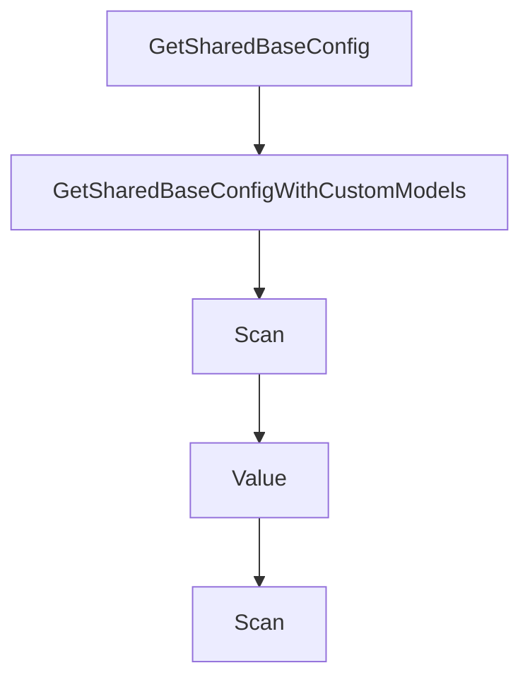

# Chapter 2: Architecture and Workflow

Welcome to **Chapter 2: Architecture and Workflow**. In this part of **Plandex Tutorial: Large-Task AI Coding Agent Workflows**, you will build an intuitive mental model first, then move into concrete implementation details and practical production tradeoffs.


Plandex combines planning, execution, and diff review to support long-horizon coding tasks.

## Workflow Stages

1. context loading and planning
2. execution and tool/debug loop
3. cumulative diff sandbox review
4. iterative refinement and apply

## Summary

You now understand Plandex's large-task lifecycle.

Next: [Chapter 3: Context Management at Scale](03-context-management-at-scale.md)

## Depth Expansion Playbook

## Source Code Walkthrough

### `app/shared/ai_models_data_models.go`

The `GetSharedBaseConfig` function in [`app/shared/ai_models_data_models.go`](https://github.com/plandex-ai/plandex/blob/HEAD/app/shared/ai_models_data_models.go) handles a key part of this chapter's functionality:

```go
	}

	sharedBaseConfig := m.GetSharedBaseConfigWithCustomModels(customModelsById)
	return sharedBaseConfig.ReservedOutputTokens
}

func (m ModelRoleConfig) GetSharedBaseConfig(settings *PlanSettings) *BaseModelShared {
	return m.GetSharedBaseConfigWithCustomModels(settings.CustomModelsById)
}

func (m ModelRoleConfig) GetSharedBaseConfigWithCustomModels(customModels map[ModelId]*CustomModel) *BaseModelShared {
	if m.BaseModelConfig != nil {
		return &m.BaseModelConfig.BaseModelShared
	}

	builtInModel := BuiltInBaseModelsById[m.ModelId]
	if builtInModel != nil {
		return &builtInModel.BaseModelShared
	}

	customModel := customModels[m.ModelId]
	if customModel != nil {
		return &customModel.BaseModelShared
	}

	return nil
}

func (m *ModelRoleConfig) Scan(src interface{}) error {
	if src == nil {
		return nil
	}
```

This function is important because it defines how Plandex Tutorial: Large-Task AI Coding Agent Workflows implements the patterns covered in this chapter.

### `app/shared/ai_models_data_models.go`

The `GetSharedBaseConfigWithCustomModels` function in [`app/shared/ai_models_data_models.go`](https://github.com/plandex-ai/plandex/blob/HEAD/app/shared/ai_models_data_models.go) handles a key part of this chapter's functionality:

```go
	}

	sharedBaseConfig := m.GetSharedBaseConfigWithCustomModels(customModelsById)
	return sharedBaseConfig.ReservedOutputTokens
}

func (m ModelRoleConfig) GetSharedBaseConfig(settings *PlanSettings) *BaseModelShared {
	return m.GetSharedBaseConfigWithCustomModels(settings.CustomModelsById)
}

func (m ModelRoleConfig) GetSharedBaseConfigWithCustomModels(customModels map[ModelId]*CustomModel) *BaseModelShared {
	if m.BaseModelConfig != nil {
		return &m.BaseModelConfig.BaseModelShared
	}

	builtInModel := BuiltInBaseModelsById[m.ModelId]
	if builtInModel != nil {
		return &builtInModel.BaseModelShared
	}

	customModel := customModels[m.ModelId]
	if customModel != nil {
		return &customModel.BaseModelShared
	}

	return nil
}

func (m *ModelRoleConfig) Scan(src interface{}) error {
	if src == nil {
		return nil
	}
```

This function is important because it defines how Plandex Tutorial: Large-Task AI Coding Agent Workflows implements the patterns covered in this chapter.

### `app/shared/ai_models_data_models.go`

The `Scan` function in [`app/shared/ai_models_data_models.go`](https://github.com/plandex-ai/plandex/blob/HEAD/app/shared/ai_models_data_models.go) handles a key part of this chapter's functionality:

```go
}

func (m *ModelRoleConfig) Scan(src interface{}) error {
	if src == nil {
		return nil
	}
	switch s := src.(type) {
	case []byte:
		return json.Unmarshal(s, m)
	case string:
		return json.Unmarshal([]byte(s), m)
	default:
		return fmt.Errorf("unsupported data type: %T", src)
	}
}

func (m ModelRoleConfig) Value() (driver.Value, error) {
	return json.Marshal(m)
}

type PlannerRoleConfig struct {
	ModelRoleConfig
	PlannerModelConfig
}

func (p *PlannerRoleConfig) Scan(src interface{}) error {
	if src == nil {
		return nil
	}
	switch s := src.(type) {
	case []byte:
		return json.Unmarshal(s, p)
```

This function is important because it defines how Plandex Tutorial: Large-Task AI Coding Agent Workflows implements the patterns covered in this chapter.

### `app/shared/ai_models_data_models.go`

The `Value` function in [`app/shared/ai_models_data_models.go`](https://github.com/plandex-ai/plandex/blob/HEAD/app/shared/ai_models_data_models.go) handles a key part of this chapter's functionality:

```go
	}

	v := reflect.ValueOf(*m)
	t := v.Type()

	for i := 0; i < v.NumField(); i++ {
		f := t.Field(i)
		if f.Name == "ModelId" { // skip the sentinel field
			continue
		}

		fv := v.Field(i)

		switch fv.Kind() {
		case reflect.Pointer, reflect.Interface, reflect.Map, reflect.Slice:
			if !fv.IsNil() {
				return false
			}
		default:
			if !fv.IsZero() {
				return false
			}
		}
	}
	return true
}

func (m *ModelRoleConfigSchema) AllModelIds() []ModelId {
	ids := []ModelId{}

	if m.ModelId != "" {
		ids = append(ids, m.ModelId)
```

This function is important because it defines how Plandex Tutorial: Large-Task AI Coding Agent Workflows implements the patterns covered in this chapter.


## How These Components Connect


