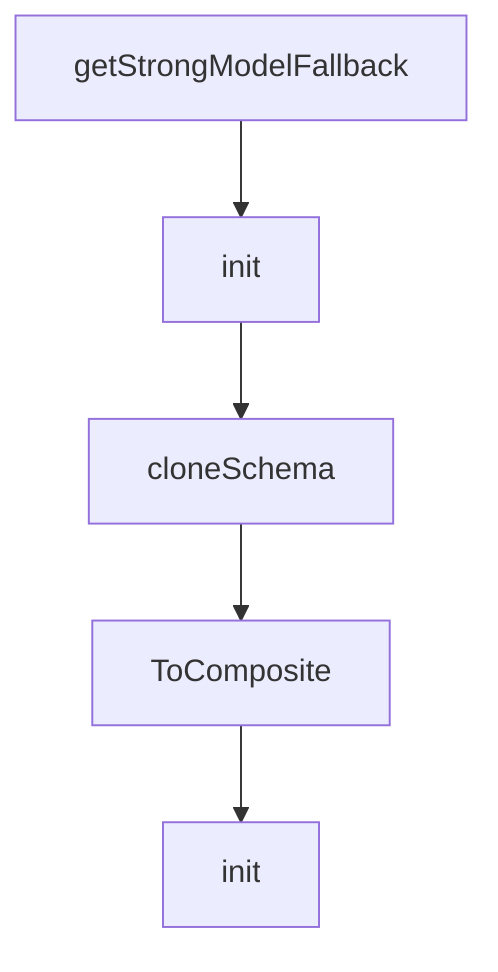

# Chapter 3: Context Management at Scale

Welcome to **Chapter 3: Context Management at Scale**. In this part of **Plandex Tutorial: Large-Task AI Coding Agent Workflows**, you will build an intuitive mental model first, then move into concrete implementation details and practical production tradeoffs.


Context management is Plandex's core advantage for large files and large codebases.

## Context Strategy

| Technique | Benefit |
|:----------|:--------|
| selective file loading | lower token waste |
| project mapping | scalable repository understanding |
| context caching | cost and latency reduction |

## Summary

You now have a context strategy for large-scale tasks in Plandex.

Next: [Chapter 4: Planning, Execution, and Diff Sandbox](04-planning-execution-and-diff-sandbox.md)

## Depth Expansion Playbook

## Source Code Walkthrough

### `app/shared/ai_models_packs.go`

The `getStrongModelFallback` function in [`app/shared/ai_models_packs.go`](https://github.com/plandex-ai/plandex/blob/HEAD/app/shared/ai_models_packs.go) handles a key part of this chapter's functionality:

```go
}

func getStrongModelFallback(role ModelRole, modelId ModelId, fns ...func(*ModelRoleConfigSchema)) func(*ModelRoleConfigSchema) {
	return func(c *ModelRoleConfigSchema) {
		n := getModelRoleConfig(role, modelId)
		for _, f := range fns {
			f(&n)
		}
		c.StrongModel = &n
	}
}

var (
	DailyDriverSchema         ModelPackSchema
	ReasoningSchema           ModelPackSchema
	StrongSchema              ModelPackSchema
	OssSchema                 ModelPackSchema
	CheapSchema               ModelPackSchema
	OllamaExperimentalSchema  ModelPackSchema
	OllamaAdaptiveOssSchema   ModelPackSchema
	OllamaAdaptiveDailySchema ModelPackSchema
	AnthropicSchema           ModelPackSchema
	OpenAISchema              ModelPackSchema
	GoogleSchema              ModelPackSchema
	GeminiPlannerSchema       ModelPackSchema
	OpusPlannerSchema         ModelPackSchema
	R1PlannerSchema           ModelPackSchema
	PerplexityPlannerSchema   ModelPackSchema
	O3PlannerSchema           ModelPackSchema
)

var BuiltInModelPackSchemas = []*ModelPackSchema{
```

This function is important because it defines how Plandex Tutorial: Large-Task AI Coding Agent Workflows implements the patterns covered in this chapter.

### `app/shared/ai_models_packs.go`

The `init` function in [`app/shared/ai_models_packs.go`](https://github.com/plandex-ai/plandex/blob/HEAD/app/shared/ai_models_packs.go) handles a key part of this chapter's functionality:

```go
}

func init() {
	defaultBuilder := getModelRoleConfig(ModelRoleBuilder, "openai/o4-mini-medium",
		getStrongModelFallback(ModelRoleBuilder, "openai/o4-mini-high"),
	)

	DailyDriverSchema = ModelPackSchema{
		Name:        "daily-driver",
		Description: "A mix of models from Anthropic, OpenAI, and Google that balances speed, quality, and cost. Supports up to 2M context.",
		ModelPackSchemaRoles: ModelPackSchemaRoles{
			Planner: getModelRoleConfig(ModelRolePlanner, "anthropic/claude-sonnet-4",
				getLargeContextFallback(ModelRolePlanner, "google/gemini-2.5-pro",
					getLargeContextFallback(ModelRolePlanner, "google/gemini-pro-1.5"),
				),
			),
			Architect: Pointer(getModelRoleConfig(ModelRoleArchitect, "anthropic/claude-sonnet-4",
				getLargeContextFallback(ModelRoleArchitect, "google/gemini-2.5-pro",
					getLargeContextFallback(ModelRoleArchitect, "google/gemini-pro-1.5"),
				),
			)),
			Coder: Pointer(getModelRoleConfig(ModelRoleCoder, "anthropic/claude-sonnet-4",
				getLargeContextFallback(ModelRoleCoder, "openai/gpt-4.1"),
			)),
			PlanSummary:      getModelRoleConfig(ModelRolePlanSummary, "openai/o4-mini-low"),
			Builder:          defaultBuilder,
			WholeFileBuilder: Pointer(getModelRoleConfig(ModelRoleWholeFileBuilder, "openai/o4-mini-medium")),
			Namer:            getModelRoleConfig(ModelRoleName, "openai/gpt-4.1-mini"),
			CommitMsg:        getModelRoleConfig(ModelRoleCommitMsg, "openai/gpt-4.1-mini"),
			ExecStatus:       getModelRoleConfig(ModelRoleExecStatus, "openai/o4-mini-low"),
		},
	}
```

This function is important because it defines how Plandex Tutorial: Large-Task AI Coding Agent Workflows implements the patterns covered in this chapter.

### `app/shared/ai_models_packs.go`

The `cloneSchema` function in [`app/shared/ai_models_packs.go`](https://github.com/plandex-ai/plandex/blob/HEAD/app/shared/ai_models_packs.go) handles a key part of this chapter's functionality:

```go

	// Copy daily driver schema and modify it to use ollama for lighter tasks
	OllamaAdaptiveDailySchema = cloneSchema(DailyDriverSchema)
	OllamaAdaptiveDailySchema.Name = "ollama-daily"
	OllamaAdaptiveDailySchema.Description = "Ollama adaptive/daily-driver blend. Uses 'daily-driver' for heavy lifting, local models for lighter tasks."
	OllamaAdaptiveDailySchema.LocalProvider = ModelProviderOllama
	OllamaAdaptiveDailySchema.PlanSummary = getModelRoleConfig(ModelRolePlanSummary, "mistral/devstral-small")
	OllamaAdaptiveDailySchema.CommitMsg = getModelRoleConfig(ModelRoleCommitMsg, "qwen/qwen3-8b-local")
	OllamaAdaptiveDailySchema.Namer = getModelRoleConfig(ModelRoleName, "qwen/qwen3-8b-local")

	// Copy oss schema and modify it to use ollama for lighter tasks
	OllamaAdaptiveOssSchema = cloneSchema(OssSchema)
	OllamaAdaptiveOssSchema.Name = "ollama-oss"
	OllamaAdaptiveOssSchema.Description = "Ollama adaptive/oss blend. Uses local models for planning and context selection, open source cloud models for implementation and file edits. Supports up to 110k context."
	OllamaAdaptiveOssSchema.LocalProvider = ModelProviderOllama
	OllamaAdaptiveOssSchema.PlanSummary = getModelRoleConfig(ModelRolePlanSummary, "mistral/devstral-small")
	OllamaAdaptiveOssSchema.CommitMsg = getModelRoleConfig(ModelRoleCommitMsg, "qwen/qwen3-8b-local")
	OllamaAdaptiveOssSchema.Namer = getModelRoleConfig(ModelRoleName, "qwen/qwen3-8b-local")

	OpenAISchema = ModelPackSchema{
		Name:        "openai",
		Description: "OpenAI blend. Supports up to 1M context. Uses OpenAI's GPT-4.1 model for heavy lifting, GPT-4.1 Mini for lighter tasks.",
		ModelPackSchemaRoles: ModelPackSchemaRoles{
			Planner:     getModelRoleConfig(ModelRolePlanner, "openai/gpt-4.1"),
			PlanSummary: getModelRoleConfig(ModelRolePlanSummary, "openai/o4-mini-low"),
			Builder:     defaultBuilder,
			WholeFileBuilder: Pointer(getModelRoleConfig(ModelRoleWholeFileBuilder,
				"openai/o4-mini-medium")),
			Namer:      getModelRoleConfig(ModelRoleName, "openai/gpt-4.1-mini"),
			CommitMsg:  getModelRoleConfig(ModelRoleCommitMsg, "openai/gpt-4.1-mini"),
			ExecStatus: getModelRoleConfig(ModelRoleExecStatus, "openai/o4-mini-low"),
		},
```

This function is important because it defines how Plandex Tutorial: Large-Task AI Coding Agent Workflows implements the patterns covered in this chapter.

### `app/shared/ai_models_providers.go`

The `ToComposite` function in [`app/shared/ai_models_providers.go`](https://github.com/plandex-ai/plandex/blob/HEAD/app/shared/ai_models_providers.go) handles a key part of this chapter's functionality:

```go
}

func (m *ModelProviderConfigSchema) ToComposite() string {
	if m.CustomProvider != nil {
		return fmt.Sprintf("%s|%s", m.Provider, *m.CustomProvider)
	}
	return string(m.Provider)
}

const DefaultAzureApiVersion = "2025-04-01-preview"
const AnthropicMaxReasoningBudget = 32000
const GoogleMaxReasoningBudget = 32000

var BuiltInModelProviderConfigs = map[ModelProvider]ModelProviderConfigSchema{
	ModelProviderOpenAI: {
		Provider:     ModelProviderOpenAI,
		BaseUrl:      OpenAIV1BaseUrl,
		ApiKeyEnvVar: OpenAIEnvVar,
		ExtraAuthVars: []ModelProviderExtraAuthVars{
			{
				Var:      "OPENAI_ORG_ID",
				Required: false,
			},
		},
	},
	ModelProviderOpenRouter: {
		Provider:     ModelProviderOpenRouter,
		BaseUrl:      OpenRouterBaseUrl,
		ApiKeyEnvVar: OpenRouterApiKeyEnvVar,
	},
	ModelProviderAnthropic: {
		Provider:     ModelProviderAnthropic,
```

This function is important because it defines how Plandex Tutorial: Large-Task AI Coding Agent Workflows implements the patterns covered in this chapter.


## How These Components Connect


