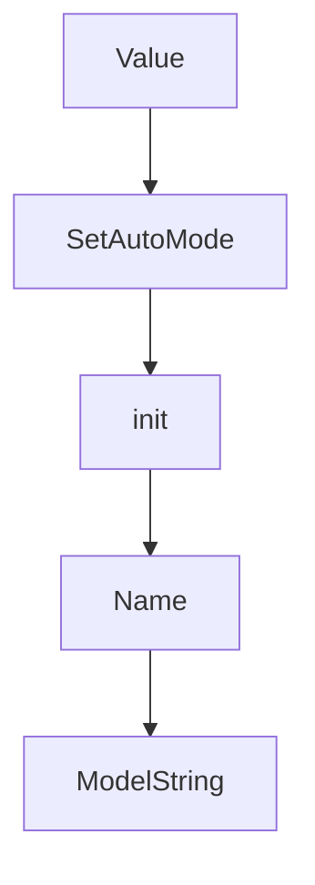

# Chapter 3: Context Management at Scale

Welcome to **Chapter 3: Context Management at Scale**. In this part of **Plandex Tutorial: Large-Task AI Coding Agent Workflows**, you will build an intuitive mental model first, then move into concrete implementation details and practical production tradeoffs.


Context management is Plandex's core advantage for large files and large codebases.

## Context Strategy

| Technique | Benefit |
|:----------|:--------|
| selective file loading | lower token waste |
| project mapping | scalable repository understanding |
| context caching | cost and latency reduction |

## Summary

You now have a context strategy for large-scale tasks in Plandex.

Next: [Chapter 4: Planning, Execution, and Diff Sandbox](04-planning-execution-and-diff-sandbox.md)

## Source Code Walkthrough

### `app/shared/plan_config.go`

The `Value` function in [`app/shared/plan_config.go`](https://github.com/plandex-ai/plandex/blob/HEAD/app/shared/plan_config.go) handles a key part of this chapter's functionality:

```go
}

func (p PlanConfig) Value() (driver.Value, error) {
	return json.Marshal(p)
}

func (p *PlanConfig) SetAutoMode(mode AutoModeType) {
	p.AutoMode = mode

	switch p.AutoMode {
	case AutoModeFull:
		p.AutoContinue = true
		p.AutoBuild = true
		p.AutoUpdateContext = true
		p.AutoLoadContext = true
		p.SmartContext = true
		p.AutoApply = true
		p.AutoCommit = true
		p.CanExec = true
		p.AutoExec = true
		p.AutoDebug = true
		p.AutoDebugTries = defaultAutoDebugTries
		p.AutoRevertOnRewind = true
		p.SkipChangesMenu = false

	case AutoModeSemi:
		p.AutoContinue = true
		p.AutoBuild = true
		p.AutoUpdateContext = true
		p.AutoLoadContext = true
		p.SmartContext = true
		p.AutoApply = false
```

This function is important because it defines how Plandex Tutorial: Large-Task AI Coding Agent Workflows implements the patterns covered in this chapter.

### `app/shared/plan_config.go`

The `SetAutoMode` function in [`app/shared/plan_config.go`](https://github.com/plandex-ai/plandex/blob/HEAD/app/shared/plan_config.go) handles a key part of this chapter's functionality:

```go
}

func (p *PlanConfig) SetAutoMode(mode AutoModeType) {
	p.AutoMode = mode

	switch p.AutoMode {
	case AutoModeFull:
		p.AutoContinue = true
		p.AutoBuild = true
		p.AutoUpdateContext = true
		p.AutoLoadContext = true
		p.SmartContext = true
		p.AutoApply = true
		p.AutoCommit = true
		p.CanExec = true
		p.AutoExec = true
		p.AutoDebug = true
		p.AutoDebugTries = defaultAutoDebugTries
		p.AutoRevertOnRewind = true
		p.SkipChangesMenu = false

	case AutoModeSemi:
		p.AutoContinue = true
		p.AutoBuild = true
		p.AutoUpdateContext = true
		p.AutoLoadContext = true
		p.SmartContext = true
		p.AutoApply = false
		p.AutoCommit = true
		p.CanExec = true
		p.AutoExec = false
		p.AutoDebug = false
```

This function is important because it defines how Plandex Tutorial: Large-Task AI Coding Agent Workflows implements the patterns covered in this chapter.

### `app/shared/plan_config.go`

The `init` function in [`app/shared/plan_config.go`](https://github.com/plandex-ai/plandex/blob/HEAD/app/shared/plan_config.go) handles a key part of this chapter's functionality:

```go
var AutoModeLabels = map[AutoModeType]string{}

// populated in init()
var AutoModeChoices []string

type PlanConfig struct {
	AutoMode AutoModeType `json:"autoMode"`
	// QuietMode bool         `json:"quietMode"`

	Editor             string   `json:"editor"`
	EditorCommand      string   `json:"editorCommand"`
	EditorArgs         []string `json:"editorArgs"`
	EditorOpenManually bool     `json:"editorOpenManually"`

	AutoContinue bool `json:"autoContinue"`
	AutoBuild    bool `json:"autoBuild"`

	AutoUpdateContext bool `json:"autoUpdateContext"`
	AutoLoadContext   bool `json:"autoContext"`
	SmartContext      bool `json:"smartContext"`

	// AutoApproveContext bool `json:"autoApproveContext"`
	// QuietContext       bool `json:"quietContext"`

	// AutoApprovePlan bool `json:"autoApprovePlan"`

	// QuietCoding    bool `json:"quietCoding"`
	// ParallelCoding bool `json:"parallelCoding"`

	AutoApply  bool `json:"autoApply"`
	AutoCommit bool `json:"autoCommit"`
	SkipCommit bool `json:"skipCommit"`
```

This function is important because it defines how Plandex Tutorial: Large-Task AI Coding Agent Workflows implements the patterns covered in this chapter.

### `app/shared/data_models.go`

The `Name` function in [`app/shared/data_models.go`](https://github.com/plandex-ai/plandex/blob/HEAD/app/shared/data_models.go) handles a key part of this chapter's functionality:

```go
type Org struct {
	Id                 string `json:"id"`
	Name               string `json:"name"`
	IsTrial            bool   `json:"isTrial"`
	AutoAddDomainUsers bool   `json:"autoAddDomainUsers"`

	// optional cloud attributes
	IntegratedModelsMode bool                `json:"integratedModelsMode,omitempty"`
	CloudBillingFields   *CloudBillingFields `json:"cloudBillingFields,omitempty"`
}

type User struct {
	Id               string `json:"id"`
	Name             string `json:"name"`
	Email            string `json:"email"`
	IsTrial          bool   `json:"isTrial"`
	NumNonDraftPlans int    `json:"numNonDraftPlans"`

	DefaultPlanConfig *PlanConfig `json:"defaultPlanConfig,omitempty"`
}

type OrgUser struct {
	OrgId     string `json:"orgId"`
	UserId    string `json:"userId"`
	OrgRoleId string `json:"orgRoleId"`

	Config *OrgUserConfig `json:"config,omitempty"`
}

type Invite struct {
	Id         string     `json:"id"`
	OrgId      string     `json:"orgId"`
```

This function is important because it defines how Plandex Tutorial: Large-Task AI Coding Agent Workflows implements the patterns covered in this chapter.


## How These Components Connect


