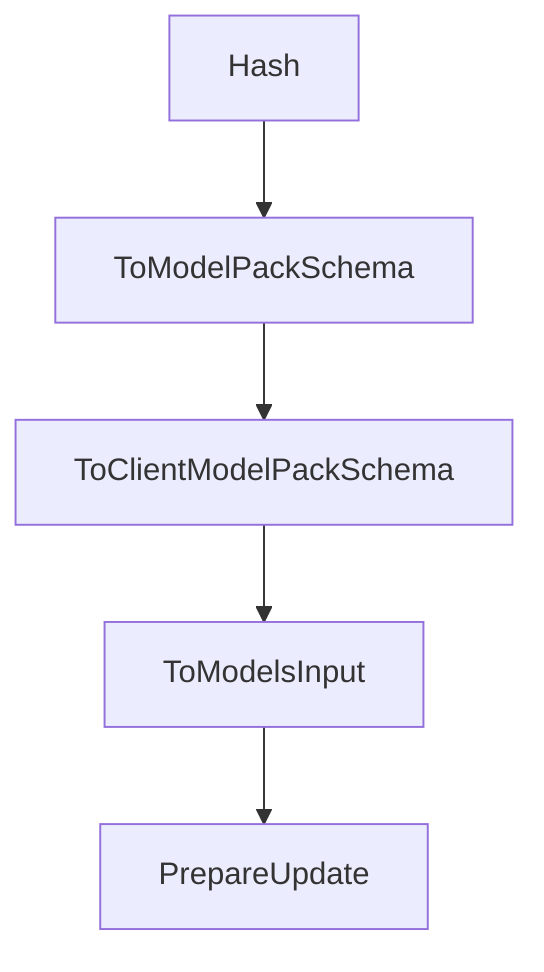

# Chapter 4: Planning, Execution, and Diff Sandbox

Welcome to **Chapter 4: Planning, Execution, and Diff Sandbox**. In this part of **Plandex Tutorial: Large-Task AI Coding Agent Workflows**, you will build an intuitive mental model first, then move into concrete implementation details and practical production tradeoffs.


Plandex keeps generated changes separate until they are reviewed, reducing risk in complex tasks.

## Safety Pattern

- execute in staged plan increments
- inspect cumulative diff output
- iterate before touching project files
- apply only after verification

## Summary

You now know how to use Plandex's review sandbox for safer high-impact changes.

Next: [Chapter 5: Model Packs and Provider Strategy](05-model-packs-and-provider-strategy.md)

## Depth Expansion Playbook

## Source Code Walkthrough

### `app/shared/ai_models_custom.go`

The `Hash` function in [`app/shared/ai_models_custom.go`](https://github.com/plandex-ai/plandex/blob/HEAD/app/shared/ai_models_custom.go) handles a key part of this chapter's functionality:

```go
}

// Hash returns a deterministic hash of the ModelsInput.
// WARNING: This relies on json.Marshal being deterministic for our struct types.
// Do not add map fields to these structs or the hash will become non-deterministic.
func (input ModelsInput) Hash() (string, error) {
	data, err := json.Marshal(input)
	if err != nil {
		return "", err
	}

	hash := sha256.Sum256(data)
	return hex.EncodeToString(hash[:]), nil
}

type ClientModelPackSchema struct {
	Name        string `json:"name"`
	Description string `json:"description"`

	ClientModelPackSchemaRoles
}

func (input *ClientModelPackSchema) ToModelPackSchema() *ModelPackSchema {
	return &ModelPackSchema{
		Name:                 input.Name,
		Description:          input.Description,
		ModelPackSchemaRoles: input.ClientModelPackSchemaRoles.ToModelPackSchemaRoles(),
	}
}

func (input *ModelPackSchema) ToClientModelPackSchema() *ClientModelPackSchema {
	return &ClientModelPackSchema{
```

This function is important because it defines how Plandex Tutorial: Large-Task AI Coding Agent Workflows implements the patterns covered in this chapter.

### `app/shared/ai_models_custom.go`

The `ToModelPackSchema` function in [`app/shared/ai_models_custom.go`](https://github.com/plandex-ai/plandex/blob/HEAD/app/shared/ai_models_custom.go) handles a key part of this chapter's functionality:

```go

func (mp *ModelPack) Equals(other *ModelPack) bool {
	return mp.ToModelPackSchema().Equals(other.ToModelPackSchema())
}

// Hash returns a deterministic hash of the ModelsInput.
// WARNING: This relies on json.Marshal being deterministic for our struct types.
// Do not add map fields to these structs or the hash will become non-deterministic.
func (input ModelsInput) Hash() (string, error) {
	data, err := json.Marshal(input)
	if err != nil {
		return "", err
	}

	hash := sha256.Sum256(data)
	return hex.EncodeToString(hash[:]), nil
}

type ClientModelPackSchema struct {
	Name        string `json:"name"`
	Description string `json:"description"`

	ClientModelPackSchemaRoles
}

func (input *ClientModelPackSchema) ToModelPackSchema() *ModelPackSchema {
	return &ModelPackSchema{
		Name:                 input.Name,
		Description:          input.Description,
		ModelPackSchemaRoles: input.ClientModelPackSchemaRoles.ToModelPackSchemaRoles(),
	}
}
```

This function is important because it defines how Plandex Tutorial: Large-Task AI Coding Agent Workflows implements the patterns covered in this chapter.

### `app/shared/ai_models_custom.go`

The `ToClientModelPackSchema` function in [`app/shared/ai_models_custom.go`](https://github.com/plandex-ai/plandex/blob/HEAD/app/shared/ai_models_custom.go) handles a key part of this chapter's functionality:

```go
}

func (input *ModelPackSchema) ToClientModelPackSchema() *ClientModelPackSchema {
	return &ClientModelPackSchema{
		Name:                       input.Name,
		Description:                input.Description,
		ClientModelPackSchemaRoles: input.ToClientModelPackSchemaRoles(),
	}
}

type ClientModelsInput struct {
	SchemaUrl SchemaUrl `json:"$schema"`

	CustomModels     []*CustomModel           `json:"models,omitempty"`
	CustomProviders  []*CustomProvider        `json:"providers,omitempty"`
	CustomModelPacks []*ClientModelPackSchema `json:"modelPacks,omitempty"`
}

func (input ClientModelsInput) ToModelsInput() ModelsInput {
	modelPacks := []*ModelPackSchema{}
	for _, pack := range input.CustomModelPacks {
		modelPacks = append(modelPacks, pack.ToModelPackSchema())
	}

	return ModelsInput{
		CustomModels:     input.CustomModels,
		CustomProviders:  input.CustomProviders,
		CustomModelPacks: modelPacks,
	}
}

func (input *ClientModelsInput) PrepareUpdate() {
```

This function is important because it defines how Plandex Tutorial: Large-Task AI Coding Agent Workflows implements the patterns covered in this chapter.

### `app/shared/ai_models_custom.go`

The `ToModelsInput` function in [`app/shared/ai_models_custom.go`](https://github.com/plandex-ai/plandex/blob/HEAD/app/shared/ai_models_custom.go) handles a key part of this chapter's functionality:

```go
}

func (input ClientModelsInput) ToModelsInput() ModelsInput {
	modelPacks := []*ModelPackSchema{}
	for _, pack := range input.CustomModelPacks {
		modelPacks = append(modelPacks, pack.ToModelPackSchema())
	}

	return ModelsInput{
		CustomModels:     input.CustomModels,
		CustomProviders:  input.CustomProviders,
		CustomModelPacks: modelPacks,
	}
}

func (input *ClientModelsInput) PrepareUpdate() {
	for _, model := range input.CustomModels {
		model.Id = ""
		model.CreatedAt = nil
		model.UpdatedAt = nil
	}

	for _, provider := range input.CustomProviders {
		provider.Id = ""
		provider.CreatedAt = nil
		provider.UpdatedAt = nil
	}
}

func (input ModelsInput) ToClientModelsInput() ClientModelsInput {
	clientModelPacks := []*ClientModelPackSchema{}
	for _, pack := range input.CustomModelPacks {
```

This function is important because it defines how Plandex Tutorial: Large-Task AI Coding Agent Workflows implements the patterns covered in this chapter.


## How These Components Connect


