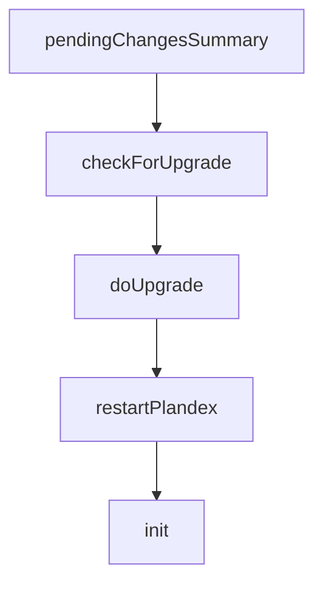

# Chapter 4: Planning, Execution, and Diff Sandbox

Welcome to **Chapter 4: Planning, Execution, and Diff Sandbox**. In this part of **Plandex Tutorial: Large-Task AI Coding Agent Workflows**, you will build an intuitive mental model first, then move into concrete implementation details and practical production tradeoffs.


Plandex keeps generated changes separate until they are reviewed, reducing risk in complex tasks.

## Safety Pattern

- execute in staged plan increments
- inspect cumulative diff output
- iterate before touching project files
- apply only after verification

## Summary

You now know how to use Plandex's review sandbox for safer high-impact changes.

Next: [Chapter 5: Model Packs and Provider Strategy](05-model-packs-and-provider-strategy.md)

## Source Code Walkthrough

### `app/shared/plan_result_pending_summary.go`

The `pendingChangesSummary` function in [`app/shared/plan_result_pending_summary.go`](https://github.com/plandex-ai/plandex/blob/HEAD/app/shared/plan_result_pending_summary.go) handles a key part of this chapter's functionality:

```go

func (state *CurrentPlanState) PendingChangesSummaryForBuild() string {
	return state.pendingChangesSummary(false, "")
}

func (state *CurrentPlanState) PendingChangesSummaryForApply(commitSummary string) string {
	return state.pendingChangesSummary(true, commitSummary)
}

func (state *CurrentPlanState) pendingChangesSummary(forApply bool, commitSummary string) string {
	var msgs []string

	descByConvoMessageId := make(map[string]*ConvoMessageDescription)

	for _, desc := range state.ConvoMessageDescriptions {
		if desc.ConvoMessageId == "" {
			log.Println("Warning: ConvoMessageId is empty for description:", desc)
			continue
		}

		descByConvoMessageId[desc.ConvoMessageId] = desc
	}

	type changeset struct {
		descsSet map[string]bool
		descs    []*ConvoMessageDescription
		results  []*PlanFileResult
	}
	byDescs := map[string]*changeset{}

	for _, result := range state.PlanResult.Results {
		// log.Println("result:")
```

This function is important because it defines how Plandex Tutorial: Large-Task AI Coding Agent Workflows implements the patterns covered in this chapter.

### `app/cli/upgrade.go`

The `checkForUpgrade` function in [`app/cli/upgrade.go`](https://github.com/plandex-ai/plandex/blob/HEAD/app/cli/upgrade.go) handles a key part of this chapter's functionality:

```go
)

func checkForUpgrade() {
	if os.Getenv("PLANDEX_SKIP_UPGRADE") != "" {
		return
	}

	if version.Version == "development" {
		return
	}

	term.StartSpinner("")
	defer term.StopSpinner()
	ctx, cancel := context.WithTimeout(context.Background(), 5*time.Second)
	defer cancel()
	latestVersionURL := "https://plandex.ai/v2/cli-version.txt"
	req, err := http.NewRequestWithContext(ctx, http.MethodGet, latestVersionURL, nil)
	if err != nil {
		log.Println("Error creating request:", err)
		return
	}
	resp, err := http.DefaultClient.Do(req)
	if err != nil {
		log.Println("Error checking latest version:", err)
		return
	}
	defer resp.Body.Close()

	body, err := io.ReadAll(resp.Body)
	if err != nil {
		log.Println("Error reading response body:", err)
		return
```

This function is important because it defines how Plandex Tutorial: Large-Task AI Coding Agent Workflows implements the patterns covered in this chapter.

### `app/cli/upgrade.go`

The `doUpgrade` function in [`app/cli/upgrade.go`](https://github.com/plandex-ai/plandex/blob/HEAD/app/cli/upgrade.go) handles a key part of this chapter's functionality:

```go
		if confirmed {
			term.ResumeSpinner()
			err := doUpgrade(latestVersion.String())
			if err != nil {
				term.OutputErrorAndExit("Failed to upgrade: %v", err)
				return
			}
			term.StopSpinner()
			restartPlandex()
		} else {
			fmt.Println("Note: set PLANDEX_SKIP_UPGRADE=1 to stop upgrade prompts")
		}
	}
}

func doUpgrade(version string) error {
	tag := fmt.Sprintf("cli/v%s", version)
	escapedTag := url.QueryEscape(tag)

	downloadURL := fmt.Sprintf("https://github.com/plandex-ai/plandex/releases/download/%s/plandex_%s_%s_%s.tar.gz", escapedTag, version, runtime.GOOS, runtime.GOARCH)
	resp, err := http.Get(downloadURL)
	if err != nil {
		return fmt.Errorf("failed to download the update: %w", err)
	}
	defer resp.Body.Close()

	// Create a temporary file to save the downloaded archive
	tempFile, err := os.CreateTemp("", "*.tar.gz")
	if err != nil {
		return fmt.Errorf("failed to create temporary file: %w", err)
	}
	defer os.Remove(tempFile.Name()) // Clean up file afterwards
```

This function is important because it defines how Plandex Tutorial: Large-Task AI Coding Agent Workflows implements the patterns covered in this chapter.

### `app/cli/upgrade.go`

The `restartPlandex` function in [`app/cli/upgrade.go`](https://github.com/plandex-ai/plandex/blob/HEAD/app/cli/upgrade.go) handles a key part of this chapter's functionality:

```go
			}
			term.StopSpinner()
			restartPlandex()
		} else {
			fmt.Println("Note: set PLANDEX_SKIP_UPGRADE=1 to stop upgrade prompts")
		}
	}
}

func doUpgrade(version string) error {
	tag := fmt.Sprintf("cli/v%s", version)
	escapedTag := url.QueryEscape(tag)

	downloadURL := fmt.Sprintf("https://github.com/plandex-ai/plandex/releases/download/%s/plandex_%s_%s_%s.tar.gz", escapedTag, version, runtime.GOOS, runtime.GOARCH)
	resp, err := http.Get(downloadURL)
	if err != nil {
		return fmt.Errorf("failed to download the update: %w", err)
	}
	defer resp.Body.Close()

	// Create a temporary file to save the downloaded archive
	tempFile, err := os.CreateTemp("", "*.tar.gz")
	if err != nil {
		return fmt.Errorf("failed to create temporary file: %w", err)
	}
	defer os.Remove(tempFile.Name()) // Clean up file afterwards

	// Copy the response body to the temporary file
	_, err = io.Copy(tempFile, resp.Body)
	if err != nil {
		return fmt.Errorf("failed to save the downloaded archive: %w", err)
	}
```

This function is important because it defines how Plandex Tutorial: Large-Task AI Coding Agent Workflows implements the patterns covered in this chapter.


## How These Components Connect


