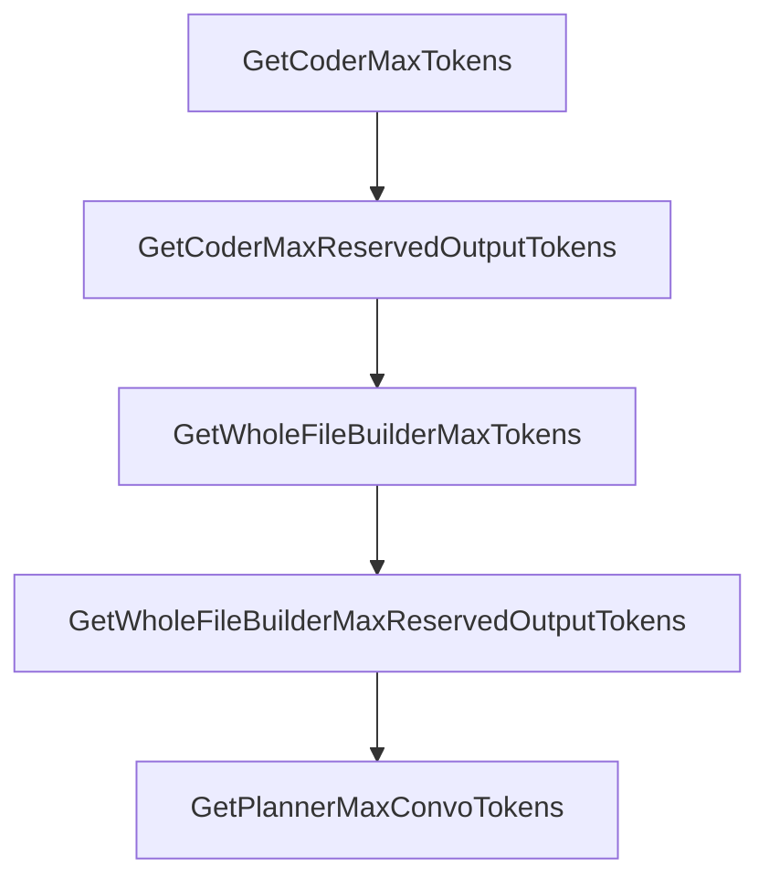

# Chapter 5: Model Packs and Provider Strategy

Welcome to **Chapter 5: Model Packs and Provider Strategy**. In this part of **Plandex Tutorial: Large-Task AI Coding Agent Workflows**, you will build an intuitive mental model first, then move into concrete implementation details and practical production tradeoffs.


Plandex supports combining models across providers to optimize quality, speed, and cost.

## Strategy Tips

- use curated model packs as baseline
- test provider combinations on representative tasks
- track cost and latency by task class

## Summary

You now have a model strategy framework for production Plandex usage.

Next: [Chapter 6: Autonomy, Control, and Debugging](06-autonomy-control-and-debugging.md)

## Depth Expansion Playbook

## Source Code Walkthrough

### `app/shared/plan_model_settings.go`

The `GetCoderMaxTokens` function in [`app/shared/plan_model_settings.go`](https://github.com/plandex-ai/plandex/blob/HEAD/app/shared/plan_model_settings.go) handles a key part of this chapter's functionality:

```go
}

func (ps PlanSettings) GetCoderMaxTokens() int {
	modelPack := ps.GetModelPack()
	coder := modelPack.GetCoder()
	fallback := coder.GetFinalLargeContextFallback()
	return fallback.GetSharedBaseConfig(&ps).MaxTokens
}

func (ps PlanSettings) GetCoderMaxReservedOutputTokens() int {
	modelPack := ps.GetModelPack()
	coder := modelPack.GetCoder()
	fallback := coder.GetFinalLargeContextFallback()
	return fallback.GetReservedOutputTokens(ps.CustomModelsById)
}

func (ps PlanSettings) GetWholeFileBuilderMaxTokens() int {
	modelPack := ps.GetModelPack()
	builder := modelPack.GetWholeFileBuilder()
	fallback := builder.GetFinalLargeContextFallback()
	return fallback.GetSharedBaseConfig(&ps).MaxTokens
}

func (ps PlanSettings) GetWholeFileBuilderMaxReservedOutputTokens() int {
	modelPack := ps.GetModelPack()
	builder := modelPack.GetWholeFileBuilder()
	fallback := builder.GetFinalLargeOutputFallback()
	return fallback.GetReservedOutputTokens(ps.CustomModelsById)
}

func (ps PlanSettings) GetPlannerMaxConvoTokens() int {
	modelPack := ps.GetModelPack()
```

This function is important because it defines how Plandex Tutorial: Large-Task AI Coding Agent Workflows implements the patterns covered in this chapter.

### `app/shared/plan_model_settings.go`

The `GetCoderMaxReservedOutputTokens` function in [`app/shared/plan_model_settings.go`](https://github.com/plandex-ai/plandex/blob/HEAD/app/shared/plan_model_settings.go) handles a key part of this chapter's functionality:

```go
}

func (ps PlanSettings) GetCoderMaxReservedOutputTokens() int {
	modelPack := ps.GetModelPack()
	coder := modelPack.GetCoder()
	fallback := coder.GetFinalLargeContextFallback()
	return fallback.GetReservedOutputTokens(ps.CustomModelsById)
}

func (ps PlanSettings) GetWholeFileBuilderMaxTokens() int {
	modelPack := ps.GetModelPack()
	builder := modelPack.GetWholeFileBuilder()
	fallback := builder.GetFinalLargeContextFallback()
	return fallback.GetSharedBaseConfig(&ps).MaxTokens
}

func (ps PlanSettings) GetWholeFileBuilderMaxReservedOutputTokens() int {
	modelPack := ps.GetModelPack()
	builder := modelPack.GetWholeFileBuilder()
	fallback := builder.GetFinalLargeOutputFallback()
	return fallback.GetReservedOutputTokens(ps.CustomModelsById)
}

func (ps PlanSettings) GetPlannerMaxConvoTokens() int {
	modelPack := ps.GetModelPack()

	// for max convo tokens, we use the planner's default max convo tokens, *not* the fallback, so that we don't end up switching to the fallback just based on the conversation length
	planner := modelPack.Planner
	if planner.MaxConvoTokens != 0 {
		return planner.MaxConvoTokens
	}

```

This function is important because it defines how Plandex Tutorial: Large-Task AI Coding Agent Workflows implements the patterns covered in this chapter.

### `app/shared/plan_model_settings.go`

The `GetWholeFileBuilderMaxTokens` function in [`app/shared/plan_model_settings.go`](https://github.com/plandex-ai/plandex/blob/HEAD/app/shared/plan_model_settings.go) handles a key part of this chapter's functionality:

```go
}

func (ps PlanSettings) GetWholeFileBuilderMaxTokens() int {
	modelPack := ps.GetModelPack()
	builder := modelPack.GetWholeFileBuilder()
	fallback := builder.GetFinalLargeContextFallback()
	return fallback.GetSharedBaseConfig(&ps).MaxTokens
}

func (ps PlanSettings) GetWholeFileBuilderMaxReservedOutputTokens() int {
	modelPack := ps.GetModelPack()
	builder := modelPack.GetWholeFileBuilder()
	fallback := builder.GetFinalLargeOutputFallback()
	return fallback.GetReservedOutputTokens(ps.CustomModelsById)
}

func (ps PlanSettings) GetPlannerMaxConvoTokens() int {
	modelPack := ps.GetModelPack()

	// for max convo tokens, we use the planner's default max convo tokens, *not* the fallback, so that we don't end up switching to the fallback just based on the conversation length
	planner := modelPack.Planner
	if planner.MaxConvoTokens != 0 {
		return planner.MaxConvoTokens
	}

	return planner.GetSharedBaseConfig(&ps).DefaultMaxConvoTokens
}

func (ps PlanSettings) GetPlannerEffectiveMaxTokens() int {
	maxPlannerTokens := ps.GetPlannerMaxTokens()
	maxReservedOutputTokens := ps.GetPlannerMaxReservedOutputTokens()

```

This function is important because it defines how Plandex Tutorial: Large-Task AI Coding Agent Workflows implements the patterns covered in this chapter.

### `app/shared/plan_model_settings.go`

The `GetWholeFileBuilderMaxReservedOutputTokens` function in [`app/shared/plan_model_settings.go`](https://github.com/plandex-ai/plandex/blob/HEAD/app/shared/plan_model_settings.go) handles a key part of this chapter's functionality:

```go
}

func (ps PlanSettings) GetWholeFileBuilderMaxReservedOutputTokens() int {
	modelPack := ps.GetModelPack()
	builder := modelPack.GetWholeFileBuilder()
	fallback := builder.GetFinalLargeOutputFallback()
	return fallback.GetReservedOutputTokens(ps.CustomModelsById)
}

func (ps PlanSettings) GetPlannerMaxConvoTokens() int {
	modelPack := ps.GetModelPack()

	// for max convo tokens, we use the planner's default max convo tokens, *not* the fallback, so that we don't end up switching to the fallback just based on the conversation length
	planner := modelPack.Planner
	if planner.MaxConvoTokens != 0 {
		return planner.MaxConvoTokens
	}

	return planner.GetSharedBaseConfig(&ps).DefaultMaxConvoTokens
}

func (ps PlanSettings) GetPlannerEffectiveMaxTokens() int {
	maxPlannerTokens := ps.GetPlannerMaxTokens()
	maxReservedOutputTokens := ps.GetPlannerMaxReservedOutputTokens()

	return maxPlannerTokens - maxReservedOutputTokens
}

func (ps PlanSettings) GetArchitectEffectiveMaxTokens() int {
	maxArchitectTokens := ps.GetArchitectMaxTokens()
	maxReservedOutputTokens := ps.GetArchitectMaxReservedOutputTokens()

```

This function is important because it defines how Plandex Tutorial: Large-Task AI Coding Agent Workflows implements the patterns covered in this chapter.


## How These Components Connect


