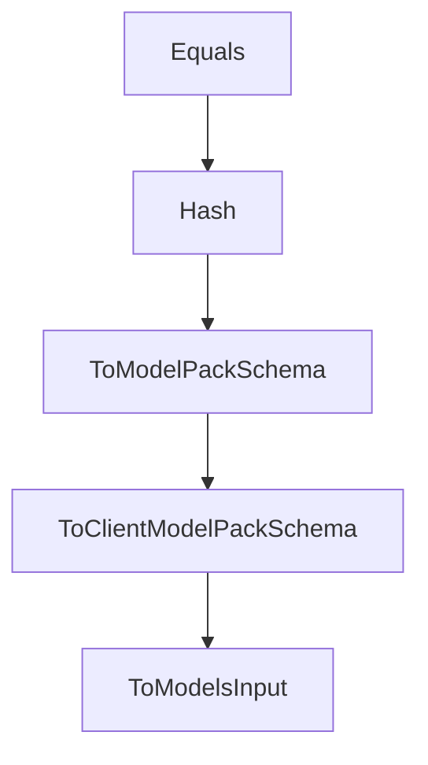

# Chapter 6: Autonomy, Control, and Debugging

Welcome to **Chapter 6: Autonomy, Control, and Debugging**. In this part of **Plandex Tutorial: Large-Task AI Coding Agent Workflows**, you will build an intuitive mental model first, then move into concrete implementation details and practical production tradeoffs.


Plandex supports both high autonomy and fine-grained control modes depending on task risk.

## Control Spectrum

| Mode | Best For |
|:-----|:---------|
| high autonomy | repetitive, low-risk implementation loops |
| guided control | high-risk refactors and complex migrations |

## Summary

You now know how to choose the right autonomy level and debugging posture per task.

Next: [Chapter 7: Git, Branching, and Review Workflows](07-git-branching-and-review-workflows.md)

## Source Code Walkthrough

### `app/shared/ai_models_custom.go`

The `Equals` function in [`app/shared/ai_models_custom.go`](https://github.com/plandex-ai/plandex/blob/HEAD/app/shared/ai_models_custom.go) handles a key part of this chapter's functionality:

```go
}

func (input ModelsInput) Equals(other ModelsInput) bool {
	left := input.FilterUnchanged(&other)
	right := other.FilterUnchanged(&input)

	return left.IsEmpty() && right.IsEmpty()
}

func (input ModelsInput) CheckNoDuplicates() (bool, string) {
	sawModelIds := map[ModelId]bool{}
	sawProviderNames := map[string]bool{}
	sawPackNames := map[string]bool{}

	builder := strings.Builder{}

	for _, provider := range input.CustomProviders {
		if _, ok := sawProviderNames[provider.Name]; ok {
			builder.WriteString(fmt.Sprintf("• Provider %s is duplicated\n", provider.Name))
		}
		sawProviderNames[provider.Name] = true
	}

	for _, model := range input.CustomModels {
		if _, ok := sawModelIds[model.ModelId]; ok {
			builder.WriteString(fmt.Sprintf("• Model %s is duplicated\n", model.ModelId))
		}
		sawModelIds[model.ModelId] = true
	}

	for _, pack := range input.CustomModelPacks {
		if _, ok := sawPackNames[pack.Name]; ok {
```

This function is important because it defines how Plandex Tutorial: Large-Task AI Coding Agent Workflows implements the patterns covered in this chapter.

### `app/shared/ai_models_custom.go`

The `Hash` function in [`app/shared/ai_models_custom.go`](https://github.com/plandex-ai/plandex/blob/HEAD/app/shared/ai_models_custom.go) handles a key part of this chapter's functionality:

```go
}

// Hash returns a deterministic hash of the ModelsInput.
// WARNING: This relies on json.Marshal being deterministic for our struct types.
// Do not add map fields to these structs or the hash will become non-deterministic.
func (input ModelsInput) Hash() (string, error) {
	data, err := json.Marshal(input)
	if err != nil {
		return "", err
	}

	hash := sha256.Sum256(data)
	return hex.EncodeToString(hash[:]), nil
}

type ClientModelPackSchema struct {
	Name        string `json:"name"`
	Description string `json:"description"`

	ClientModelPackSchemaRoles
}

func (input *ClientModelPackSchema) ToModelPackSchema() *ModelPackSchema {
	return &ModelPackSchema{
		Name:                 input.Name,
		Description:          input.Description,
		ModelPackSchemaRoles: input.ClientModelPackSchemaRoles.ToModelPackSchemaRoles(),
	}
}

func (input *ModelPackSchema) ToClientModelPackSchema() *ClientModelPackSchema {
	return &ClientModelPackSchema{
```

This function is important because it defines how Plandex Tutorial: Large-Task AI Coding Agent Workflows implements the patterns covered in this chapter.

### `app/shared/ai_models_custom.go`

The `ToModelPackSchema` function in [`app/shared/ai_models_custom.go`](https://github.com/plandex-ai/plandex/blob/HEAD/app/shared/ai_models_custom.go) handles a key part of this chapter's functionality:

```go

func (mp *ModelPack) Equals(other *ModelPack) bool {
	return mp.ToModelPackSchema().Equals(other.ToModelPackSchema())
}

// Hash returns a deterministic hash of the ModelsInput.
// WARNING: This relies on json.Marshal being deterministic for our struct types.
// Do not add map fields to these structs or the hash will become non-deterministic.
func (input ModelsInput) Hash() (string, error) {
	data, err := json.Marshal(input)
	if err != nil {
		return "", err
	}

	hash := sha256.Sum256(data)
	return hex.EncodeToString(hash[:]), nil
}

type ClientModelPackSchema struct {
	Name        string `json:"name"`
	Description string `json:"description"`

	ClientModelPackSchemaRoles
}

func (input *ClientModelPackSchema) ToModelPackSchema() *ModelPackSchema {
	return &ModelPackSchema{
		Name:                 input.Name,
		Description:          input.Description,
		ModelPackSchemaRoles: input.ClientModelPackSchemaRoles.ToModelPackSchemaRoles(),
	}
}
```

This function is important because it defines how Plandex Tutorial: Large-Task AI Coding Agent Workflows implements the patterns covered in this chapter.

### `app/shared/ai_models_custom.go`

The `ToClientModelPackSchema` function in [`app/shared/ai_models_custom.go`](https://github.com/plandex-ai/plandex/blob/HEAD/app/shared/ai_models_custom.go) handles a key part of this chapter's functionality:

```go
}

func (input *ModelPackSchema) ToClientModelPackSchema() *ClientModelPackSchema {
	return &ClientModelPackSchema{
		Name:                       input.Name,
		Description:                input.Description,
		ClientModelPackSchemaRoles: input.ToClientModelPackSchemaRoles(),
	}
}

type ClientModelsInput struct {
	SchemaUrl SchemaUrl `json:"$schema"`

	CustomModels     []*CustomModel           `json:"models,omitempty"`
	CustomProviders  []*CustomProvider        `json:"providers,omitempty"`
	CustomModelPacks []*ClientModelPackSchema `json:"modelPacks,omitempty"`
}

func (input ClientModelsInput) ToModelsInput() ModelsInput {
	modelPacks := []*ModelPackSchema{}
	for _, pack := range input.CustomModelPacks {
		modelPacks = append(modelPacks, pack.ToModelPackSchema())
	}

	return ModelsInput{
		CustomModels:     input.CustomModels,
		CustomProviders:  input.CustomProviders,
		CustomModelPacks: modelPacks,
	}
}

func (input *ClientModelsInput) PrepareUpdate() {
```

This function is important because it defines how Plandex Tutorial: Large-Task AI Coding Agent Workflows implements the patterns covered in this chapter.


## How These Components Connect


