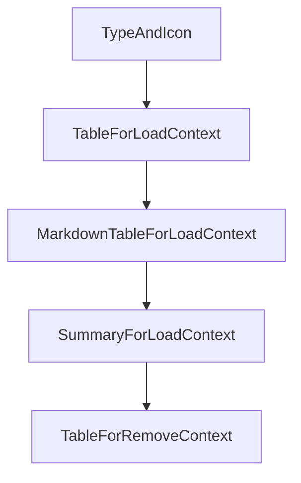

# Chapter 6: Autonomy, Control, and Debugging

Welcome to **Chapter 6: Autonomy, Control, and Debugging**. In this part of **Plandex Tutorial: Large-Task AI Coding Agent Workflows**, you will build an intuitive mental model first, then move into concrete implementation details and practical production tradeoffs.


Plandex supports both high autonomy and fine-grained control modes depending on task risk.

## Control Spectrum

| Mode | Best For |
|:-----|:---------|
| high autonomy | repetitive, low-risk implementation loops |
| guided control | high-risk refactors and complex migrations |

## Summary

You now know how to choose the right autonomy level and debugging posture per task.

Next: [Chapter 7: Git, Branching, and Review Workflows](07-git-branching-and-review-workflows.md)

## Depth Expansion Playbook

## Source Code Walkthrough

### `app/shared/context.go`

The `TypeAndIcon` function in [`app/shared/context.go`](https://github.com/plandex-ai/plandex/blob/HEAD/app/shared/context.go) handles a key part of this chapter's functionality:

```go
}

func (c *Context) TypeAndIcon() (string, string) {
	var icon string
	var t string
	switch c.ContextType {
	case ContextFileType:
		icon = "📄"
		t = "file"
	case ContextURLType:
		icon = "🌎"
		t = "url"
	case ContextDirectoryTreeType:
		icon = "🗂 "
		t = "tree"
	case ContextNoteType:
		icon = "✏️ "
		t = "note"
	case ContextPipedDataType:
		icon = "↔️ "
		t = "piped"
	case ContextImageType:
		icon = "🖼️ "
		t = "image"
	case ContextMapType:
		icon = "🗺️ "
		t = "map"
	}

	return t, icon
}

```

This function is important because it defines how Plandex Tutorial: Large-Task AI Coding Agent Workflows implements the patterns covered in this chapter.

### `app/shared/context.go`

The `TableForLoadContext` function in [`app/shared/context.go`](https://github.com/plandex-ai/plandex/blob/HEAD/app/shared/context.go) handles a key part of this chapter's functionality:

```go
}

func TableForLoadContext(contexts []*Context, plaintext bool) string {
	tableString := &strings.Builder{}
	table := tablewriter.NewWriter(tableString)
	table.SetHeader([]string{"Name", "Type", "🪙"})
	table.SetAutoWrapText(false)

	for _, context := range contexts {
		t, icon := context.TypeAndIcon()
		row := []string{
			" " + icon + " " + context.Name,
			t,
			"+" + strconv.Itoa(context.NumTokens),
		}

		if !plaintext {
			table.Rich(row, []tablewriter.Colors{
				{tablewriter.FgHiGreenColor, tablewriter.Bold},
				{tablewriter.FgHiGreenColor},
				{tablewriter.FgHiGreenColor},
			})
		} else {
			table.Append(row)
		}
	}

	table.Render()

	return strings.TrimSpace(tableString.String())
}

```

This function is important because it defines how Plandex Tutorial: Large-Task AI Coding Agent Workflows implements the patterns covered in this chapter.

### `app/shared/context.go`

The `MarkdownTableForLoadContext` function in [`app/shared/context.go`](https://github.com/plandex-ai/plandex/blob/HEAD/app/shared/context.go) handles a key part of this chapter's functionality:

```go
}

func MarkdownTableForLoadContext(contexts []*Context) string {
	var sb strings.Builder
	sb.WriteString("| Name | Type | 🪙 |\n")
	sb.WriteString("|------|------|----|\n")

	for _, context := range contexts {
		t, icon := context.TypeAndIcon()
		sb.WriteString(fmt.Sprintf("| %s %s | %s | +%d |\n",
			icon, context.Name, t, context.NumTokens))
	}

	return sb.String()
}

func SummaryForLoadContext(contexts []*Context, tokensAdded, totalTokens int) string {

	var hasNote bool
	var hasPiped bool

	var numFiles int
	var numTrees int
	var numUrls int
	var numMaps int

	for _, context := range contexts {
		switch context.ContextType {
		case ContextFileType:
			numFiles++
		case ContextURLType:
			numUrls++
```

This function is important because it defines how Plandex Tutorial: Large-Task AI Coding Agent Workflows implements the patterns covered in this chapter.

### `app/shared/context.go`

The `SummaryForLoadContext` function in [`app/shared/context.go`](https://github.com/plandex-ai/plandex/blob/HEAD/app/shared/context.go) handles a key part of this chapter's functionality:

```go
}

func SummaryForLoadContext(contexts []*Context, tokensAdded, totalTokens int) string {

	var hasNote bool
	var hasPiped bool

	var numFiles int
	var numTrees int
	var numUrls int
	var numMaps int

	for _, context := range contexts {
		switch context.ContextType {
		case ContextFileType:
			numFiles++
		case ContextURLType:
			numUrls++
		case ContextDirectoryTreeType:
			numTrees++
		case ContextNoteType:
			hasNote = true
		case ContextPipedDataType:
			hasPiped = true
		case ContextMapType:
			numMaps++
		}
	}

	var added []string

	if hasNote {
```

This function is important because it defines how Plandex Tutorial: Large-Task AI Coding Agent Workflows implements the patterns covered in this chapter.


## How These Components Connect


