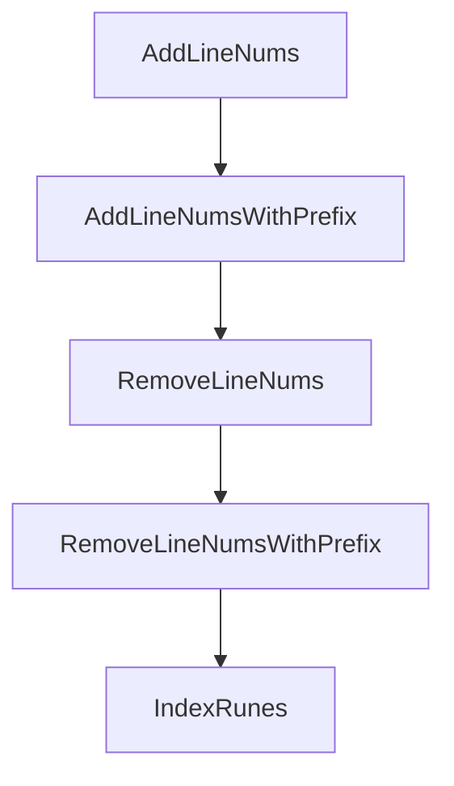

# Chapter 7: Git, Branching, and Review Workflows

Welcome to **Chapter 7: Git, Branching, and Review Workflows**. In this part of **Plandex Tutorial: Large-Task AI Coding Agent Workflows**, you will build an intuitive mental model first, then move into concrete implementation details and practical production tradeoffs.


Plandex integrates with Git-oriented team workflows for reviewable and reversible delivery.

## Team Workflow Pattern

1. branch per task stream
2. run sandbox review + tests
3. commit with structured messages
4. open PR with change rationale and validation

## Summary

You now have a repeatable review workflow for team-scale Plandex adoption.

Next: [Chapter 8: Self-Hosting and Production Operations](08-self-hosting-and-production-operations.md)

## Depth Expansion Playbook

## Source Code Walkthrough

### `app/shared/utils.go`

The `AddLineNums` function in [`app/shared/utils.go`](https://github.com/plandex-ai/plandex/blob/HEAD/app/shared/utils.go) handles a key part of this chapter's functionality:

```go
type LineNumberedTextType string

func AddLineNums(s string) LineNumberedTextType {
	return LineNumberedTextType(AddLineNumsWithPrefix(s, "pdx-"))
}

func AddLineNumsWithPrefix(s, prefix string) LineNumberedTextType {
	var res string
	for i, line := range strings.Split(s, "\n") {
		res += fmt.Sprintf("%s%d: %s\n", prefix, i+1, line)
	}
	return LineNumberedTextType(res)
}

func RemoveLineNums(s LineNumberedTextType) string {
	return RemoveLineNumsWithPrefix(s, "pdx-")
}

func RemoveLineNumsWithPrefix(s LineNumberedTextType, prefix string) string {
	return regexp.MustCompile(fmt.Sprintf(`(?m)^%s\d+: `, prefix)).ReplaceAllString(string(s), "")
}

// indexRunes searches for the slice of runes `needle` in the slice of runes `haystack`
// and returns the index of the first rune of `needle` in `haystack`, or -1 if `needle` is not present.
func IndexRunes(haystack []rune, needle []rune) int {
	if len(needle) == 0 {
		return 0
	}
	if len(haystack) == 0 {
		return -1
	}

```

This function is important because it defines how Plandex Tutorial: Large-Task AI Coding Agent Workflows implements the patterns covered in this chapter.

### `app/shared/utils.go`

The `AddLineNumsWithPrefix` function in [`app/shared/utils.go`](https://github.com/plandex-ai/plandex/blob/HEAD/app/shared/utils.go) handles a key part of this chapter's functionality:

```go

func AddLineNums(s string) LineNumberedTextType {
	return LineNumberedTextType(AddLineNumsWithPrefix(s, "pdx-"))
}

func AddLineNumsWithPrefix(s, prefix string) LineNumberedTextType {
	var res string
	for i, line := range strings.Split(s, "\n") {
		res += fmt.Sprintf("%s%d: %s\n", prefix, i+1, line)
	}
	return LineNumberedTextType(res)
}

func RemoveLineNums(s LineNumberedTextType) string {
	return RemoveLineNumsWithPrefix(s, "pdx-")
}

func RemoveLineNumsWithPrefix(s LineNumberedTextType, prefix string) string {
	return regexp.MustCompile(fmt.Sprintf(`(?m)^%s\d+: `, prefix)).ReplaceAllString(string(s), "")
}

// indexRunes searches for the slice of runes `needle` in the slice of runes `haystack`
// and returns the index of the first rune of `needle` in `haystack`, or -1 if `needle` is not present.
func IndexRunes(haystack []rune, needle []rune) int {
	if len(needle) == 0 {
		return 0
	}
	if len(haystack) == 0 {
		return -1
	}

	// Search for the needle
```

This function is important because it defines how Plandex Tutorial: Large-Task AI Coding Agent Workflows implements the patterns covered in this chapter.

### `app/shared/utils.go`

The `RemoveLineNums` function in [`app/shared/utils.go`](https://github.com/plandex-ai/plandex/blob/HEAD/app/shared/utils.go) handles a key part of this chapter's functionality:

```go
}

func RemoveLineNums(s LineNumberedTextType) string {
	return RemoveLineNumsWithPrefix(s, "pdx-")
}

func RemoveLineNumsWithPrefix(s LineNumberedTextType, prefix string) string {
	return regexp.MustCompile(fmt.Sprintf(`(?m)^%s\d+: `, prefix)).ReplaceAllString(string(s), "")
}

// indexRunes searches for the slice of runes `needle` in the slice of runes `haystack`
// and returns the index of the first rune of `needle` in `haystack`, or -1 if `needle` is not present.
func IndexRunes(haystack []rune, needle []rune) int {
	if len(needle) == 0 {
		return 0
	}
	if len(haystack) == 0 {
		return -1
	}

	// Search for the needle
	for i := 0; i <= len(haystack)-len(needle); i++ {
		found := true
		for j := 0; j < len(needle); j++ {
			if haystack[i+j] != needle[j] {
				found = false
				break
			}
		}
		if found {
			return i
		}
```

This function is important because it defines how Plandex Tutorial: Large-Task AI Coding Agent Workflows implements the patterns covered in this chapter.

### `app/shared/utils.go`

The `RemoveLineNumsWithPrefix` function in [`app/shared/utils.go`](https://github.com/plandex-ai/plandex/blob/HEAD/app/shared/utils.go) handles a key part of this chapter's functionality:

```go

func RemoveLineNums(s LineNumberedTextType) string {
	return RemoveLineNumsWithPrefix(s, "pdx-")
}

func RemoveLineNumsWithPrefix(s LineNumberedTextType, prefix string) string {
	return regexp.MustCompile(fmt.Sprintf(`(?m)^%s\d+: `, prefix)).ReplaceAllString(string(s), "")
}

// indexRunes searches for the slice of runes `needle` in the slice of runes `haystack`
// and returns the index of the first rune of `needle` in `haystack`, or -1 if `needle` is not present.
func IndexRunes(haystack []rune, needle []rune) int {
	if len(needle) == 0 {
		return 0
	}
	if len(haystack) == 0 {
		return -1
	}

	// Search for the needle
	for i := 0; i <= len(haystack)-len(needle); i++ {
		found := true
		for j := 0; j < len(needle); j++ {
			if haystack[i+j] != needle[j] {
				found = false
				break
			}
		}
		if found {
			return i
		}
	}
```

This function is important because it defines how Plandex Tutorial: Large-Task AI Coding Agent Workflows implements the patterns covered in this chapter.


## How These Components Connect


