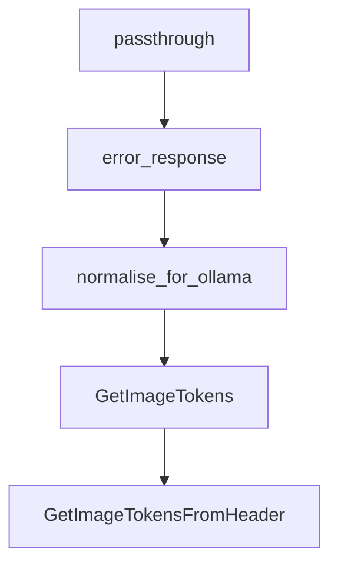

# Chapter 8: Self-Hosting and Production Operations

Welcome to **Chapter 8: Self-Hosting and Production Operations**. In this part of **Plandex Tutorial: Large-Task AI Coding Agent Workflows**, you will build an intuitive mental model first, then move into concrete implementation details and practical production tradeoffs.


This chapter covers local/self-hosted operation patterns for production-grade Plandex usage.

## Operations Checklist

- isolate secrets and provider keys by environment
- monitor task success, retry, and rollback rates
- keep release process tied to eval + review gates

## Source References

- [Plandex Self-Hosting Quickstart](https://docs.plandex.ai/hosting/self-hosting/local-mode-quickstart)
- [Plandex Docs](https://docs.plandex.ai/)

## Summary

You now have an operations baseline for running Plandex as a serious engineering tool.

## Depth Expansion Playbook

## Source Code Walkthrough

### `app/server/litellm_proxy.py`

The `passthrough` function in [`app/server/litellm_proxy.py`](https://github.com/plandex-ai/plandex/blob/HEAD/app/server/litellm_proxy.py) handles a key part of this chapter's functionality:

```py

@app.post("/v1/chat/completions")
async def passthrough(request: Request):
  payload = await request.json()

  if LOGGING_ENABLED:
    # Log the request data for debugging
    try:
      # Get headers (excluding authorization to avoid logging credentials)
      headers = dict(request.headers)
      if "Authorization" in headers:
        headers["Authorization"] = "Bearer [REDACTED]"
      if "api-key" in headers:
        headers["api-key"] = "[REDACTED]"
      
      # Create a log-friendly representation
      request_data = {
        "method": request.method,
        "url": str(request.url),
        "headers": headers,
        "body": payload
      }
    
      # Log the request data
      print("Incoming request to /v1/chat/completions:")
      print(json.dumps(request_data, indent=2))
    except Exception as e:
      print(f"Error logging request: {str(e)}")

  model = payload.get("model", None)
  print(f"Litellm proxy: calling model: {model}")

```

This function is important because it defines how Plandex Tutorial: Large-Task AI Coding Agent Workflows implements the patterns covered in this chapter.

### `app/server/litellm_proxy.py`

The `error_response` function in [`app/server/litellm_proxy.py`](https://github.com/plandex-ai/plandex/blob/HEAD/app/server/litellm_proxy.py) handles a key part of this chapter's functionality:

```py
        response_stream = completion(api_key=api_key, **payload)
      except Exception as e:
        return error_response(e)
      def stream_generator():
        try:  
          for chunk in response_stream:
            yield f"data: {json.dumps(chunk.to_dict())}\n\n"
          yield "data: [DONE]\n\n"
        except Exception as e:
          # surface the problem to the client _inside_ the SSE stream
          yield f"data: {json.dumps({'error': str(e)})}\n\n"
          return

        finally:
          try:
            response_stream.close()
          except AttributeError:
            pass

      print(f"Litellm proxy: Initiating streaming response for model: {payload.get('model', 'unknown')}")
      return StreamingResponse(stream_generator(), media_type="text/event-stream")

    else:
      print(f"Litellm proxy: Non-streaming response requested for model: {payload.get('model', 'unknown')}")
      try:
        result = completion(api_key=api_key, **payload)
      except Exception as e:
        return error_response(e)
      return JSONResponse(content=result)

  except Exception as e:
    err_msg = str(e)
```

This function is important because it defines how Plandex Tutorial: Large-Task AI Coding Agent Workflows implements the patterns covered in this chapter.

### `app/server/litellm_proxy.py`

The `normalise_for_ollama` function in [`app/server/litellm_proxy.py`](https://github.com/plandex-ai/plandex/blob/HEAD/app/server/litellm_proxy.py) handles a key part of this chapter's functionality:

```py

  # clean up for ollama if needed
  payload = normalise_for_ollama(payload)

  try:
    if payload.get("stream"):
      
      try:
        response_stream = completion(api_key=api_key, **payload)
      except Exception as e:
        return error_response(e)
      def stream_generator():
        try:  
          for chunk in response_stream:
            yield f"data: {json.dumps(chunk.to_dict())}\n\n"
          yield "data: [DONE]\n\n"
        except Exception as e:
          # surface the problem to the client _inside_ the SSE stream
          yield f"data: {json.dumps({'error': str(e)})}\n\n"
          return

        finally:
          try:
            response_stream.close()
          except AttributeError:
            pass

      print(f"Litellm proxy: Initiating streaming response for model: {payload.get('model', 'unknown')}")
      return StreamingResponse(stream_generator(), media_type="text/event-stream")

    else:
      print(f"Litellm proxy: Non-streaming response requested for model: {payload.get('model', 'unknown')}")
```

This function is important because it defines how Plandex Tutorial: Large-Task AI Coding Agent Workflows implements the patterns covered in this chapter.

### `app/shared/images.go`

The `GetImageTokens` function in [`app/shared/images.go`](https://github.com/plandex-ai/plandex/blob/HEAD/app/shared/images.go) handles a key part of this chapter's functionality:

```go
)

func GetImageTokens(base64Image string, detail openai.ImageURLDetail) (int, error) {
	imageData, err := base64.StdEncoding.DecodeString(base64Image)
	if err != nil {
		log.Println("failed to decode base64 image data:", err)
		return 0, fmt.Errorf("failed to decode base64 image data: %w", err)
	}

	return GetImageTokensFromHeader(bytes.NewReader(imageData), detail, int64(len(imageData)))
}

func GetImageTokensFromHeader(reader io.Reader, detail openai.ImageURLDetail, maxBytes int64) (int, error) {
	reader = io.LimitReader(reader, maxBytes)
	img, _, err := image.DecodeConfig(reader)
	if err != nil {
		log.Println("failed to decode image config:", err)
		return 0, fmt.Errorf("failed to decode image config: %w", err)
	}

	width, height := img.Width, img.Height

	anthropicTokens := getAnthropicImageTokens(width, height)
	googleTokens := getGoogleImageTokens(width, height)
	openaiTokens := getOpenAIImageTokens(width, height, detail)

	// log.Printf("GetImageTokens - width: %d, height: %d\n", width, height)
	// log.Printf("GetImageTokens - anthropicTokens: %d\n", anthropicTokens)
	// log.Printf("GetImageTokens - googleTokens: %d\n", googleTokens)
	// log.Printf("GetImageTokens - openaiTokens: %d\n", openaiTokens)

	// get max of the three
```

This function is important because it defines how Plandex Tutorial: Large-Task AI Coding Agent Workflows implements the patterns covered in this chapter.


## How These Components Connect


